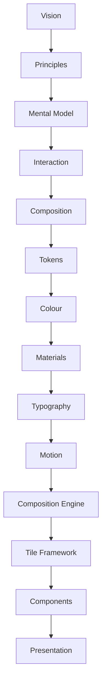
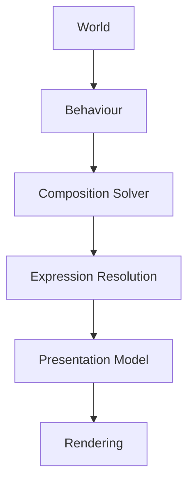

<!--
File: docs/engineering/architecture/mdp-001-adaptive-composition-runtime/index.md
Document: MDP-001
Status: Deferred
-->

# MDP-001 — Adaptive Composition Runtime

> *The interface is never authored. It is solved.*

> **Disposition: Deferred.** MDP-001 is non-authoritative, unscheduled research. Mosaic v1 uses governed client-side components and semantic SDUI through [MDS-008 — Component Library](../../../design/system/mds-008-component-library/index.md).

---

# Purpose

Every specification preceding MDP-001 has defined **what** Mosaic is.

The MDL established:

- Vision
- Principles
- Mental Model
- Interaction
- Composition

The MDS established:

- Design Tokens
- Colour
- Materials
- Typography
- Motion

MDP-001 explores how all of those systems could become a living adaptive runtime experience.

It is not part of the current Mosaic architecture or v1 delivery commitment.

Unlike traditional UI frameworks, which render predefined screens, the Composition Engine continuously constructs the user's current World from behaviour, information and relationships.

It does not render layouts.

It solves understanding.

The proposal preserves solver, depth and normalised-layout mathematics for possible future review. None of its contents are Mosaic v1 conformance requirements.

The behavioural Tile model that was formerly carried here is preserved separately as [MDP-002 — Tile Framework](../mdp-002-tile-framework/index.md). The two were reviewed and deferred together and can be reactivated independently.

---

# Proposal Objectives

MDP-001 preserves research intended to determine whether a future client runtime can:

- solve breathable Composition from semantic intent
- preserve identity through continuous spatial change
- use logical depth without mesh geometry
- protect text and artwork saliency across depth
- calibrate layout decisions from real Mosaic interfaces
- degrade predictably within Presentation budgets

---

# Proposal Disposition

The proposal is deferred because Mosaic v1 must first establish the component library, semantic SDUI boundary, Material implementation and reference interfaces required to evaluate the adaptive model.

Deferral does not imply acceptance, rejection or delivery commitment.

Reactivation requires:

- evidence from production-quality v1 compositions
- an active Roadmap horizon
- renewed design and technical review
- a decision updating the current Design System authority

---

# Relationship to Previous Specifications



The Composition Engine consumes every previous specification.

It produces:

- Expressions
- Runtime Hierarchy
- Adaptive Composition
- Runtime Behaviour
- Presentation Models

---

# Scope

This specification defines:

- Composition Engine Architecture
- Runtime Solver
- Expression Resolution
- Hierarchy Resolution
- Adaptive Layout Resolution
- Persistent Composition-Plane Occupancy
- Breathable Composition Extent
- Projected Text Legibility
- Evidence-Led Solver Calibration
- Airspace Reserve Resolution
- Behaviour Orchestration
- Runtime Graph Processing
- Multi-Device Composition
- Registered Device Capability Envelopes
- Live Presentation Profiles
- Normalised Composition Coordinates
- Composition Caching
- Runtime Pipelines

This specification intentionally does **not** define:

- Components
- Rendering APIs
- GraphQL Schema
- Storage
- Transport

Those systems provide data.

The Composition Engine constructs experience.

---

# Guiding Question

MDP-001 exists to answer one question.

> **How does Mosaic construct the user's World at runtime?**

Not:

> How do we render screens?

---

# Composition Engine Statement

Within Mosaic:

> **The user experiences a solved World rather than a rendered interface.**

Every runtime decision should reinforce that principle.

---

# Composition Engine Responsibilities

The Composition Engine separates runtime construction into several conceptual layers.



Each layer contributes one responsibility.

No layer duplicates another.

---

# Expected Outcome

After reading MDP-001 contributors should understand:

- how runtime composition works,
- how Expressions are resolved,
- how adaptive composition behaves,
- how multiple devices share one runtime model,
- how behavioural changes propagate,
- how presentation remains implementation independent,
- how layered projected occupancy and protected artwork regions are solved,

without discussing specific UI frameworks.

---

# Repository Structure

```text
docs/engineering/architecture/
  mdp-001-adaptive-composition-runtime/
    index.md
    00-document-control.md
    01-composition-engine-philosophy.md
    ...
    14-adaptive-tile-model.md
    15-motion-model.md
    16-unresolved-questions.md
    references.md
    glossary.md
```

---

# Dependencies

Required reading:

- [MDL-001](../../../design/language/mdl-001-vision/index.md) → [MDL-005](../../../design/language/mdl-005-composition-model/index.md)
- [MDS-001](../../../design/system/mds-001-design-token-architecture/index.md) → [MDS-005](../../../design/system/mds-005-motion-system/index.md)

Downstream specifications:

- [MDS-008 — Component Library](../../../design/system/mds-008-component-library/index.md)
