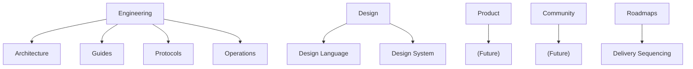
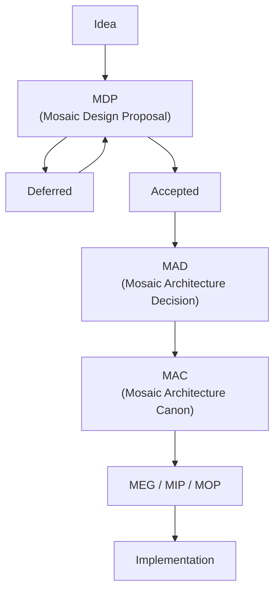
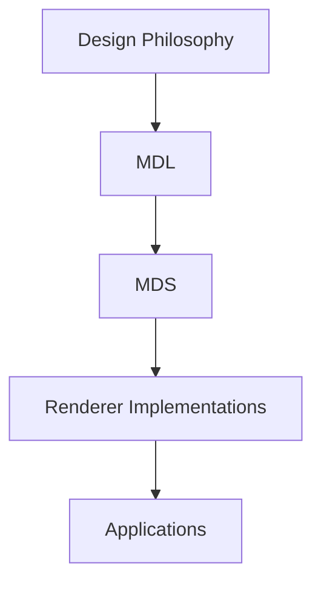
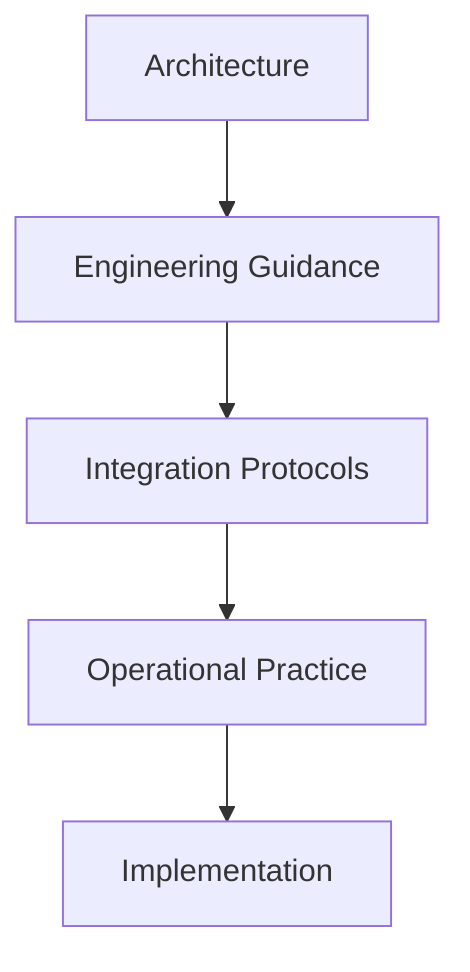

<!--
File: docs/engineering/documentation/mdg-001-documentation-authority-guide/01-document-hierarchy.md
Document: MDG-001
Status: Draft
Version: 0.4
-->

# 01 — Documentation Hierarchy

---

# Purpose

Mosaic documentation is intentionally organised into a hierarchy.

Each document type exists to fulfil a single responsibility.

This separation ensures:

- architectural intent remains clear
- information is not duplicated
- implementation guidance remains independent of architectural principles
- historical decisions remain preserved
- documentation evolves predictably

Every document created within the Mosaic Architecture repository shall belong to exactly one document type.

---

# Documentation Layers

Mosaic documentation is organised into five primary disciplines.



Within these disciplines, document types provide progressively greater levels of detail.

---

# Engineering

Engineering documentation defines how Mosaic is architected, implemented, integrated and operated.

It contains:

- Mosaic Architecture Canon (MAC)
- Mosaic Design Proposals (MDP)
- Mosaic Architecture Decisions (MAD)
- Mosaic Engineering Guides (MEG)
- Mosaic Integration Protocols (MIP)
- Mosaic Operations & Playbooks (MOP)

Engineering documentation is considered the authoritative technical reference for the platform.

---

# Design

Design documentation defines how Mosaic communicates visually and experientially.

It contains:

- Mosaic Design Language (MDL)
- Mosaic Design System (MDS)

Design documentation should remain implementation independent wherever possible.

Its purpose is to define principles rather than platform-specific implementations.

---

# Roadmaps

Roadmap documentation describes delivery sequence and release outcomes across Engineering and Design.

It contains:

- Mosaic Roadmaps (MRM)

Roadmaps consume authoritative specifications and proposals. They do not define architecture, Design Language, reusable assets, protocols or implementation practice.

---

# Documentation Progression

Architectural knowledge matures through several stages.

Ideas become proposals.

Accepted proposals become architectural decisions.

Those decisions shape the Architecture Canon.

Engineering guidance, integration protocols and operational documentation then describe how that architecture is realised.

The normal progression is illustrated below.



This progression preserves both architectural intent and the reasoning that produced it.

---

# Design Progression

Design documentation follows a similar progression.



The Design Language defines principles.

The Design System defines reusable assets.

Applications implement those assets using technologies appropriate to their respective platforms.

---

# Separation of Responsibilities

Every document type exists for a distinct purpose.

Documents should reference one another rather than duplicate content.

For example:

- MAC documents should reference MADs for historical decisions.
- MEGs should reference MACs for architectural principles.
- MIPs should reference MACs where architectural context is required.
- MOPs should reference MIPs where operational procedures rely upon published protocols.
- MDS documents should reference MDL documents rather than restating design philosophy.

This separation improves maintainability while reducing inconsistencies throughout the documentation set.

---

# Hierarchical Dependency

Higher-level documents define principles.

Lower-level documents realise those principles.

The dependency direction is therefore always downward.



Lower-level documents may not redefine concepts established by higher-level documents.

Where clarification is required, the higher-level document should instead be revised.

---

# Stability

Not every document type evolves at the same rate.

Generally:

| Document Type | Expected Stability |
|---------------|-------------------|
| MAC | Very High |
| MAD | Immutable after acceptance |
| MDP | Highly Iterative |
| MEG | Medium |
| MIP | Medium |
| MOP | Medium |
| MDL | Medium |
| MDS | Medium |
| MRM | Highly Iterative |

Understanding this distinction is essential.

Architectural truth should remain stable.

Engineering practice should improve continuously.

Operational knowledge should evolve alongside the platform.

Design should mature deliberately rather than reactively.

---

# Repository Organisation

Repository structure should reinforce the documentation hierarchy rather than replace it.

Directories represent disciplines.

Document prefixes represent document types.

For example:

```text
engineering/

    architecture/

        MAC-001

        MAD-001

        MDP-001

    guides/

        MEG-001

    protocols/

        MIP-001

    operations/

        MOP-001

design/

    language/

        MDL-001

    system/

        MDS-001

roadmaps/

    MRM-001
```

Repository organisation should remain intuitive to contributors while allowing the documentation taxonomy to evolve independently.
