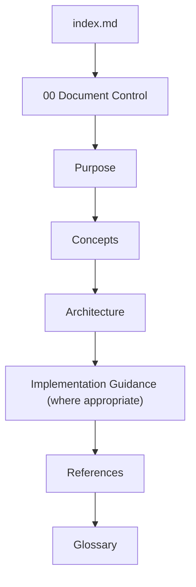

<!--
File: docs/engineering/documentation/mdg-001-documentation-authority-guide/04-writing-standards.md
Document: MDG-001
Status: Draft
Version: 0.4
-->

# 04 — Writing Standards

---

# Purpose

Consistency is one of the defining characteristics of high-quality technical documentation.

Readers should be able to move between documents without needing to relearn writing style, document organisation or terminology.

This chapter establishes the writing standards expected throughout the Mosaic documentation library.

These standards apply regardless of document type.

---

# Writing Philosophy

Documentation exists to communicate knowledge.

It should therefore prioritise:

- clarity
- precision
- consistency
- longevity

Documentation should explain architecture rather than impress the reader.

Complexity should emerge naturally from the subject matter rather than the writing itself.

---

# Tone

Documentation should maintain a professional and technical tone.

Authors should:

- write objectively
- avoid unnecessary opinion
- explain decisions clearly
- use direct language

Documentation should remain approachable while assuming technical competence.

---

# Voice

Documentation should be written using the active voice wherever practical.

For example:

> The Platform owns the capability registry.

rather than:

> The capability registry is owned by the Platform.

Active voice generally improves readability while making responsibilities explicit.

---

# Terminology

Terminology should remain consistent throughout the documentation library.

A concept should be described using one preferred term.

For example:

| Preferred | Avoid |
|-----------|-------|
| Platform | Core (unless historically required) |
| Module | Extension, Plugin |
| Capability | Service, Feature |
| Provider | Adapter (unless referring specifically to Hexagonal Architecture) |
| Supervisor | Runtime Manager |

When terminology evolves, older documents should be updated unless historical accuracy requires the original wording.

---

# Concept Definitions

New concepts should be introduced before they are used extensively.

The first occurrence of a significant architectural concept should:

- define the concept
- explain its purpose
- establish consistent terminology

Later sections should reference the established definition rather than redefining it.

---

# Avoid Duplication

Documentation should favour references over repetition.

Where information already exists within another specification:

- reference the authoritative document
- summarise only when necessary
- avoid maintaining duplicate explanations

Duplicated documentation inevitably diverges over time.

---

# Document Structure

Every Mosaic specification should follow a consistent structure.

Typically:



Individual document types may extend this structure where appropriate.

The `index.md` page introduces the specification. Authored pages should not include review-status summaries or manual previous and next page links. Metadata communicates document maturity, while the documentation portal provides navigation between pages.

---

# Headings

Headings should describe subjects rather than actions.

Preferred:

```text
Capability Registration
```

Avoid:

```text
Registering Capabilities
```

Headings should remain concise while accurately describing the section.

---

# Lists

Bullet lists should be used when:

- describing responsibilities
- identifying characteristics
- enumerating principles

Numbered lists should be reserved for:

- ordered processes
- workflows
- procedures
- lifecycle descriptions

Lists should remain short where practical.

Large collections of related information should instead be presented using tables.

---

# Tables

Tables should be used whenever structured comparison improves readability.

Examples include:

- version progression
- terminology
- document responsibilities
- capability comparisons

Tables should remain concise.

Narrative explanation should accompany complex comparisons where necessary.

---

# Diagrams

Diagrams should explain relationships rather than decorate documentation.

Preferred diagram types include:

- hierarchy diagrams
- lifecycle diagrams
- architectural relationships
- dependency graphs
- process flows

Diagrams should remain implementation independent unless the document specifically requires implementation detail.

Authored relationship diagrams must use Mermaid. This includes flows,
lifecycles, state transitions, hierarchies, dependencies and interactions,
including small diagrams with only two nodes. Mermaid source must use stable
synthetic identifiers and quoted labels when punctuation, repeated labels or
code-like text could make node identifiers ambiguous.

Text and unlabelled fences are appropriate only when fixed-width source is the
subject, such as repository trees, commands, source code, configuration, logs,
schemas, templates, notation, coordinate layouts or interface wireframes that
Mermaid cannot represent faithfully. Authors must not use ASCII arrows or
non-file tree glyphs as a substitute for Mermaid.

---

# Examples

Examples should illustrate concepts rather than define them.

Where examples include source code:

- keep them concise
- remove unnecessary implementation detail
- focus on the concept being explained

Examples should complement explanations rather than replace them.

---

# References

Every specification should conclude with a References chapter.

References should include:

- related Mosaic documents
- external specifications
- standards
- academic papers
- authoritative technical resources

References should support the document rather than overwhelm it.

---

# Glossary

Every specification should conclude with a Glossary chapter.

Glossaries should define:

- architectural concepts
- specialised terminology
- acronyms
- domain-specific language

Glossary entries should remain concise.

Concept definitions should remain consistent across the documentation library.

---

# Normative Language

Authors should use normative language consistently.

| Term | Meaning |
|------|---------|
| Must | Mandatory requirement |
| Should | Strong recommendation |
| May | Optional behaviour |
| Must Not | Prohibited behaviour |

These terms should only be used where normative intent is required.

MRM documents must distinguish committed outcomes from candidate or research horizons explicitly. Planning language must not make a deferred MDP or unapproved architecture appear mandatory.

MDP documents must state their disposition without using normative language to imply that Active or Deferred proposals are current requirements.

---

# Markdown

Documentation should use standard Markdown wherever practical.

Authors should:

- avoid unnecessary HTML
- use fenced code blocks
- use tables for structured data
- use block quotes for important observations
- use Mermaid for diagrams where appropriate

Markdown should remain portable across documentation tooling.

---

# Future Compatibility

Documentation should be written independently of any specific documentation engine.

Specifications should remain readable as plain Markdown.

Presentation improvements provided by documentation tooling should enhance the reading experience without becoming required for understanding the content.

This ensures the Mosaic documentation library remains portable, maintainable and resilient as tooling evolves.
