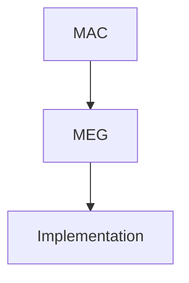
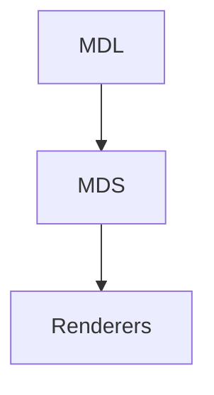
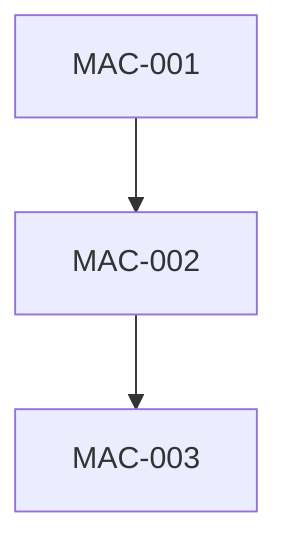
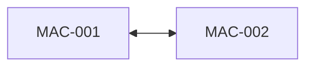
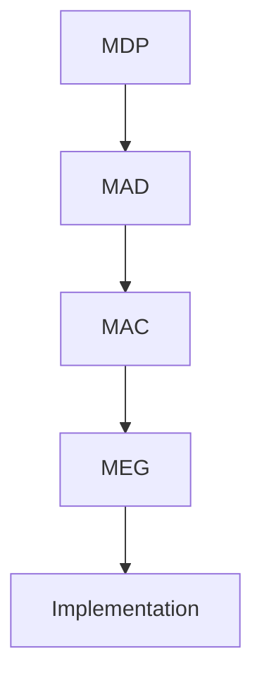
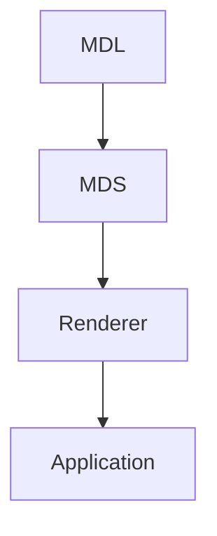

<!--
File: docs/engineering/documentation/mdg-001-documentation-authority-guide/06-cross-references.md
Document: MDG-001
Status: Draft
Version: 0.4
-->

# 06 — Cross References

---

# Purpose

The Mosaic documentation library should behave as a connected body of knowledge rather than a collection of isolated specifications.

Cross references establish relationships between documents while avoiding unnecessary duplication.

Every document should therefore reference authoritative sources rather than restating information maintained elsewhere.

---

# Guiding Principles

Cross references exist to:

- improve discoverability
- reduce duplication
- preserve a single source of truth
- strengthen architectural traceability
- simplify long-term maintenance

Readers should be encouraged to navigate between related specifications rather than encountering repeated explanations.

---

# Single Source of Truth

Every architectural concept should have one authoritative home.

Examples include:

- architectural principles
- capability definitions
- integration contracts
- design philosophy
- operational procedures

Where additional explanation is required, documents should reference the authoritative source instead of reproducing its contents.

---

# Reference Direction

Cross references should generally follow the documentation hierarchy.

Higher-level documents establish principles.

Lower-level documents build upon them.

For example:



Engineering Guides should therefore reference the Architecture Canon rather than redefining architectural concepts.

Similarly:



Design Systems should reference the Design Language rather than repeating design philosophy.

---

# Architecture Decision References

Architecture Decisions preserve historical reasoning.

Canonical specifications should reference relevant decisions rather than embedding historical discussion.

For example:

```text
Related Decisions

• MAD-001 — Static Module Composition
• MAD-004 — Supervisor Owns Runtime
```

Readers interested in architectural rationale can then consult the corresponding decision record without interrupting the flow of the specification.

---

# Proposal References

Design Proposals represent work in progress.

Accepted proposals should normally be replaced by references to:

- Architecture Decisions
- updated Canon documents

Rejected proposals may continue to exist for historical context but should not be referenced as authoritative guidance.

---

# Engineering Guide References

Architecture documents should avoid implementation examples.

Instead they should reference Engineering Guides where practical.

Example:

```text
Implementation guidance is provided by:

• MEG-011 — Developing Mosaic Modules
```

This separation preserves the long-term stability of the Architecture Canon while allowing engineering practice to evolve independently.

---

# Reference Format

References should use the official document identifier.

Every navigational reference to another published Mosaic document must be a
relative Markdown hyperlink. Link an identifier-only reference as
`[ID](relative/path/index.md)`. When a title is included, use the catalogued
form `[ID — Canonical Title](relative/path/index.md)`. Link directly to a
chapter or anchor when the reference concerns that narrower material.

Preferred format:

```text
MAC-001 — Platform Architecture
```

Avoid references that rely solely upon document titles.

Document identifiers provide stable traceability even if titles evolve.

---

# Internal References

References within a document should use descriptive language.

Preferred:

> The Capability Model is defined in [MAC-001 — Platform Architecture](../../architecture/mac-001-platform-architecture/03-capability-model.md).

Avoid:

> See above.

Descriptive references remain meaningful even when documentation is reorganised.

References to documents that are not published must remain unlinked and include
either `planned; not yet published` or `deferred; not yet published`. This makes
the absence deliberate and prevents unavailable identifiers from appearing to
be broken navigation.

---

# External References

External references should be used only where they strengthen understanding.

Examples include:

- language specifications
- technical standards
- academic publications
- industry guidance

External references should never replace Mosaic documentation.

The Mosaic Architecture repository remains the authoritative source for Mosaic itself.

---

# Circular References

Mutually dependent documents should be avoided wherever possible.

For example:



is preferable to:



Where circular relationships cannot be avoided, each document should clearly establish which concepts it owns.

---

# Cross-Reference Validation

Every cross reference should remain valid.

Review should confirm:

- referenced documents exist
- document identifiers are correct
- document titles remain accurate
- references point to the authoritative specification

Broken references should be treated as documentation defects.

---

# Future Automation

Cross-reference validation should eventually become part of the documentation toolchain.

Automated validation should verify:

- missing documents
- invalid identifiers
- broken hyperlinks
- duplicate glossary entries
- orphaned specifications

Automated validation reduces maintenance effort while improving long-term consistency throughout the documentation library.

---

# Architectural Traceability

Cross references create traceability across the documentation ecosystem.

Readers should be able to follow an architectural concept naturally.

For example:



Likewise:



This progression allows readers to understand not only how Mosaic is implemented, but why those implementations exist.
