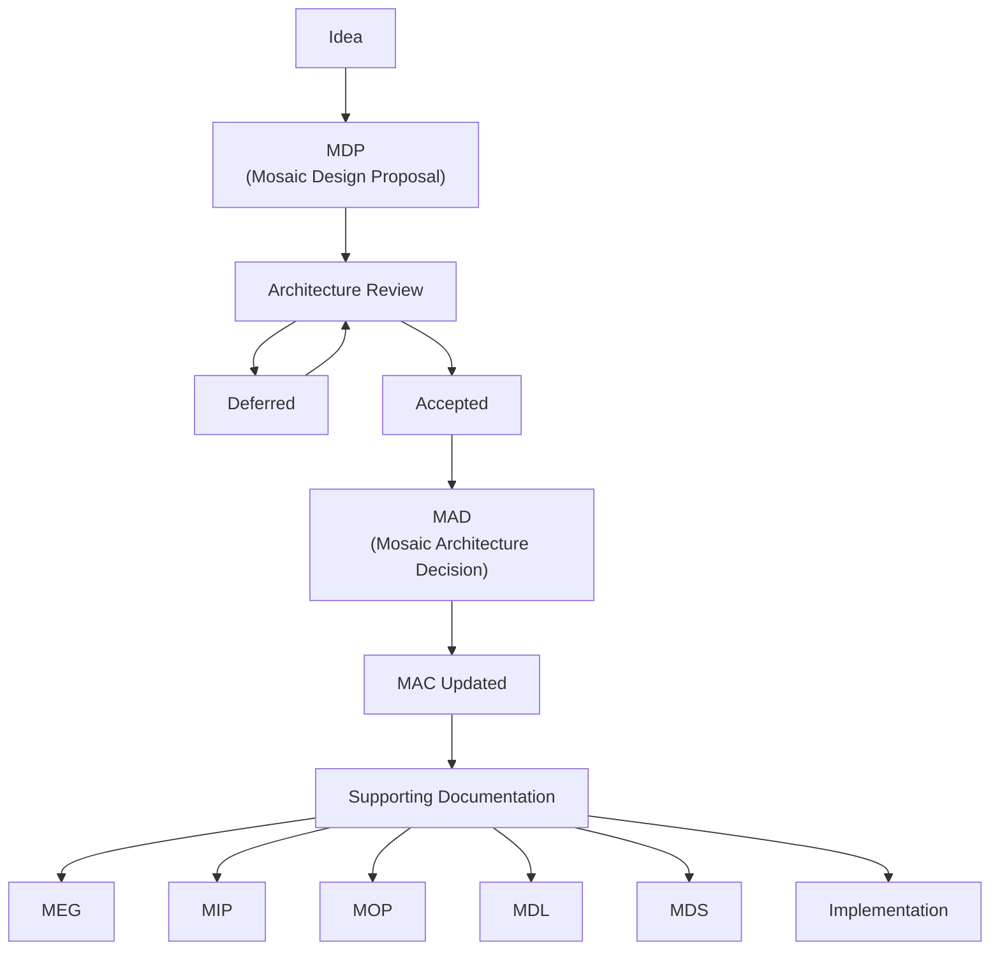

<!--
File: docs/engineering/documentation/mdg-001-documentation-authority-guide/08-document-lifecycle.md
Document: MDG-001
Status: Draft
Version: 0.4
-->

# 08 — Document Lifecycle

---

# Purpose

Documentation should evolve through a deliberate and traceable lifecycle.

Architectural knowledge matures over time.

Ideas become proposals.

Proposals become decisions.

Accepted decisions become part of the Architecture Canon.

Engineering guidance, integration protocols and operational procedures are then derived from the accepted architecture.

Understanding this lifecycle ensures that documentation remains coherent while preserving the reasoning behind architectural evolution.

---

# Documentation Lifecycle

Every significant architectural concept should progress through the following lifecycle.

Each stage has a distinct responsibility.

Progression should occur only when the previous stage has reached an appropriate level of maturity.

---

# Stage 1 — Idea

Ideas represent potential improvements to the platform.

Ideas are intentionally informal.

Examples include:

- architectural observations
- engineering improvements
- design concepts
- integration opportunities
- operational improvements

Ideas should not directly modify authoritative documentation.

Instead they should be refined into a Design Proposal.

---

# Stage 2 — Mosaic Design Proposal (MDP)

An MDP exists to explore a potential architectural change.

During this stage:

- assumptions are challenged
- alternatives are evaluated
- discussion is encouraged
- architecture is refined

An MDP remains non-authoritative until formally accepted.

Rejected proposals should remain archived for historical reference.

A proposal may instead become **Deferred** when its research remains valuable but it is not scheduled for delivery or ready to become current architecture.

Deferred proposals:

- remain non-authoritative
- retain their research and unresolved questions
- must declare `Disposition: Deferred`
- must not establish implementation requirements
- may return to Active review when evidence or Roadmap priorities change

Deferral does not imply rejection, acceptance or future commitment.

---

# Stage 3 — Architecture Decision (MAD)

Once consensus has been reached, the proposal becomes an Architecture Decision.

The decision records:

- why the change was accepted
- alternatives considered
- expected consequences

The decision becomes part of the permanent architectural history of Mosaic.

MAD documents should remain immutable after acceptance.

---

# Stage 4 — Architecture Canon (MAC)

The accepted decision is incorporated into the Architecture Canon.

The Canon defines the architecture as it exists today.

It should not describe:

- previous alternatives
- rejected approaches
- implementation history

Those responsibilities remain with the corresponding Architecture Decision.

---

# Stage 5 — Supporting Documentation

Once the Canon has been updated, supporting documentation should evolve to reflect the accepted architecture.

Depending upon the nature of the change, this may include:

- Engineering Guides
- Integration Protocols
- Operations Playbooks
- Design Language
- Design System

Supporting documentation should never introduce new architectural concepts independently.

Architecture should always originate within the Canon.

---

# Stage 6 — Implementation

Implementation is the final stage of the lifecycle.

Engineering work should implement the accepted architecture rather than define it.

Where implementation reveals architectural shortcomings, the lifecycle begins again with a new Design Proposal.

Implementation should not silently redefine accepted architecture.

---

# Roadmap Lifecycle

MRM documents evolve alongside delivery planning rather than architectural maturity.

An MRM should:

1. identify release outcomes and their owning documents
2. distinguish committed delivery from candidate and research horizons
3. update progress only from verifiable evidence
4. mark completed outcomes without becoming their permanent specification
5. remove or reclassify outcomes when priorities change

Changing an MRM does not accept, reject or supersede architecture. Any architectural change discovered through planning must re-enter the MDP lifecycle.

---

# Architectural Evolution

Architecture should evolve deliberately.

Changes to accepted documentation should normally originate from:

- new requirements
- validated engineering experience
- accepted Design Proposals

Reactive documentation changes driven solely by implementation should be avoided.

---

# Deprecation

Architectural concepts occasionally become obsolete.

When this occurs:

1. A replacement should be proposed.
2. The replacement should be reviewed.
3. An Architecture Decision should record the change.
4. The Canon should be updated.
5. Supporting documentation should be revised.

Historical documents should remain available for reference where appropriate.

---

# Superseded Documents

When a document is replaced, it should not normally be deleted.

Instead:

- its status should become **Superseded**
- replacement documents should be referenced
- historical context should be preserved

This maintains traceability throughout the documentation library.

---

# Archival

Documentation may be archived when it no longer forms part of the active architecture.

Archived documents remain valuable because they preserve:

- architectural history
- previous reasoning
- implementation context

Archived documentation should remain clearly identifiable while continuing to be accessible.

---

# Continuous Improvement

Documentation should evolve continuously.

Minor improvements include:

- editorial refinement
- improved clarity
- additional references
- better diagrams
- terminology consistency

These improvements should not require architectural redesign.

Instead they strengthen the quality and longevity of the documentation library.

---

# Documentation as an Architectural Asset

Documentation is not produced after architecture has been completed.

Documentation is part of the architectural process itself.

Every proposal, decision, specification and implementation contributes to the long-term understanding of the platform.

The lifecycle defined within this chapter ensures that architectural knowledge remains:

- deliberate
- traceable
- maintainable
- authoritative

throughout the lifetime of the Mosaic project.
