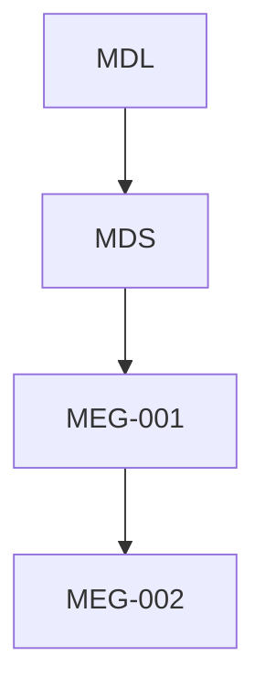
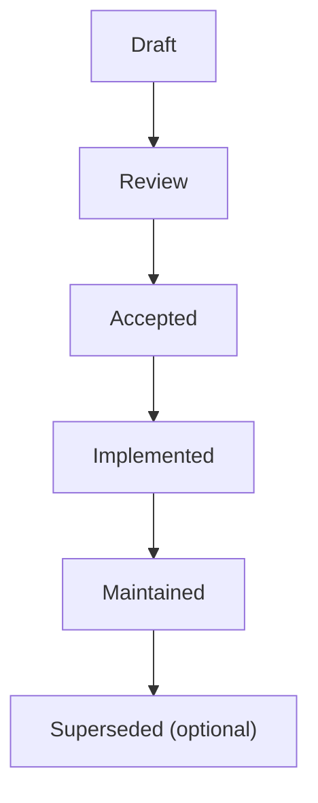

<!--
File: docs/engineering/guides/meg-002-event-driven-runtime/00-document-control.md
Document: MEG-002
Status: Draft
Version: 0.4
-->

# Document Control

---

# Document Information

| Field | Value |
|---------|--------|
| Document ID | MEG-002 |
| Title | Event-Driven Runtime |
| File | 00-document-control.md |
| Status | Draft |
| Version | 0.4 |
| Owner | AdamNi-7080 |
| Classification | Internal Architecture Specification |

---

# Purpose

This document establishes the governance, authority and lifecycle of the Mosaic Event-Driven Runtime specification.

Version 0.3 aligns implementation guidance with [MIP-001](../../protocols/mip-001-event-protocol/index.md) event ownership, namespaced events and public/private Module event contracts.

MEG-002 defines the architectural standards governing how independently developed capabilities communicate and coordinate work within the Mosaic Runtime.

Unlike implementation documentation, this specification defines **runtime behaviour**, not implementation detail.

---

# Authority

MEG-002 is the authoritative specification governing event-driven behaviour throughout the Mosaic ecosystem.

This specification applies to:

- Mosaic Platform
- First-party Modules
- Third-party Modules
- Background Workers
- Schedulers
- Event Publishers
- Event Subscribers
- Runtime Infrastructure

Every component participating in the Mosaic Runtime MUST comply with the standards defined within this specification.

---

# Relationship to Other Specifications

MEG specifications intentionally build upon one another.

Specifically:

- **MDL** defines product philosophy.
- **MDS** defines presentation.
- **[MEG-001](../meg-001-go-engineering-standards/index.md)** defines engineering practices.
- **MEG-002** defines runtime behaviour.

Later MEG specifications build upon the runtime model introduced here.

---

# Normative Language

Unless explicitly stated otherwise, the following keywords are interpreted according to RFC 2119.

| Keyword | Meaning |
|----------|---------|
| **MUST** | Mandatory requirement. |
| **MUST NOT** | Prohibited behaviour. |
| **SHOULD** | Strong recommendation. Deviation requires architectural justification. |
| **SHOULD NOT** | Discouraged except where clearly justified. |
| **MAY** | Optional behaviour based upon engineering judgement. |

Examples and diagrams are informative unless explicitly identified as normative.

---

# Runtime Principles

The Mosaic Runtime is built upon several foundational principles.

- Capabilities own behaviour.
- Events communicate facts.
- Dependencies remain explicit.
- Failures are expected.
- Components remain autonomous.
- Work is asynchronous by default.
- Runtime behaviour must be observable.
- Shutdown must be deterministic.

Every subsequent chapter expands one or more of these principles.

---

# Document Lifecycle

MEG specifications evolve alongside the platform.

Each document progresses through the following lifecycle.

Accepted specifications become part of the canonical Mosaic architecture.

Historical versions SHOULD remain available for future reference.

---

# Runtime Evolution

The runtime is expected to evolve.

However, architectural evolution should occur deliberately.

Changes affecting:

- event contracts
- event delivery guarantees
- runtime semantics
- lifecycle behaviour
- module interaction

SHOULD be accompanied by an Architectural Decision Record (ADR).

This ensures architectural intent remains discoverable long after implementation changes.

---

# Compliance

All runtime components SHOULD comply with MEG-002.

Where deviation becomes necessary, the repository SHOULD document:

- the reason
- expected impact
- migration strategy
- compatibility implications

Temporary deviations should eventually be removed.

Permanent deviations should generally result in updates to the specification.

---

# Design Philosophy

MEG-002 intentionally favours:

- deterministic behaviour
- loose coupling
- eventual consistency
- explicit ownership
- bounded complexity
- observable execution

The runtime should encourage independent capability evolution without sacrificing operational clarity.

This reflects established practice in mature event-driven systems, where idempotency, observability, ordering guarantees and bounded failure handling are treated as first-class architectural concerns rather than implementation details.  [Encore Framework](https://encore.dev/articles/event-driven-architecture)

---

# Scope of Authority

MEG-002 governs runtime behaviour.

It does **not** define:

- business domains
- storage technologies
- transport protocols
- module packaging
- deployment architecture

Those concerns belong to other MEG specifications.

This separation keeps runtime concerns independent from implementation concerns.
