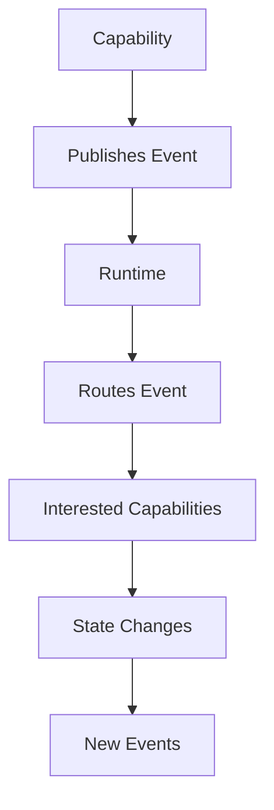
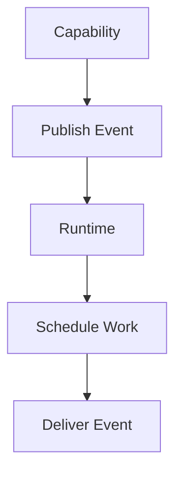
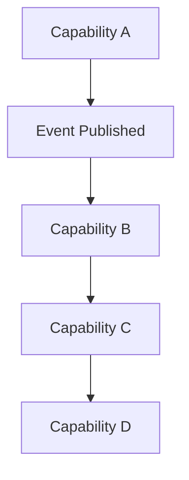
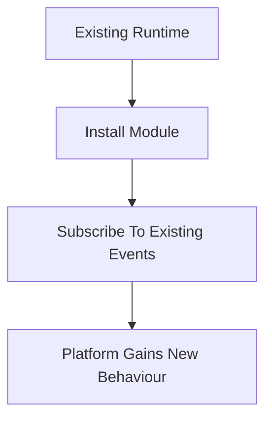
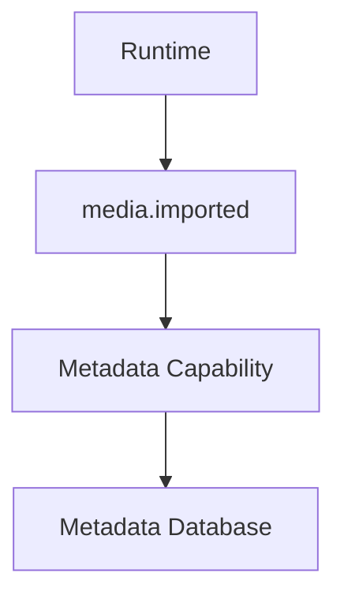
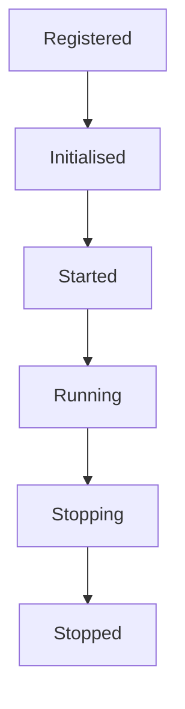

<!--
File: docs/engineering/guides/meg-002-event-driven-runtime/01-runtime-philosophy.md
Document: MEG-002
Status: Draft
Version: 0.4
-->

# Runtime Philosophy

> *The runtime exists to orchestrate capabilities, not control them.*

---

# Purpose

The Mosaic Runtime is fundamentally different from a traditional monolithic application.

Rather than a collection of tightly coupled services calling one another directly, the runtime consists of autonomous capabilities that collaborate through events.

Each capability owns its own behaviour.

The runtime owns coordination.

Understanding this distinction is essential to understanding every architectural decision made throughout the Mosaic platform.

---

# Philosophy

Within Mosaic:

> **The runtime coordinates work. Capabilities own behaviour.**

The runtime should never become a place where business logic accumulates.

Instead, it provides the infrastructure that allows independently developed capabilities to cooperate safely and predictably.

---

# Runtime Responsibilities

The runtime owns platform-wide concerns.

These include:

- Event delivery
- Capability discovery
- Lifecycle management
- Scheduling
- Background execution
- Health monitoring
- Observability
- Graceful shutdown
- Resource ownership

The runtime intentionally does **not** own:

- Media management
- Metadata
- Playback
- Authentication
- Search
- Library management

These responsibilities belong to capabilities.

---

# Capabilities

A capability represents a self-contained piece of business functionality.

Examples include:

```

Metadata

Playback

Library

Search

Notifications

Recommendations
```

A capability should:

- own its own behaviour
- own its own state
- publish events
- subscribe to relevant events

A capability should **never** become responsible for orchestrating the wider platform.

---

# Runtime Model

The runtime intentionally separates coordination from execution.



Notice that capabilities never communicate directly.

The runtime becomes the coordination layer.

---

# The Runtime Is Not The Business

One of the easiest mistakes to make when building event-driven systems is gradually moving business logic into the event bus.

Within Mosaic this is prohibited.

The runtime should answer questions such as:

- Where should this event go?
- Who is subscribed?
- Is the runtime healthy?
- Can this work be retried?

The runtime should never answer questions such as:

- Is this movie watched?
- Should metadata be refreshed?
- Does this user have permission?

Those belong to capabilities.

---

# Publish Facts

Capabilities publish facts.

Not commands.

Good:

```

media.imported
```

```

playback.started
```

```

metadata.updated
```

Poor:

```

RefreshMetadata
```

```

UpdateArtwork
```

Facts describe what has happened.

Commands instruct another capability what to do.

Facts encourage loose coupling.

Commands create dependency.

---

# Autonomous Capabilities

Capabilities should remain autonomous.

A capability should never need to know:

- who consumes its events
- how many consumers exist
- whether consumers exist
- what consumers do

Publishing an event should feel like writing to a public noticeboard.

Other capabilities decide whether they care.

---

# The Runtime Owns Time

Business capabilities should not concern themselves with:

- scheduling
- retry timing
- delayed execution
- backoff
- worker allocation

Instead:



Time is a runtime concern.

Business behaviour is not.

---

# The Runtime Owns Reliability

Failures are inevitable.

The runtime is responsible for ensuring they do not compromise the platform.

This includes:

- retries
- dead-letter handling
- backpressure
- cancellation
- graceful shutdown

Business capabilities should focus solely on business behaviour.

Reliability is a platform responsibility.

---

# Eventual Consistency

The Mosaic Runtime embraces eventual consistency.

Immediately after an event is published:



Each capability progresses independently.

The platform eventually converges upon a consistent state.

Immediate synchronisation is intentionally avoided unless correctness requires it.

This aligns with common event-driven architecture principles, where autonomous components converge through asynchronous communication rather than synchronous orchestration. ([martinfowler.com](https://martinfowler.com/articles/201701-event-driven.html))

---

# Progressive Capability

One of the defining characteristics of the runtime is progressive capability.

Installing a module should not require modifying existing capabilities.

Instead:



No existing capability changes.

The runtime simply gains another participant.

This allows the platform to evolve organically.

---

# Runtime Boundaries

The runtime deliberately exposes a small surface area.

Capabilities should depend upon:

- event publication
- event subscription
- scheduling
- lifecycle notifications

Nothing more.

Reducing the runtime API encourages long-term stability.

---

# Runtime Does Not Own State

The runtime coordinates state changes.

It does not own business state.

Example:



The runtime transports the event.

It does not inspect or modify metadata.

This distinction is critical.

---

# Runtime Lifecycle

Every runtime component follows the same lifecycle.



Capabilities should respond to lifecycle transitions.

They should never attempt to control them.

---

# The Runtime Is Replaceable

Business capabilities should depend upon runtime contracts.

Not runtime implementations.

This allows:

- testing
- simulation
- future runtime evolution

without requiring changes to business behaviour.

Capabilities should view the runtime as infrastructure.

---

# Mosaic Principles

Within Mosaic:

- Capabilities own behaviour.
- The runtime owns coordination.
- Events communicate facts.
- Capabilities remain autonomous.
- The runtime owns time.
- The runtime owns reliability.
- Business state never belongs to the runtime.
- Modules integrate through events rather than direct dependencies.

These principles define the architectural identity of the Mosaic platform.

Every future runtime decision should reinforce them.

---

# Summary

The Mosaic Runtime exists to enable cooperation without coupling.

It coordinates.

It schedules.

It observes.

It delivers.

It never becomes the business itself.

When responsibilities remain clearly separated, new capabilities can be introduced without modifying existing ones.

That is the defining property of an extensible platform.
