<!--
File: docs/engineering/guides/meg-002-event-driven-runtime/02-why-events.md
Document: MEG-002
Status: Draft
Version: 0.4
-->

# Why Events?

> *Events are not an implementation detail. They are the language through which capabilities communicate.*

---

# Purpose

Every architectural decision carries trade-offs.

The Mosaic Runtime intentionally adopts an event-driven architecture because it aligns with the platform's foundational design goals:

- Extensibility
- Loose coupling
- Independent capabilities
- Background processing
- Progressive enhancement

This document explains **why** events are the primary communication mechanism within the Mosaic platform.

It intentionally focuses on architectural reasoning rather than implementation details.

---

# The Problem

Traditional applications often communicate through direct service calls.

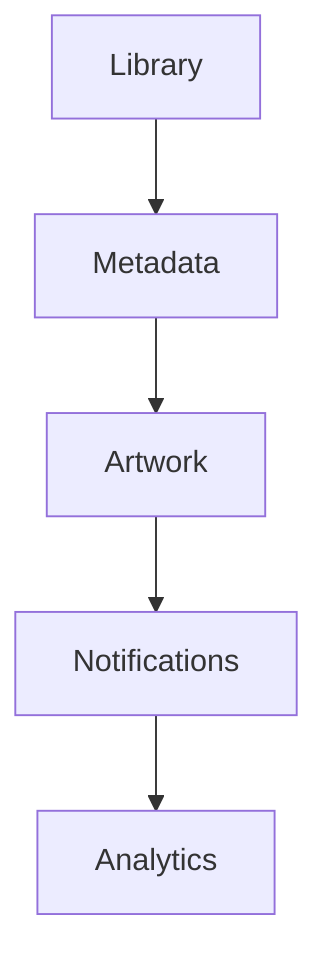

Each component becomes aware of every other component.

As functionality grows:

- dependencies multiply
- coupling increases
- testing becomes harder
- introducing new behaviour becomes increasingly expensive

The architecture gradually evolves into a dependency graph rather than a platform.

---

# Direct Communication

Consider a seemingly simple operation.

```

Media Imported
```

A traditional implementation might become:

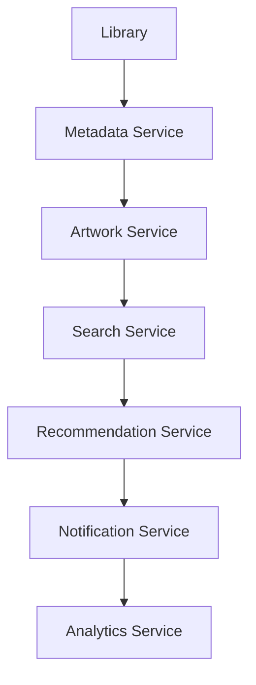

The Library capability now knows about six unrelated systems.

Every future capability requires modifying Library.

This violates the Open/Closed Principle.

---

# Event Communication

The same behaviour using events becomes:

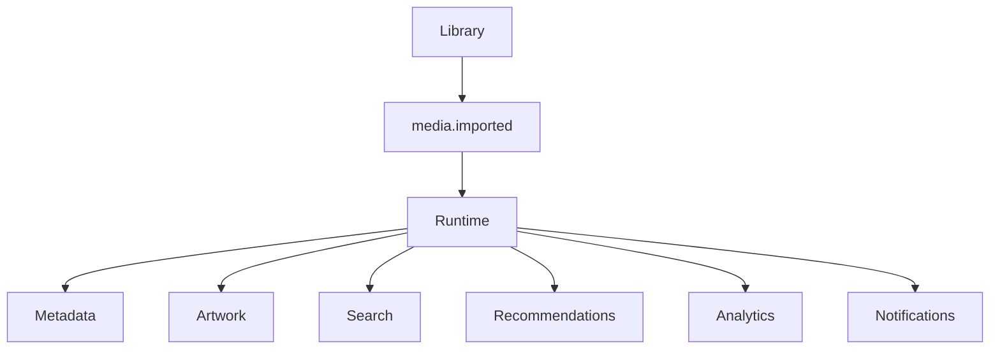

Library publishes one fact.

Everything else becomes someone else's responsibility.

Library never changes as the platform grows.

---

# Events Describe Facts

Within Mosaic:

Events describe something that **has already happened**.

Examples include:

```

media.imported
```

```

playback.started
```

```

UserAuthenticated
```

```

LibraryScanned
```

These are historical facts.

They cannot be rejected.

They have already occurred.

---

# Events Are Not Commands

Commands tell another component what to do.

```

GenerateArtwork
```

```

RefreshMetadata
```

```

IndexSearch
```

These tightly couple two capabilities.

One capability now assumes:

- another capability exists
- it performs a particular behaviour
- it should perform it immediately

This is not how Mosaic capabilities communicate.

---

# Facts Enable Growth

Publishing facts means future capabilities require no modifications to existing systems.

Imagine adding:

```

AI Recommendations
```

No existing capability changes.

Instead:

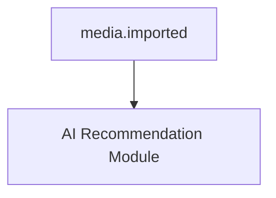

The module simply subscribes.

The runtime already understands how to deliver events.

This property allows Mosaic to grow indefinitely without creating dependency explosions.

---

# Capabilities Should Not Know Each Other

One of the primary goals of Mosaic is capability independence.

A capability should never ask:

- Who needs this information?
- How many subscribers exist?
- What happens next?

Instead it should simply announce:

> "This happened."

Everything afterwards belongs to the runtime.

---

# Event Flow

Every event follows the same conceptual flow.

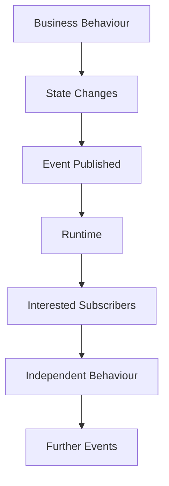

Notice that no capability explicitly invokes another capability.

The runtime coordinates everything.

---

# Loose Coupling

Loose coupling produces numerous architectural benefits.

Capabilities can:

- evolve independently
- be developed independently
- be tested independently
- be replaced independently
- be disabled independently

This dramatically reduces long-term maintenance costs.

Loose coupling is one of the defining characteristics of event-driven architectures because publishers and subscribers evolve independently. ([martinfowler.com](https://martinfowler.com/articles/201701-event-driven.html))

---

# Module Independence

Modules should integrate naturally.

Example.

Without events:

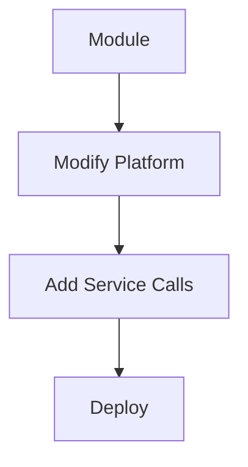

With events:

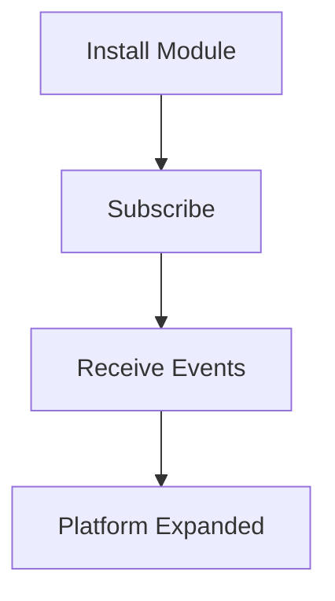

The existing runtime remains unchanged.

This is one of the strongest arguments for an event-driven platform.

---

# Failure Isolation

Suppose:

```

Artwork Generation
```

fails.

With direct calls:

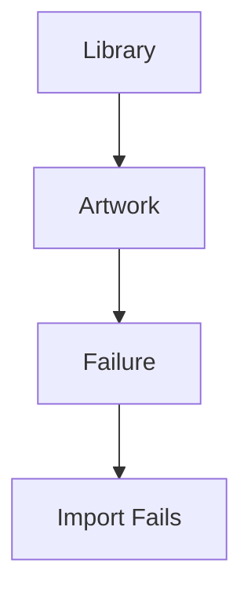

With events:

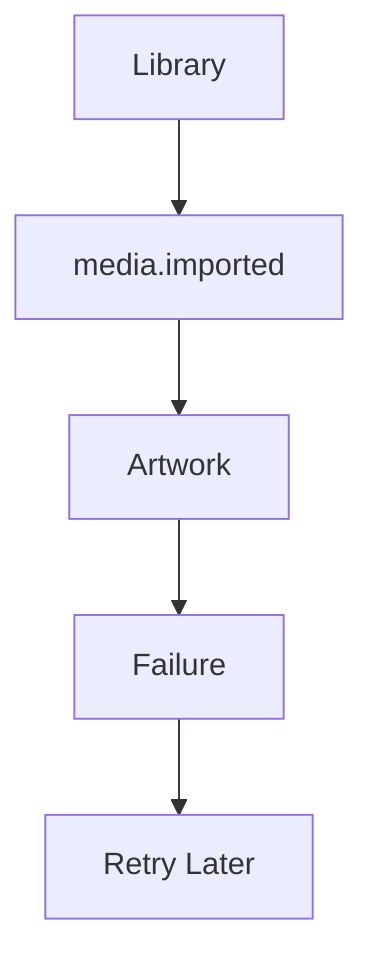

The import succeeds.

Artwork eventually catches up.

Independent failures remain isolated.

---

# Asynchronous Behaviour

Many operations should not delay user interaction.

Examples include:

- metadata refresh
- artwork generation
- recommendation updates
- search indexing
- analytics
- cache warming

These naturally become background subscribers.

The initiating capability remains responsive.

---

# Progressive Capability

The runtime encourages capabilities to appear gradually.

Initially:

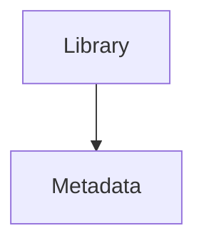

Later:

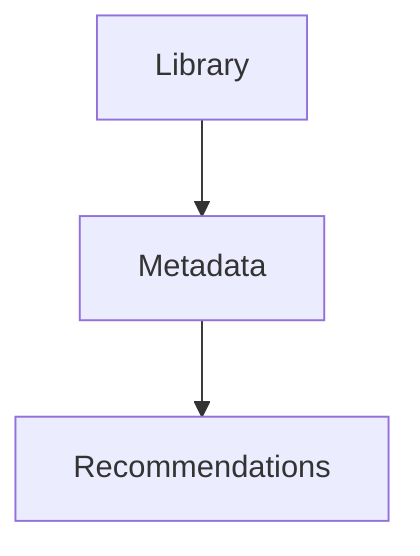

Later still:

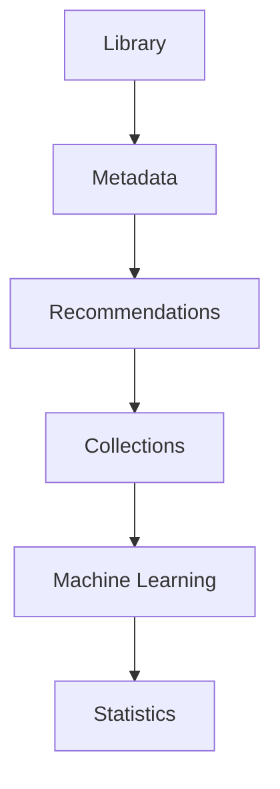

No earlier capability requires modification.

Growth becomes additive.

Not invasive.

---

# Observable Behaviour

Events naturally produce observable systems.

Every important state transition becomes visible.

Example.

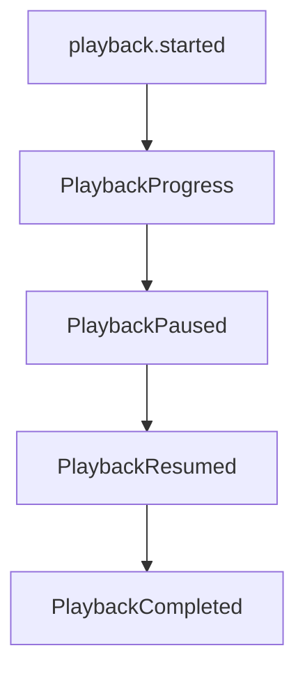

Operations become traceable.

Failures become diagnosable.

Observability emerges naturally from the architecture.

---

# Event Chains

Complex workflows emerge from simple event chains.

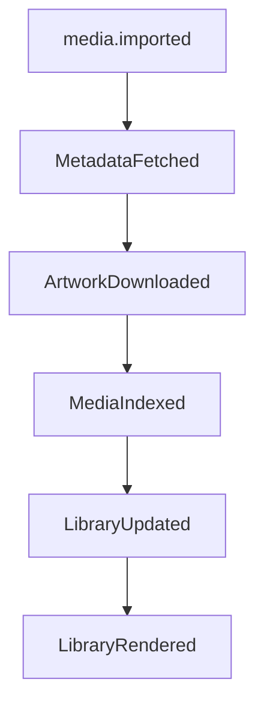

Each capability owns one transition.

No capability owns the entire workflow.

This keeps responsibilities small.

---

# The Runtime Is A Coordinator

The runtime intentionally behaves like infrastructure.

It routes.

It schedules.

It retries.

It observes.

It never becomes another business capability.

This distinction keeps business logic separate from orchestration.

---

# When Not To Use Events

Not every interaction should become an event.

Events SHOULD NOT replace:

- immediate validation
- synchronous queries
- request/response APIs
- simple in-process function calls

If one capability requires an immediate answer from another, a direct abstraction is usually more appropriate.

Events communicate facts.

They do not replace every form of communication.

---

# Mosaic Guidelines

Within Mosaic:

- Events communicate facts.
- Capabilities SHOULD publish events after state changes.
- Capabilities SHOULD remain unaware of subscribers.
- Modules SHOULD integrate through events.
- Direct capability dependencies SHOULD be minimised.
- Background work SHOULD originate from events where practical.
- The runtime SHOULD coordinate rather than orchestrate business behaviour.

---

# Summary

Events are not simply another messaging mechanism.

Within Mosaic they are the language of the runtime.

They allow independently developed capabilities to cooperate without depending upon one another.

That single architectural decision enables:

- module-first development
- progressive capability
- background processing
- resilience
- scalability
- long-term maintainability

Everything else defined within MEG-002 builds upon this principle.
