<!--
File: docs/engineering/guides/meg-002-event-driven-runtime/07-event-bus.md
Document: MEG-002
Status: Draft
Version: 0.4
-->

# Event Bus

> *The Event Bus transports facts. It never interprets them.*

---

# Purpose

The Event Bus is the central coordination mechanism of the Mosaic Runtime.

It is responsible for delivering events between capabilities while remaining completely unaware of business behaviour.

The Event Bus is **not** a workflow engine.

It is **not** an orchestration engine.

It is **not** a rules engine.

Its only responsibility is to reliably transport immutable business facts from publishers to interested subscribers.

---

# Philosophy

Within Mosaic:

> **The Event Bus owns delivery. Capabilities own meaning.**

The Event Bus should never understand:

- media
- playback
- metadata
- users
- modules

Those are business concepts.

The Event Bus understands only:

- events
- subscribers
- delivery
- retries
- acknowledgements
- lifecycle
- visibility metadata
- version metadata

This separation is fundamental to maintaining loose coupling.

---

# Responsibilities

The Event Bus owns the following responsibilities.

- Event publication
- Subscriber discovery
- Event routing
- Delivery guarantees
- Retry scheduling
- Dead-letter routing
- Delivery metrics
- Backpressure
- Runtime observability

The Event Bus intentionally does **not** own:

- business validation
- event payload semantics
- Module event definitions
- business workflows
- business state
- business decisions

---

# Runtime Model

Every event follows the same runtime path.

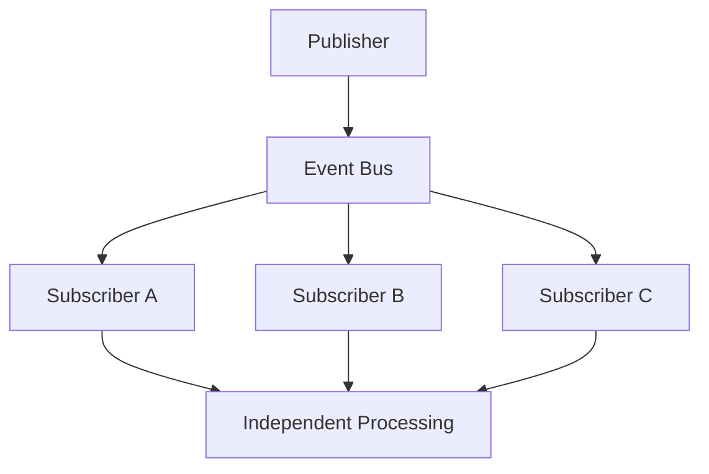

Notice that publishers never communicate directly with subscribers.

Every interaction occurs through the Event Bus.

---

# Publish

Publishing an event means:

> **This business fact has occurred.**

The publisher does not ask:

- Who receives it?
- How many subscribers exist?
- Did anybody process it?
- What happens next?

Publishing should be fire-and-forget from the publisher's perspective.

Once accepted by the Event Bus, responsibility transfers to the runtime.

---

# Subscription

Capabilities subscribe to events.

Not publishers.

Example.

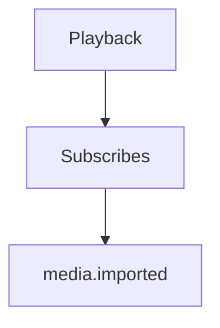

The Library capability remains unaware that Playback exists.

Adding another subscriber never requires modifying the publisher.

---

# Routing

The Event Bus routes events using:

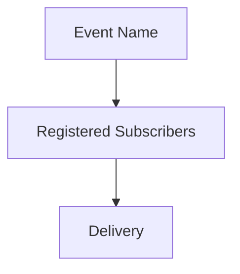

No routing logic should exist inside business capabilities.

Capabilities express interest.

The runtime performs routing.

Routing should respect event visibility.

Public Module events and Platform events may be subscribed to by other Modules.

Private Module events should remain within the owning Module boundary.

---

# Delivery Model

The Event Bus delivers events independently.

Example.

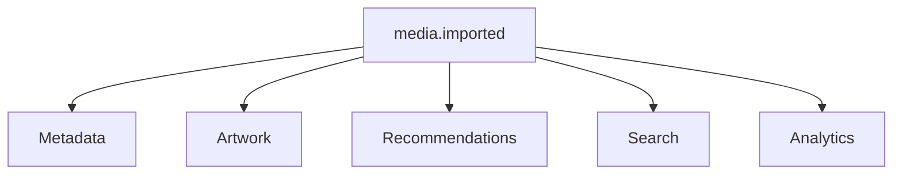

Each subscriber receives the event independently.

Failure in one subscriber MUST NOT prevent delivery to others.

Subscriber isolation is one of the key properties of resilient event-driven systems.

---

# Delivery Guarantees

Within Mosaic, the Event Bus provides:

> **At-Least-Once Delivery**

Every published event is delivered one or more times.

Subscribers MUST therefore be idempotent.

Exactly-once delivery is intentionally avoided because it introduces substantial complexity and often relies on infrastructure-specific guarantees. At-least-once delivery with idempotent consumers is the more common architectural choice for distributed event-driven systems. ([microservices.io](https://microservices.io/post/microservices/patterns/2020/10/16/idempotent-consumer.html))

Future chapters define idempotency requirements.

---

# Fan-Out

One event may have many subscribers.

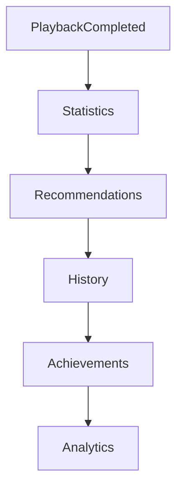

The Event Bus performs the fan-out automatically.

Publishers remain unchanged regardless of subscriber count.

---

# No Subscriber Ordering

Subscribers MUST be considered independent.

The runtime makes **no guarantee** that:

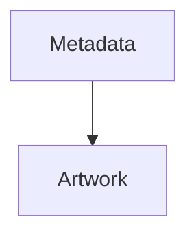

will execute before:

```

Recommendations
```

If ordering is required, it should emerge naturally through additional events.

Never through subscriber registration order.

---

# Runtime Registration

Capabilities register subscriptions during startup.

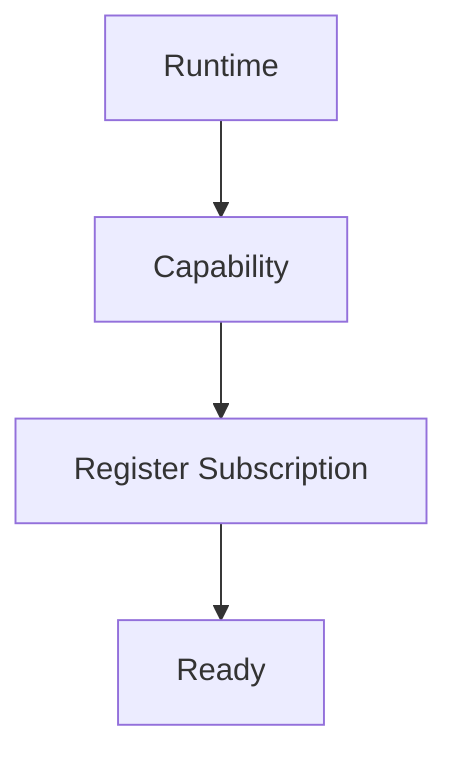

Subscriptions should remain static throughout the application's lifetime unless explicitly designed otherwise.

---

# Dynamic Modules

Modules register subscriptions exactly like Platform capabilities.

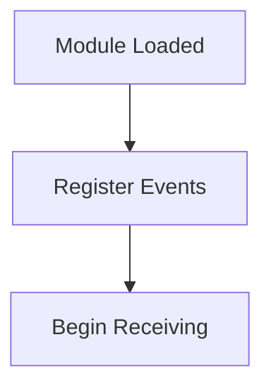

The Event Bus makes no distinction between:

- Platform capabilities
- First-party modules
- Third-party modules

Every capability participates equally.

---

# Delivery Independence

Suppose one subscriber fails.

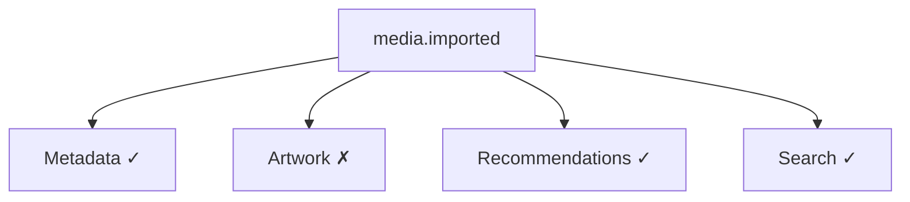

The failure affects only Artwork.

Other subscribers continue normally.

Retry belongs to Artwork.

Not the publisher.

---

# Event Acknowledgement

Subscribers acknowledge successful processing.

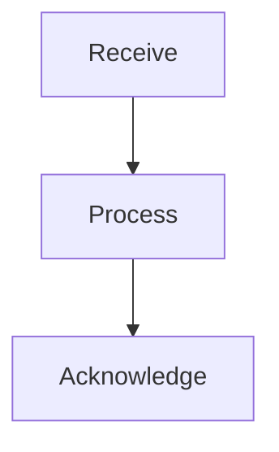

Only after acknowledgement is the event considered successfully processed for that subscriber.

Unacknowledged events become eligible for retry.

---

# Event Filtering

Subscribers receive only events they have explicitly subscribed to.

Poor.

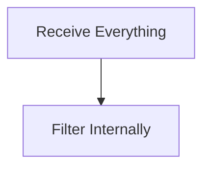

Preferred.

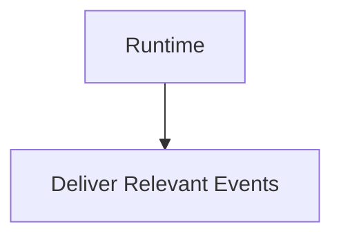

The runtime performs routing.

Subscribers process business logic.

---

# Backpressure

The Event Bus is responsible for protecting the runtime during overload.

Possible strategies include:

- bounded queues
- worker pools
- rate limiting
- deferred retries

Unbounded queues are prohibited.

The runtime must remain stable under sustained load.

Future chapters discuss backpressure in detail.

---

# Event Persistence

The Event Bus MAY persist events before delivery.

Persistence enables:

- replay
- diagnostics
- recovery
- auditing

Whether persistence is enabled is a runtime concern.

Business capabilities should remain unaware.

---

# Event Replay

Replay follows the same delivery path as live events.

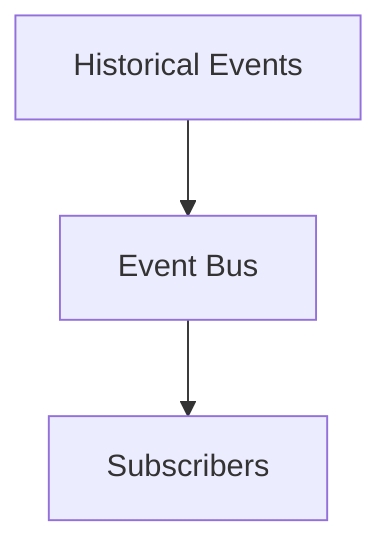

Subscribers should not need separate replay implementations.

Processing historical events should be indistinguishable from processing live events wherever practical.

---

# Runtime Observability

Every significant Event Bus action SHOULD produce telemetry.

Examples include:

- published events
- delivery latency
- retry count
- subscriber failures
- queue depth
- dead-letter events

The Event Bus should be one of the most observable components within the platform.

If events cannot be observed, debugging distributed behaviour becomes significantly harder.

---

# Event Bus Boundaries

The Event Bus should remain intentionally small.

It should expose behaviour such as:

- Publish
- Subscribe
- Register
- Shutdown

It should not expose business concepts.

The runtime API should remain stable even as capabilities evolve.

---

# Anti-Patterns

The following practices are prohibited.

## Business Logic Inside The Event Bus

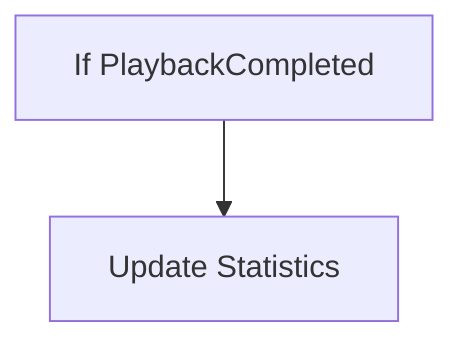

The Event Bus should never understand business events.

---

## Subscriber Discovery By Publishers

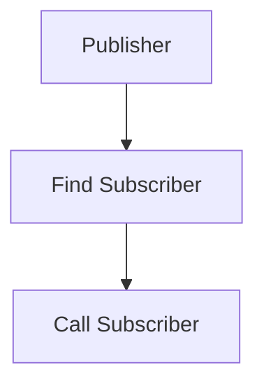

Publishers should never know subscribers exist.

---

## Shared Subscriber State

Subscribers communicating through shared mutable memory rather than events.

---

## Runtime Orchestration

The Event Bus deciding which business operation should execute next.

Business workflows emerge from events.

Not runtime decisions.

---

## Synchronous Delivery Requirements

Publishers waiting for every subscriber before continuing.

The runtime should remain asynchronous wherever practical.

---

# Mosaic Guidelines

Within Mosaic:

- The Event Bus MUST remain business agnostic.
- Publishers MUST publish facts only.
- Subscribers MUST register explicitly.
- Subscribers MUST remain independent.
- Delivery MUST be at-least-once.
- Subscriber failures MUST NOT affect other subscribers.
- Runtime routing MUST remain transparent to publishers.
- The Event Bus MUST remain observable.
- Modules MUST integrate through the same Event Bus as Platform capabilities.

---

# Summary

The Event Bus is the nervous system of the Mosaic Runtime.

It transports information.

It coordinates delivery.

It observes execution.

It never owns business behaviour.

Maintaining this separation allows the platform to grow from a handful of capabilities to hundreds without introducing direct dependencies between them.

The Event Bus therefore remains one of the smallest yet most important components within the entire Mosaic architecture.
