<!--
File: docs/engineering/guides/meg-002-event-driven-runtime/08-publishers.md
Document: MEG-002
Status: Draft
Version: 0.4
-->

# Publishers

> *A publisher records that something happened. It never decides who should care.*

---

# Purpose

Publishers are responsible for introducing events into the Mosaic Runtime.

They represent the boundary between business behaviour and runtime coordination.

A publisher owns one responsibility:

> **Publish immutable business facts after successful state transitions.**

Everything that follows belongs to the runtime.

This document defines the responsibilities, behaviour and constraints governing every event publisher within the Mosaic ecosystem.

---

# Philosophy

Within Mosaic:

> **Publishers announce facts. They never orchestrate workflows.**

Publishing an event should be the final step of completing business behaviour.

The publisher should never:

- invoke subscribers
- coordinate workflows
- wait for processing
- understand downstream behaviour

Those responsibilities belong to the runtime.

---

# Publisher Responsibilities

Every publisher is responsible for:

- detecting completed business state changes
- constructing valid events
- publishing events
- preserving event integrity

A publisher is **not** responsible for:

- delivery
- retries
- scheduling
- subscriber discovery
- ordering
- observability

Those concerns belong entirely to the Event Bus.

---

# Publishing Lifecycle

Every event follows the same publishing lifecycle.

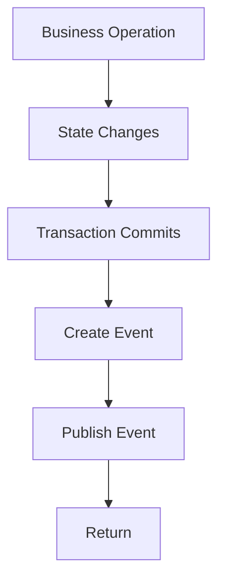

Publishing should occur only after the business operation has completed successfully.

---

# Publish After Success

Events MUST represent reality.

Correct.

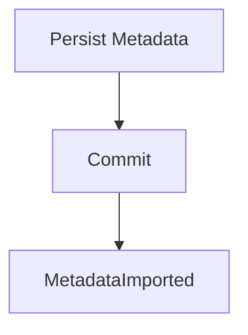

Incorrect.

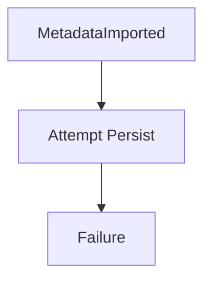

The runtime must never observe events describing work that never actually happened.

---

# One Publisher

Every event MUST have exactly one publisher.

Example.

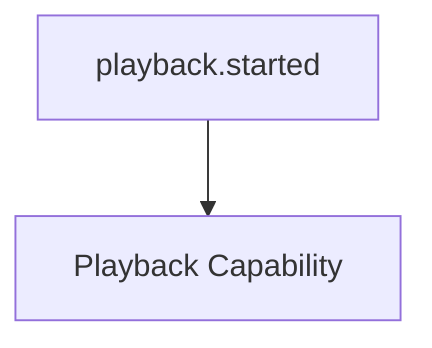

Only Playback owns this business fact.

Other capabilities may observe it.

None should publish it.

Ownership must remain unambiguous.

---

# Publisher Ownership

A capability owns the events describing the state it owns.

Examples.

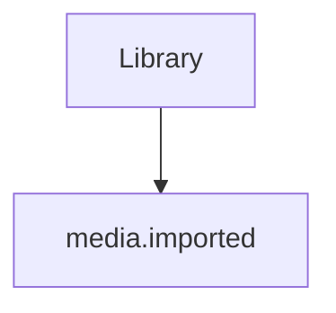

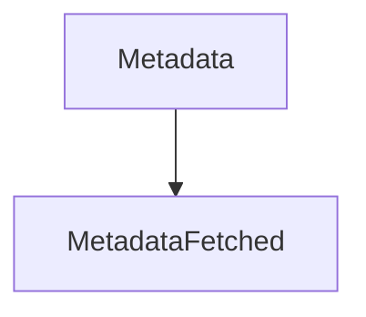

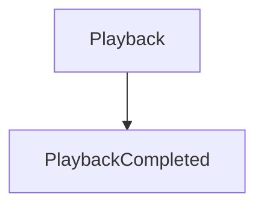

Ownership should never cross bounded contexts.

If multiple capabilities publish the same event, architectural ownership has become unclear.

---

# Publishing Is Fire-And-Forget

Once an event has been accepted by the Event Bus:

The publisher's responsibility ends.

The publisher MUST NOT:

- wait for subscribers
- retry delivery
- inspect acknowledgements
- coordinate processing

Example.

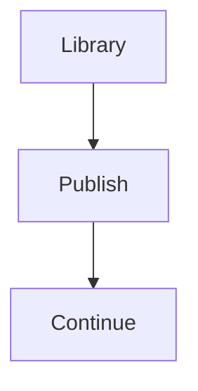

The runtime becomes responsible for reliable delivery.

---

# Publish Facts

Publishers communicate:

```

What happened
```

Never:

```

What should happen
```

Good.

```

media.imported
```

Poor.

```

GenerateArtwork
```

Subscribers decide what actions, if any, should follow.

---

# Publisher Independence

Publishers must remain completely unaware of:

- subscriber count
- subscriber identity
- subscriber implementation
- subscriber success
- subscriber failure

A capability should function correctly even if no subscribers exist.

This is the defining property of loose coupling.

---

# Constructing Events

Publishers construct complete events.

This includes:

- runtime metadata
- business payload
- identifiers
- timestamps

Incomplete events should never enter the runtime.

Validation belongs at publication time.

---

# Publishing Transactions

Publishing should occur only after business state becomes durable.

Recommended sequence.

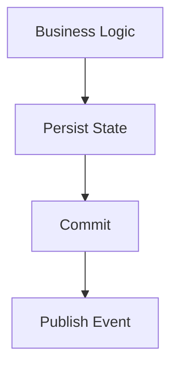

This avoids publishing events describing rolled-back work.

In distributed systems this concern is often addressed using the Transactional Outbox pattern, which records events atomically alongside business state before asynchronous publication. ([microservices.io](https://microservices.io/patterns/data/transactional-outbox.html))

---

# Multiple Events

A single operation may publish multiple events.

Example.

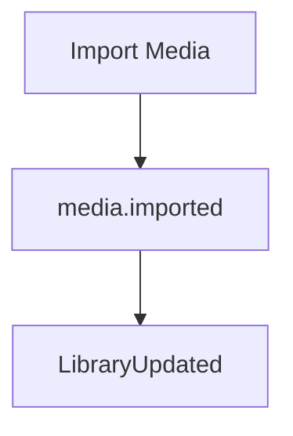

Each event should represent a distinct business fact.

Do not combine unrelated concepts into one large event.

---

# Event Timing

Publishers determine **when** a fact becomes true.

They do not determine:

- when subscribers execute
- when retries occur
- when work completes

The runtime controls execution timing.

Publishers control business truth.

---

# Avoid Conditional Publishing

Poor.

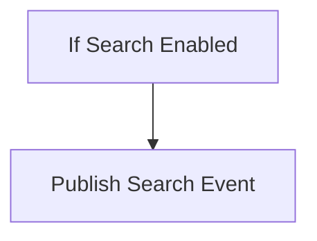

Better.

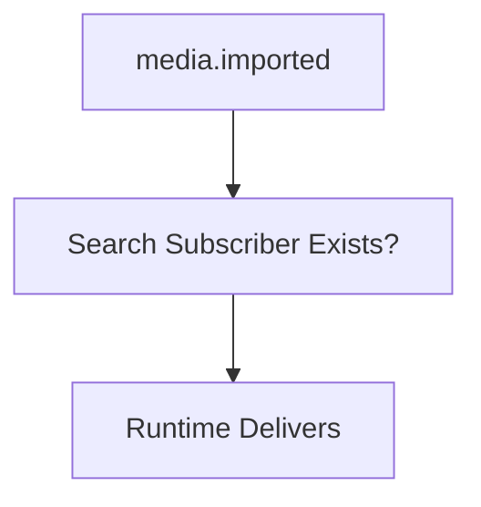

Capabilities should publish business facts regardless of platform configuration.

Subscribers determine relevance.

---

# Idempotent Publication

Publishers SHOULD avoid accidentally publishing duplicate events.

If duplicate publication occurs, subscriber idempotency should ensure correctness.

Publisher correctness remains preferable.

Duplicate events should represent exceptional rather than normal behaviour.

---

# Publisher Failure

Publishing itself may fail.

Examples include:

- runtime unavailable
- event validation failure
- persistence failure

Publishers should treat publication failure as a business failure unless the runtime explicitly guarantees deferred publication.

Silent event loss is prohibited.

---

# Event Ordering

Publishers SHOULD publish events in the order business facts occur.

Example.

Correct.

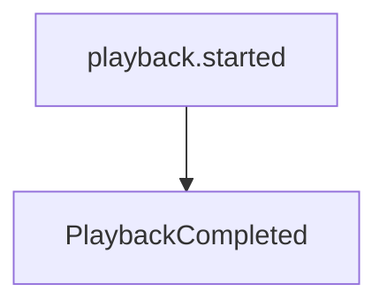

Incorrect.

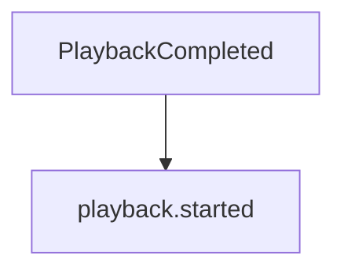

The runtime does not infer chronology.

Publishers establish it.

---

# Domain Boundaries

Publishers must never publish events belonging to another capability.

Poor.

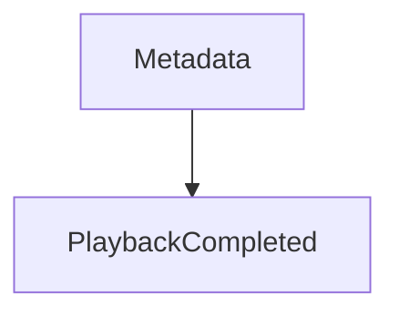

Only Playback owns playback.

Capabilities should never invent facts outside their own domain.

---

# Publisher Simplicity

Publishing code should remain simple.

Example.

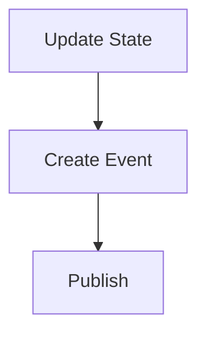

Complex business logic should already have completed.

If publishing requires extensive decision making, that logic probably belongs elsewhere.

---

# Anti-Patterns

The following practices are prohibited.

## Waiting For Subscribers

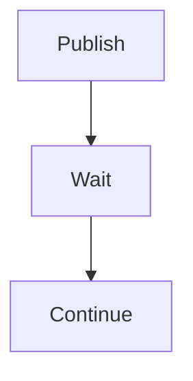

Publishing should not become orchestration.

---

## Publishing Before Commit

Publishing facts before durable state exists.

---

## Publishing Commands

```

RefreshMetadata
```

Publish facts instead.

---

## Subscriber Discovery

Publishers attempting to locate subscribers.

---

## Business Logic During Publication

Publication should not become another application layer.

Business decisions belong before publication.

---

## Publishing Another Capability's Events

Every capability owns its own business facts.

Ownership should never overlap.

---

# Mosaic Guidelines

Within Mosaic:

- Publishers MUST publish facts only.
- Publishers MUST publish after successful state transitions.
- Every event MUST have one canonical publisher.
- Publishers MUST remain unaware of subscribers.
- Publishers MUST NOT coordinate workflows.
- Events MUST be validated before publication.
- Business ownership MUST determine publisher ownership.
- Publication SHOULD remain deterministic and simple.

---

# Summary

Publishers are intentionally uncomplicated.

They perform one task exceptionally well:

> **Convert completed business state into immutable events.**

By remaining unaware of downstream behaviour, publishers allow the Mosaic Runtime to grow indefinitely without increasing coupling between capabilities.

This simplicity is one of the key architectural properties that enables Mosaic's module-first platform.
