<!--
File: docs/engineering/guides/meg-002-event-driven-runtime/09-subscribers.md
Document: MEG-002
Status: Draft
Version: 0.4
-->

# Subscribers

> *Subscribers react to facts. They never influence whether those facts occurred.*

---

# Purpose

Subscribers are responsible for reacting to events published within the Mosaic Runtime.

They represent autonomous capabilities that observe business facts and perform additional work where appropriate.

Unlike publishers, subscribers have no ownership over the event itself.

Their responsibility begins only after the event has been published.

This document defines the behaviour, responsibilities and architectural constraints governing event subscribers.

---

# Philosophy

Within Mosaic:

> **Subscribers react independently to immutable business facts.**

A subscriber should answer one question.

> **"Given this fact, is there work my capability should perform?"**

Nothing more.

Subscribers should never become orchestrators.

They should simply react.

---

# Subscriber Responsibilities

Subscribers are responsible for:

- receiving events
- validating event compatibility
- performing business behaviour
- publishing new facts
- acknowledging successful processing

Subscribers are **not** responsible for:

- event routing
- retry scheduling
- subscriber discovery
- event persistence
- delivery guarantees

Those responsibilities belong to the runtime.

---

# Subscription Model

Subscribers explicitly declare interest.

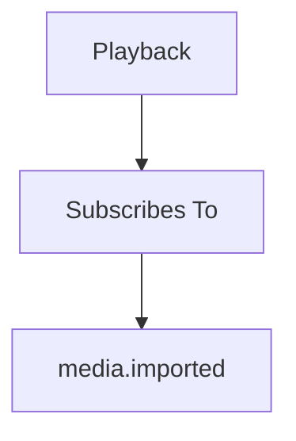

The runtime records this relationship.

Publishers remain unaware.

---

# Processing Lifecycle

Every subscriber follows the same lifecycle.

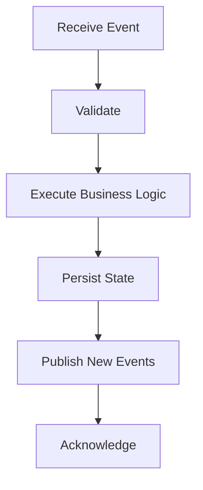

This lifecycle remains consistent regardless of capability.

---

# Validate First

Before processing an event, every subscriber SHOULD validate:

- supported version
- required payload fields
- mandatory identifiers
- business preconditions

Invalid events SHOULD fail immediately.

Subscribers should never execute partial business logic against invalid contracts.

---

# Process Independently

Subscribers should process events independently.

Example.

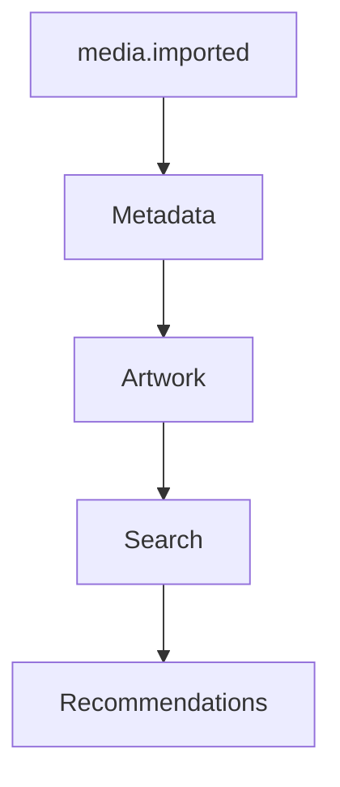

Each subscriber owns its own behaviour.

No subscriber should depend upon another subscriber completing first.

---

# Publish New Facts

Subscribers frequently become publishers.

Example.

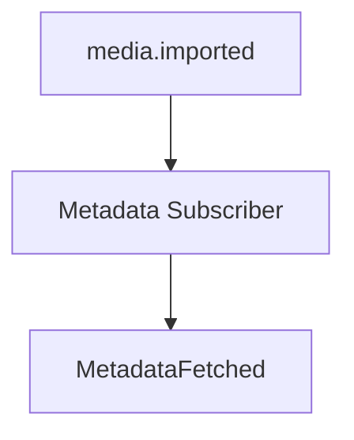

The subscriber reacts.

Performs work.

Publishes a new business fact.

The chain continues.

This creates naturally evolving workflows without central orchestration.

---

# One Responsibility

Each subscriber SHOULD own one business concern.

Good.

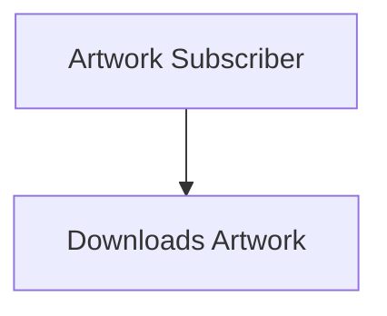

Poor.

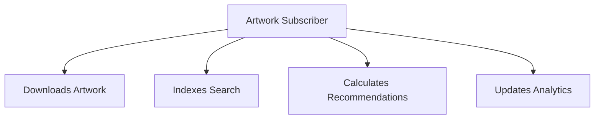

Subscribers should remain cohesive.

---

# Idempotency

Subscribers MUST be idempotent.

Receiving the same event multiple times must produce the same final state.

Example.

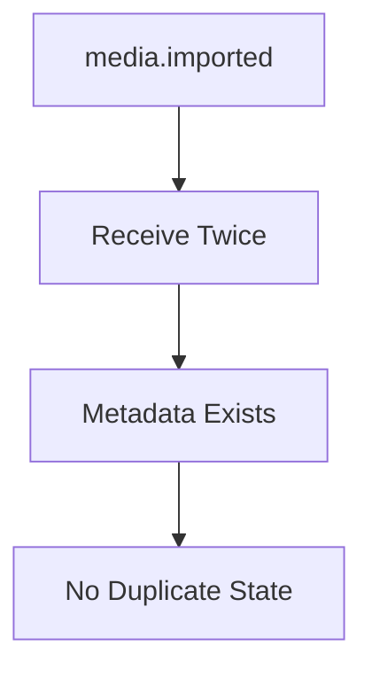

At-least-once delivery makes idempotent subscribers a fundamental architectural requirement rather than an optimisation. The Idempotent Consumer pattern is widely recommended for this reason. ([microservices.io](https://microservices.io/post/microservices/patterns/2020/10/16/idempotent-consumer.html))

Future chapters define idempotency in detail.

---

# Failure Isolation

Subscriber failure must remain isolated.

Example.

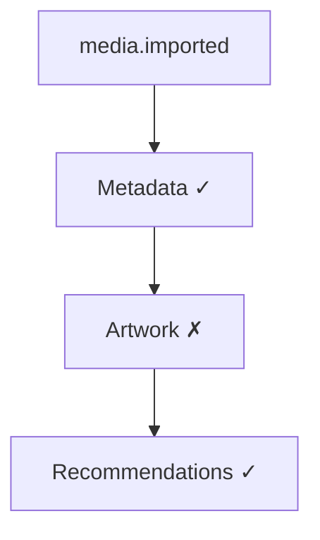

Artwork failure must never prevent Recommendations from processing.

The runtime manages retries independently.

---

# Timeouts

Subscribers SHOULD honour context cancellation.

Long-running work must terminate when:

- cancellation requested
- runtime shutting down
- timeout exceeded

Subscribers should never ignore runtime lifecycle.

---

# Retry Behaviour

Subscribers SHOULD assume events may be retried.

Business behaviour must therefore tolerate:

- duplicate delivery
- delayed delivery
- replay

Subscribers should never assume:

```

Receive Once
```

They should assume:

```

Receive One Or More Times
```

---

# Side Effects

Subscribers frequently perform side effects.

Examples include:

- downloading artwork
- writing databases
- updating caches
- sending notifications

Side effects SHOULD occur only after successful validation.

Subscribers should avoid partially completed work wherever practical.

---

# Ordering Assumptions

Subscribers MUST NOT assume:

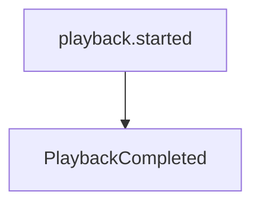

always arrives in chronological order.

Network delays.

Retries.

Replay.

Independent processing.

All may affect delivery order.

Subscribers should validate current business state rather than relying solely on event order.

---

# Business Ownership

Subscribers may observe many domains.

They should only modify their own.

Example.

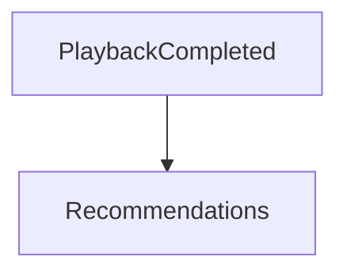

Recommendations may update recommendation state.

It should **not** modify playback history.

Every capability owns its own data.

---

# Stateless Processing

Subscribers SHOULD remain stateless wherever practical.

State belongs in:

- databases
- caches
- repositories

Not subscriber instances.

Stateless subscribers are:

- easier to test
- easier to restart
- easier to scale

---

# Slow Subscribers

Slow subscribers should not delay the runtime.

Possible approaches include:

- worker pools
- bounded queues
- background execution

The runtime should remain responsive even when individual capabilities perform expensive work.

---

# Event Chaining

Subscribers naturally create event chains.

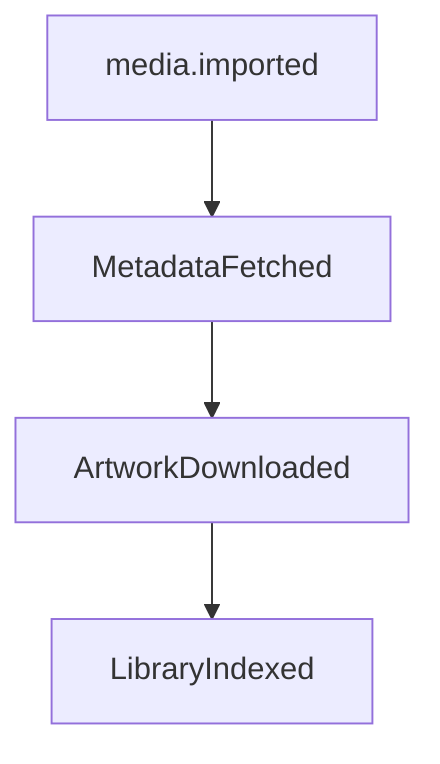

Each subscriber owns one transition.

No subscriber owns the complete workflow.

---

# Logging

Subscribers SHOULD log:

- processing failures
- unexpected states
- validation failures

Subscribers SHOULD NOT log:

- successful processing of every routine event

Routine success belongs in metrics.

Failures belong in logs.

---

# Metrics

Every subscriber SHOULD expose:

- processing count
- failure count
- retry count
- processing latency

Subscriber metrics provide operational visibility into runtime behaviour.

---

# Replay

Subscribers SHOULD process replayed events identically to live events.

Replay should require:

```

No Code Changes
```

Business behaviour should remain deterministic.

Historical replay should reproduce historical outcomes.

---

# Dead-Letter Events

Subscribers SHOULD eventually give up.

Permanent failures should result in:

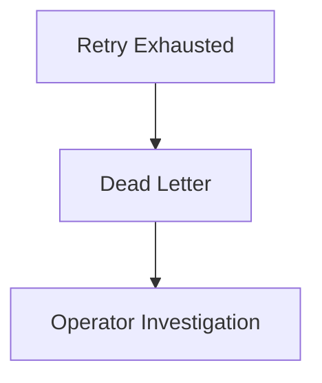

Subscribers should not retry indefinitely.

Future chapters define retry policies.

---

# Anti-Patterns

The following practices are prohibited.

## Calling Other Subscribers

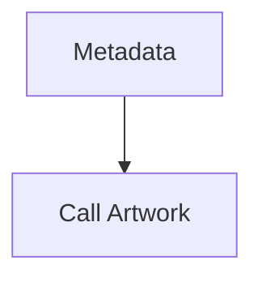

Publish an event instead.

---

## Shared Subscriber State

Subscribers coordinating through mutable shared memory.

---

## Ignoring Duplicates

Assuming every event is delivered exactly once.

---

## Long Blocking Operations

Subscribers preventing the runtime from progressing.

---

## Business Logic Inside Retry

Retry logic belongs to the runtime.

Business logic belongs to subscribers.

---

## Assuming Subscriber Order

Subscribers should never rely on registration order.

---

# Mosaic Guidelines

Within Mosaic:

- Subscribers MUST remain autonomous.
- Subscribers MUST validate events before processing.
- Subscribers MUST be idempotent.
- Subscribers MUST honour cancellation.
- Subscribers MUST publish new facts where appropriate.
- Subscribers MUST own only their own business state.
- Subscribers MUST tolerate duplicate and delayed delivery.
- Subscribers SHOULD remain stateless.
- Subscribers SHOULD expose operational metrics.

---

# Summary

Subscribers transform facts into further business behaviour.

They remain independent.

They remain deterministic.

They remain unaware of one another.

This allows the Mosaic Runtime to evolve organically.

New capabilities simply subscribe to existing facts.

Existing capabilities remain unchanged.

That property is one of the defining characteristics of a truly extensible platform.
