<!--
File: docs/engineering/guides/meg-002-event-driven-runtime/11-scheduling.md
Document: MEG-002
Status: Draft
Version: 0.4
-->

# Scheduling

> *Time is a runtime concern. Business capabilities should describe what must happen, never when it should happen.*

---

# Purpose

Not all work should execute immediately.

Some work should occur:

- after a delay
- at a specific time
- periodically
- after a timeout
- once another condition has been satisfied

Within Mosaic, these concerns belong to the runtime scheduler.

Business capabilities should never implement their own scheduling logic.

Instead, they describe work.

The runtime determines when that work should execute.

---

# Philosophy

Within Mosaic:

> **Capabilities own intent. The runtime owns time.**

Time is infrastructure.

Business logic should remain completely unaware of:

- timers
- cron expressions
- polling loops
- scheduling algorithms
- worker allocation

This separation allows scheduling behaviour to evolve independently of business behaviour.

---

# Why Scheduling Exists

Many runtime operations are naturally delayed.

Examples include:

- Metadata refresh
- Cache invalidation
- Periodic library scanning
- Module health checks
- Retry backoff
- Cleanup tasks
- Token expiration
- Scheduled notifications

These operations share one common characteristic.

They depend upon **time**, not user interaction.

---

# Runtime Model

Every scheduled task follows the same lifecycle.

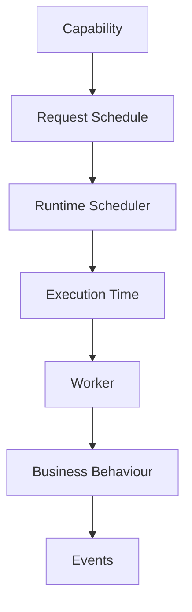

Notice that the capability never manages the timer itself.

---

# Scheduling Responsibilities

The runtime scheduler owns:

- delayed execution
- recurring execution
- retry scheduling
- timeout scheduling
- worker allocation
- schedule persistence
- cancellation
- observability

It intentionally does **not** own:

- business decisions
- task implementation
- workflow orchestration

---

# Business Responsibilities

Capabilities may request scheduling.

They should never implement scheduling.

Example.

Good.

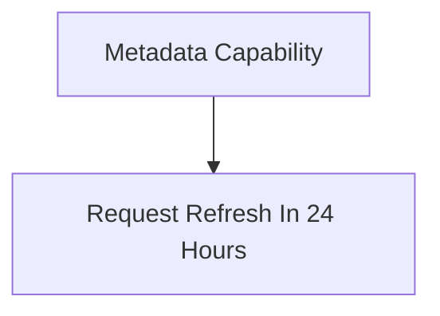

Poor.

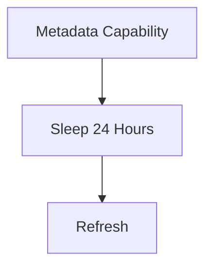

Business logic should remain independent of time.

---

# One-Time Scheduling

One-time tasks execute once.

Examples include:

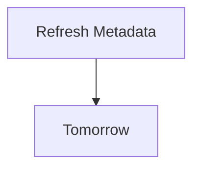

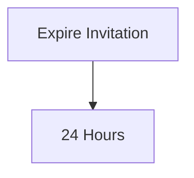

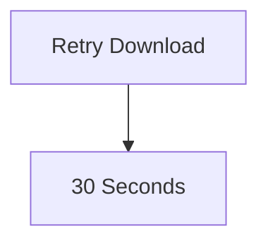

Once complete, the schedule is removed.

---

# Recurring Scheduling

Recurring tasks execute repeatedly.

Examples include:

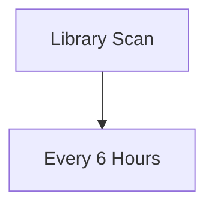

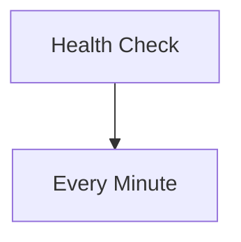

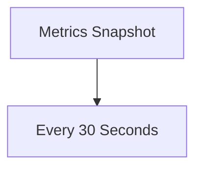

Recurring schedules remain active until explicitly cancelled.

---

# Delayed Execution

Some work should intentionally occur later.

Example.

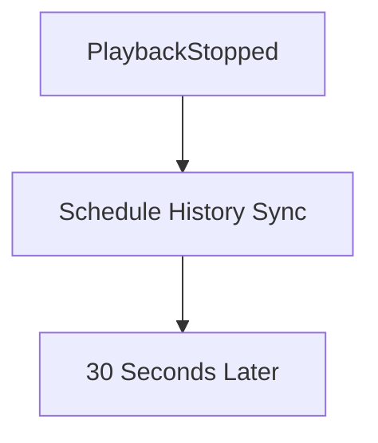

Delaying work can:

- reduce unnecessary processing
- batch operations
- improve responsiveness

The runtime owns these decisions.

---

# Retry Scheduling

Retries are simply scheduled work.

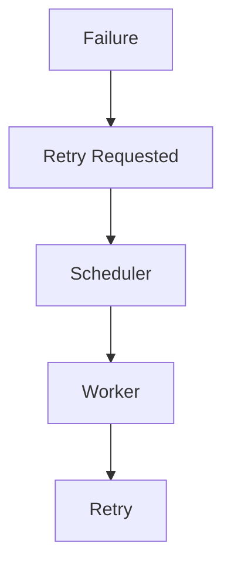

Subscribers should never implement retry loops.

Retries belong to the runtime.

Future chapters define retry policies.

---

# Cron Jobs

Traditional cron jobs are discouraged.

Poor.

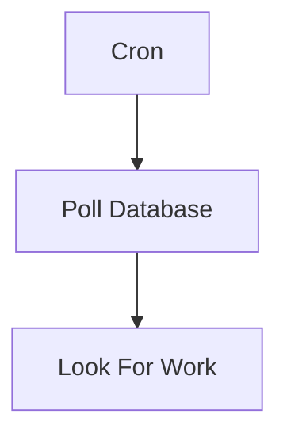

Preferred.

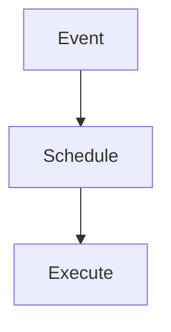

The runtime should react to business events rather than continually polling for changes.

Periodic schedules remain appropriate for genuine maintenance work.

---

# Schedule Ownership

Every scheduled task has exactly one owner.

Example.

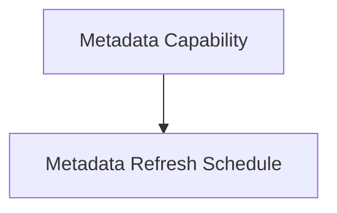

Only the owning capability should create or cancel its schedules.

The runtime executes them.

It does not define them.

---

# Schedule Identity

Every scheduled task SHOULD have a unique identifier.

Identity enables:

- cancellation
- diagnostics
- metrics
- replay
- observability

The scheduler should treat schedules as first-class runtime objects.

---

# Persistence

Long-running schedules SHOULD survive runtime restarts.

Examples include:

- recurring scans
- subscription renewals
- maintenance tasks

Ephemeral schedules may remain in memory.

Persistent schedules should be restored during startup.

The runtime owns persistence.

Capabilities remain unaware.

---

# Cancellation

Schedules SHOULD be cancellable.

Typical lifecycle.

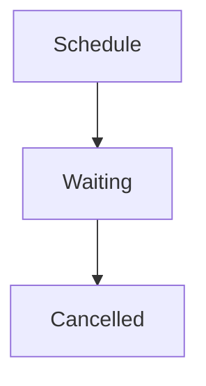

Cancellation should:

- release resources
- prevent future execution
- remain observable

Cancellation should never silently disappear.

---

# Scheduling Events

The scheduler SHOULD publish runtime events.

Examples include:

```

TaskScheduled
```

```

TaskExecuted
```

```

TaskCancelled
```

```

TaskExpired
```

These are **runtime events** rather than business events.

They improve observability without coupling business capabilities to scheduler internals.

---

# Scheduling Precision

Not every scheduled task requires millisecond precision.

Examples.

High precision:

- Playback synchronisation
- Session expiration

Low precision:

- Metadata refresh
- Library scan
- Cleanup

The scheduler should optimise for correctness rather than unnecessary precision.

---

# Resource Management

Scheduling should remain bounded.

The runtime should avoid:

- unlimited pending schedules
- duplicate recurring schedules
- abandoned timers

Every scheduled task consumes runtime resources.

Ownership must remain explicit.

---

# Restart Behaviour

Following a restart:

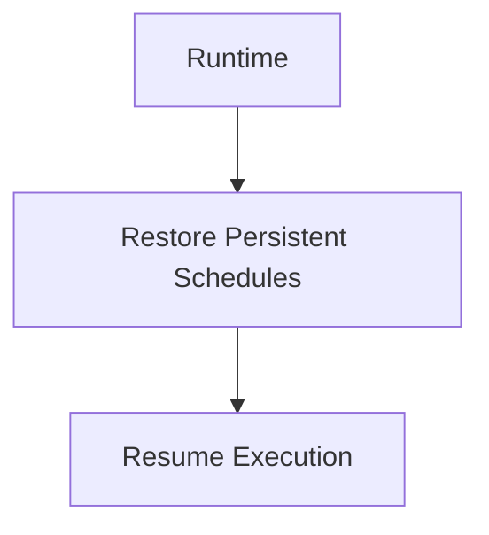

Business capabilities should not need to recreate long-lived schedules manually.

The runtime restores them.

---

# Observability

The scheduler SHOULD expose:

- active schedules
- completed schedules
- cancelled schedules
- execution latency
- queue depth
- missed executions

Scheduling should remain one of the most observable runtime components.

---

# Scaling

Scheduling decisions should remain centralised.

Execution should remain distributed.

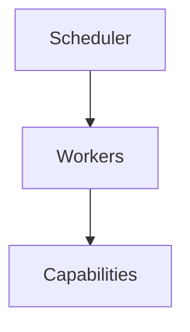

The scheduler decides **when**.

Workers decide **where**.

Capabilities decide **what**.

This separation keeps responsibilities clear.

---

# Anti-Patterns

The following practices are prohibited.

## Sleeping Inside Business Logic

```go
time.Sleep(...)
```

Business capabilities should never delay themselves.

---

## Infinite Polling

```

for {

    check()

    sleep()
}
```

Polling should be replaced with events wherever practical.

---

## Self-Scheduling Capabilities

Capabilities creating their own timer infrastructure.

Scheduling belongs to the runtime.

---

## Hidden Timers

Background timers started automatically during object construction.

All scheduling should remain explicit.

---

## Duplicate Schedules

Multiple recurring schedules performing identical work.

The runtime should detect and prevent unnecessary duplication.

---

## Scheduling Business Decisions

The scheduler should never determine:

```

Should Metadata Refresh?
```

It simply executes requested work.

Business decisions belong to capabilities.

---

# Mosaic Guidelines

Within Mosaic:

- The runtime MUST own scheduling.
- Business capabilities MUST remain time agnostic.
- Retries MUST be scheduled by the runtime.
- Persistent schedules SHOULD survive restarts.
- Schedules MUST be observable.
- Schedules MUST be cancellable.
- Polling SHOULD be replaced with events wherever practical.
- Workers MUST execute scheduled work.
- The scheduler MUST remain business agnostic.

---

# Summary

Scheduling is infrastructure.

It allows capabilities to express **intent** without becoming responsible for **time**.

By separating scheduling from business behaviour, the Mosaic Runtime gains:

- deterministic execution
- simplified capabilities
- improved observability
- graceful recovery
- scalable worker allocation

Time becomes another service provided by the platform.

Capabilities remain focused entirely on business behaviour.
