<!--
File: docs/engineering/guides/meg-002-event-driven-runtime/12-idempotency.md
Document: MEG-002
Status: Draft
Version: 0.4
-->

# Idempotency

> *Every event should be safe to process more than once. Correctness should never depend upon perfect delivery.*

---

# Purpose

The Mosaic Runtime guarantees **at-least-once delivery**.

This means every subscriber must assume an event may be delivered:

- once
- multiple times
- after a delay
- after a retry
- during replay

Without idempotency, duplicate delivery produces duplicate side effects.

This document defines how capabilities ensure repeated event processing always converges on the same final state.

---

# Philosophy

Within Mosaic:

> **Processing an event twice should produce the same final business state as processing it once.**

Idempotency is not an optimisation.

It is a fundamental property of every event subscriber.

Correctness must never depend upon receiving an event exactly once.

---

# Why Idempotency Exists

Consider:

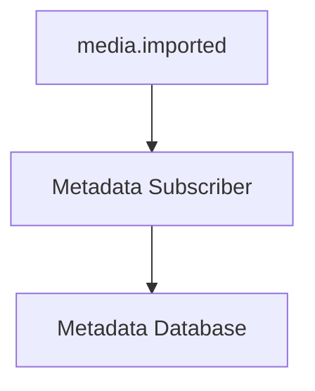

Suppose the subscriber:

- downloads metadata
- stores metadata
- crashes before acknowledging the event

The runtime retries.

Without idempotency:

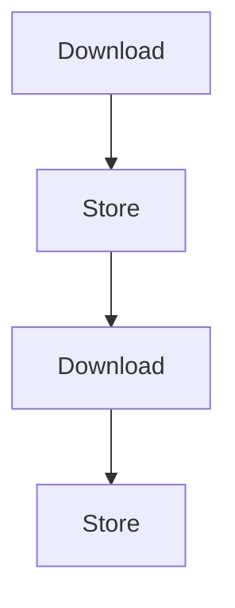

Duplicate work.

Potentially duplicate state.

Idempotency prevents this.

---

# At-Least-Once Delivery

The Mosaic Runtime deliberately provides:

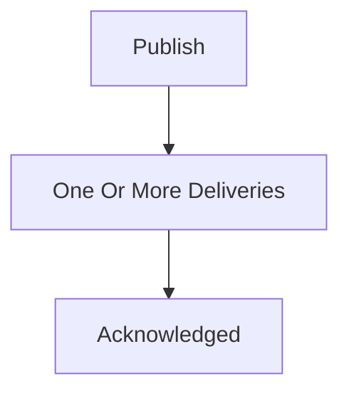

Not:

```

Exactly Once
```

Exactly-once delivery generally requires distributed coordination between the event bus, storage engine and subscriber, introducing significant complexity. Mosaic instead adopts the more common architectural approach of at-least-once delivery with idempotent consumers. ([microservices.io](https://microservices.io/post/microservices/patterns/2020/10/16/idempotent-consumer.html))

---

# Idempotent Behaviour

An operation is idempotent when:

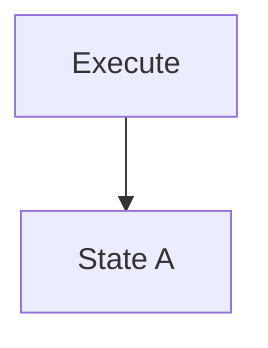

and

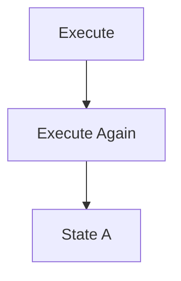

The final state remains identical.

Repeated execution produces no additional business effect.

---

# Business State

Idempotency concerns business state.

Not implementation.

Poor.

```

Handler executed twice
```

Good.

```

Library contains one media item.
```

The implementation may execute multiple times.

The business result should remain correct.

---

# Event Identity

Every event contains a unique Event ID.

Subscribers SHOULD use this identifier when determining whether work has already been completed.

Example.

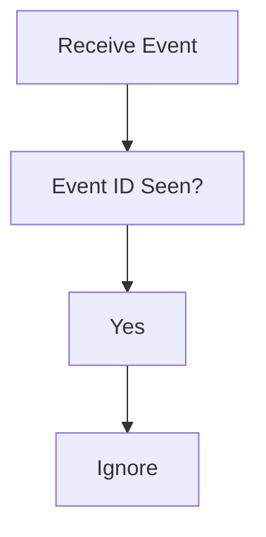

or

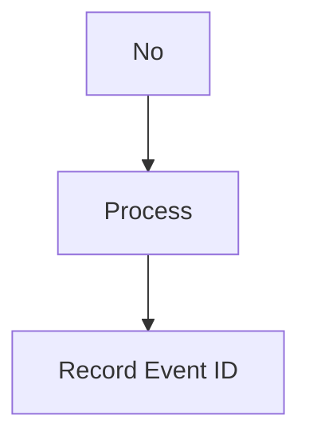

The Event ID represents one occurrence of a business fact.

---

# Natural Idempotency

Some operations are naturally idempotent.

Example.

```

Set Status = Completed
```

Running repeatedly produces:

```

Completed
```

No additional work occurs.

Prefer naturally idempotent business operations wherever practical.

---

# Artificial Idempotency

Other operations require explicit tracking.

Example.

```

Send Email
```

Running twice sends two emails.

Instead.

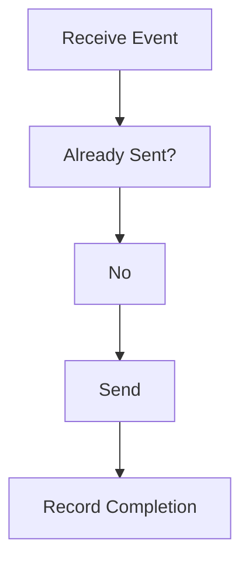

Artificial idempotency introduces explicit duplicate detection.

---

# Business Keys

Sometimes Event IDs are insufficient.

Example.

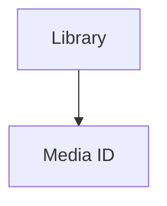

If only one metadata record should ever exist per media item:

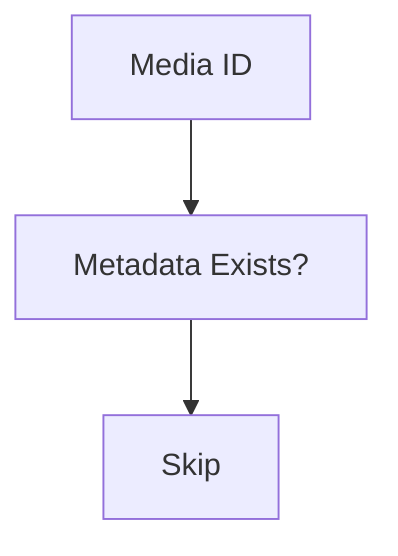

Business identifiers frequently provide stronger guarantees than event identifiers alone.

---

# Database Constraints

Whenever possible, correctness should be enforced by persistence.

Examples include:

- unique constraints
- primary keys
- upserts

Example.

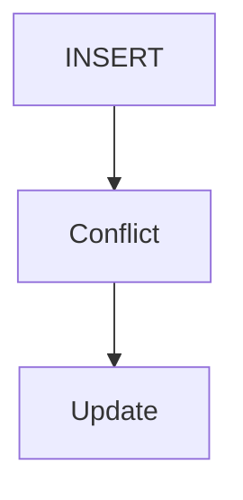

Database constraints provide an additional layer of protection against duplicate processing.

Business correctness should not rely solely upon application code.

---

# Upserts

Prefer:

```

Insert Or Update
```

Rather than:

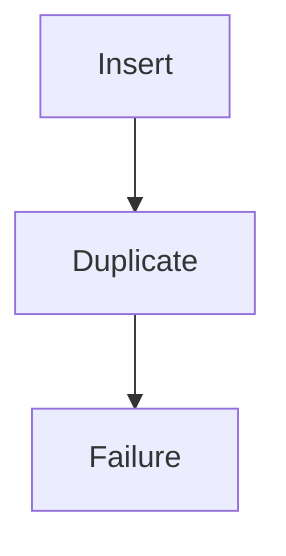

Upserts naturally support idempotent behaviour.

They simplify subscriber implementation.

---

# Event Recording

Subscribers MAY maintain a processed-event store.

Example.

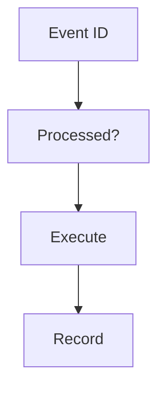

This approach is particularly useful for side-effect-heavy operations.

The runtime does not require a specific implementation.

Only the resulting behaviour.

---

# Side Effects

Special care is required for external side effects.

Examples include:

- email
- notifications
- webhooks
- external APIs

Repeated execution may produce:

- duplicate emails
- duplicate notifications
- duplicate API calls

Subscribers should therefore verify whether the side effect has already occurred before repeating it.

---

# Event Replay

Replay intentionally delivers historical events again.

Replay should therefore produce:

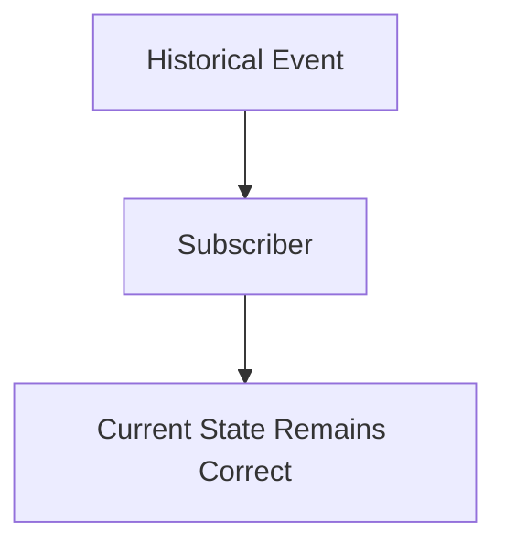

Replay should never corrupt business state.

This property depends entirely upon idempotent subscribers.

---

# Retries

Retries become trivial when subscribers are idempotent.

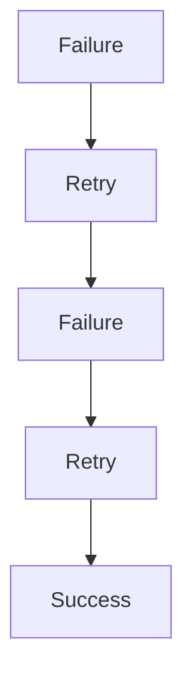

Subscribers do not need to distinguish between:

- original delivery
- retry
- replay

They simply process events safely.

---

# Event Ordering

Idempotency should not rely upon ordering.

Suppose:

```

PlaybackCompleted
```

arrives before:

```

playback.started
```

Subscribers should validate current business state rather than assuming chronological delivery.

Ordering guarantees belong elsewhere.

Idempotency remains independent.

---

# Compensating Events

Business state should never be "rolled back" by replay.

Instead:

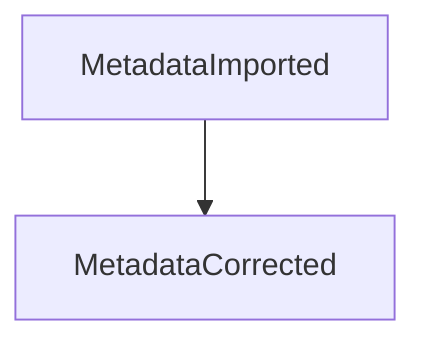

New facts supersede previous facts.

History remains intact.

Subscribers simply converge upon current truth.

---

# Stateless Subscribers

Stateless subscribers naturally encourage idempotency.

State should remain in:

- repositories
- databases
- projections

Not subscriber instances.

Restarting a subscriber should not affect correctness.

---

# Observability

Duplicate processing SHOULD remain observable.

Useful metrics include:

- duplicate events ignored
- replayed events processed
- idempotency failures
- constraint violations

Operational visibility helps identify architectural problems before they affect users.

---

# Anti-Patterns

The following practices are prohibited.

## Assuming Exactly Once

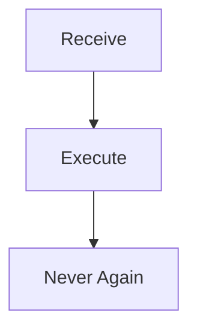

Subscribers must always assume duplicate delivery.

---

## Side Effects Before Validation

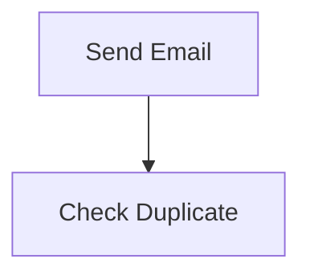

Validation should always precede external effects.

---

## Mutable Event History

Changing historical events to avoid duplicate processing.

History remains immutable.

Subscribers adapt.

---

## Runtime-Owned Idempotency

The runtime should not decide business correctness.

Subscribers own idempotent behaviour.

---

## Ignoring Duplicate Delivery

Assuming retries will never occur.

Duplicate delivery is expected.

Not exceptional.

---

# Mosaic Guidelines

Within Mosaic:

- Every subscriber MUST be idempotent.
- Duplicate event delivery MUST produce the same business state.
- Business correctness MUST NOT depend upon exactly-once delivery.
- Event IDs SHOULD support duplicate detection.
- Database constraints SHOULD reinforce idempotency.
- External side effects MUST be protected against duplication.
- Replay MUST remain safe.
- Retries MUST assume duplicate execution.

---

# Relationship to the Runtime

Idempotency is one of the architectural properties that allows the Mosaic Runtime to remain simple.

Because subscribers are idempotent:

- retries become inexpensive
- worker crashes become recoverable
- replay becomes possible
- rolling deployments become safer
- runtime coordination becomes dramatically simpler

Rather than building an increasingly complicated runtime attempting to prevent duplicates, Mosaic accepts duplicate delivery and requires subscribers to handle it correctly.

This significantly improves resilience while reducing runtime complexity.

---

# Summary

Idempotency is not about preventing duplicate execution.

It is about ensuring duplicate execution produces correct behaviour.

Within the Mosaic Runtime, correctness is achieved through:

- immutable events
- idempotent subscribers
- durable business state
- explicit ownership

When these principles are followed, retries, replay and recovery become natural properties of the platform rather than exceptional situations requiring special handling.
