<!--
File: docs/engineering/guides/meg-002-event-driven-runtime/13-retry-strategy.md
Document: MEG-002
Status: Draft
Version: 0.4
-->

# Retry Strategy

> *Retries exist to recover from transient failures. They should never become an infinite substitute for fixing permanent ones.*

---

# Purpose

Failure is an expected characteristic of distributed systems.

Networks fail.

Services become temporarily unavailable.

Databases restart.

Modules crash.

The purpose of the Mosaic Runtime is not to eliminate failure.

It is to recover from transient failure safely while exposing permanent failure clearly.

This document defines how retries are performed throughout the Mosaic Runtime.

---

# Philosophy

Within Mosaic:

> **Retry infrastructure belongs to the runtime. Recovery belongs to the capability.**

Business capabilities should never implement retry loops.

Instead they should:

- return failures
- remain idempotent
- allow the runtime to decide when, whether and how work should be retried.

---

# Why Retries Exist

Consider:

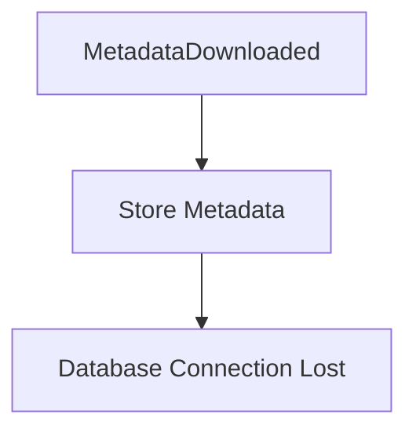

The business operation has not failed permanently.

The database was temporarily unavailable.

Retrying later is entirely reasonable.

Now consider:

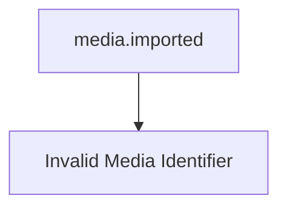

Retrying will never succeed.

The failure is permanent.

Understanding this distinction is fundamental.

---

# Failure Categories

Failures fall into two categories.

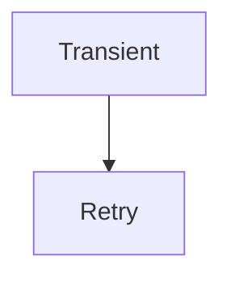

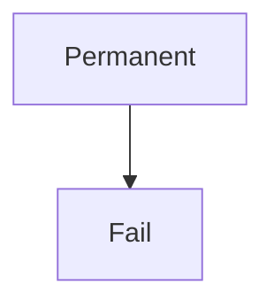

The runtime should never blindly retry every failure.

---

# Transient Failures

Transient failures are expected to recover naturally.

Examples include:

- temporary network failure
- service unavailable
- database restart
- timeout
- rate limiting
- temporary file lock

Retries are appropriate.

---

# Permanent Failures

Permanent failures cannot succeed through repetition.

Examples include:

- invalid payload
- unsupported event version
- missing required fields
- business validation failure
- corrupted data

Retries should not occur.

These failures should be surfaced immediately.

---

# Retry Lifecycle

Every retry follows the same lifecycle.

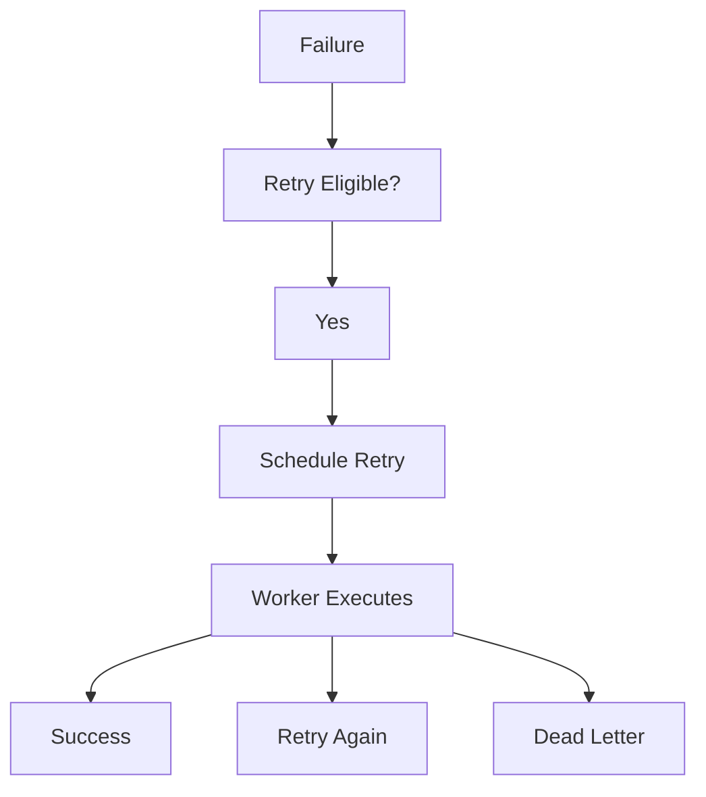

Retry is therefore another form of scheduled work.

Not a special execution path.

---

# Runtime Ownership

The runtime owns:

- retry scheduling
- retry timing
- retry counting
- retry cancellation
- retry observability

Capabilities own:

- determining whether the operation succeeded
- returning meaningful failures
- remaining idempotent

Responsibilities remain clearly separated.

---

# Exponential Backoff

Retries SHOULD use exponential backoff.

Example.

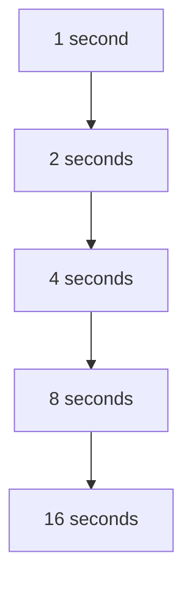

Exponential backoff reduces:

- cascading failures
- unnecessary load
- resource contention

Immediate retries often amplify outages.

Exponential backoff with optional jitter is widely recommended to avoid synchronized retry storms. ([aws.amazon.com](https://aws.amazon.com/builders-library/timeouts-retries-and-backoff-with-jitter/))

---

# Jitter

Retry timing SHOULD include random jitter.

Without jitter:

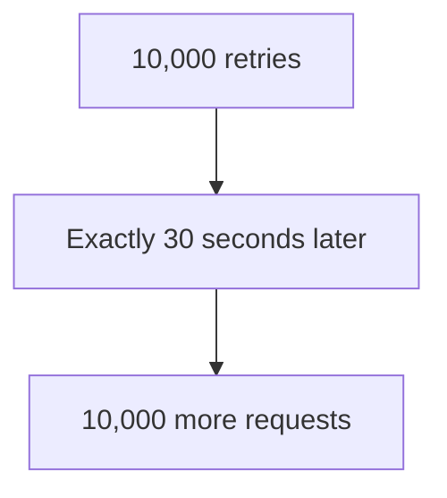

With jitter:

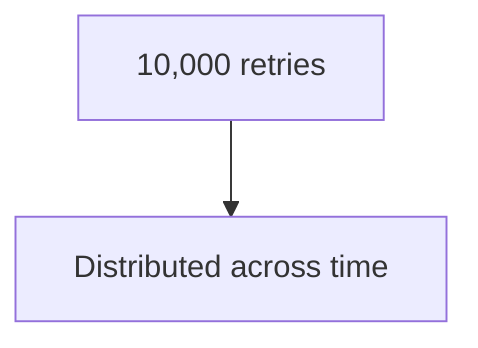

This significantly reduces retry storms.

---

# Maximum Retries

Retries MUST be bounded.

Example.

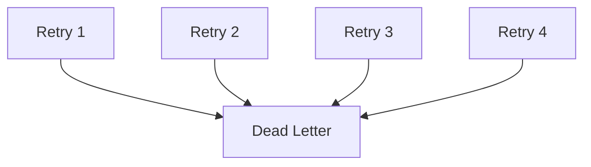

Infinite retries are prohibited.

Every retry strategy must eventually terminate.

---

# Retry Budget

The runtime SHOULD maintain retry budgets.

Budgets prevent one failing capability from consuming disproportionate runtime resources.

Examples include:

- maximum retries
- maximum retry duration
- maximum concurrent retries

Resource usage should remain predictable.

---

# Retry Delay Ownership

Capabilities should never decide retry timing.

Poor.

```go
time.Sleep(30 * time.Second)
```

Better.

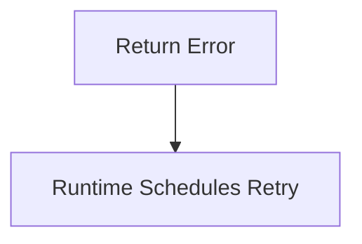

Time remains a runtime concern.

Business logic remains pure.

---

# Idempotency Requirement

Retries assume idempotent subscribers.

Without idempotency:

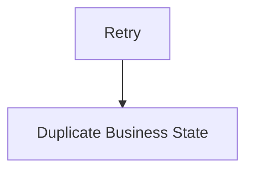

With idempotency:

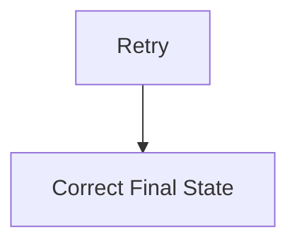

Retry safety depends entirely upon the previous chapter.

---

# Retry Classification

Errors SHOULD communicate retry intent.

Conceptually.

```

Retryable
```

or

```

Permanent
```

The runtime should not inspect error messages.

Capabilities should classify failures explicitly.

Future runtime APIs should expose this distinction clearly.

---

# Retry Observability

Every retry SHOULD produce telemetry.

Examples include:

- retry count
- retry latency
- retry success
- retry exhaustion
- retry cancellation

Operators should understand:

- why retries occurred
- how frequently
- whether they succeeded

Retries should never become invisible.

---

# Retry Cancellation

Retries should respect runtime shutdown.

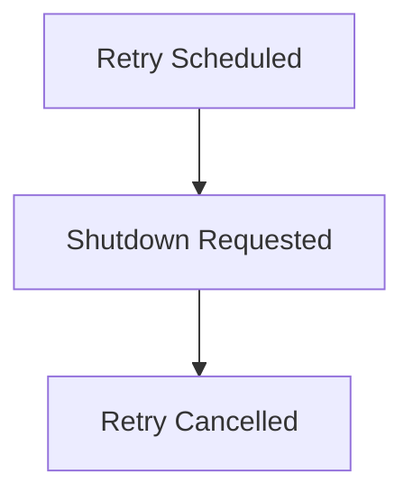

The runtime should never execute retries after shutdown begins unless explicitly configured to resume them after restart.

---

# Retry Persistence

Pending retries SHOULD survive runtime restarts.

Example.

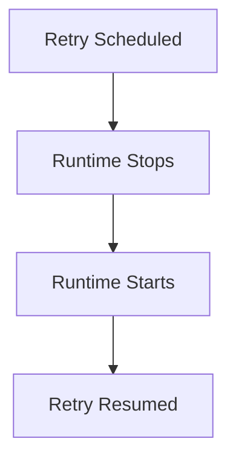

Retry scheduling should be durable wherever business correctness depends upon eventual completion.

---

# Dead Letter Transition

Retries eventually terminate.

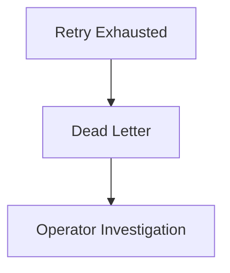

Retries are intended to recover temporary failures.

They are not intended to conceal permanent ones.

---

# Immediate Retry

Immediate retry SHOULD be rare.

Appropriate examples include:

- optimistic locking conflicts
- short-lived resource contention

Even then:

Retry count should remain bounded.

---

# Retry Transparency

Business capabilities should not know:

- current retry number
- retry delay
- retry scheduling algorithm

They simply process events.

The runtime manages delivery behaviour.

---

# Retry Independence

Each subscriber owns its own retry lifecycle.

Example.

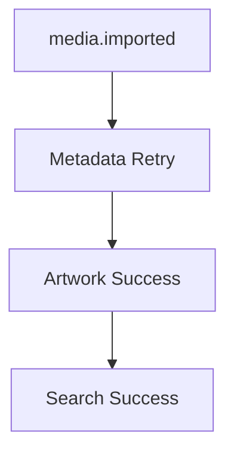

Subscriber retries should never block unrelated capabilities.

Failure isolation remains intact.

---

# Retry Metrics

The runtime SHOULD expose:

- retries scheduled
- retries completed
- retries cancelled
- retries exhausted
- average retry latency
- retry queue depth

Retry metrics provide early warning of degrading platform health.

---

# Anti-Patterns

The following practices are prohibited.

## Infinite Retry Loops

```

Retry Forever
```

---

## Sleeping Inside Subscribers

```go
time.Sleep(...)
```

---

## Retrying Validation Failures

Invalid business input should fail immediately.

---

## Subscriber-Owned Retry Logic

Retry belongs to runtime infrastructure.

---

## Retrying Without Idempotency

Duplicate execution must always be safe.

---

## Retry Storms

Large numbers of simultaneous retries without:

- backoff
- jitter
- budgets

---

# Mosaic Guidelines

Within Mosaic:

- Retries MUST remain runtime responsibilities.
- Retries MUST use exponential backoff.
- Retries SHOULD include jitter.
- Retries MUST remain bounded.
- Subscribers MUST remain idempotent.
- Retry scheduling SHOULD survive restart where required.
- Retry behaviour MUST remain observable.
- Permanent failures MUST NOT be retried.
- Retry exhaustion MUST transition to dead-letter handling.

---

# Relationship to the Runtime

Retry is simply another form of scheduling.

The runtime already owns:

- time
- workers
- execution

Retry naturally becomes another scheduled execution.

This keeps business capabilities free from infrastructure concerns while allowing the runtime to evolve retry strategies without modifying business code.

---

# Summary

Retries should recover temporary failure.

They should never disguise permanent failure.

Within Mosaic, retries are:

- runtime managed
- bounded
- observable
- idempotent
- deterministic

When combined with idempotent subscribers and immutable events, retries become a routine operational mechanism rather than a source of architectural complexity.
