<!--
File: docs/engineering/guides/meg-002-event-driven-runtime/14-event-ordering.md
Document: MEG-002
Status: Draft
Version: 0.4
-->

# Event Ordering

> *Correct systems do not depend upon perfect ordering. They depend upon correct business state.*

---

# Purpose

Distributed systems naturally introduce uncertainty.

Events may be:

- delayed
- duplicated
- replayed
- processed concurrently
- delivered out of chronological order

The Mosaic Runtime intentionally avoids guaranteeing global event ordering because doing so significantly reduces scalability and increases coupling.

Instead, capabilities are engineered to converge upon correct business state regardless of delivery order wherever practical.

This document defines the ordering guarantees provided by the Mosaic Runtime and the responsibilities of capabilities consuming events.

---

# Philosophy

Within Mosaic:

> **Ordering is a business concern, not a transport guarantee.**

The runtime transports events.

Business capabilities determine whether order is significant.

When ordering is required, it should be modelled explicitly rather than assumed implicitly.

---

# Why Ordering Is Difficult

Consider two events.

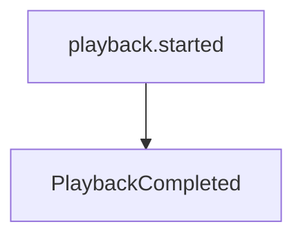

Business chronology is obvious.

Runtime chronology is not.

A temporary network delay may produce:

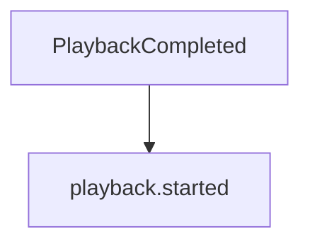

Both events are valid.

Only their arrival differs.

Subscribers must therefore distinguish between:

- event occurrence
- event delivery

These are different concepts.

---

# Occurrence vs Delivery

Every event has two timelines.

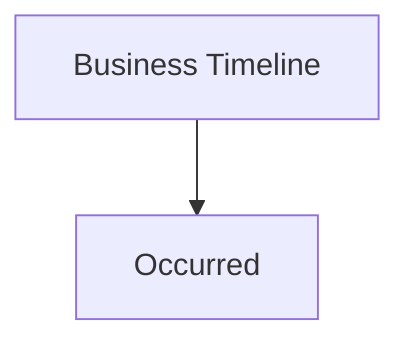

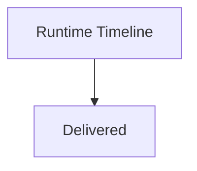

The runtime preserves occurrence metadata.

It does not guarantee delivery order.

Subscribers should therefore reason about business time rather than arrival time.

---

# Runtime Guarantees

The Mosaic Runtime guarantees:

- every accepted event will eventually be delivered (subject to retry policy)
- every event preserves its metadata
- every event preserves its occurrence timestamp

The runtime does **not** guarantee:

- global ordering
- subscriber ordering
- cross-capability ordering
- simultaneous delivery

These guarantees intentionally remain minimal.

---

# Ordering Domains

Ordering is meaningful only within a bounded business context.

Example.

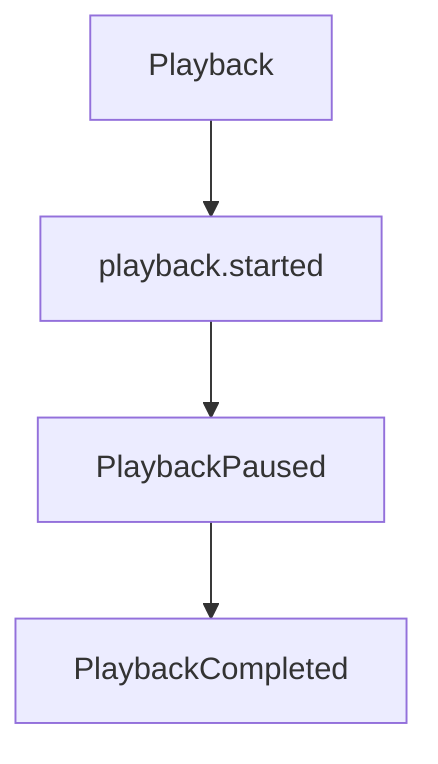

Ordering matters.

However:

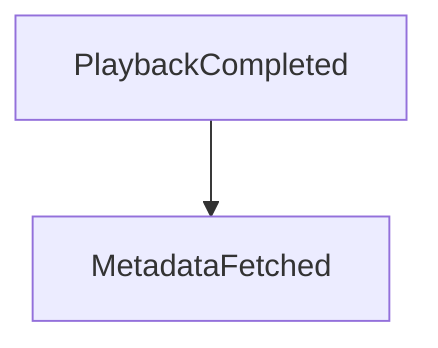

There is usually no meaningful ordering relationship.

Capabilities should define ordering only where the business genuinely requires it.

---

# Global Ordering

Global ordering is prohibited.

Example.

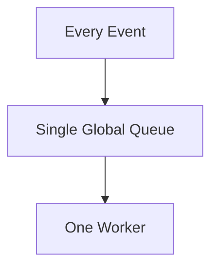

While simple, this approach:

- limits throughput
- increases latency
- couples unrelated capabilities
- reduces resilience

The runtime intentionally avoids this architecture.

Independent work should remain independent.

---

# Per-Entity Ordering

Where ordering is required, it SHOULD generally be scoped to a business entity.

Example.

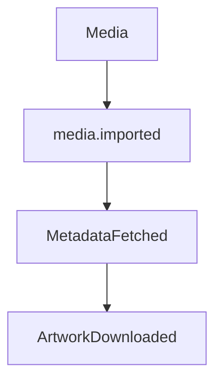

Ordering exists because all events concern the same media item.

This provides deterministic behaviour without requiring global coordination.

---

# Subscriber Expectations

Subscribers MUST assume:

- duplicate delivery
- delayed delivery
- reordered delivery

Subscribers SHOULD NOT assume:

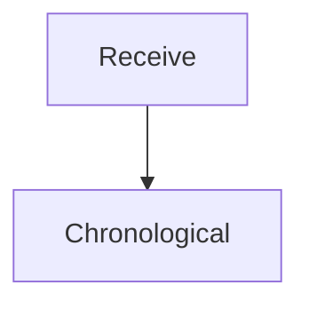

Instead they should validate current business state before performing work.

---

# State Validation

Suppose:

```

PlaybackCompleted
```

arrives first.

The subscriber should ask:

```

Current Playback State?
```

Rather than:

```

Did playback.started arrive?
```

Business state is authoritative.

Event order is informative.

---

# Sequence Numbers

Some event families benefit from sequence numbers.

Example.

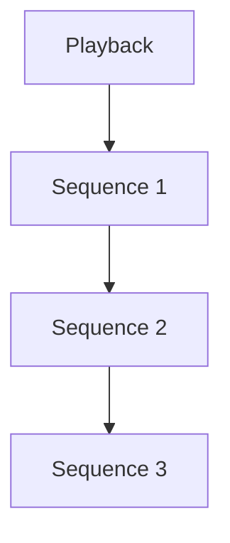

Sequence numbers allow subscribers to detect:

- missing events
- duplicates
- stale events

They should be introduced only where ordering genuinely matters.

Most events do not require them.

---

# Version vs Sequence

Do not confuse:

```

Version
```

with

```

Sequence
```

Version identifies:

```

Schema
```

Sequence identifies:

```

Business chronology
```

They solve entirely different problems.

---

# Concurrent Events

Independent capabilities may legitimately publish events simultaneously.

Example.

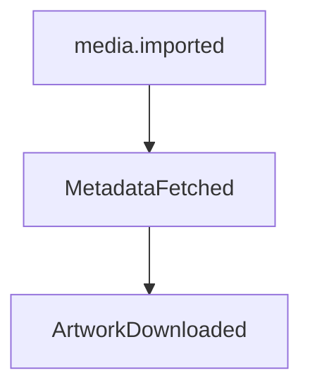

and

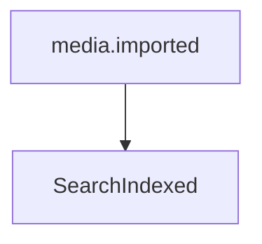

Neither workflow depends upon the other.

The runtime should allow maximum concurrency.

Artificial ordering reduces scalability.

---

# Ordering Through Events

When business ordering genuinely exists, model it explicitly.

Example.

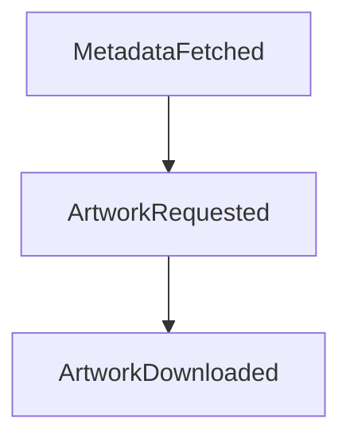

Each event naturally establishes the next business step.

Ordering emerges through business facts rather than runtime configuration.

---

# Replay Ordering

Replay SHOULD preserve original occurrence order where practical.

However:

Subscribers must still remain resilient to duplicate processing and partial replay.

Replay correctness should never depend solely upon transport order.

Business state remains authoritative.

---

# Event Timestamps

Subscribers SHOULD use:

```

Occurred At
```

when chronological reasoning is required.

Subscribers SHOULD NOT use:

```

Received At
```

Delivery time reflects runtime behaviour.

Occurrence time reflects business reality.

---

# Missing Events

Subscribers should tolerate missing events gracefully.

Example.

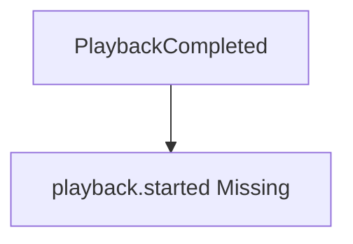

Possible responses include:

- query current state
- ignore stale event
- log diagnostic information
- request reconciliation

Subscribers should never enter undefined behaviour because one expected event failed to arrive.

---

# Stale Events

Events may become stale.

Example.

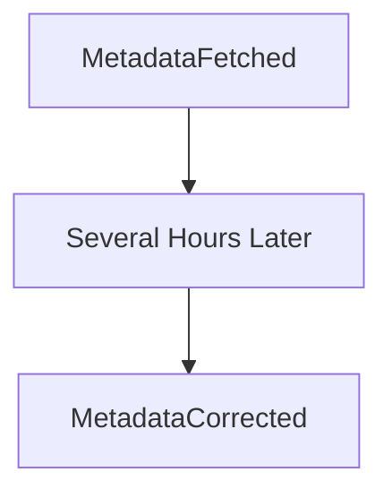

Receiving the older event later should not overwrite newer business state.

Subscribers should compare:

- timestamps
- versions
- current state

before applying changes.

---

# Causal Ordering

Where business causality matters, subscribers SHOULD use:

- Correlation ID
- Causation ID

rather than delivery order.

These identifiers describe business relationships.

Transport order does not.

---

# Runtime Behaviour

The runtime intentionally avoids reordering events.

It delivers events as they become available.

Capabilities determine whether ordering is relevant.

This keeps the runtime:

- simple
- scalable
- transport agnostic

Business semantics remain outside runtime infrastructure.

---

# Anti-Patterns

The following practices are prohibited.

## Assuming FIFO Globally

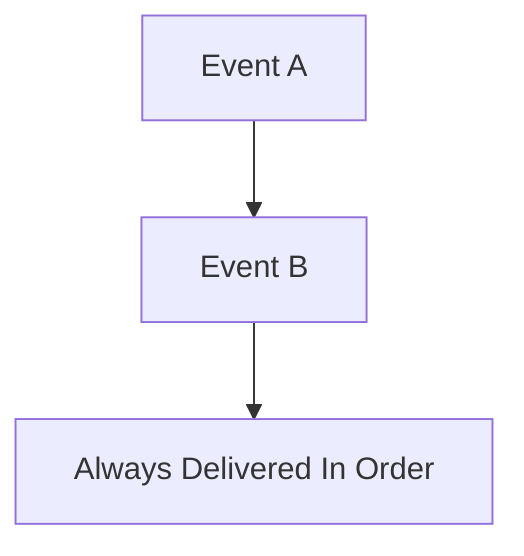

---

## Subscriber Registration Order

Assuming subscriber execution order has business meaning.

---

## Delivery Time As Business Time

Using:

```

Received At
```

instead of:

```

Occurred At
```

---

## Blocking Unrelated Work

Preventing independent capabilities from progressing while waiting for ordered processing.

---

## Runtime-Owned Business Ordering

The runtime should never determine:

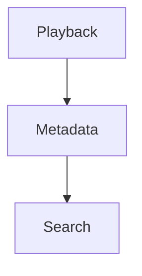

Business ordering belongs to capabilities.

---

# Mosaic Guidelines

Within Mosaic:

- Global ordering MUST NOT be assumed.
- Subscribers MUST tolerate out-of-order delivery.
- Business state MUST remain authoritative.
- Ordering SHOULD be scoped to business entities where required.
- Sequence numbers SHOULD only be introduced when justified.
- Event timestamps SHOULD represent business occurrence.
- Correlation and causation SHOULD express business relationships.
- Runtime delivery MUST remain independent of business semantics.

---

# Relationship to the Runtime

Relaxing ordering guarantees is one of the key architectural decisions enabling Mosaic's scalability.

Because the runtime does not attempt to globally sequence every event:

- worker pools remain highly parallel
- modules remain independent
- failures remain isolated
- throughput scales naturally
- capabilities evolve independently

Where ordering matters, business capabilities model it explicitly.

Where it does not, the runtime remains free to optimise for concurrency.

---

# Summary

Perfect ordering is an attractive illusion.

In distributed systems it often comes at the expense of scalability, resilience and simplicity.

Within Mosaic, the runtime delivers immutable business facts.

Capabilities determine how those facts should influence business state.

By treating ordering as a business concern rather than a runtime guarantee, the platform remains both highly concurrent and architecturally simple.
