<!--
File: docs/engineering/guides/meg-002-event-driven-runtime/15-backpressure.md
Document: MEG-002
Status: Draft
Version: 0.4
-->

# Backpressure

> *A healthy runtime knows when to slow down. An unhealthy runtime tries to do everything at once.*

---

# Purpose

The Mosaic Runtime is designed to operate continuously under varying workloads.

During normal operation, events flow smoothly through the platform.

However, temporary spikes are inevitable.

Examples include:

- importing a large media library
- installing a new module
- rebuilding metadata
- replaying historical events
- recovering after downtime

Without backpressure, these bursts can overwhelm:

- workers
- databases
- storage
- external APIs
- memory
- CPU

This document defines how the Mosaic Runtime controls workload to maintain predictable behaviour under load.

---

# Philosophy

Within Mosaic:

> **The runtime should slow work down before it breaks.**

Throughput is desirable.

Stability is mandatory.

When resources become constrained, the runtime should reduce intake rather than consume unlimited memory or spawn unlimited work.

---

# What Is Backpressure?

Backpressure is the mechanism through which the runtime communicates:

> **"I cannot safely accept more work right now."**

Rather than continuing to accept events indefinitely, the runtime intentionally limits throughput to protect overall system health.

Backpressure is a fundamental concept in reactive systems because it allows producers and consumers to operate at sustainable rates instead of overwhelming one another. ([reactivemanifesto.org](https://www.reactivemanifesto.org/))

---

# Why Backpressure Matters

Consider:

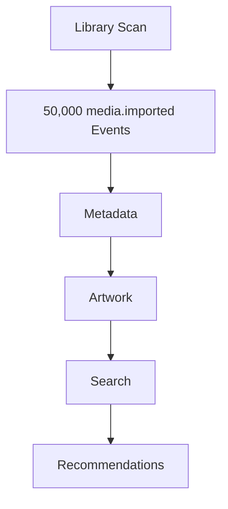

If every event immediately creates work:

- memory usage grows
- queues expand indefinitely
- workers become saturated
- external providers become rate limited

Eventually:

The runtime becomes unstable.

Backpressure prevents this.

---

# Runtime Model

The runtime continuously balances:

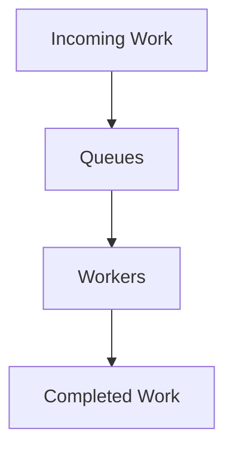

If workers cannot keep pace:

Queues grow.

Eventually the runtime begins applying backpressure.

---

# Backpressure Principles

The runtime should always prefer:

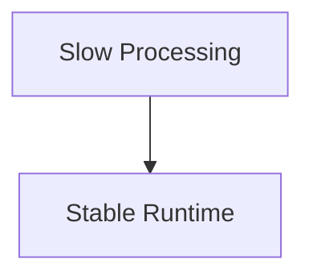

Rather than:

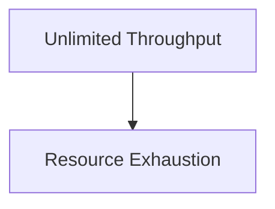

Graceful degradation is always preferable to catastrophic failure.

---

# Bounded Queues

Every runtime queue MUST have a maximum capacity.

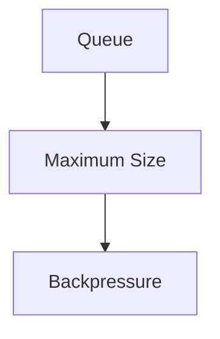

Unbounded queues are prohibited.

Unlimited buffering simply converts CPU pressure into memory pressure.

Eventually the runtime still fails.

---

# Queue Ownership

Each capability owns its own work queue.

Example.

```

Metadata Queue

Artwork Queue

Search Queue

Recommendation Queue
```

Independent queues prevent slow capabilities from blocking unrelated work.

Failure isolation remains intact.

---

# Worker Saturation

Suppose:

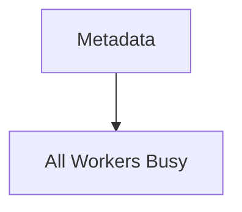

New work should queue.

If the queue becomes full:

Backpressure should be applied.

Workers should never grow without limit.

---

# Resource Protection

Backpressure protects:

- CPU
- memory
- database pools
- blob storage
- network connections
- external APIs

Protecting infrastructure is one of the runtime's primary responsibilities.

Business capabilities should remain unaware.

---

# Producer Behaviour

Publishers should never attempt to bypass runtime backpressure.

Poor.

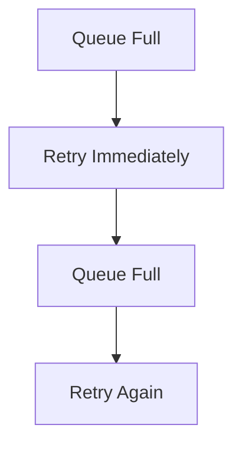

This amplifies overload.

Instead:

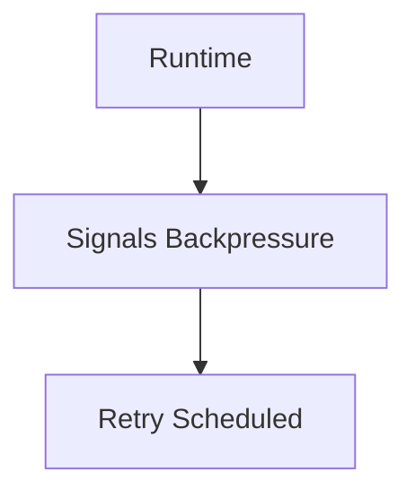

The runtime controls recovery.

---

# Queue Growth

Queue depth should remain observable.

Typical lifecycle.

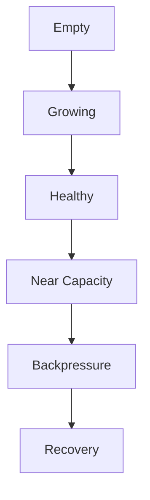

The runtime should begin protecting itself before queues become completely full.

---

# Priority

Not all work is equally important.

Examples.

High Priority.

- Playback
- Authentication
- User interaction

Lower Priority.

- Metadata refresh
- Recommendation generation
- Analytics

The scheduler MAY prioritise critical work during sustained load.

Business correctness should always take precedence over convenience.

---

# Load Shedding

Some work may be safely discarded.

Examples include:

- duplicate refresh requests
- repeated health checks
- obsolete cache refreshes

Other work must never be discarded.

Examples include:

- playback progress
- authentication events
- library imports

The runtime should understand this distinction.

---

# Coalescing

Repeated equivalent work SHOULD be combined where practical.

Example.

Poor.

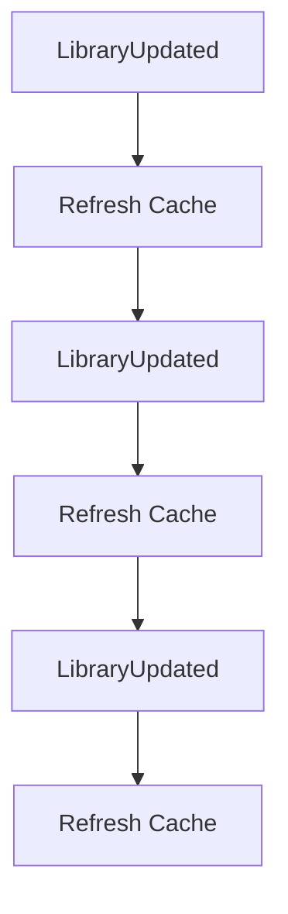

Better.

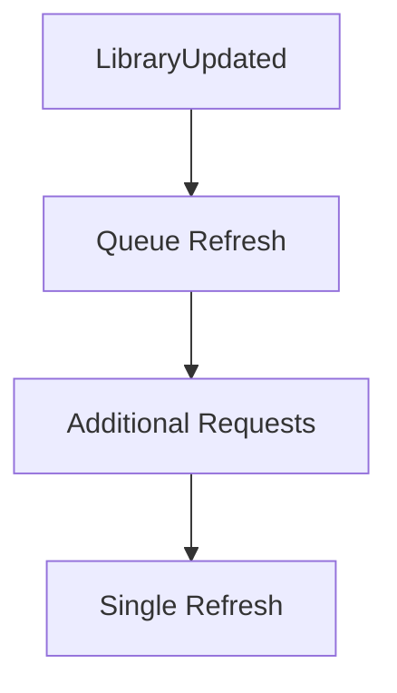

The runtime should avoid redundant work whenever correctness permits.

---

# Rate Limiting

External systems frequently impose rate limits.

Examples include:

- TMDB
- AniList
- Docker APIs
- Remote storage

Backpressure should naturally integrate with rate limiting.

Rather than failing continuously, the runtime should reduce throughput to sustainable levels.

---

# Module Isolation

Modules should never be capable of overwhelming the runtime.

Suppose:

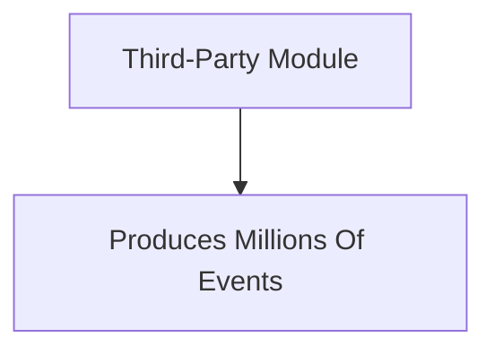

The runtime should:

- isolate the module
- apply backpressure
- preserve platform functionality

Platform stability always takes precedence over module throughput.

---

# Recovery

Backpressure should be temporary.

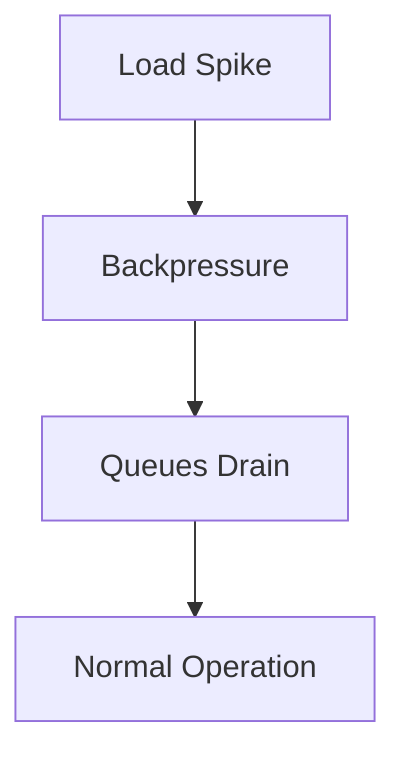

Recovery should occur automatically.

Manual intervention should rarely be required.

---

# Metrics

The runtime SHOULD expose:

- queue depth
- worker utilisation
- rejected work
- deferred work
- queue wait time
- average processing latency

These metrics provide early warning of runtime stress.

Operators should identify overload before users experience degraded behaviour.

---

# Adaptive Scaling

Where supported, the runtime MAY increase worker capacity during sustained load.

However:

Scaling should remain bounded.

Unlimited worker creation simply moves the bottleneck elsewhere.

Scaling should complement backpressure.

Not replace it.

---

# Circuit Breakers

Backpressure integrates naturally with circuit breakers.

Suppose:

```

TMDB Offline
```

Instead of:

```

Retry

Retry

Retry

Retry
```

The runtime should:

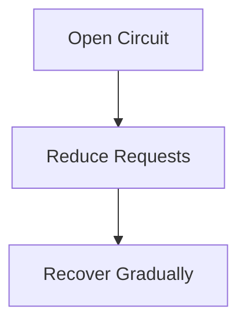

This protects both the runtime and external dependencies.

---

# Replay

Replay should respect normal backpressure.

Historical replay should never bypass:

- queues
- workers
- rate limits
- resource limits

Replay should appear identical to live processing from the runtime's perspective.

---

# Anti-Patterns

The following practices are prohibited.

## Unlimited Queues

```

Append Forever
```

---

## Unlimited Workers

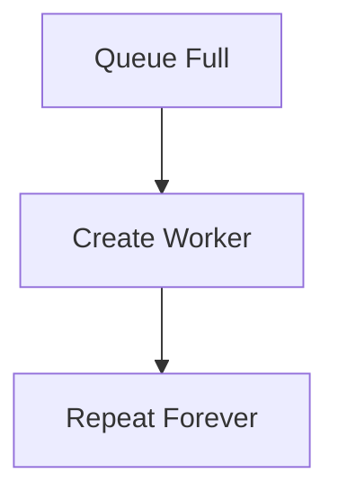

---

## Busy Waiting

Workers repeatedly polling empty queues.

---

## Ignoring Resource Limits

Continuing to accept work after resource exhaustion.

---

## Module Starvation

Allowing one module to consume all runtime capacity.

---

## Immediate Retry During Overload

Retries should reduce pressure.

Not increase it.

---

# Mosaic Guidelines

Within Mosaic:

- Every queue MUST be bounded.
- Every worker pool MUST be bounded.
- The runtime MUST apply backpressure before resource exhaustion.
- Queue depth MUST remain observable.
- Modules MUST be isolated from one another.
- Recovery SHOULD occur automatically.
- Replay MUST respect runtime limits.
- High-priority work SHOULD remain responsive during overload.
- Stability MUST always take precedence over throughput.

---

# Relationship to the Runtime

Backpressure is the mechanism that keeps the Mosaic Runtime stable under unpredictable workloads.

Combined with:

- worker pools
- scheduling
- retries
- idempotency
- event isolation

it allows the platform to remain responsive even during significant operational stress.

Rather than treating overload as an exceptional condition, the runtime treats it as an expected characteristic of a long-running system.

This philosophy produces a platform that fails gracefully rather than catastrophically.

---

# Summary

The purpose of backpressure is not to process more work.

It is to process work sustainably.

Within Mosaic, backpressure ensures:

- predictable resource usage
- resilient modules
- protected infrastructure
- graceful degradation
- operational stability

The runtime should always prefer temporary slowdown over permanent failure.

That single principle keeps the platform healthy as it grows from a handful of capabilities to hundreds of independently developed modules.
