<!--
File: docs/engineering/guides/meg-002-event-driven-runtime/16-correlation-and-observability.md
Document: MEG-002
Status: Draft
Version: 0.4
-->

# Correlation and Observability

> *A distributed system cannot be understood by reading code alone. It must explain itself while it is running.*

---

# Purpose

As the Mosaic Runtime grows, individual business operations will span multiple capabilities, workers and modules.

Consider a simple user action.

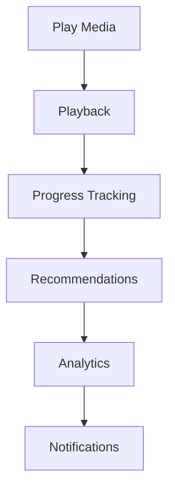

By the time the operation completes, dozens of events may have been published.

Without observability, understanding what actually happened becomes extremely difficult.

This document defines how the Mosaic Runtime provides complete visibility into distributed execution.

---

# Philosophy

Within Mosaic:

> **Every significant runtime action should be traceable from beginning to end.**

The runtime should never become a black box.

Operators should be able to answer:

- What happened?
- Why did it happen?
- What caused it?
- What failed?
- How long did it take?
- Which capability was responsible?

without modifying production code.

---

# Observability Pillars

The Mosaic Runtime adopts the three pillars of observability.

```

Logs

+

Metrics

+

Traces
```

Each provides different information.

Together they explain runtime behaviour.

Modern observability platforms, including OpenTelemetry, are built around these three signal types. ([opentelemetry.io](https://opentelemetry.io/docs/concepts/observability-primer/))

---

# Correlation

Correlation links related work together.

Suppose a user imports media.

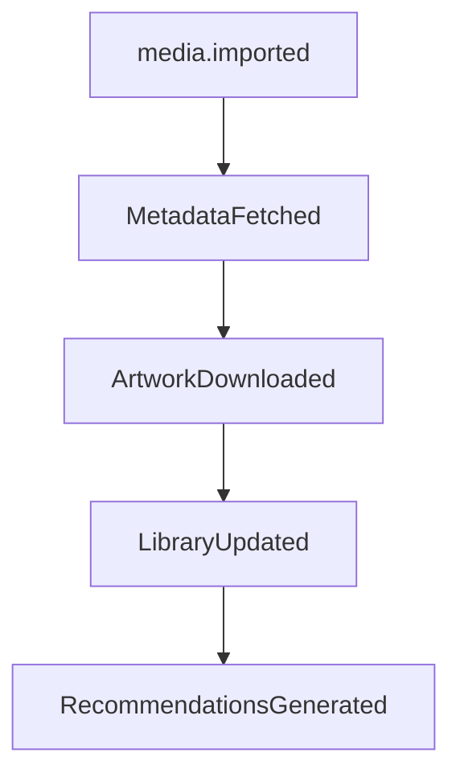

Although many capabilities participate, they all belong to one business operation.

Correlation allows the runtime to reconstruct that workflow.

---

# Correlation ID

Every workflow begins with a Correlation ID.

Example.

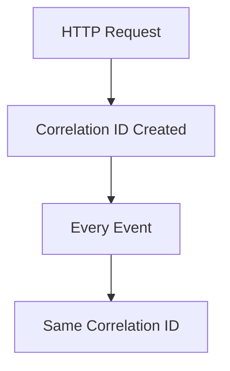

The Correlation ID remains constant throughout the lifetime of the workflow.

It identifies:

> **One business operation.**

Not one event.

---

# Causation ID

Correlation explains:

```

What belongs together?
```

Causation explains:

```

What directly caused this event?
```

Example.

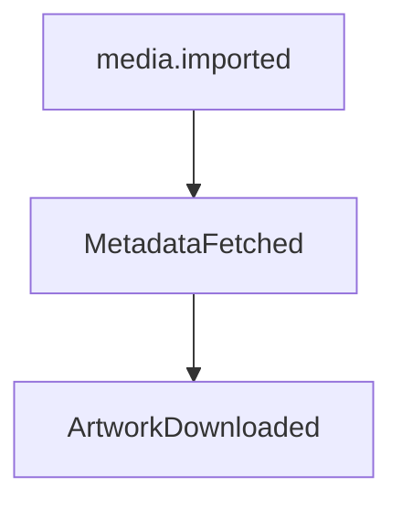

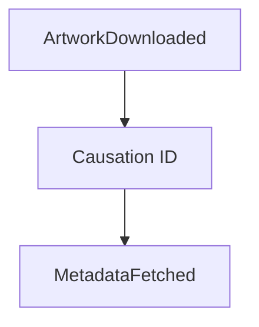

Each event identifies its immediate parent.

Together:

Correlation creates workflows.

Causation creates dependency graphs.

---

# Event Graph

Combining Correlation and Causation naturally produces an event graph.

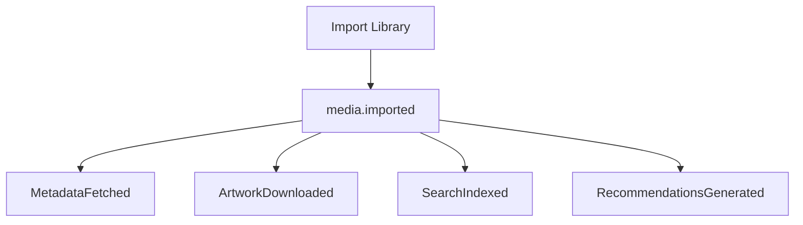

This graph allows operators to understand exactly how work propagated through the runtime.

---

# Distributed Tracing

Every event SHOULD participate in distributed tracing.

Tracing answers questions such as:

- Which capability was slow?
- Which worker executed the task?
- Which dependency failed?
- Where was latency introduced?

Tracing should span:

- HTTP
- Workers
- Event Bus
- Modules
- External APIs

OpenTelemetry provides a vendor-neutral standard for propagating tracing context across distributed systems. ([opentelemetry.io](https://opentelemetry.io/docs/concepts/signals/traces/))

---

# Trace Context

The runtime SHOULD automatically propagate trace context.

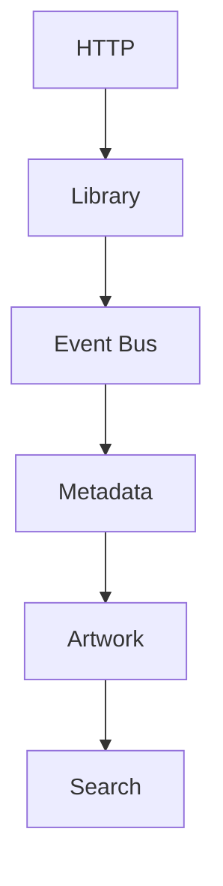

Business capabilities should not manually manage trace propagation.

The runtime owns tracing infrastructure.

---

# Structured Logging

Every runtime component SHOULD emit structured logs.

Example.

```text
Timestamp

Level

Correlation ID

Causation ID

Capability

Worker

Event

Message
```

Logs should be machine-readable.

Not free-form text.

Structured logging enables reliable filtering, aggregation and analysis.

---

# Logging Philosophy

Logs should explain:

- unexpected behaviour
- failures
- lifecycle transitions
- operational decisions

Logs should **not** describe routine successful execution.

Poor.

```

Processed Event
```

10,000 times.

Good.

```

Retry exhausted.

Moving event to dead letter queue.
```

Routine behaviour belongs in metrics.

Unexpected behaviour belongs in logs.

---

# Metrics

Metrics describe system health.

Every capability SHOULD expose:

- events processed
- processing latency
- failures
- retries
- queue depth
- throughput

Metrics answer:

> **How healthy is the platform?**

They do not explain individual requests.

---

# Traces

Traces explain one workflow.

Metrics explain all workflows.

Logs explain exceptional workflows.

Each serves a different purpose.

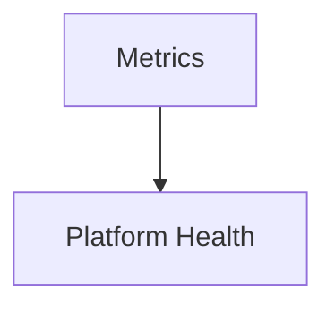

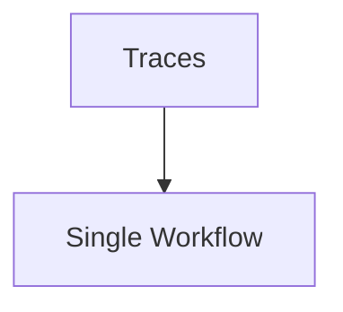

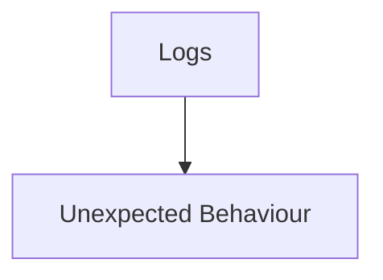

Together they form complete observability.

---

# Runtime Events

The runtime itself should publish operational events.

Examples include:

```

WorkerStarted
```

```

WorkerStopped
```

```

RetryScheduled
```

```

RetryExhausted
```

```

BackpressureApplied
```

```

ModuleLoaded
```

These are runtime events.

Not business events.

They describe platform behaviour.

---

# Capability Visibility

Every capability SHOULD expose:

- health
- version
- subscriptions
- queue depth
- worker utilisation
- processing latency

Capabilities should become observable without requiring custom instrumentation.

---

# Health

Health should answer:

> **Can this capability currently perform work?**

Examples.

Healthy.

```

Ready
```

Degraded.

```

External API unavailable
```

Unhealthy.

```

Database disconnected
```

Health should represent operational readiness.

Not merely process existence.

---

# Correlation Across Modules

Third-party modules participate exactly like Platform capabilities.

Example.

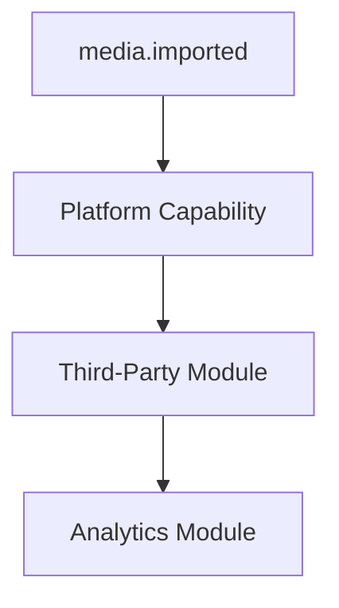

Every event shares the same Correlation ID.

The runtime should make module boundaries invisible during tracing.

---

# Failure Investigation

Suppose artwork generation fails.

Operators should be able to answer:

- Which media?
- Which worker?
- Which module?
- Which retry?
- Which API?
- Which event?
- Which workflow?

without enabling additional debugging.

Observability should already contain the answer.

---

# Event Timeline

A single Correlation ID should naturally produce a timeline.

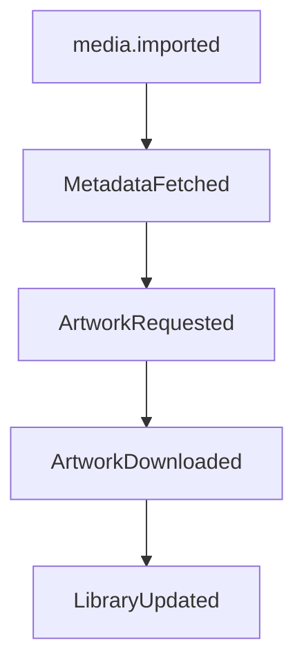

Reading the timeline should explain the entire workflow.

No additional context should be required.

---

# Runtime Instrumentation

Instrumentation belongs to the runtime.

Capabilities should not manually:

- propagate trace IDs
- generate correlation IDs
- publish metrics
- manage log formats

Business logic should remain unaware of operational infrastructure wherever practical.

---

# Privacy

Observability MUST respect privacy.

Logs and traces SHOULD NOT contain:

- passwords
- access tokens
- API keys
- encryption secrets
- personally identifiable information unless explicitly required

Correlation should identify workflows.

Not expose sensitive data.

---

# Anti-Patterns

The following practices are prohibited.

## Plain Text Logs

```

Something happened...
```

Without structured metadata.

---

## Missing Correlation IDs

Events that cannot be connected to their originating workflow.

---

## Manual Trace Propagation

Business capabilities managing tracing state directly.

---

## Logging Successful Every Operation

Generating excessive log volume for normal behaviour.

---

## Metrics Without Context

Counters that cannot be attributed to capabilities or event types.

---

## Runtime Blindness

Components executing work without exposing:

- health
- metrics
- traces

---

# Mosaic Guidelines

Within Mosaic:

- Every workflow MUST have a Correlation ID.
- Every event SHOULD include a Causation ID.
- Structured logging MUST be used throughout the runtime.
- Metrics SHOULD describe platform health.
- Traces SHOULD describe workflow execution.
- Runtime instrumentation SHOULD be automatic.
- Modules MUST participate in runtime observability.
- Sensitive information MUST NOT appear in logs or traces.
- Every significant runtime action SHOULD be observable.

---

# Relationship to the Runtime

Observability is not an operational feature added after development.

It is part of the runtime architecture.

By making:

- events
- workers
- scheduling
- retries
- queues
- modules

fully observable, the Mosaic Runtime becomes significantly easier to:

- operate
- debug
- optimise
- extend

Observability therefore enables confidence as much as it enables diagnostics.

---

# Summary

An event-driven platform cannot rely upon stack traces and debugger sessions alone.

Its behaviour emerges from many independent capabilities working together.

The purpose of observability is therefore simple:

> **Make the invisible visible.**

Every event.

Every worker.

Every retry.

Every module.

Every workflow.

The runtime should always be able to explain itself.
