<!--
File: docs/engineering/guides/meg-002-event-driven-runtime/17-runtime-shutdown.md
Document: MEG-002
Status: Draft
Version: 0.4
-->

# Runtime Shutdown

> *Stopping a distributed system is as important as starting one. Shutdown is not the absence of work. It is the controlled completion of work.*

---

# Purpose

Every long-running system must eventually stop.

Shutdown may occur because of:

- deployment
- upgrades
- maintenance
- scaling
- configuration changes
- operating system signals
- unexpected failures

Within the Mosaic Runtime, shutdown is considered a first-class architectural concern.

Stopping the platform should never:

- lose events
- corrupt state
- abandon work
- leave resources allocated

This document defines how the Mosaic Runtime performs graceful shutdown.

---

# Philosophy

Within Mosaic:

> **The runtime should stop accepting new work before stopping existing work.**

Graceful shutdown is the process of allowing in-flight operations to complete while preventing additional work from entering the system.

The objective is deterministic behaviour.

Not immediate termination.

---

# Shutdown Principles

Every shutdown should satisfy the following principles.

- No new work accepted.
- Existing work allowed to finish where practical.
- Context cancellation propagated.
- Resources released.
- Runtime state remains consistent.
- Shutdown remains observable.

Every component participates.

No component should define its own shutdown semantics.

---

# Runtime Lifecycle

The runtime follows a predictable lifecycle.

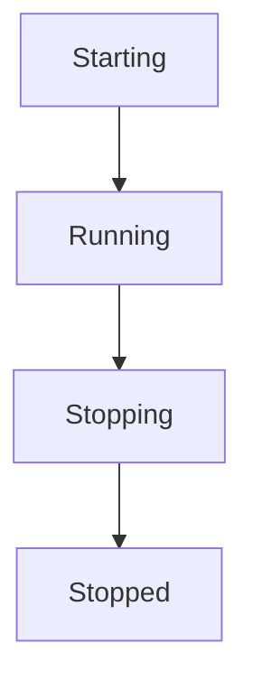

Only the runtime transitions between lifecycle states.

Capabilities react to transitions.

They do not control them.

---

# Shutdown Sequence

Graceful shutdown follows the same sequence every time.

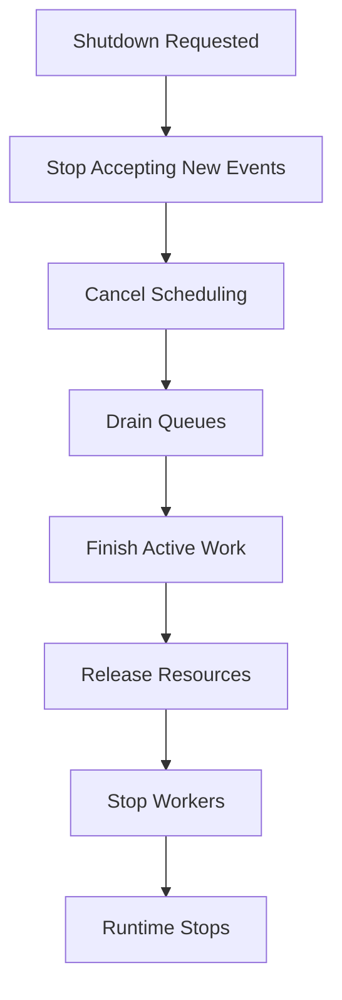

The order is deliberate.

Changing it risks inconsistent behaviour.

---

# Initiating Shutdown

Shutdown begins when the runtime receives a termination request.

Examples include:

- SIGTERM
- SIGINT
- administrator request
- orchestrator termination
- controlled restart

The runtime immediately transitions into:

```

Stopping
```

No additional work should be accepted after this point.

---

# Stop Accepting New Work

The first responsibility of shutdown is preventing new work.

Examples include:

- HTTP listeners stop accepting requests
- event publishers reject new publications
- schedulers stop creating future work
- module loading stops

Existing work continues.

New work does not begin.

---

# Scheduler Behaviour

During shutdown the scheduler SHOULD:

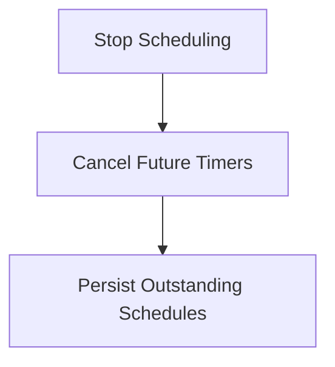

Recurring schedules should not continue creating work once shutdown begins.

Long-lived schedules may be restored after restart.

---

# Queue Draining

Existing queues should drain naturally.

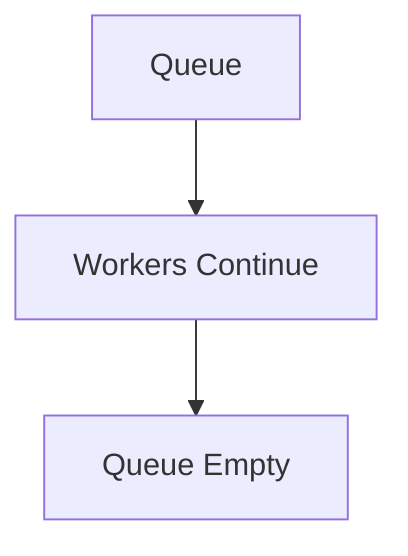

Workers should continue processing available tasks until:

- queues empty
- cancellation deadline reached

Queue draining reduces unnecessary retries after restart.

---

# Worker Shutdown

Workers receive cancellation through context.

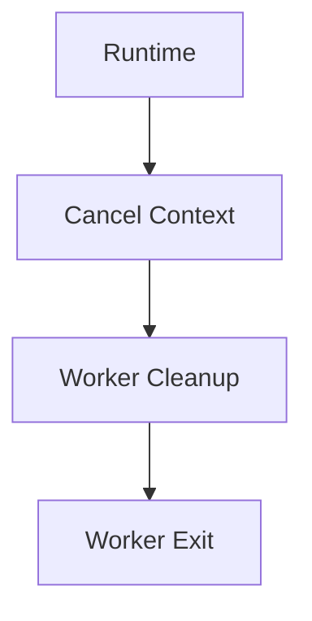

Workers should:

- finish current work where practical
- acknowledge completed work
- release resources
- terminate promptly

Workers should never ignore cancellation indefinitely.

---

# Active Tasks

Long-running tasks should periodically check:

```go
ctx.Done()
```

If cancellation occurs they should:

- clean up
- return a meaningful status
- avoid partial state where practical

Business correctness should always take precedence over speed of shutdown.

---

# Event Delivery

Events already accepted by the Event Bus should continue through the delivery pipeline where practical.

The runtime SHOULD avoid abandoning accepted events.

If completion is impossible:

- work should remain durable
- processing should resume after restart

Shutdown should never silently lose accepted work.

---

# Retry Queue

Pending retries SHOULD be persisted.

Example.

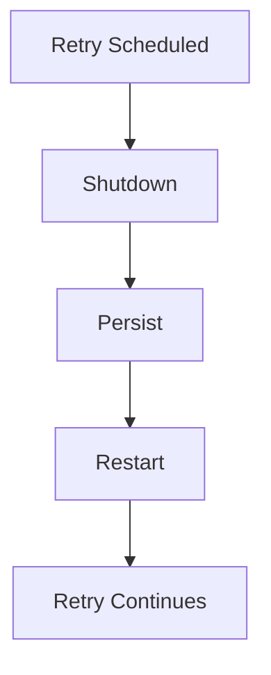

Retries should survive controlled restarts.

Business correctness depends upon eventual execution.

---

# Module Shutdown

Modules participate in runtime shutdown exactly like Platform capabilities.

Lifecycle.

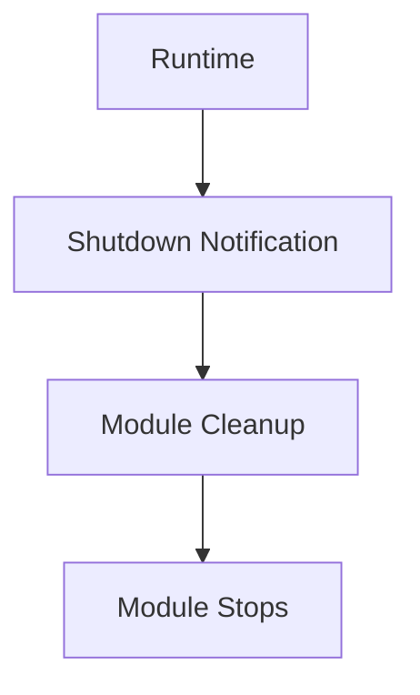

Modules should never require special shutdown handling.

The runtime should treat all capabilities equally.

---

# Resource Cleanup

Every runtime component is responsible for releasing owned resources.

Examples include:

- database connections
- file handles
- network sockets
- timers
- worker pools
- subscriptions

Ownership determines cleanup responsibility.

Resources should never be released by unrelated components.

---

# Timeouts

Graceful shutdown should remain bounded.

Example.

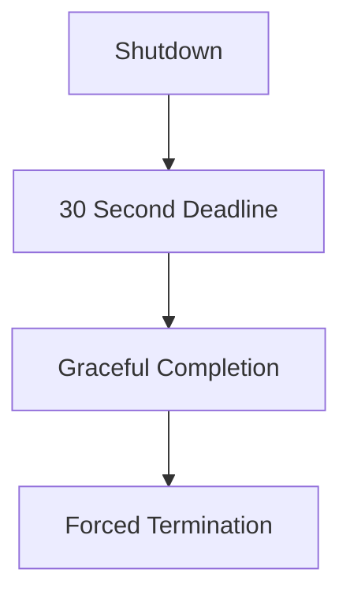

The runtime should not wait indefinitely.

Eventually the platform must terminate.

The timeout should be configurable.

---

# Forced Shutdown

If graceful shutdown exceeds its deadline:

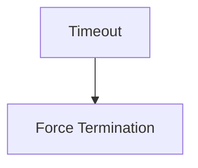

Forced shutdown is a last resort.

It may:

- interrupt work
- require retries
- delay eventual consistency

The runtime should make every reasonable attempt to avoid this outcome.

---

# Observability

Shutdown should be fully observable.

Useful events include:

```

RuntimeStopping
```

```

QueueDrained
```

```

WorkerStopped
```

```

ModuleStopped
```

```

RuntimeStopped
```

Operators should understand:

- how long shutdown required
- whether work completed
- whether work was abandoned
- whether retries were persisted

Shutdown should never appear mysterious.

---

# Health During Shutdown

During graceful shutdown:

Health should report:

```

Not Ready
```

before:

```

Stopped
```

This allows:

- load balancers
- orchestrators
- service discovery

to stop routing new work before termination.

The runtime remains alive.

It simply stops accepting additional work.

---

# Startup Symmetry

Startup and shutdown should mirror one another.

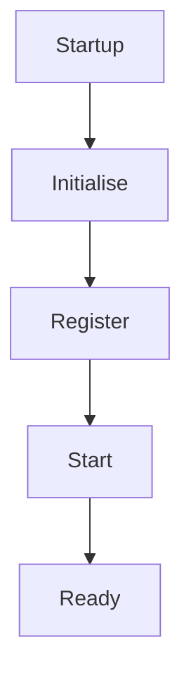

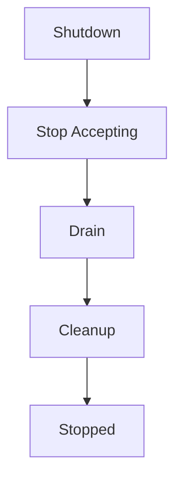

Symmetrical lifecycle management simplifies reasoning about the runtime.

---

# Crash Recovery

Unexpected crashes differ from graceful shutdown.

After restart:

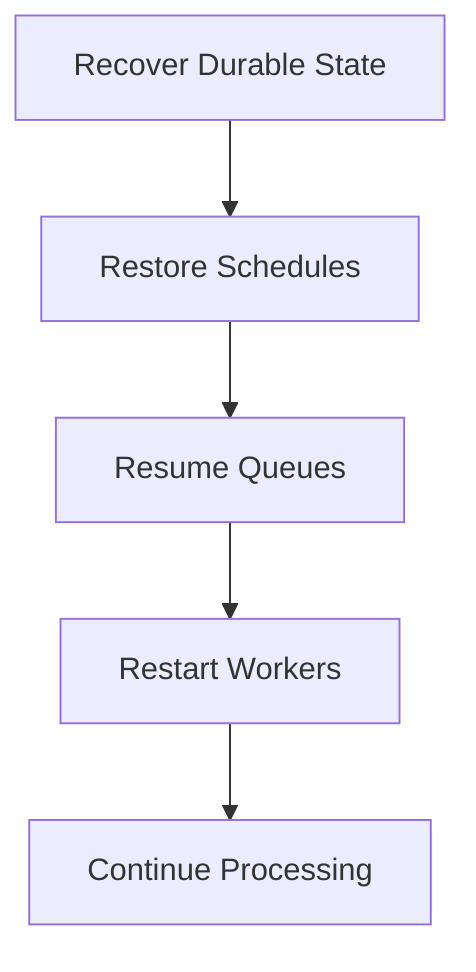

Business correctness should depend upon durability.

Not graceful shutdown always succeeding.

---

# Testing Shutdown

Graceful shutdown SHOULD be tested.

Examples include:

- worker cancellation
- queue draining
- retry persistence
- module cleanup
- scheduler shutdown

Shutdown is part of normal runtime behaviour.

It deserves the same engineering attention as startup.

---

# Anti-Patterns

The following practices are prohibited.

## Immediate Process Exit

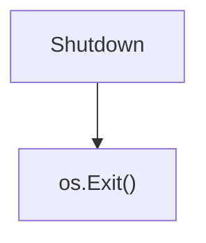

without cleanup.

---

## Ignoring Cancellation

Workers continuing indefinitely after shutdown begins.

---

## Accepting New Work During Shutdown

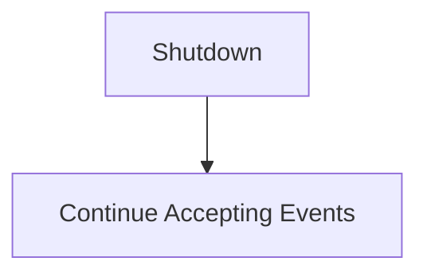

---

## Resource Leaks

Failing to close:

- database pools
- timers
- subscriptions
- workers

---

## Silent Shutdown

Stopping without exposing runtime events or metrics.

---

## Capability-Owned Shutdown

Business capabilities deciding when the runtime should terminate.

Lifecycle belongs to the runtime.

---

# Mosaic Guidelines

Within Mosaic:

- Shutdown MUST be graceful.
- New work MUST stop before existing work.
- Workers MUST honour cancellation.
- Queues SHOULD drain where practical.
- Pending retries SHOULD survive restart.
- Resource ownership MUST determine cleanup.
- Shutdown SHOULD remain observable.
- Graceful shutdown SHOULD remain bounded by timeout.
- Capabilities MUST react to runtime lifecycle rather than define it.

---

# Relationship to the Runtime

Graceful shutdown completes the runtime lifecycle defined throughout MEG-002.

Combined with:

- worker ownership
- scheduling
- retries
- idempotency
- observability

shutdown becomes a predictable operational process rather than an emergency procedure.

This consistency allows the Mosaic Runtime to:

- deploy safely
- scale safely
- recover safely
- evolve safely

without compromising business correctness.

---

# Summary

Stopping a platform should be as carefully engineered as starting it.

Within Mosaic, graceful shutdown ensures:

- accepted work completes
- future work pauses
- resources are released
- state remains consistent
- recovery remains possible

A runtime that cannot stop predictably cannot be considered production ready.

Graceful shutdown is therefore not merely an operational concern.

It is a fundamental architectural property of the Mosaic Runtime.
