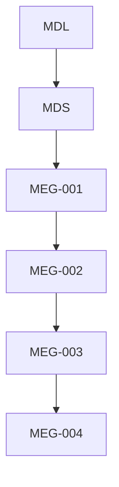
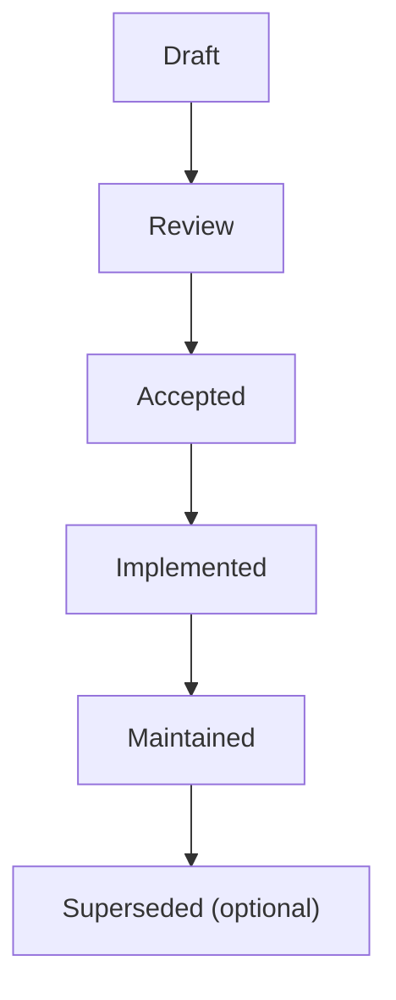

<!--
File: docs/engineering/guides/meg-004-hexagonal-architecture/00-document-control.md
Document: MEG-004
Status: Draft
-->

# Document Control

---

# Document Information

| Field | Value |
|---------|--------|
| Document ID | MEG-004 |
| Title | Hexagonal Architecture |
| File | 00-document-control.md |
| Status | Draft |
| Owner | AdamNi-7080 |
| Classification | Internal Architecture Specification |

---

# Purpose

This document establishes the governance, authority and lifecycle of the Mosaic Hexagonal Architecture specification. MEG-004 defines the architectural rules governing how the Domain Model interacts with infrastructure.

Unlike implementation documentation, this specification defines **dependency boundaries**, not implementation details. Its primary purpose is to ensure that the Domain remains independent of technology for the lifetime of the Mosaic platform.

---

# Authority

MEG-004 is the authoritative specification governing architectural boundaries throughout the Mosaic ecosystem. It applies to the Mosaic Platform, first-party Modules, third-party Modules, Runtime Capabilities, SDKs and Infrastructure Components. Every capability developed within the Mosaic platform should comply with the dependency rules established here.

---

# Relationship to Other Specifications

MEG specifications intentionally build upon one another.

Specifically:

- **MDL** defines product philosophy.
- **MDS** defines presentation.
- **[MEG-001](../meg-001-go-engineering-standards/index.md)** defines engineering standards.
- **[MEG-002](../meg-002-event-driven-runtime/index.md)** defines runtime behaviour.
- **[MEG-003](../meg-003-domain-driven-design/index.md)** defines business modelling.
- **MEG-004** defines dependency boundaries.

Future specifications build upon the architectural separation established here.

---

# Normative Language

Unless explicitly stated otherwise, the following keywords are interpreted according to RFC 2119.

| Keyword | Meaning |
|----------|---------|
| **MUST** | Mandatory requirement. |
| **MUST NOT** | Prohibited behaviour. |
| **SHOULD** | Strong recommendation. Deviation requires architectural justification. |
| **SHOULD NOT** | Discouraged except where clearly justified. |
| **MAY** | Optional behaviour based upon engineering judgement. |

Examples and diagrams are informative unless explicitly identified as normative.

---

# Architectural Principles

The Mosaic Hexagonal Architecture is built upon several foundational principles. The Domain owns business behaviour and never imports infrastructure; dependencies flow towards the Domain and infrastructure adapts to it; Ports define contracts and Adapters implement them; technology remains replaceable and business logic remains isolated. Every subsequent chapter expands one or more of these principles.

---

# Document Lifecycle

MEG specifications evolve alongside the platform, and each document progresses through the following lifecycle.

Accepted specifications become part of the canonical Mosaic architecture, and historical versions should remain available for future reference.

---

# Architectural Evolution

Hexagonal Architecture is intentionally stable. Changes affecting dependency direction, port definitions, adapter responsibilities, application services, runtime integration or infrastructure boundaries should be accompanied by an Architectural Decision Record (ADR), because architectural consistency should remain more important than implementation convenience.

---

# Compliance

All repositories implementing Mosaic capabilities should comply with MEG-004. Where deviation becomes necessary, the repository should document the reason, the affected boundaries, the architectural impact and the migration strategy.

Temporary deviations should eventually be removed. Permanent deviations should generally result in updates to this specification.

---

# Design Philosophy

MEG-004 intentionally favours explicit dependencies, replaceable infrastructure, domain independence, clear ownership, technology isolation and long-term maintainability. The architecture should continue functioning even if databases, frameworks, transports or infrastructure change: only the adapters should require modification, and the Domain should remain unchanged.

Hexagonal Architecture exists precisely to achieve this separation between business logic and infrastructure by ensuring dependencies point inward towards the application core. ([alistair.cockburn.us](https://alistair.cockburn.us/hexagonal-architecture))

---

# Scope of Authority

MEG-004 governs architectural boundaries. It does **not** define business behaviour, runtime execution, storage technologies, deployment topology or user interface design; those concerns belong to other MEG specifications. Keeping them separate allows each architectural layer to evolve independently.
