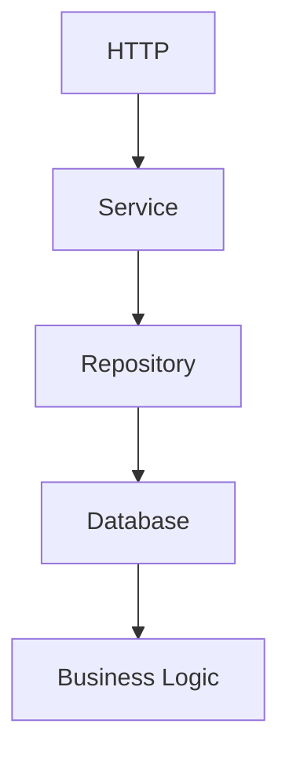
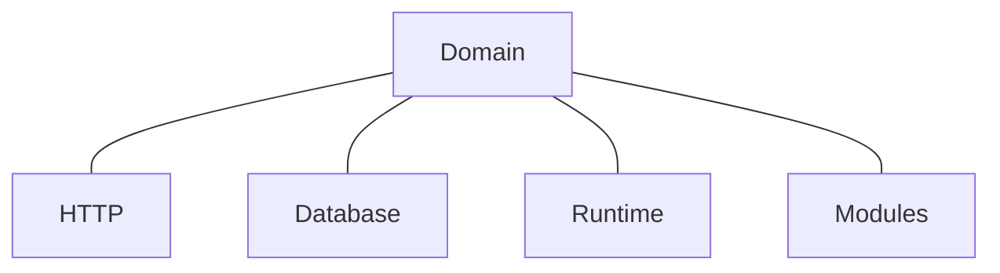
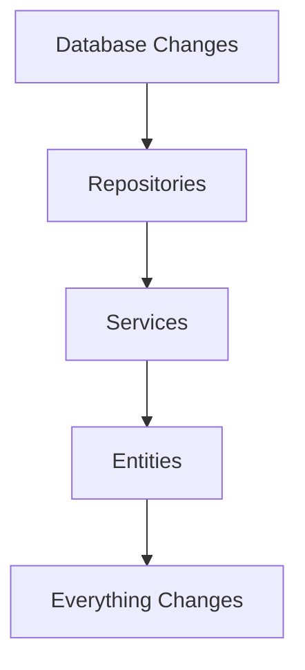
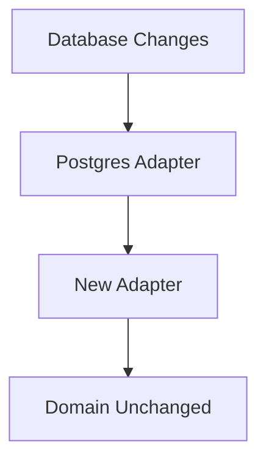
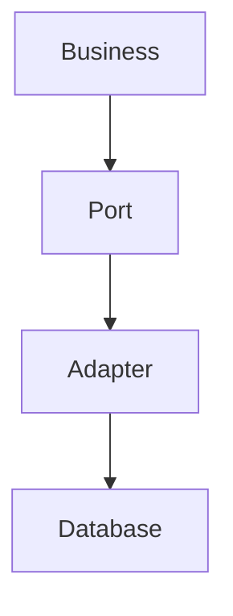

<!--
File: docs/engineering/guides/meg-004-hexagonal-architecture/01-hexagonal-philosophy.md
Document: MEG-004
Status: Draft
-->

# Hexagonal Philosophy

> *Technology is temporary. The business is not.*

---

# Purpose

Software changes constantly. Databases are replaced, protocols evolve, frameworks become obsolete and even programming languages change. The business those systems serve generally changes far more slowly, and Hexagonal Architecture exists to ensure that technological change does not force unnecessary business change. Within Mosaic the Domain Model should remain the most stable part of the entire platform, and everything else exists to support it.

---

# Philosophy

Within Mosaic:

> **The Domain should know nothing about how it is used or how it is persisted.**

The Domain should not know about HTTP, PostgreSQL, DuckDB, Blob Storage, the Event Bus, Docker, TMDB, Jellyfin or Stremio. Those technologies adapt themselves to the Domain, never the reverse.

---

# The Problem

Traditional layered architectures frequently evolve into this.

Over time the business becomes increasingly coupled to infrastructure: SQL exceptions inside business logic, HTTP concepts inside entities, framework annotations inside the domain, and persistence models quietly becoming business models. Eventually, changing infrastructure requires changing business behaviour — precisely what Hexagonal Architecture seeks to prevent.

---

# The Guiding Principle

Everything revolves around one idea: **dependencies always point inward**, not outward. The Domain owns the business rules, the business language and the business behaviour, and infrastructure depends upon those concepts. The Domain itself depends upon nothing external. This inversion of dependency direction is the defining characteristic of Ports and Adapters architecture. ([alistair.cockburn.us](https://alistair.cockburn.us/hexagonal-architecture))

---

# The Hexagon

The architecture is traditionally represented as a hexagon.

The shape itself is symbolic, and it communicates one important idea: there is no "top" or "bottom". Every external system is simply another adapter, so HTTP is not special and neither is the database.

Inside the hexagon there are only business concepts — Entities, Value Objects, Aggregates, Domain Services and Domain Events — and the Domain should be understandable without mentioning any technology. If infrastructure terminology appears inside the Domain, the architectural boundary has already been breached.

Everything external becomes infrastructure: HTTP, REST, GraphQL, PostgreSQL, DuckDB, Redis, Blob Storage, the Event Bus, Docker, the CLI and mobile applications. These technologies change frequently, and the Domain should remain unaffected.

---

# The Domain Is The Product

One of the central principles of Mosaic is that the business drives the technology, not the technology the business. The platform exists because of Libraries, Playback, Metadata and Users — not because of PostgreSQL — and infrastructure should therefore remain replaceable.

---

# Replaceability

Suppose PostgreSQL becomes unsuitable. Without Hexagonal Architecture, the change cascades.

With Hexagonal Architecture, it stops at the boundary.

Only infrastructure changes, and the business remains stable.

---

# Runtime Independence

Likewise, the Domain should not know the Reactive Runtime exists. It is poor practice for Playback to publish an event onto the Event Bus; Playback should instead raise a Domain Event, and later a Runtime Adapter translates that into a Runtime Event on the Event Bus. The Domain records business facts and the Runtime communicates them, so the separation established in [MEG-002](../meg-002-event-driven-runtime/index.md) remains intact.

---

# Technology Independence

The Domain should remain capable of operating without databases, networks, filesystems, messaging or containers. If a Domain Model cannot be unit tested without PostgreSQL, the architecture has failed.

---

# The Cost Of Coupling

Infrastructure changes frequently: the TMDB API ships a new version, a storage engine demands a migration, Docker gives way to a new runtime. These changes should affect adapters, not business behaviour, because every dependency from the Domain to infrastructure increases future maintenance cost.

---

# Business Before Infrastructure

When designing new functionality ask:

> **What is the business behaviour?**

Only afterwards ask:

> **How will the infrastructure support it?**

The second question should never influence the answer to the first.

---

# Every Technology Is Equal

One subtle but important property of the Hexagon is that HTTP, the CLI, a Worker, a Scheduler, the Event Bus and Tests are all equivalent. Each is simply a mechanism for interacting with the Domain, no technology occupies a privileged position, and the Domain remains the centre.

---

# Infrastructure Is Temporary

History demonstrates that infrastructure changes: REST gave way to GraphQL, Docker to containerd, and PostgreSQL will eventually give way to something else. Business concepts such as Library, Playback and Collection rarely disappear, so architecture should optimise for the longer-lived concepts.

---

# Ports Before Adapters

One of the defining ideas of Hexagonal Architecture is that the Domain defines contracts and infrastructure satisfies them. The database must never dictate terms to the business. Instead:

This inversion keeps the Domain in control.

---

# Simplicity

Hexagonal Architecture should simplify software, not introduce unnecessary abstraction. If a Port exists it should represent genuine business interaction rather than hypothetical future flexibility. [MEG-001](../meg-001-go-engineering-standards/index.md)'s principles still apply, and concrete solutions remain preferable until abstraction becomes necessary.

---

# Mosaic Principles

Within Mosaic:

- The Domain owns the architecture.
- Infrastructure adapts to the Domain.
- Dependencies always point inward.
- Technology remains replaceable.
- Runtime remains infrastructure.
- Modules remain infrastructure.
- Storage remains infrastructure.
- Transport remains infrastructure.
- Business behaviour remains independent.

These principles define the architectural identity of the platform.

---

# Relationship to MEG

[MEG-003](../meg-003-domain-driven-design/index.md) established **what the business is**; MEG-004 begins answering **how do we protect it?** The remaining chapters explain the mechanisms through which Hexagonal Architecture preserves Domain independence, the first of which is the **Port**.

---

# Summary

Hexagonal Architecture is often misunderstood as a folder structure. It is not — it is a dependency philosophy, and within Mosaic it exists for one reason:

> **To ensure the Domain remains the most stable, valuable and protected part of the entire platform.**

Everything else is expected to change. The Domain should not.
