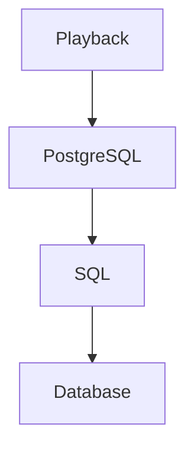
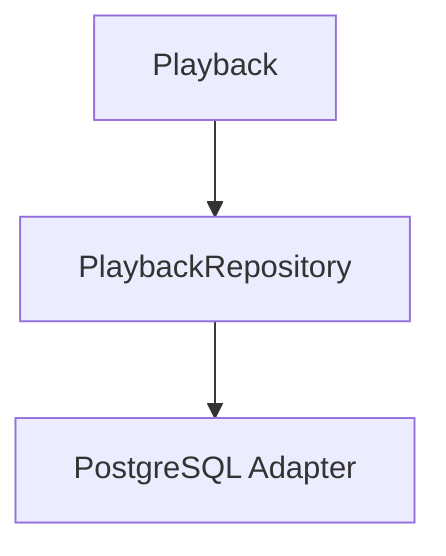
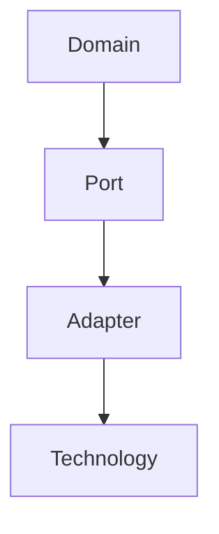

<!--
File: docs/engineering/guides/meg-004-hexagonal-architecture/02-ports.md
Document: MEG-004
Status: Draft
-->

# Ports

> *A Port defines what the Domain needs. It never defines how that need is fulfilled.*

---

# Purpose

The Domain must interact with the outside world: loading Aggregates, publishing Domain Events, reading metadata, writing blob storage, retrieving configuration and querying external providers. It must nevertheless remain completely unaware of PostgreSQL, DuckDB, TMDB, Jellyfin, Docker, HTTP and filesystems. Ports solve this problem by defining the contracts through which the Domain communicates with external systems without depending upon those systems.

---

# Philosophy

Within Mosaic:

> **The Domain owns every contract it depends upon.**

A Port represents a business capability, not a technology. The Domain defines Ports and infrastructure implements them, and this inversion of ownership is the defining characteristic of Hexagonal Architecture.

---

# What Is A Port?

A Port is an interface representing a business capability required by the Domain, such as `MediaRepository`, `MetadataProvider`, `ArtworkStore` or `Clock`. Each Port answers one question — **what does the Domain require?** — and never **how is it implemented?**

---

# Why Ports Exist

Without Ports, business behaviour reaches straight through to the storage engine.



The Domain now understands infrastructure. Instead:



The Domain understands only `PlaybackRepository`, and everything else becomes replaceable.

---

# The Domain Owns The Port

One of the most important principles of Hexagonal Architecture is that the Domain defines the interface and infrastructure implements it, never the reverse. Ownership always belongs to the Domain: the business decides what it needs, and infrastructure satisfies those needs.

---

# Ports Describe Behaviour

Ports should describe business behaviour. Good:

```go
type PlaybackRepository interface {

    FindByID(...)

    Save(...)
}
```

Poor:

```go
type PostgreSQLRepository interface {

    ExecuteSQL(...)
}
```

The first describes business intent; the second describes implementation. Ports should never leak technology.

---

# Business Language

Port names should reinforce the ubiquitous language. `CollectionRepository`, `MetadataProvider` and `RecommendationEngine` are good; `DatabaseAccess`, `StorageLayer` and `PersistenceManager` are poor. Business concepts should always dominate technical vocabulary.

---

# Ports Are Stable

Infrastructure changes frequently; Ports should not. Changing a Port affects the Domain, every Adapter, every test and every implementation, so Ports form part of the long-term architectural contract and should evolve deliberately.

---

# Ports Are Small

Ports should remain focused. Good:

```go
type ArtworkProvider interface {

    Artwork(...)
}
```

Poor:

```go
type MediaPlatform interface {

    Import()

    Search()

    Playback()

    Metadata()

    Recommendations()

    Authentication()
}
```

Large Ports increase coupling while small Ports improve flexibility. This aligns closely with Go's preference for small interfaces representing behaviour rather than broad capability sets. ([go.dev](https://go.dev/doc/effective_go))

---

# Business First

A useful question when designing a Port is **what would the business ask for?**, not **what can PostgreSQL provide?** The Domain should remain entirely unaware of implementation constraints.

---

# Technology Neutral

Ports should never reference SQL, REST, HTTP, Kafka, NATS, Docker or Redis: `SQLRepository` is poor where `MediaRepository` is good. Technology belongs behind the Port.

---

# Ports Are Intent

Ports communicate intent. `MetadataProvider` communicates "retrieve metadata" while saying nothing about TMDB, AniList, a local cache or the filesystem. Those become Adapter concerns.

---

# One Responsibility

Each Port should describe one responsibility — `MetadataProvider`, `ArtworkStore`, `Clock` — and avoid combining unrelated concepts, as a Port such as `MediaInfrastructure` does. One Port should answer one business question.

---

# Domain Dependencies

Everything the Domain depends upon should enter through Ports, including repositories, providers, storage, time and identity generation. This dramatically improves testing, replacement and evolution, and the Domain remains isolated.

---

# Input vs Output

Not all Ports are identical. Some receive requests; others perform work on behalf of the Domain. Hexagonal Architecture traditionally distinguishes these as Driving Ports and Driven Ports, and the next two chapters explore this distinction.

---

# Ports Are Not Adapters

A common mistake is confusing a Port with an Adapter. Ports define contracts and Adapters implement them; the Port belongs to the Domain and the Adapter belongs to Infrastructure. The two should never be combined.

---

# Testing

Ports make testing straightforward. A test can substitute a fake repository for `PlaybackRepository`, and the Domain remains unaware that no real database exists. Tests become deterministic, fast and infrastructure independent, which is one of the primary practical benefits of Hexagonal Architecture.

---

# Port Evolution

Ports should evolve slowly. Whenever a Port changes, ask whether the Domain is changing or merely the infrastructure. If only infrastructure changed, the Port probably should not, because Ports should remain stable as technologies evolve.

---

# Mosaic Examples

Ports within Mosaic include `LibraryRepository`, `PlaybackRepository`, `MetadataProvider`, `ArtworkStore`, `BlobStore`, `IdentityGenerator` and `Clock`. Every one expresses a business dependency; none express technology.

---

# Anti-Patterns

The following practices are prohibited.

## Technology Ports

Ports named for their implementation, such as `PostgresRepository` or `RedisProvider`.

## Generic Ports

Ports such as `Storage` without business meaning.

## Large Ports

Interfaces representing unrelated capabilities.

## Infrastructure Dependencies

Ports importing SQL, HTTP, Runtime or Logging.

## Shared Ownership

Infrastructure defining contracts consumed by the Domain. The Domain owns the contract, always.

---

# Mosaic Guidelines

Within Mosaic:

- Ports must belong to the Domain.
- Ports must describe business behaviour.
- Ports must remain technology independent.
- Ports should remain small.
- Ports should reinforce the ubiquitous language.
- Infrastructure must implement Ports.
- Ports should evolve slowly.
- Business requirements must drive Port design.

---

# Relationship to MEG

Hexagonal Architecture revolves around one simple idea.



Ports define the contracts and Adapters satisfy them. The next chapter introduces the first category of Ports: **Driving Ports**, which define how the outside world requests business behaviour from the Domain.

---

# Summary

Ports are one of the most important concepts within Hexagonal Architecture because they invert the traditional ownership of dependencies. Instead of infrastructure telling the Domain how to behave, the Domain tells infrastructure what it requires. That inversion protects the business from technology and ensures the Domain remains the most stable part of the Mosaic platform.
