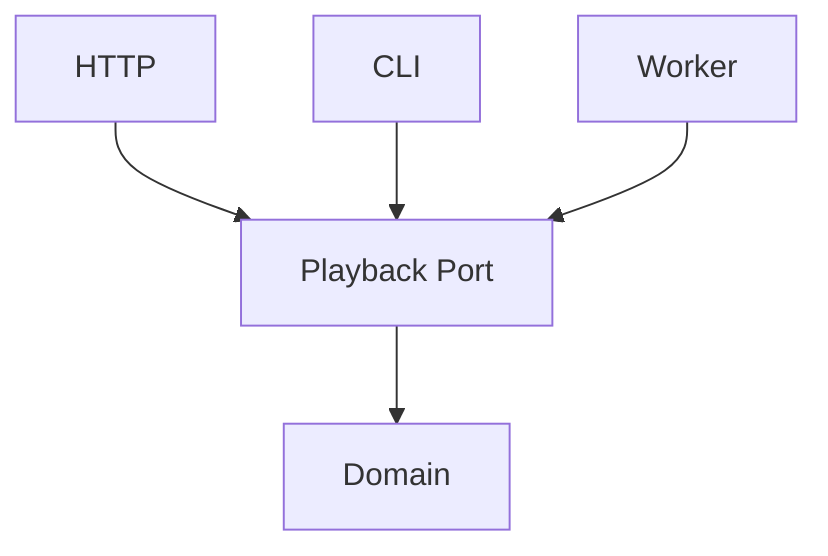
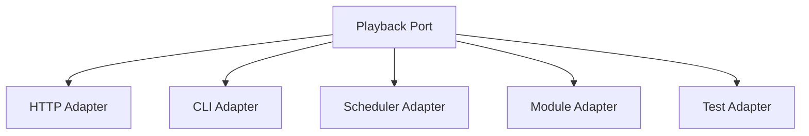
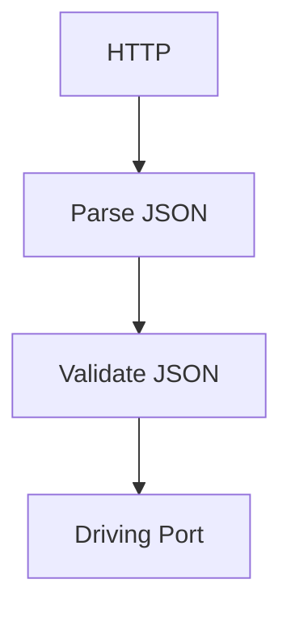
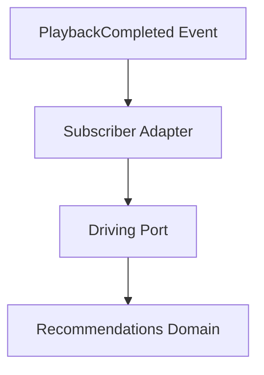

<!--
File: docs/engineering/guides/meg-004-hexagonal-architecture/03-driving-ports.md
Document: MEG-004
Status: Draft
-->

# Driving Ports

> *Driving Ports describe what the outside world may ask the Domain to do.*

---

# Purpose

Every business capability exposes behaviour — importing media, starting playback, creating collections, updating metadata, authenticating users — and external systems require a mechanism through which they can request it. Within Hexagonal Architecture these contracts are known as **Driving Ports**. They define the public capabilities of the Domain without defining how those capabilities are invoked.

---

# Philosophy

Within Mosaic:

> **Driving Ports express business use cases, not transport protocols.**

A Driving Port answers one question — **what business behaviour is available?** — and never **how does someone invoke it?** Transport remains an infrastructure concern.

---

# What Is A Driving Port?

A Driving Port is an interface through which an external actor requests business behaviour. HTTP, the CLI, a Scheduler, an Event Subscriber, a Module and a Test all interact with the Domain through the same Driving Port, which allows the Domain to remain unaware of how requests arrive.

---

# Why Driving Ports Exist

Without Driving Ports, each entry point grows its own copy of the business. HTTP reaches Playback directly, the CLI later grows different business logic, and a Worker eventually adds another implementation again — business behaviour becomes duplicated. Instead, every entry point invokes exactly the same business behaviour through one Port.



---

# The Domain Defines Behaviour

Driving Ports belong to the Application layer immediately surrounding the Domain. They describe use cases, commands and business operations — not HTTP endpoints, REST resources, WebSocket messages or CLI commands. Technology adapts itself to the Port, never the reverse.

---

# One Port Per Use Case

Driving Ports should model business capabilities. `PlaybackService`, `LibraryImporter` and `CollectionManager` are good; `HTTPPlaybackController` and `RESTLibraryAPI` are poor. The business should remain unaware of transport.

---

# Use Cases

Every operation exposed by a Driving Port should correspond to a business use case, such as `ImportMedia()`, `ResumePlayback()`, `CreateCollection()` or `GenerateRecommendations()`. Notice that these operations describe business behaviour, not infrastructure.

---

# Business Language

Driving Ports should reinforce the ubiquitous language: `ResumePlayback(...)` rather than `ExecutePlaybackHandler(...)`. The Port should read like a conversation with the business.

---

# Request Models

Driving Ports may define request objects.

```go
type ImportMediaRequest struct {

    LibraryID LibraryID

    Source Source
}
```

These request models represent business concepts and should not mirror HTTP payloads, JSON documents or database schemas. Transport models should be translated before reaching the Port.

---

# Response Models

Likewise, Driving Ports may return business responses.

```go
type ImportMediaResult struct {

    MediaID MediaID
}
```

Avoid exposing HTTP status codes, JSON responses or protobuf messages. The Domain should return business concepts and transport decides how to present them.

---

# Commands

Driving Ports frequently execute commands: the intention to import media is expressed as `ImportMedia()`. A Driving Port represents the intention to perform business work, and successful execution may later produce Domain Events.

---

# One Behaviour

Driving Port operations should remain cohesive. `ProcessEverything()` is poor; `ImportMedia()`, `CreateCollection()` and `ArchiveMedia()` are better. Every operation should communicate one business intention.

---

# No Infrastructure

Driving Ports must remain infrastructure agnostic. `ImportMedia(http.Request)` is poor; `ImportMedia(request ImportMediaRequest)` is better. HTTP belongs to the Adapter and the Port belongs to the Domain.

---

# Multiple Adapters

One Driving Port may have many Adapters.



The Domain remains unchanged and only the Adapters differ, which is one of the key advantages of Hexagonal Architecture.

---

# Validation

Driving Ports should receive already valid transport models.



Business validation still occurs inside the Domain while transport validation remains outside; the two solve different problems.

---

# Transactions

Driving Ports define business operations. They do not own database transactions, retries, event publication or infrastructure coordination — those responsibilities belong elsewhere within the architecture. The Port simply exposes business behaviour.

---

# Testing

Driving Ports make business testing straightforward: a test invokes the Driving Port directly and reaches the Domain with no HTTP server, no REST and no database. The business can be exercised directly, which dramatically simplifies testing.

---

# Event Subscribers

Within Mosaic's Reactive Runtime, event subscribers frequently become Driving Adapters.



Notice that the subscriber remains infrastructure while the Domain still receives business requests through the Driving Port. This cleanly integrates [MEG-002](../meg-002-event-driven-runtime/index.md) with Hexagonal Architecture.

---

# Examples Within Mosaic

Driving Ports within Mosaic include `PlaybackService`, `LibraryImporter`, `CollectionService`, `MetadataManager` and `RecommendationEngine`. Each exposes business behaviour; none expose technology.

---

# Anti-Patterns

The following practices are prohibited.

## HTTP In Ports

Ports exposing transport entry points such as `ServeHTTP(...)`.

## Database Models

Ports accepting SQL entities.

## JSON Objects

Ports exposing transport models directly.

## Framework Types

Ports importing gin, echo, grpc or protobuf.

## Generic Methods

Operations such as `Execute()`, `Handle()` or `Process()` without clear business meaning.

---

# Mosaic Guidelines

Within Mosaic:

- Driving Ports must expose business use cases.
- Driving Ports must remain transport independent.
- Driving Ports should reinforce the ubiquitous language.
- Every operation should describe one business behaviour.
- Request and response models should represent business concepts.
- Multiple adapters may implement the same Driving Port.
- Infrastructure must translate before invoking the Port.
- Driving Ports must remain stable as transport evolves.

---

# Relationship to MEG

Ports define contracts, and Driving Ports define **how the outside world requests business behaviour**. The next chapter introduces **Driven Ports**, which define the opposite direction: **how the Domain requests capabilities from the outside world**. Together they complete the communication boundary between the Domain and infrastructure.

---

# Summary

Driving Ports represent the public face of the Domain. They describe business capabilities, business language and business intent, and they remain completely independent of HTTP, the CLI, the Runtime, Modules and transport generally. By ensuring every external interaction passes through the same business contract, Mosaic guarantees that changing how users interact with the platform never requires changing the Domain itself.
