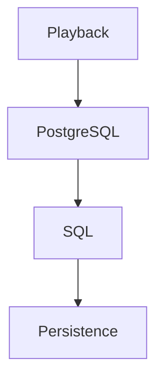
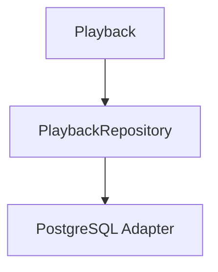
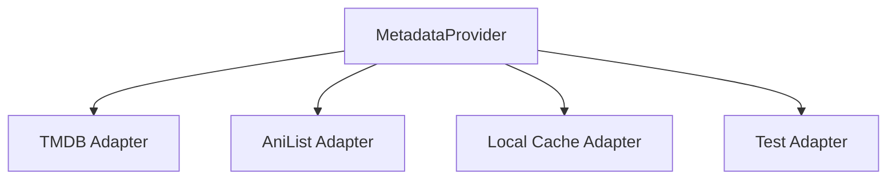
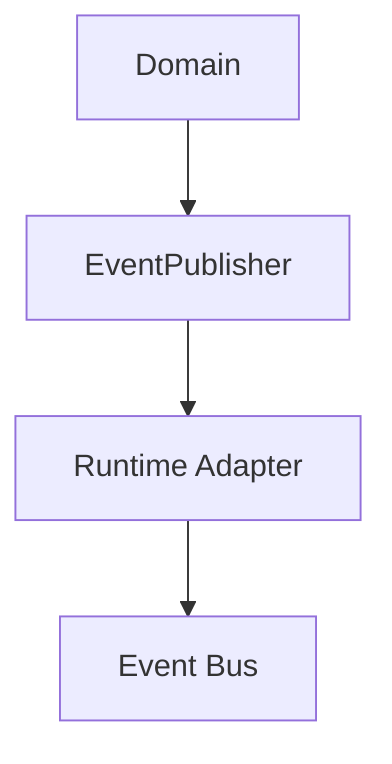
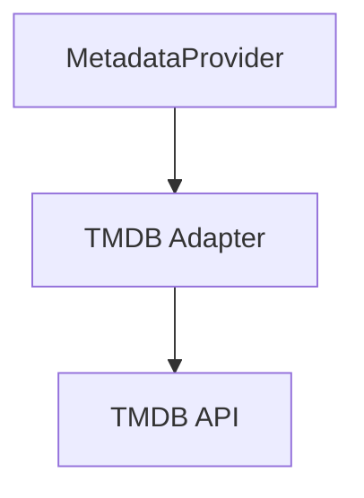

<!--
File: docs/engineering/guides/meg-004-hexagonal-architecture/04-driven-ports.md
Document: MEG-004
Status: Draft
-->

# Driven Ports

> *Driven Ports describe the capabilities the Domain requires from the outside world. They never describe how those capabilities are implemented.*

---

# Purpose

Business behaviour frequently depends upon external capabilities: loading Aggregates, persisting changes, retrieving metadata, storing artwork, generating identifiers and obtaining the current time. The Domain requires these capabilities but should not know how they are fulfilled. Driven Ports define those requirements — the contracts through which the Domain requests services from infrastructure while remaining completely independent of implementation.

---

# Philosophy

Within Mosaic:

> **The Domain expresses needs. Infrastructure fulfils them.**

A Driven Port answers one question — **what capability does the Domain require?** — and never **which technology provides it?** Implementation remains outside the Domain.

---

# What Is A Driven Port?

A Driven Port is an interface representing a capability required by the Domain, such as `LibraryRepository`, `MetadataProvider`, `ArtworkStore`, `Clock` or `IdentityGenerator`. Each describes behaviour; none describe technology.

---

# Why Driven Ports Exist

Without Driven Ports, persistence reaches back into the business.



The Domain now understands infrastructure. Instead:



Only the Adapter knows PostgreSQL exists, and the Domain remains infrastructure independent.

---

# Dependency Inversion

Driven Ports are the mechanism through which Dependency Inversion is achieved: the Domain declares the interface and infrastructure implements it, never the other way round. The Domain owns every dependency it requires, and infrastructure adapts itself to satisfy those contracts.

---

# The Domain Defines Requirements

A Driven Port expresses a business requirement. `PlaybackRepository`, for example, expresses that the Domain requires the ability to load Playback and save Playback. It does not require SQL, transactions, indexes or connection pools; those concerns belong entirely to infrastructure.

---

# Ports Describe Behaviour

Driven Ports should describe business behaviour. Good:

```go
type MetadataProvider interface {

    Metadata(...)
}
```

Poor:

```go
type TMDBClient interface {

    GetMovie(...)
}
```

The first describes business intent; the second exposes infrastructure.

---

# Business Language

Driven Ports should reinforce the ubiquitous language. `ArtworkStore`, `IdentityGenerator` and `RecommendationRepository` are good; `BlobClient`, `DatabaseAccess` and `RedisCache` are poor. Technology names should never appear within the Domain.

---

# Multiple Implementations

One Driven Port may have many implementations.



The Domain remains unchanged and Adapters become interchangeable. This flexibility is one of the primary architectural benefits of Hexagonal Architecture.

---

# Repositories

Repositories are among the most common Driven Ports. The Playback Domain depends upon `PlaybackRepository` only, and the Adapter behind it reaches PostgreSQL, so persistence remains completely replaceable.

---

# External Providers

External services should always appear behind Driven Ports. The Metadata Domain depends upon `MetadataProvider`, whose Adapter today calls TMDB and tomorrow may call AniList instead. The Domain does not change; only the Adapter changes.

---

# Time

Time is infrastructure, so calling

```go
time.Now()
```

inside the Domain is poor practice. The Domain should instead request the current time through a `Clock` Port and let infrastructure determine how that time is obtained, which improves both testing and determinism.

---

# Identity Generation

Identity generation should also occur through a Driven Port: an `IdentityGenerator` generates a `LibraryID` on the Domain's behalf. The Domain requires a unique identity; it does not require a UUID, a ULID, a Snowflake or a database sequence, all of which are implementation choices.

---

# Storage

Storage technologies should never appear within the Domain, so a Port named for Blob Storage is poor where `ArtworkStore` is preferred. The business requires artwork storage and does not care whether artwork is stored in Blob Storage, the filesystem or cloud storage. The Adapter owns that decision.

---

# Ports Should Be Small

Driven Ports should remain narrowly focused: `ArtworkStore` is good, `InfrastructureProvider` is poor. Each Port should represent one business capability, nothing more.

---

# Ports Are Stable

Infrastructure changes frequently, but Driven Ports should remain relatively stable. Changing a Port forces changes throughout the Domain, the Adapters and the tests, whereas changing an Adapter affects only infrastructure. Stable Ports protect the Domain from implementation churn.

---

# Error Semantics

Driven Ports should communicate business failures: the Domain should receive "media not found" rather than an SQL error. The Adapter translates infrastructure failures so that the Domain receives business concepts, mirroring the repository guidance established in [MEG-003](../meg-003-domain-driven-design/index.md).

---

# Testing

Driven Ports make infrastructure easy to replace. A test can satisfy `PlaybackRepository` with `InMemoryRepository`, `Clock` with `FixedClock`, and `MetadataProvider` with `FakeProvider`, so the Domain can be tested without external dependencies.

---

# Runtime Integration

The Reactive Runtime itself may satisfy Driven Ports.



Notice that the Domain depends only upon the Port while the Runtime implements it, so [MEG-002](../meg-002-event-driven-runtime/index.md) and MEG-004 complement one another naturally.

---

# Anti-Corruption Layers

Driven Ports frequently terminate at Anti-Corruption Layers.



Translation occurs entirely inside the Adapter and the Domain never understands external terminology, which preserves the purity of the Domain Model established in [MEG-003](../meg-003-domain-driven-design/index.md).

---

# Examples Within Mosaic

Driven Ports within Mosaic include `LibraryRepository`, `PlaybackRepository`, `MetadataProvider`, `ArtworkStore`, `Clock`, `IdentityGenerator` and `BlobStore`. Every one expresses a business dependency; none expose implementation.

---

# Anti-Patterns

The following practices are prohibited.

## Infrastructure Interfaces

Interfaces such as `TMDBClient` or `PostgresRepository` inside the Domain.

## Framework Dependencies

Ports importing SQL, HTTP, Redis or Docker.

## Technology Language

Using implementation terminology rather than business terminology.

## Generic Infrastructure Ports

Ports such as `StorageProvider` without business meaning.

## Shared Infrastructure Contracts

Allowing infrastructure to define interfaces consumed by the Domain. The Domain always owns its own contracts.

---

# Mosaic Guidelines

Within Mosaic:

- Driven Ports must belong to the Domain.
- Driven Ports must express business requirements.
- Driven Ports must remain technology independent.
- Infrastructure must implement Driven Ports.
- Ports should remain focused and cohesive.
- External systems must be hidden behind Adapters.
- Error semantics should remain business oriented.
- Driven Ports should evolve more slowly than infrastructure.

---

# Relationship to MEG

Driving Ports answer **how does the outside world invoke the Domain?** and Driven Ports answer **how does the Domain obtain capabilities from the outside world?** Together they define every dependency crossing the boundary of the Hexagon. The next chapter introduces **Adapters**, the infrastructure components that implement these contracts while keeping the Domain completely insulated from technology.

---

# Summary

Driven Ports are the Domain's expression of dependency: they communicate what the business requires, not how it is implemented. By ensuring every external dependency passes through a Domain-owned contract, Mosaic protects its most valuable asset — the business model itself. Infrastructure remains free to evolve, and the Domain remains free to ignore it.
