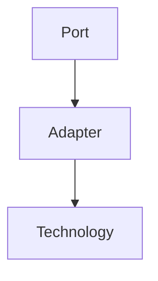
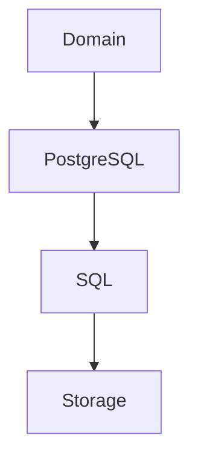
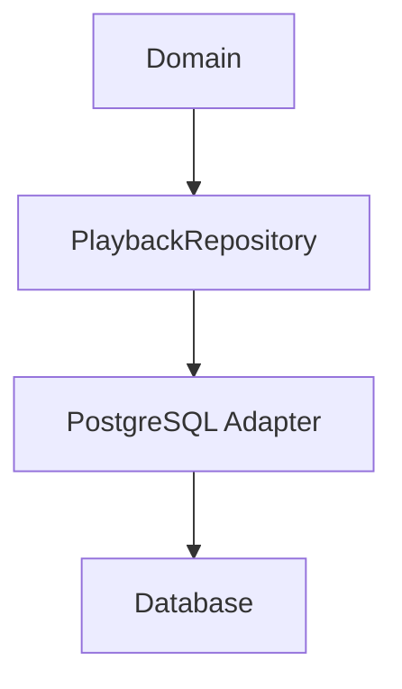
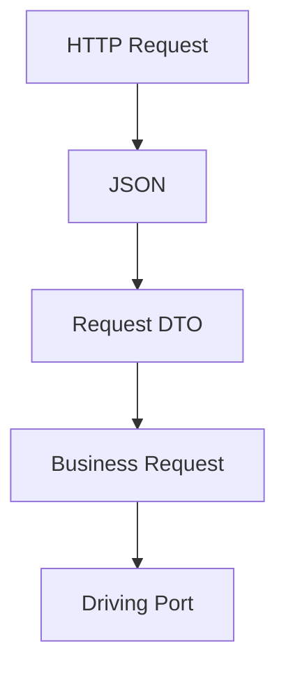
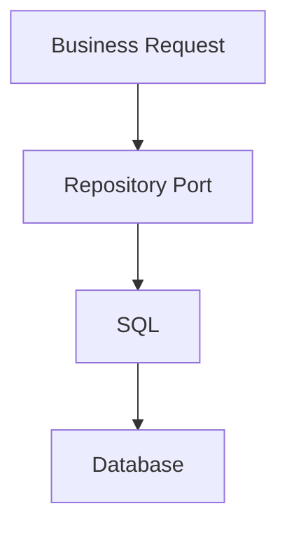
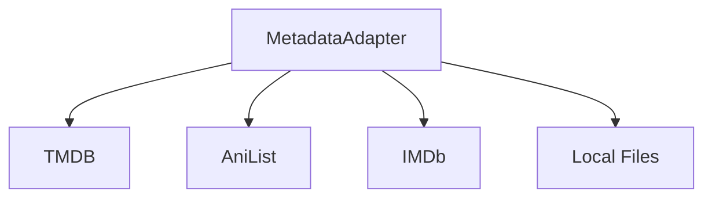
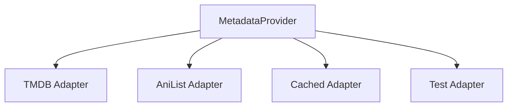
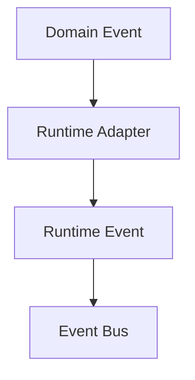
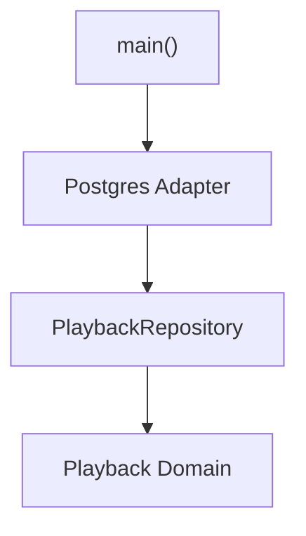

<!--
File: docs/engineering/guides/meg-004-hexagonal-architecture/05-adapters.md
Document: MEG-004
Status: Draft
-->

# Adapters

> *If Ports define what the Domain needs, Adapters define how the outside world fulfils those needs.*

---

# Purpose

The Domain communicates exclusively through Ports, but Ports are only contracts. Something must translate those contracts into real technologies such as HTTP, PostgreSQL, DuckDB, Blob Storage, an Event Bus, Docker, TMDB, Jellyfin and Stremio. Adapters perform that translation, isolating infrastructure from the Domain while allowing each technology to evolve independently.

---

# Philosophy

Within Mosaic:

> **Adapters translate. They do not decide.**

Adapters are translators. They convert transport into business requests, business requests into infrastructure operations, and infrastructure responses back into business concepts. They should never contain business rules, which belong to the Domain.

---

# What Is An Adapter?

An Adapter implements a Port. Conceptually:

A `PlaybackRepository` is satisfied by a PostgreSQL Adapter, a `MetadataProvider` by a TMDB Adapter, and an `ArtworkStore` by a Blob Storage Adapter. In each case the Adapter satisfies the Port and the Domain remains unchanged.

---

# Why Adapters Exist

Without Adapters, business behaviour becomes coupled to infrastructure:

With them, the dependency terminates at a contract instead:

Only the Adapter understands SQL. The Domain never does.

---

# Translation Layer

An Adapter performs translation in both directions. Inbound, a transport request is decoded and reshaped until it becomes something the business can act upon:

Outbound, a business request becomes an infrastructure operation:

Translation occurs only inside the Adapter, so the Domain never sees infrastructure models.

---

# Adapters Own Technology

Every technology belongs inside an Adapter, including SQL, HTTP, GraphQL, Redis, Docker, Kafka, Blob Storage, the TMDB SDK and the Jellyfin API. If these concepts appear inside the Domain, the architectural boundary has failed.

---

# Business Objects Stay Inside

Adapters should convert infrastructure models into Domain concepts rather than forwarding them. A SQL row passed straight into the Domain is poor; a SQL row mapped by the Adapter into an Aggregate is better. Likewise, HTTP JSON should reach the Domain only as a Business Request. The Domain should never parse JSON.

---

# One Adapter, One Technology

Each Adapter should represent one integration. A `TMDB Adapter` is good. A single `MetadataAdapter` reaching into TMDB, AniList, IMDb and Local Files at once is poor:

Multiple technologies should generally produce multiple Adapters implementing the same Port, which keeps integrations isolated and independently replaceable.

---

# Multiple Adapters

One Port may have many Adapters:

The Domain depends only upon `MetadataProvider`, so changing Adapters requires no Domain changes. This is the Platform foundation value proposition of Ports and Adapters.  [AWS Documentation](https://docs.aws.amazon.com/prescriptive-guidance/latest/cloud-design-patterns/hexagonal-architecture.html)

---

# Adapters Are Replaceable

Adapters should be considered disposable. Suppose TMDB is deprecated: the replacement should require a new Adapter, not a Domain rewrite. Replaceability is one of the primary architectural goals.

---

# Adapters Are Thin

Adapters should remain small. Their typical responsibilities are translation, mapping, validation, protocol conversion and error translation. They should not contain business rules, workflow decisions, Aggregate logic or invariants. If business behaviour appears inside an Adapter, move it into the Domain.

---

# Error Translation

Adapters translate infrastructure failures into business concepts. A SQL error must not reach the Domain unchanged; the Adapter should turn it into something like `Media Not Found`. The Domain should never understand database exceptions.

---

# Mapping

Adapters frequently perform mapping: JSON into a Domain Request, a database row into an Aggregate, a TMDB response into a Metadata Value Object. Mapping belongs entirely to infrastructure, not the Domain.

---

# Runtime Integration

The Reactive Runtime integrates through Adapters:

The Adapter performs the translation, and the Domain remains unaware that an Event Bus even exists. This preserves the separation established in [MEG-002](../meg-002-event-driven-runtime/index.md).

---

# External APIs

Every external API should terminate at an Adapter, so that AniList reaches the Domain only as a `MetadataProvider` implemented by an AniList Adapter. The Domain should never import API clients, SDKs or REST models; the Adapter shields it from external change.

---

# Testing

Adapters are tested independently, typically verifying mapping correctness, translation, protocol handling and infrastructure interaction. Domain tests should not require Adapter tests, because the responsibilities remain separate.

---

# Composition Root

Adapters are assembled within the Composition Root:

The Domain never constructs its own Adapters; construction belongs entirely outside the Hexagon.

---

# Evolution

Adapters change frequently — REST gives way to GraphQL, PostgreSQL to CockroachDB, Blob Storage to S3. In every case the Adapter changes while the Port and the Domain remain. This asymmetry is intentional.

---

# Examples Within Mosaic

Adapters within Mosaic include the HTTP Playback Adapter, CLI Import Adapter, PostgreSQL Playback Repository, DuckDB Analytics Repository, TMDB Metadata Adapter, Jellyfin Compatibility Adapter and Stremio Integration Adapter. Every one owns technology; none own business behaviour.

---

# Anti-Patterns

The following practices are prohibited.

## Business Rules In Adapters

Calculating business decisions during mapping.

---

## Domain Imports Infrastructure

Entities importing SQL, HTTP, Docker or SDKs.

---

## Fat Adapters

Adapters performing orchestration or business workflows.

---

## Shared Adapters

One Adapter implementing unrelated Ports.

---

## Technology Leaks

Returning infrastructure models directly to the Domain.

---

# Mosaic Guidelines

Within Mosaic:

- Every Adapter must implement one or more Ports.
- Adapters must own technology-specific code.
- Adapters must translate between infrastructure and business concepts.
- Adapters must remain thin.
- Adapters must not contain business rules.
- Infrastructure models must not cross the Port boundary.
- Adapters should remain independently replaceable.
- Adapters should evolve without requiring Domain changes.

---

# Relationship to MEG

Ports define:

> **What the Domain needs.**

Adapters define:

> **How those needs are fulfilled.**

The next two chapters separate Adapters into two categories: **Driving Adapters**, which bring requests into the Domain, and **Driven Adapters**, which fulfil the Domain's requests to external systems. This distinction completes the Ports and Adapters model at the heart of Hexagonal Architecture.

---

# Summary

Adapters are translators. They isolate technology from the business by converting external representations into Domain concepts and Domain concepts back into external representations.

Within Mosaic, every infrastructure concern exists behind an Adapter. That simple rule allows databases, APIs, runtimes and transport protocols to evolve continuously while the Domain remains stable, expressive and entirely focused on the business.
