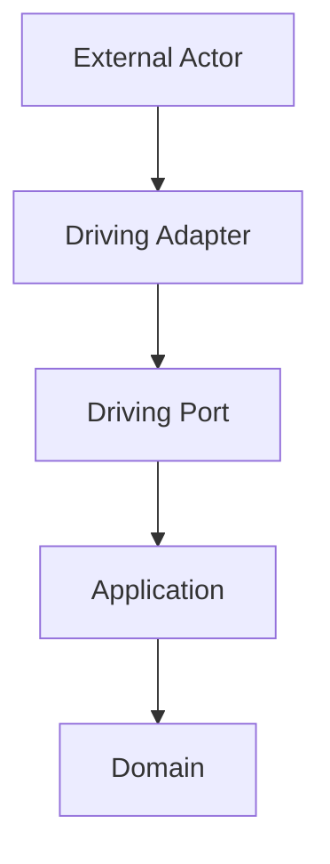
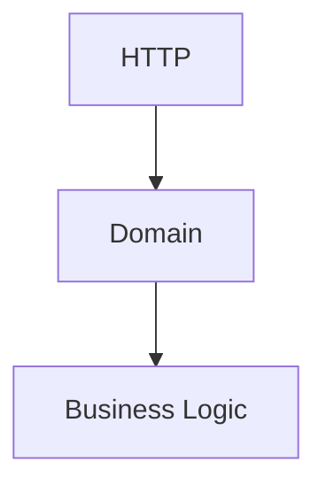
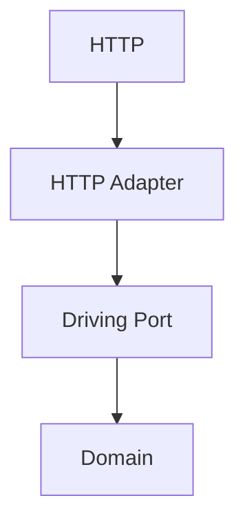
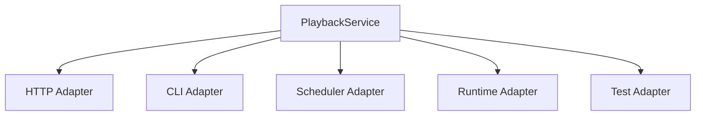
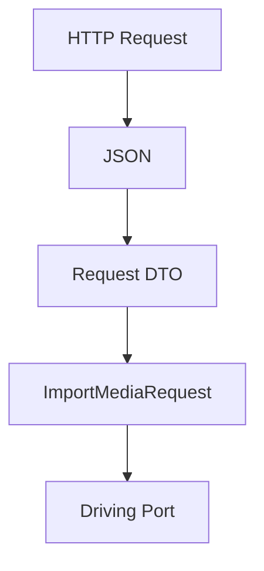
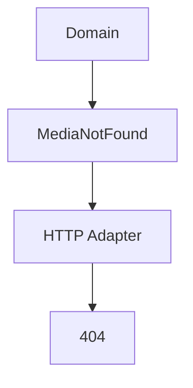
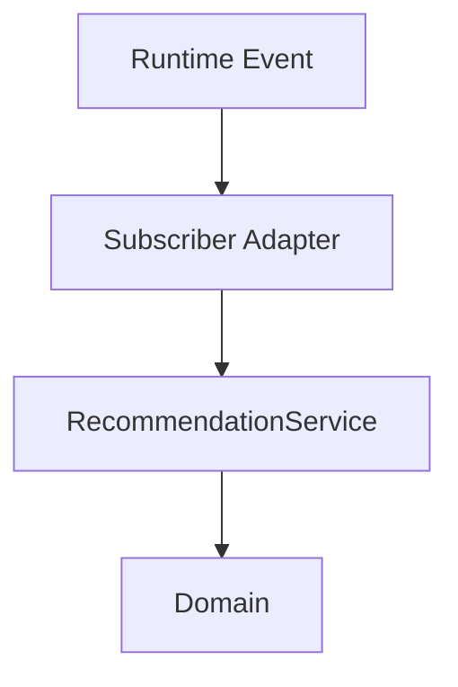
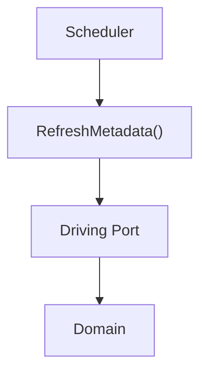
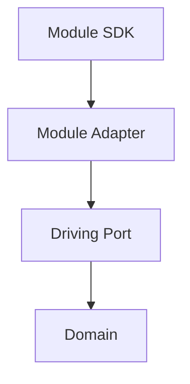

<!--
File: docs/engineering/guides/meg-004-hexagonal-architecture/06-driving-adapters.md
Document: MEG-004
Status: Draft
-->

# Driving Adapters

> *Driving Adapters translate external requests into business behaviour. They never become part of the business themselves.*

---

# Purpose

The Domain cannot receive requests directly, so every interaction with the outside world must first pass through an Adapter — HTTP requests, CLI commands, scheduled tasks, runtime events, Module calls and test harnesses alike. These external interactions differ technologically; they should not differ architecturally. Driving Adapters translate them into calls against Driving Ports.

---

# Philosophy

Within Mosaic:

> **Driving Adapters understand technology. Driving Ports understand the business.**

A Driving Adapter should answer one question:

> **How does this external system communicate with the Domain?**

It should never answer:

> **What should the business do?**

That responsibility belongs entirely to the Domain.

---

# What Is A Driving Adapter?

A Driving Adapter is an infrastructure component that invokes a Driving Port. Conceptually:

The Driving Adapter is responsible for translation, and nothing more.

---

# External Actors

Many different systems may invoke the same business capability: HTTP, the CLI, a scheduler, a runtime subscriber or a Module. Every one of them becomes a Driving Adapter, and no transport receives special treatment.

---

# Why Driving Adapters Exist

Without Driving Adapters the Domain ends up understanding HTTP:

With one in place, the transport stops at the boundary:

Only the Adapter understands HTTP, and the Domain remains completely transport independent.

---

# One Driving Port

Multiple Driving Adapters may invoke the same Driving Port:

The business implementation remains identical; only the entry mechanism changes.

---

# Translation

Driving Adapters translate external representations into business requests:

A CLI Adapter does the same work in fewer steps, turning CLI arguments into a Business Request before invoking the Driving Port. In both cases translation ends at the Port boundary.

---

# Validation

Driving Adapters perform transport validation: malformed JSON, missing HTTP headers, invalid CLI syntax, protobuf decoding and authentication tokens. Business validation belongs to the Domain, and the two should never be confused. `Required JSON Field Missing` is transport validation; `Collection Already Exists` is business validation. Different layers, different responsibilities.

---

# Authentication And Authorisation

Authentication belongs to the Driving Adapter layer, which authenticates the caller before invoking the Driving Port. The Domain should receive an `Authenticated User`, never a JWT, bearer token or OAuth header: security mechanisms remain infrastructure concerns while business identity remains a domain concern.

Authorisation decisions should likewise generally occur before entering the Domain, with the Adapter performing the permission check ahead of the Driving Port call. The Domain assumes the caller has already been authorised to invoke the requested business behaviour, keeping business rules separate from access control.

---

# Error Translation

Driving Adapters translate Domain errors into transport errors:

A CLI Adapter performs the equivalent translation into an exit code. The Domain should never return HTTP status codes, CLI exit codes or GraphQL errors; Adapters perform the translation.

---

# Runtime Events

Within the Reactive Runtime, subscribers become Driving Adapters:

Subscribers simply translate runtime events into business requests, and the Domain remains unaware that an Event Bus exists. This is one of the key integration points between [MEG-002](../meg-002-event-driven-runtime/index.md) and MEG-004.

---

# Scheduled Work

Scheduled tasks also become Driving Adapters:

The Domain should never understand timers, cron or scheduling. The scheduler invokes the business through the same contract as every other caller.

---

# Modules

Modules invoke the Domain through Driving Adapters:

The Domain remains unaware whether the caller is Platform capabilities, a Module, a test or the CLI. All callers appear identical.

---

# Tests

Tests become Driving Adapters too, invoking the Driving Port directly with no HTTP, no runtime and no infrastructure in between. The business remains directly testable, which is one of the greatest practical benefits of Hexagonal Architecture.

---

# Thin And Stateless

Driving Adapters should remain thin. Their typical responsibilities are parsing, authentication, transport validation, mapping and error translation; they should not contain business rules, Aggregate manipulation, orchestration or persistence, because business behaviour belongs beyond the Port.

They should also remain stateless, since they simply translate one request into another. State belongs to Aggregates, Repositories and the Runtime, not the Adapter itself.

---

# Examples Within Mosaic

Driving Adapters within Mosaic include the REST API, GraphQL API, CLI, Worker Subscriber, Scheduler, Module Runtime and integration tests. Each invokes exactly the same business behaviour.

---

# Anti-Patterns

The following practices are prohibited.

## Business Rules

Determining business outcomes inside HTTP handlers.

---

## Persistence

Executing SQL directly from Driving Adapters.

---

## Runtime Logic

Managing retries, scheduling or workers. These belong to the runtime.

---

## Aggregate Mutation

Changing Aggregate state directly. All business behaviour must enter through the Driving Port.

---

## Technology Leakage

Passing HTTP requests, protobuf messages or JSON documents directly into the Domain.

---

# Mosaic Guidelines

Within Mosaic:

- Driving Adapters must invoke Driving Ports.
- Driving Adapters must remain transport specific.
- Driving Adapters must perform translation.
- Driving Adapters must perform transport validation.
- Business validation must remain inside the Domain.
- Driving Adapters must translate Domain errors into transport-specific responses.
- Driving Adapters should remain stateless.
- Every external caller should interact through a Driving Adapter.

---

# Relationship to MEG

Driving Ports define:

> **What business behaviour is available.**

Driving Adapters define:

> **How external systems invoke that behaviour.**

The next chapter introduces **Driven Adapters**, which perform the opposite role by implementing the capabilities requested by the Domain through Driven Ports. Together they complete the two halves of the Hexagonal Architecture.

---

# Summary

Driving Adapters isolate the Domain from every external interaction. Whether requests originate from HTTP, the CLI, runtime events, Modules or tests, the Domain always receives the same business request through the same Driving Port.

That consistency allows Mosaic to support many interaction models without ever allowing transport concerns to leak into the business itself.
