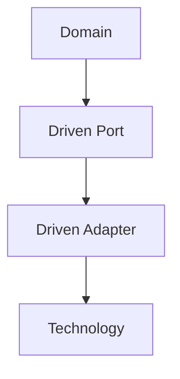
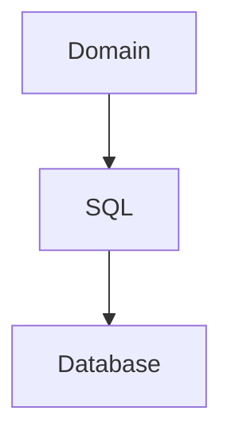
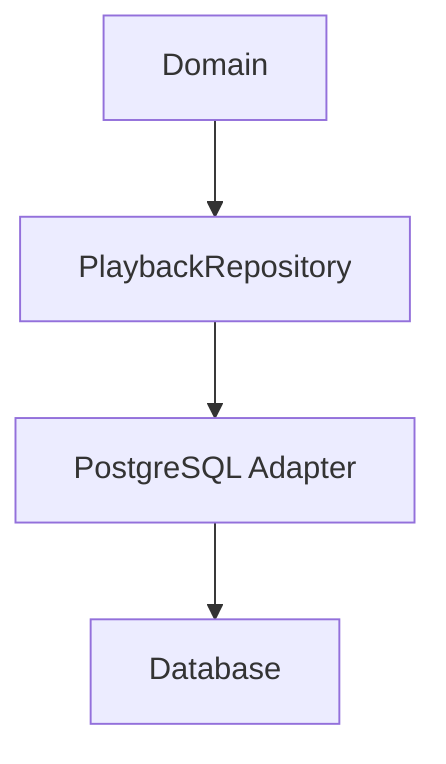
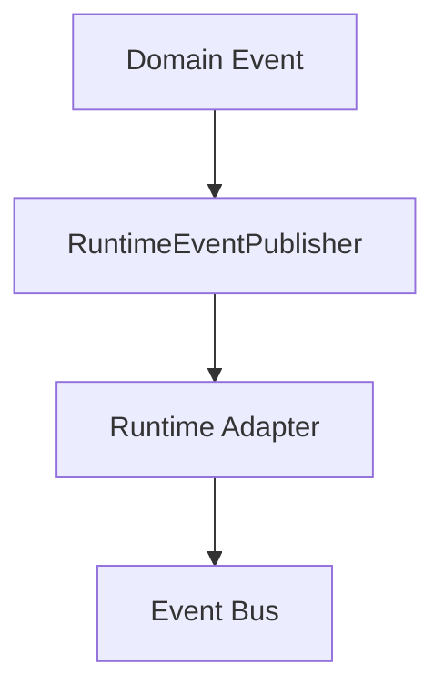
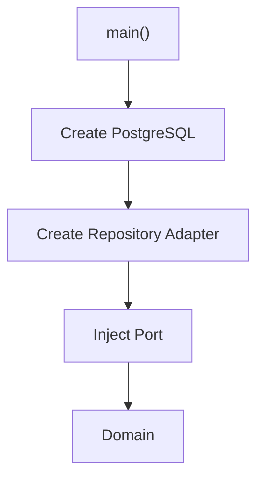
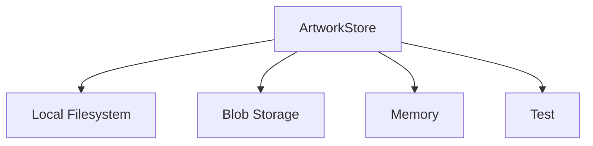
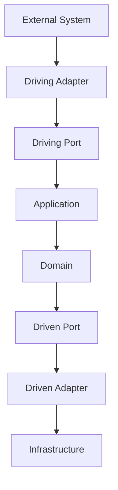

<!--
File: docs/engineering/guides/meg-004-hexagonal-architecture/07-driven-adapters.md
Document: MEG-004
Status: Draft
-->

# Driven Adapters

> *Driven Adapters fulfil the Domain's requests by translating business intent into infrastructure operations.*

---

# Purpose

The Domain frequently requires capabilities that only infrastructure can provide: persisting Aggregates, retrieving metadata, storing artwork, publishing runtime events, generating identifiers and obtaining the current time. It expresses these requirements through Driven Ports, and Driven Adapters satisfy them by implementing the corresponding Port using specific infrastructure technologies. They form the boundary between the Domain and the external world.

---

# Philosophy

Within Mosaic:

> **Driven Adapters implement capabilities. They never define them.**

The Domain owns the contract and the Driven Adapter owns the implementation. This distinction allows infrastructure to evolve without requiring changes to the Domain Model.

---

# What Is A Driven Adapter?

A Driven Adapter is an infrastructure implementation of a Driven Port. Conceptually:

The Domain depends only upon the Port; the Adapter depends upon the technology.

---

# Why Driven Adapters Exist

Without Driven Adapters, business behaviour becomes tightly coupled to persistence:

With one in place, the dependency stops at a contract:

Only the Adapter understands SQL, and the Domain remains completely independent.

---

# One Port

Every Driven Adapter implements one or more Driven Ports. A `MetadataProvider` may be implemented today by a TMDB Adapter and later by an AniList Adapter; the Domain remains unchanged, and only the Adapter changes.

---

# Infrastructure Ownership

Driven Adapters own every technology-specific concern, including SQL, HTTP clients, SDKs, authentication tokens, connection pools, file systems, blob storage and serialization. None of these concepts belong inside the Domain.

---

# Repository Adapters

Repository implementations are Driven Adapters, such as the PostgreSQL Adapter behind `PlaybackRepository`. Their responsibilities are SQL generation, transaction management, persistence mapping and Aggregate reconstruction. Business behaviour remains inside the Aggregate; persistence behaviour remains inside the Adapter.

---

# External Service Adapters

External services should always terminate at a Driven Adapter, so that the TMDB API is reached only through a TMDB Adapter implementing `MetadataProvider`. The Adapter performs authentication, request construction, retries where appropriate, response mapping and error translation, so the Domain receives only business concepts.

---

# Runtime Adapters

The Reactive Runtime is also infrastructure:

The Domain remains unaware of workers, queues, subscribers and delivery guarantees; those concepts belong entirely to the runtime.

---

# Translation And Mapping

Driven Adapters translate business requests into infrastructure requests, and later infrastructure responses back into business results. Translation occurs entirely within the Adapter: neither the Domain nor the infrastructure should understand one another's models directly.

Much of that work is mapping — an Aggregate into a database row, a database row back into an Aggregate, a TMDB response into a Metadata Value Object. Mapping should remain symmetrical wherever practical, and business models should never become persistence models.

---

# Error Translation

Infrastructure errors should never escape the Adapter. A SQL error reaching the Domain unchanged is poor; the Adapter should translate it into `MediaNotFound`, just as it should translate an HTTP timeout into `MetadataUnavailable`. The Domain should reason about business failures, never infrastructure failures.

---

# Configuration

Configuration belongs to infrastructure, so a TMDB API key is supplied to the Adapter and goes no further. The Domain should never receive API keys, connection strings or endpoint URLs; configuration remains an implementation concern.

---

# Retry Behaviour

Driven Adapters may implement infrastructure retries when interacting with unreliable external systems such as TMDB, AniList and Blob Storage. These retries differ from the runtime event retries defined in [MEG-002](../meg-002-event-driven-runtime/index.md): infrastructure retries protect one operation, whereas runtime retries protect business workflows. The two should remain distinct.

---

# Resource Ownership

Driven Adapters own infrastructure resources such as database connections, HTTP clients, blob clients, caches and SDK instances. The Domain should never manage resource lifecycles; construction and disposal belong to infrastructure.

---

# Composition Root

Driven Adapters are constructed within the Composition Root:

The Domain should never instantiate its own Adapters.

---

# Testing

Driven Adapters should be tested independently from the Domain, with tests typically verifying SQL mapping, HTTP translation, serialization, authentication and protocol compatibility. Domain tests should replace Adapters with simple test implementations. This separation keeps business tests fast while still validating infrastructure behaviour.

---

# Technology Replacement

Replacing infrastructure should require replacing only the Adapter, whether moving from PostgreSQL to CockroachDB or from TMDB to AniList. The Port remains unchanged, the Domain remains unchanged, and only the Adapter evolves. This is one of the primary reasons Hexagonal Architecture scales well over time.

---

# Multiple Adapters

One Port may have multiple implementations simultaneously:

Selecting the implementation becomes a Composition Root decision, not a Domain decision.

---

# Anti-Corruption Layers

Every integration with an external system should terminate inside a Driven Adapter, so that Jellyfin reaches `LibraryRepository` only through a Jellyfin Adapter. That Adapter translates terminology, identifiers, lifecycle and business concepts, ensuring external models never leak into the Domain.

---

# Examples Within Mosaic

Driven Adapters within Mosaic include the PostgreSQL Playback Repository, DuckDB Analytics Repository, TMDB Metadata Provider, AniList Metadata Provider, Blob Artwork Store, Filesystem Artwork Store and Runtime Event Publisher. Every one owns implementation; none own business behaviour.

---

# Anti-Patterns

The following practices are prohibited.

## Business Logic

Calculating recommendations inside a repository.

---

## Domain Models Leaking Out

Returning SQL rows directly to the Domain.

---

## Infrastructure Models Leaking In

Passing SDK objects into Aggregates.

---

## Shared Adapters

One Adapter implementing unrelated Ports.

---

## Framework Dependencies

Importing HTTP, SQL or Docker into Domain objects.

---

## Repository As Service

Repositories making business decisions rather than simply persisting Aggregates.

---

# Mosaic Guidelines

Within Mosaic:

- Driven Adapters must implement Driven Ports.
- Driven Adapters must own technology-specific code.
- Driven Adapters must translate infrastructure models into business models.
- Infrastructure errors must be translated into business concepts.
- Configuration must remain inside infrastructure.
- Domain objects must remain infrastructure independent.
- Driven Adapters should remain independently replaceable.
- Infrastructure changes should affect only Driven Adapters.

---

# Relationship to MEG

Driving Adapters bring business requests into the Domain and Driven Adapters fulfil the Domain's external requirements. Together they complete the Hexagonal Architecture:

Every dependency crossing the architectural boundary now passes through an explicit Port and Adapter. Nothing crosses the boundary accidentally.

---

# Summary

Driven Adapters are where technology finally appears. They isolate databases, APIs, storage, runtimes and external services from the Domain by translating business concepts into infrastructure operations and back again.

Within Mosaic, replacing an infrastructure technology should almost always mean replacing only a Driven Adapter. If changing a database requires changing an Aggregate, the architectural boundary has been violated.
