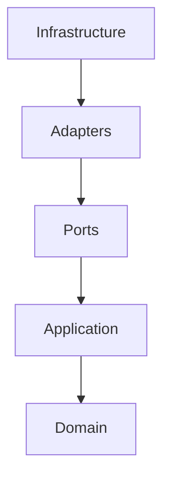
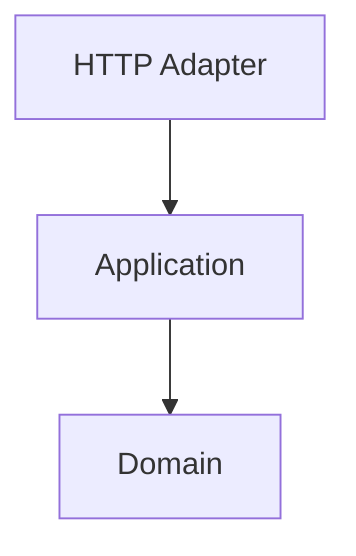
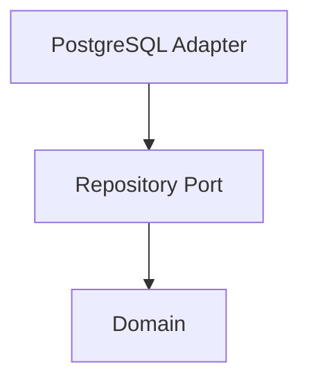
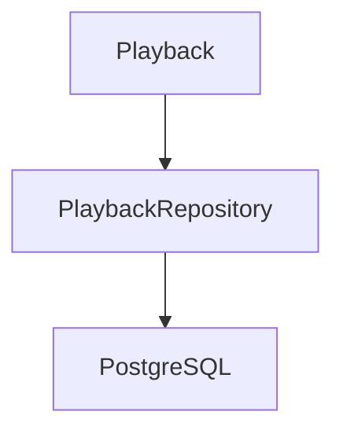
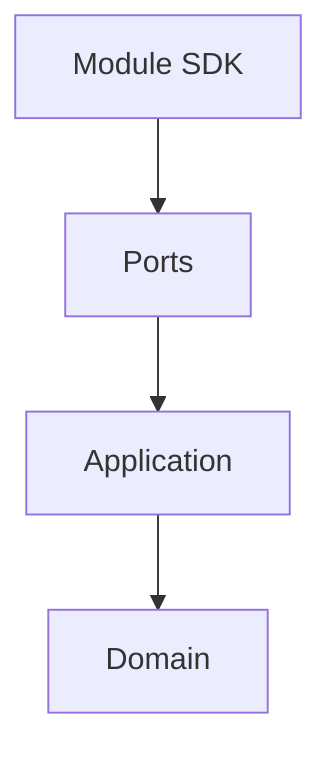
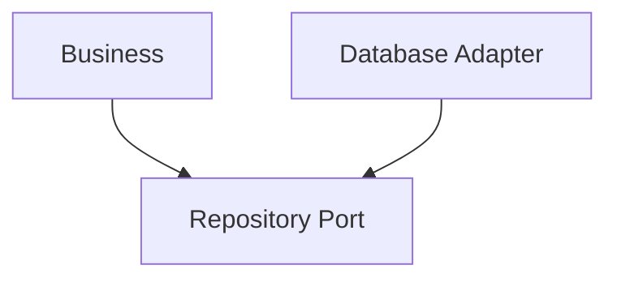
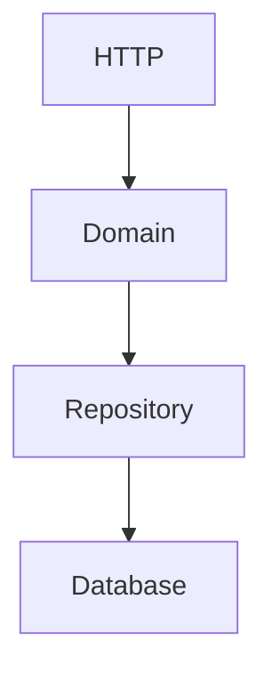
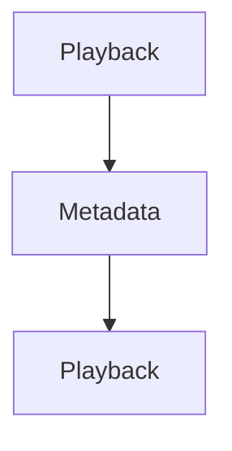
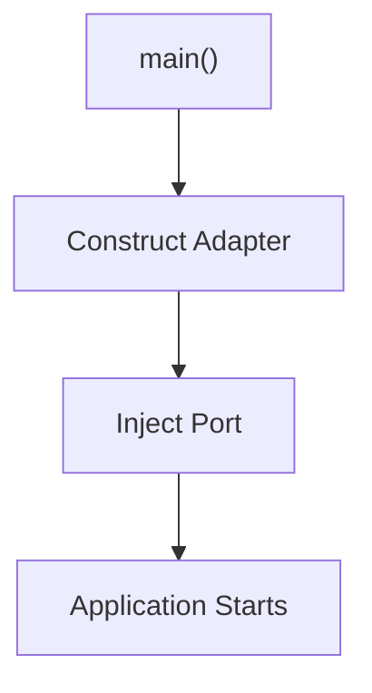
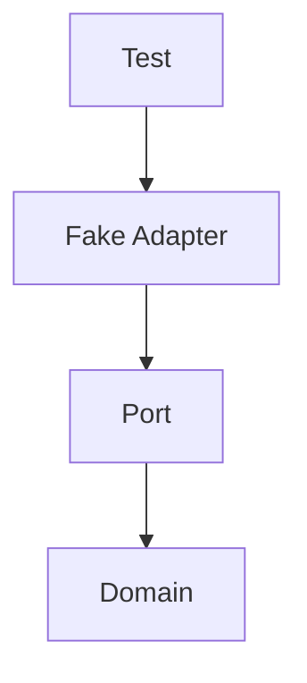

<!--
File: docs/engineering/guides/meg-004-hexagonal-architecture/08-dependency-direction.md
Document: MEG-004
Status: Draft
-->

# Dependency Direction

> *Architecture is not defined by layers. It is defined by the direction of dependencies.*

---

# Purpose

The single most important rule within Hexagonal Architecture is:

> **Dependencies always point towards the Domain.**

Everything else in this specification exists to enforce that rule. When dependency direction is correct, infrastructure becomes replaceable, business logic remains isolated, testing becomes simple and long-term maintenance becomes significantly easier. When it is violated, technology begins shaping the business. This document defines the dependency rules governing every Mosaic codebase.

---

# Philosophy

Within Mosaic:

> **The Domain depends upon nothing. Everything else depends upon the Domain.**

This is the architectural centre of the platform, and every package, interface and dependency should reinforce it. If an engineer is unsure where code belongs, the dependency direction should answer the question.

---

# The Dependency Rule

Every dependency points inward, and the reverse direction is prohibited:



The Domain should remain the least coupled part of the platform. This inward dependency rule is the defining characteristic shared by Hexagonal, Onion and Clean Architecture.  [AWS Documentation](https://docs.aws.amazon.com/prescriptive-guidance/latest/hexagonal-architectures/overview.html)

---

# The Domain

The Domain sits at the centre and owns the business language, business rules, entities, aggregates, value objects, domain services and domain events. It depends on nothing. If the Domain imports infrastructure, the architecture has already failed.

---

# The Application Layer

The Application layer coordinates the Domain. It may depend upon the Domain and Domain Ports, but must not depend upon HTTP, SQL, the Runtime, Blob Storage or frameworks. It orchestrates business use cases; it does not implement infrastructure.

---

# Ports

Ports belong to the Domain or the Application layer and define business contracts. They never depend upon Adapters. Infrastructure implements Ports; Ports never implement infrastructure. Ownership remains with the Domain.

---

# Adapters

Adapters sit outside the Hexagon and depend upon Ports, the Application layer and the Domain. They may additionally depend upon HTTP, SQL, Docker, SDKs, the Runtime and filesystems. Adapters are allowed to know technology. The Domain is not.

---

# Infrastructure

Infrastructure is the outermost layer and includes PostgreSQL, DuckDB, Blob Storage, HTTP servers, the Event Bus, Docker, TMDB, Jellyfin and Trakt. Infrastructure depends upon everything inside it, and nothing inside depends upon infrastructure.

---

# Allowed Dependencies

The following dependency graphs are valid.





Every dependency points towards the centre.

---

# Forbidden Dependencies

The reverse graphs are prohibited: the Domain depending upon HTTP, an Aggregate depending upon SQL, or Playback depending upon Docker. Business concepts must never depend upon implementation technologies.

---

# Runtime Dependency Direction

The Reactive Runtime is infrastructure, so a dependency from the Runtime to the Domain is valid and a dependency from the Domain to the Runtime is prohibited. Domain Events should never publish themselves, understand workers, understand retries or understand scheduling. The Runtime adapts to the Domain, not the reverse.

---

# Storage Dependencies

Storage technologies remain infrastructure. This is correct:



Playback depending upon PostgreSQL directly is incorrect. The Domain should never import SQL drivers, ORMs or database clients; storage remains entirely outside the Hexagon.

---

# Module Dependencies

Modules are infrastructure, and they depend inward like everything else:



The Domain should never know which modules exist, how modules load or where modules execute. This allows capabilities to remain stable regardless of platform composition.

---

# Dependency Inversion

Dependency Inversion frequently causes confusion. Traditional architecture has the business depending directly upon the database. Hexagonal Architecture inverts that:



Notice that both depend upon the Repository Port. The Domain owns the abstraction and infrastructure implements it, which is what allows infrastructure to remain replaceable.  [AWS Documentation](https://docs.aws.amazon.com/prescriptive-guidance/latest/cloud-design-patterns/hexagonal-architecture.html)

---

# Compile-Time Dependencies

Dependency direction is a compile-time concern determined by imports, not by function calls. A Domain object may indirectly trigger database persistence, but that does not mean it imports the database. Only imports determine dependency direction.

---

# Runtime Call Flow

Runtime execution frequently flows outward, and that is acceptable:



Execution direction and dependency direction are different concepts: execution flows both ways, while dependencies always point inward. This distinction is one of the most commonly misunderstood aspects of Hexagonal Architecture.

---

# Package Dependencies

Package imports should naturally reflect architectural direction. The preferred layout is:

```text
internal/
    domain/
    application/
    adapters/
    infrastructure/
```

Adapters depend upon the Application layer, which depends upon the Domain; the Domain must never depend upon Adapters. The package graph should visually reinforce the architecture.

---

# Cycles

Circular dependencies are prohibited, including any cycle between packages such as Playback and Metadata:



If two packages require one another, one of three things is probably true: ownership is unclear, a Port is missing, or the model requires refinement. Circular dependencies are architectural feedback, not compiler inconvenience.

---

# Composition Root

The Composition Root is the only place where concrete implementations, adapters and infrastructure meet the Domain:



Every other part of the application should remain unaware of concrete implementations.

---

# Testing

Dependency direction naturally enables testing:



The Domain never knows; tests simply provide another Adapter. This is one of the major practical advantages of the architecture.

---

# Dependency Checklist

Before introducing a dependency, ask:

- Does this dependency point inward?
- Does the Domain know about infrastructure?
- Does this import introduce technology into the Domain?
- Does this dependency reinforce or weaken the architecture?
- Could this become a Port instead?

If uncertainty exists, the dependency probably requires reconsideration.

---

# Anti-Patterns

The following practices are prohibited.

## Domain Imports Infrastructure

The Domain depending upon SQL.

---

## Runtime Imports

The Domain depending upon the Event Bus.

---

## Framework Dependencies

Entities importing gin, echo, grpc or ORM libraries.

---

## Shared Infrastructure Models

Passing infrastructure models directly into the Domain.

---

## Circular Dependencies

Any package cycle between architectural layers.

---

## Dependency Convenience

Importing infrastructure "because it is easier." Convenience should never override architecture.

---

# Mosaic Guidelines

Within Mosaic:

- Dependencies must always point towards the Domain.
- The Domain must remain infrastructure independent.
- Ports must be owned by the Domain or Application.
- Adapters must implement Ports.
- Infrastructure must remain replaceable.
- Runtime must remain outside the Domain.
- Package imports must reinforce architectural direction.
- Circular dependencies must not exist.
- The Composition Root must assemble the application.

---

# Relationship to MEG

Previous chapters introduced Ports, Driving Ports, Driven Ports and Adapters; this chapter defines the rule connecting them all. The next chapter introduces the **Composition Root**, the single location where the entire dependency graph is assembled before the application begins execution.

---

# Summary

Every architectural decision within Hexagonal Architecture ultimately reduces to one rule:

> **Dependencies point inward.**

Everything else — Ports, Adapters, Dependency Inversion, replaceable infrastructure and testability — is simply a consequence of consistently following that principle. Within Mosaic, preserving dependency direction is one of the primary mechanisms protecting the Domain from the inevitable evolution of technology.
