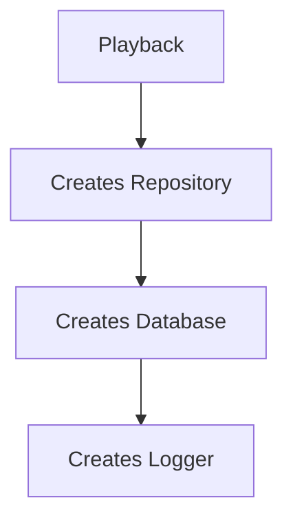
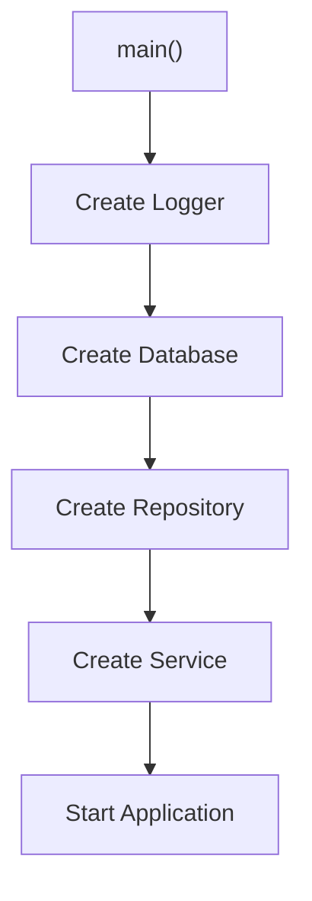
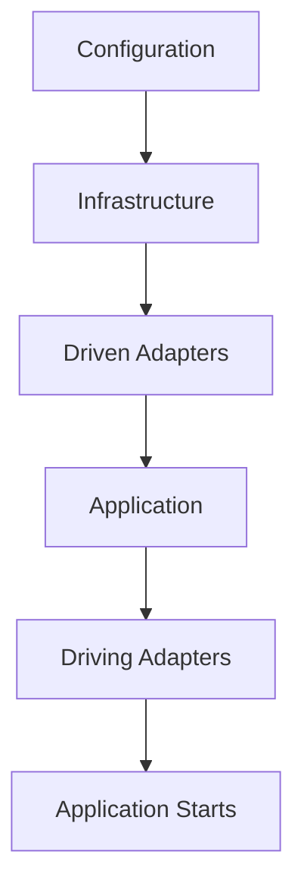
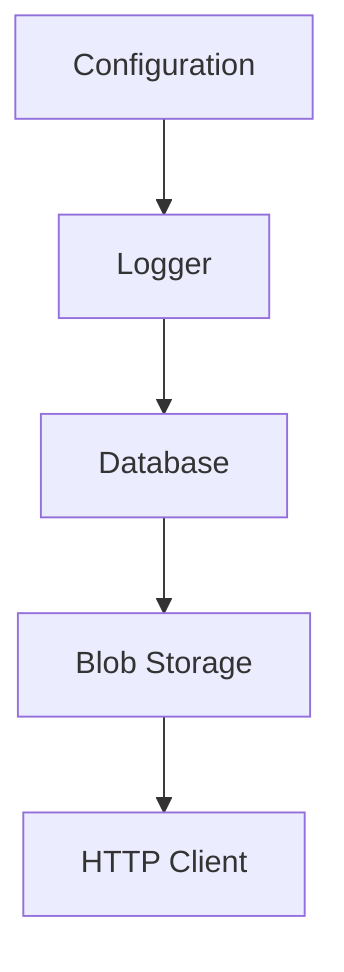
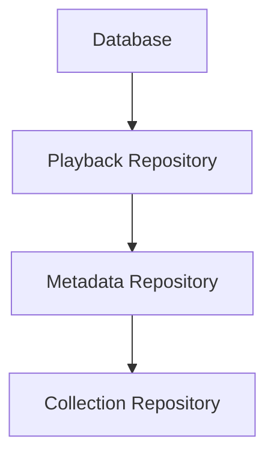
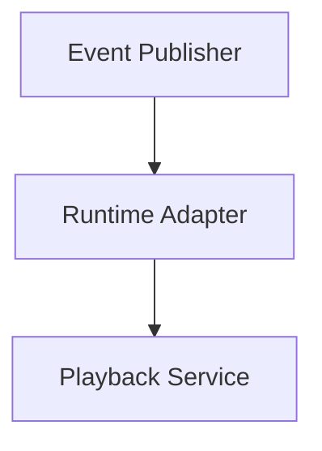
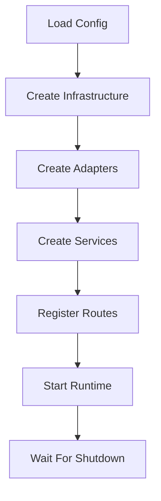

<!--
File: docs/engineering/guides/meg-004-hexagonal-architecture/09-composition-root.md
Document: MEG-004
Status: Draft
-->

# Composition Root

> *The Composition Root is the only place in the application where concrete implementations know about one another.*

---

# Purpose

Previous chapters established that the Domain owns Ports, that Adapters implement Ports, and that dependencies point inward. Eventually, however, the application must actually run: concrete implementations must be created and dependencies connected, the HTTP server must receive a Service, Repositories must receive database connections, and the Runtime must receive Event Publishers. All of this assembly occurs in one place, the **Composition Root**.

---

# Philosophy

Within Mosaic:

> **Construction is centralised. Behaviour is distributed.**

The Composition Root is a single, logical location where an application's object graph is assembled. [R2 Dev](https://pub-979cff47d4d84105ade2d75c354ef020.r2.dev/Dependency%20Injection%20Principles.pdf) It is the only location where infrastructure knows about the Domain, where Adapters know about each other, where concrete implementations are selected and where object graphs are assembled. Every other part of the application remains unaware of concrete implementations.

---

# What Is A Composition Root?

A Composition Root is the application's entry point. Typical examples include:

```text
cmd/server/main.go
cmd/worker/main.go
cmd/migrate/main.go
```

Every executable has exactly one Composition Root. Everything else receives dependencies; nothing else constructs them.

---

# Why A Composition Root Exists

Without a Composition Root, construction spreads through the call graph — Playback creates a Repository, which creates a Database, which creates a Logger:



Construction becomes distributed, dependencies become hidden and testing becomes difficult. With a Composition Root, `main()` performs the whole sequence in the open, leaving behaviour isolated everywhere else:



---

# Responsibilities

The Composition Root owns configuration loading, logger construction, infrastructure construction, adapter construction, dependency wiring, runtime startup and graceful shutdown. It intentionally does **not** own business behaviour, business rules, orchestration or validation. Once construction completes, its work is finished.

---

# Dependency Graph

The Composition Root assembles dependencies from the outside in.



Notice that dependencies are created in the opposite order to dependency direction: construction begins outside, while knowledge still points inward.

---

# Manual Dependency Injection

Within Mosaic, dependencies are assembled explicitly. For example:

```go
db := postgres.New(...)

repo := postgres.NewPlaybackRepository(db)

service := playback.NewService(repo)

handler := http.NewPlaybackHandler(service)
```

Every dependency is visible and nothing is hidden. Go's explicit construction style naturally complements Hexagonal Architecture.

---

# No Dependency Injection Container

Mosaic intentionally avoids dependency injection containers such as Spring, Guice, Dig or Wire at runtime. The Composition Root should remain ordinary Go code, because explicit construction is easier to debug, understand and test. The Go ecosystem generally favours explicit wiring over runtime dependency injection containers. [R2 Dev](https://pub-979cff47d4d84105ade2d75c354ef020.r2.dev/Dependency%20Injection%20Principles.pdf)

---

# Infrastructure Assembly

Infrastructure should be constructed first, working outward from configuration:



These components become dependencies for Adapters, and they should not be created lazily inside business code.

---

# Adapter Assembly

Adapters are constructed after infrastructure, each one built from the infrastructure it isolates:



Each Adapter implements a Port, and the Composition Root decides which implementation to use.

---

# Application Assembly

Application Services receive Ports: the Playback Service is constructed from the Playback Repository. The Service knows only about the Port and remains unaware of PostgreSQL.

---

# Driving Adapter Assembly

Driving Adapters are constructed last. The Playback Service is handed in turn to the HTTP Handler, the CLI Command and the Runtime Subscriber, so that every entry point receives the same business capability.

---

# Runtime Assembly

The Reactive Runtime is assembled exactly the same way — an Event Publisher is wrapped by a Runtime Adapter, which is given to the Playback Service:



Equally, a Runtime Subscriber may be constructed around the Recommendation Service. The Runtime remains infrastructure and is assembled outside the Domain.

---

# Configuration

Configuration belongs exclusively to the Composition Root. Calling `os.Getenv(...)` inside the Domain is poor practice; instead, configuration feeds the Composition Root, which injects the resulting dependencies. Business behaviour should never read environment variables directly.

---

# Environment Selection

The Composition Root selects implementations per environment: a Filesystem Artwork Store in development, a Blob Artwork Store in production and an InMemory Artwork Store in testing. The Domain remains unchanged; only the Composition Root changes.

---

# Testing

Tests frequently create their own miniature Composition Roots, wiring a Fake Repository into a Playback Service that the Test then exercises. The test still assembles the dependency graph — it simply chooses different Adapters, which is another consequence of explicit dependency construction.

---

# One Composition Root

Each executable should have one Composition Root. A Service that creates its own dependencies is poor; `main()` constructing everything is good. Distributed construction eventually becomes a Service Locator, and that architectural pattern is prohibited throughout Mosaic.

---

# Lifecycle Ownership

The Composition Root owns long-lived resources such as database pools, HTTP servers, the runtime, schedulers and worker pools. It is therefore responsible for startup, shutdown and disposal. Ownership should never become ambiguous.

---

# Composition Should Be Boring

Reading `main.go` should feel predictable, following a typical flow:



No surprises, no hidden construction, no runtime discovery.

---

# Anti-Patterns

The following practices are prohibited.

- **Distributed Construction** — creating dependencies throughout the application.
- **Service Locator** — calling `container.Resolve(...)` inside business code.
- **Infrastructure In The Domain** — Entities constructing repositories.
- **Runtime Discovery** — reflection-based dependency resolution during normal execution.
- **Multiple Composition Roots** — one executable assembling dependencies in several unrelated locations.
- **Hidden Singletons** — global mutable dependencies accessible from anywhere.

---

# Mosaic Guidelines

Within Mosaic:

- Every executable must have one Composition Root.
- The Composition Root must assemble the complete dependency graph.
- Dependencies must be injected explicitly.
- Configuration must remain outside the Domain.
- Infrastructure must be created before Adapters.
- Adapters must be created before Application Services.
- Driving Adapters must be assembled last.
- Business code must never construct infrastructure.
- Dependency injection containers should not be used.

---

# Relationship to MEG

Previous chapters established Ports, Adapters and Dependency Direction; the Composition Root is where those concepts finally become a running application. The next chapter introduces **Application Services**, the layer responsible for coordinating use cases while preserving the integrity of the Domain Model.

---

# Summary

The Composition Root is one of the simplest files in the application, and it should also be one of the most important. It answers one question:

> **How is this application assembled?**

Within Mosaic, the answer should always be visible, explicit and unsurprising. Once construction completes, the Composition Root steps aside and the rest of the application simply performs business behaviour.
