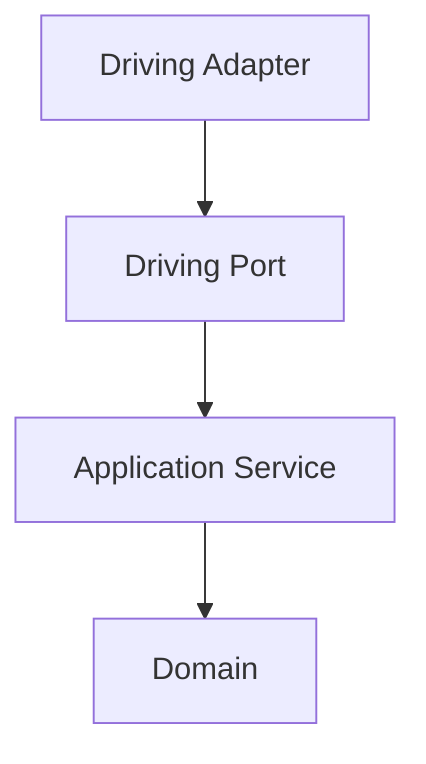
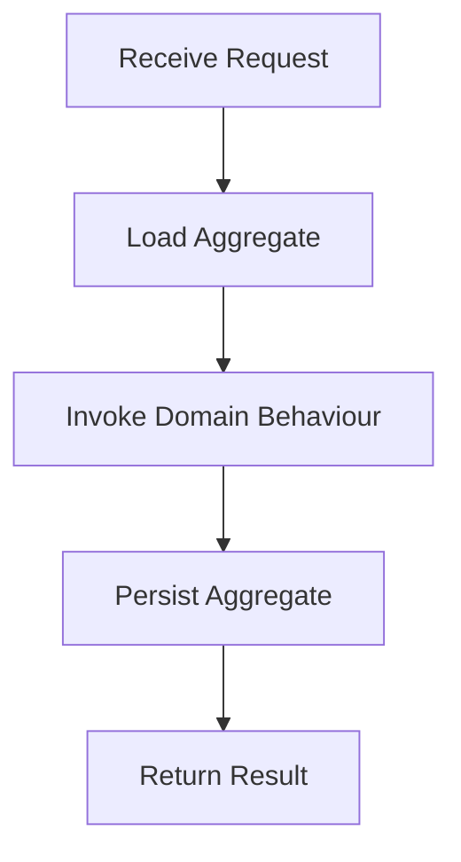
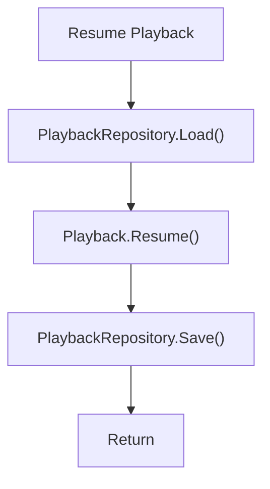
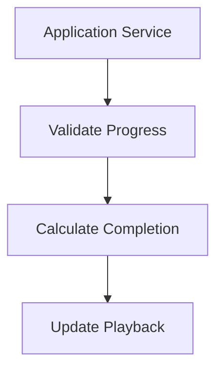
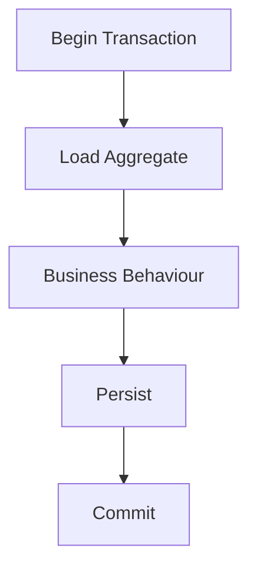
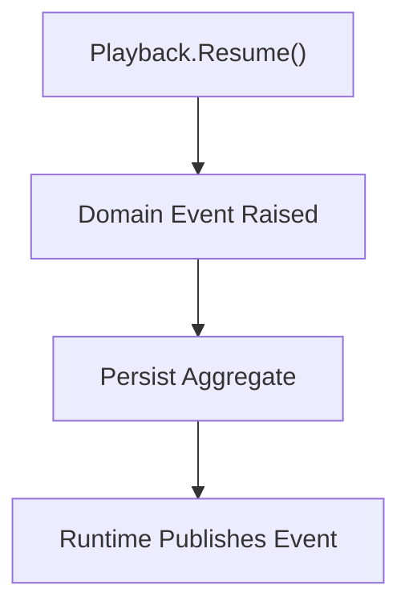
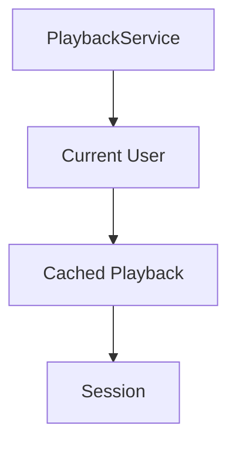
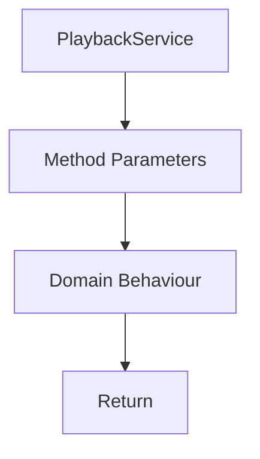

<!--
File: docs/engineering/guides/meg-004-hexagonal-architecture/10-application-services.md
Document: MEG-004
Status: Draft
-->

# Application Services

> *Application Services coordinate business behaviour. They never contain it.*

---

# Purpose

The Domain Model defines business rules, business behaviour and business invariants. External requests, however, frequently require more than invoking a single Aggregate: an Aggregate must be loaded, business behaviour invoked, changes persisted and Domain Events published. This coordination belongs to the **Application Layer**. Application Services orchestrate business use cases while ensuring the Domain remains focused exclusively on business decisions.

---

# Philosophy

Within Mosaic:

> **Application Services coordinate. The Domain decides.**

An Application Service should answer one question — **how should this business use case be executed?** — and never **what business rule applies?** Business rules belong to Aggregates, Entities, Value Objects and Domain Services, never to the Application Service. Application services are widely described as thin orchestration layers that load aggregates, invoke domain behaviour and persist the results without containing domain logic themselves. [Protean Docs](https://docs.proteanhq.com/concepts/building-blocks/application-services/)

---

# What Is An Application Service?

An Application Service represents a business use case, such as:

```text
Import Media
Resume Playback
Create Collection
Generate Recommendations
```

Each Application Service coordinates the work required to fulfil one business objective.

---

# Position Within The Hexagon

Application Services sit immediately outside the Domain.



They form the bridge between infrastructure and business without allowing infrastructure to enter the Domain.

---

# Responsibilities

Application Services coordinate use cases, load Aggregates, invoke business behaviour, persist Aggregates and return business results. They are **not** responsible for business rules, infrastructure, transport, runtime orchestration or persistence implementation. Responsibilities remain intentionally narrow.

---

# Typical Lifecycle

A typical Application Service follows this sequence.



Notice that the Application Service performs no business decision making; it simply coordinates.

---

# Example

Conceptually, resuming playback looks like this.



The business decision — *can playback resume?* — belongs entirely to the Playback Aggregate.

---

# Business Logic Belongs Elsewhere

It is poor practice for an Application Service to validate progress, calculate completion and update playback itself:



Preferably, the Application Service simply calls `Playback.Resume()`. The Aggregate performs validation, invariants, state transitions and Domain Events; the Application Service merely invokes it.

---

# Transactions

Application Services frequently define transaction boundaries.



Transaction management belongs here because it coordinates infrastructure; it does not belong inside the Domain.

---

# Domain Events

Application Services frequently bridge the Domain and the Runtime.



Notice that the Application Service does **not** create the Domain Event — the Aggregate already did. It simply ensures the event leaves the Domain after successful persistence.

---

# Ports

Application Services depend only upon Ports: the PlaybackService is constructed from the PlaybackRepository Port, never from PostgreSQL. Concrete infrastructure remains invisible.

---

# Stateless

Application Services should remain stateless. A PlaybackService that accumulates a current user, cached playback and a session is poor:



Preferably it takes method parameters, invokes domain behaviour and returns:



State belongs to the Domain, not to orchestration.

---

# One Use Case Per Method

Every public method should represent one business use case. Good:

```go
ResumePlayback(...)
```

```go
ArchiveMedia(...)
```

Poor:

```go
Process(...)
```

Methods should reinforce the ubiquitous language and describe outcomes rather than mechanisms.

---

# Request Models

Application Services may receive request objects.

```go
type ResumePlaybackRequest struct {

    PlaybackID PlaybackID

    Position PlaybackPosition
}
```

These models represent business requests and should not mirror HTTP payloads, JSON documents or protobuf messages; Driving Adapters perform that translation.

---

# Return Values

Application Services should return Aggregates, Value Objects or business result objects, never HTTP responses, JSON, SQL rows or infrastructure models. The caller decides how to present the result.

---

# Runtime Independence

Application Services remain unaware of workers, retries, scheduling, event delivery and subscribers. These concerns belong to the Reactive Runtime; the Application Service coordinates business behaviour and nothing more.

---

# Testing

Application Services should be straightforward to test. Typical tests verify that the correct Aggregate was loaded, the correct business behaviour invoked and the correct persistence performed. Business rules themselves should be tested at the Domain level, because Application Services verify orchestration rather than business correctness.

---

# Evolution

Application Services should evolve slowly. When a method becomes increasingly complicated, ask whether business logic has leaked into the Application Service; if it has, move it into the Aggregate, a Domain Service or a Value Object. Application Services should become thinner over time, not thicker.

---

# Examples Within Mosaic

Mosaic examples include `ImportMediaService`, `PlaybackService`, `CollectionService` and `RecommendationService`. Each represents one business capability and each coordinates, but none make business decisions.

---

# Anti-Patterns

The following practices are prohibited.

- **Business Logic** — calculating business rules inside the Application Service.
- **Infrastructure Dependencies** — importing SQL, HTTP or Docker directly.
- **Fat Services** — Application Services containing hundreds of lines of business behaviour.
- **Shared Mutable State** — Application Services storing request-specific information.
- **Aggregate Bypass** — updating persistence directly without invoking the Aggregate.
- **Runtime Logic** — managing retries, managing workers or publishing runtime events directly. These belong elsewhere.

---

# Mosaic Guidelines

Within Mosaic:

- Application Services must coordinate business use cases.
- Application Services must remain stateless.
- Business rules must remain inside the Domain.
- Application Services must depend only upon Ports.
- Application Services should represent one use case per method.
- Request and response models should remain business focused.
- Domain Events should originate inside Aggregates.
- Application Services should remain thin.

---

# Relationship to MEG

The previous chapters established Ports, Adapters, Dependency Direction and the Composition Root; Application Services now complete the centre of the Hexagon. The next chapter explains how the **Reactive Runtime** integrates with Hexagonal Architecture while preserving the Domain's independence, and is where [MEG-002](../meg-002-event-driven-runtime/index.md) and MEG-004 finally converge.

---

# Summary

Application Services are frequently misunderstood as another place to write business logic, but within Mosaic they exist for a much narrower purpose: they coordinate, load, invoke and persist, while the Domain decides, validates, protects and evolves. Keeping these responsibilities separate allows the Domain Model to remain expressive while the Application Layer remains remarkably simple.
