<!--
File: docs/engineering/guides/meg-004-hexagonal-architecture/11-runtime-boundary.md
Document: MEG-004
Status: Draft
-->

# Runtime Boundary

> *The Runtime executes the business. It is not the business.*

---

# Purpose

The Reactive Runtime introduced in [MEG-002](../meg-002-event-driven-runtime/index.md) is one of the most sophisticated parts of the Mosaic platform, managing event delivery, scheduling, retries, workers, observability and lifecycle. Despite that sophistication it remains infrastructure, and the Domain must never become aware that it exists. This document defines the architectural boundary separating the Domain Model from the Reactive Runtime.

---

# Philosophy

Within Mosaic:

> **The Runtime serves the Domain. The Domain never serves the Runtime.**

The Runtime exists because the Domain requires a mechanism for coordinating work; the Domain does **not** exist because the Runtime provides one. This distinction is one of the most important architectural boundaries in the entire platform.

---

# Two Independent Models

Mosaic intentionally maintains two independent models: the Business Model, expressed by the Domain, and the Execution Model, expressed by the Reactive Runtime. The Business Model describes media, playback, metadata, libraries and collections; the Execution Model describes workers, queues, retries, scheduling and event delivery. Neither model should leak into the other.

---

# The Runtime Is Infrastructure

Within Hexagonal Architecture, the Runtime is simply another external system alongside HTTP, the Database, Blob Storage and External APIs:

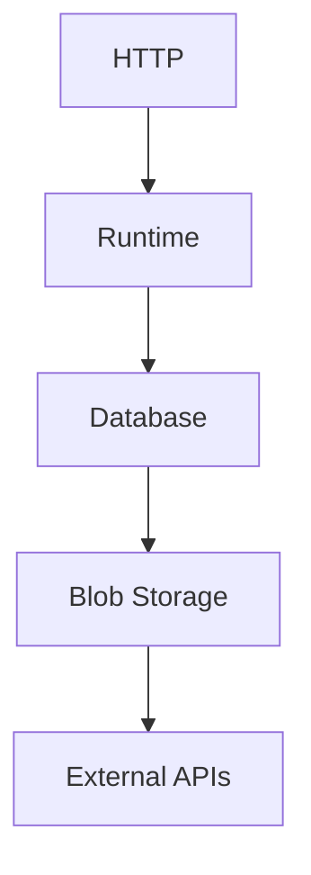

All exist outside the Domain and all communicate through Ports and Adapters. The Runtime receives no special architectural status simply because it is part of Mosaic.

---

# Business Behaviour

Business behaviour belongs exclusively to the Domain, and covers concepts such as *Playback Completed*, *Collection Created* and *Metadata Corrected*. The Runtime neither understands nor evaluates these concepts; it simply transports and coordinates the resulting events.

---

# Runtime Behaviour

The Runtime owns operational concerns such as *Retry Scheduled*, *Worker Started*, *Backpressure Applied* and *Queue Drained*. These are runtime concepts rather than business concepts, and the Domain should never reference them.

---

# Domain Events

The Domain raises Domain Events: `PlaybackSession.Complete()` raises `PlaybackCompleted`, and at that point the Domain has finished its work. It does not publish messages, schedule retries or notify subscribers — those responsibilities begin only after the Domain boundary.

---

# Runtime Translation

A Runtime Adapter bridges the two models.

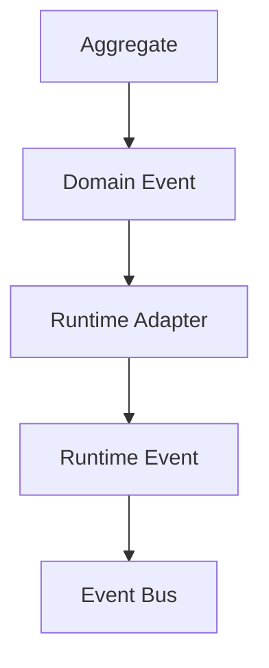

Notice that the Domain never imports the Event Bus, the Publisher or the Runtime; the Adapter performs the translation. This keeps the Domain pure while allowing the Runtime to evolve independently.

---

# Subscribers

Runtime Subscribers are Driving Adapters.

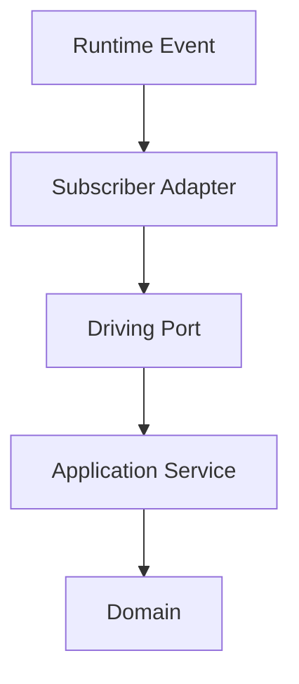

The Domain remains unaware that queues, workers and event buses exist; it simply receives another business request.

---

# Scheduling

Scheduling belongs entirely to the Runtime. Calling `time.Sleep(...)` inside an Aggregate is poor practice; instead, the Domain requests behaviour, the Runtime Scheduler defers it, and a Driving Adapter later re-enters the Domain:

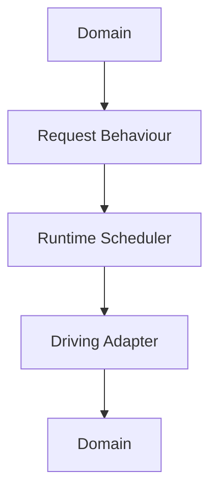

The Runtime owns time; the Domain owns behaviour.

---

# Retries

Retries are Runtime concerns. Suppose metadata retrieval fails:

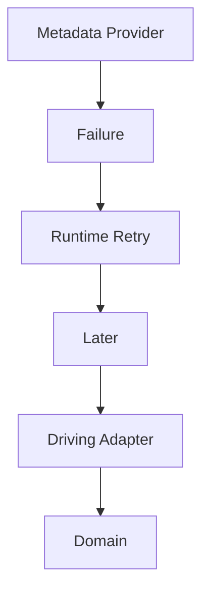

The Domain simply executes business behaviour again, unaware that this execution resulted from a retry. This separation keeps business behaviour deterministic while allowing the Runtime to implement sophisticated recovery strategies. [AWS Documentation](https://docs.aws.amazon.com/prescriptive-guidance/latest/cloud-design-patterns/hexagonal-architecture.html)

---

# Workers

Workers execute Application Services; they do not execute Aggregates directly.

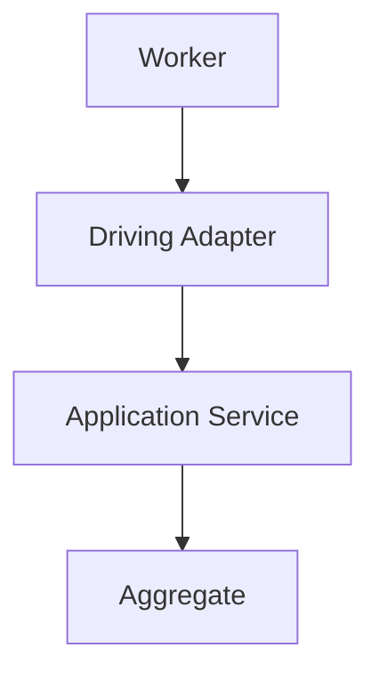

The Worker knows scheduling, cancellation and retries; the Aggregate knows business rules. Responsibilities remain completely separate.

---

# Cancellation

Runtime cancellation should never leak into business behaviour. The Runtime decides when to *stop processing*; the Domain decides *how to leave business state consistent*. Cancellation is operational, whereas consistency is business.

---

# Observability

The Runtime owns traces, metrics, queue depth, worker utilisation and retry counts, while the Domain owns business events, business identities and business outcomes. Operational telemetry should never pollute the Domain Model.

---

# Module Integration

Modules participate through the Runtime boundary.

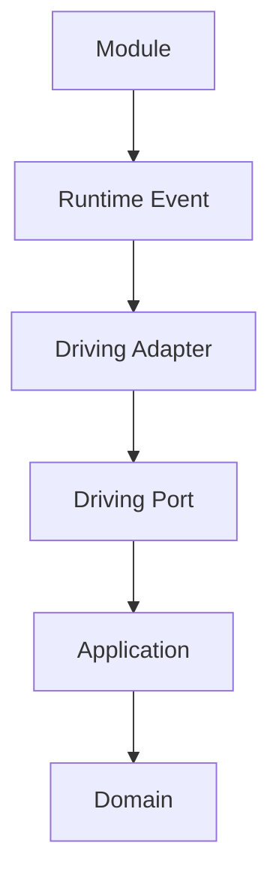

The Domain cannot determine whether the caller is Platform capabilities, a Module, the Scheduler or HTTP — every caller appears identical, which greatly simplifies business modelling.

---

# Runtime Replacement

Imagine replacing the current Runtime: Event Bus A with Event Bus B, or Worker Engine A with Worker Engine B. The Domain should remain unchanged, and only the Runtime Adapters and the Composition Root require modification. This is a direct consequence of respecting the Runtime boundary.

---

# Runtime Is Not An Application Service

A common mistake is allowing the Runtime to orchestrate business workflows:

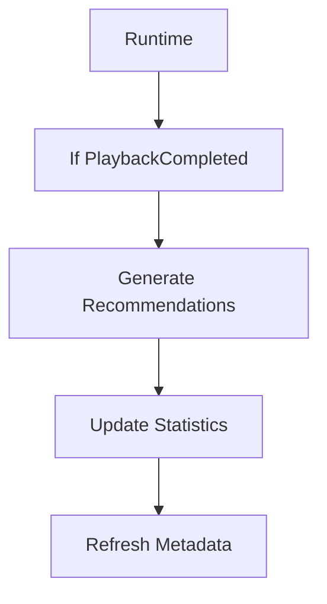

The Runtime has now become part of the business. Instead, it should deliver `PlaybackCompleted` to independent subscribers:

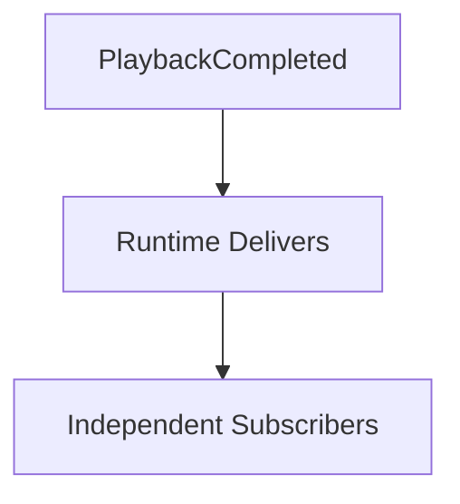

Business behaviour remains inside the Domain; the Runtime merely coordinates execution.

---

# Runtime APIs

The Domain should never import runtime APIs such as:

```go
runtime.Publish(...)
```

```go
runtime.Schedule(...)
```

A Domain Event should instead reach the Runtime through a Runtime Adapter. The Runtime remains replaceable because the Domain does not depend upon its APIs.

---

# Testing

The Runtime boundary makes testing significantly easier. Domain tests exercise an Application Service and its Aggregate and then assert:

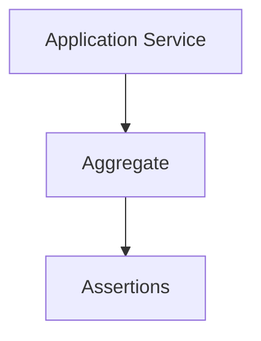

Runtime tests exercise the Worker and Runtime Adapter against queues and retries:

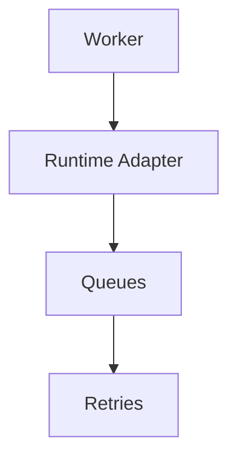

Each model can be verified independently, which dramatically reduces testing complexity.

---

# Anti-Patterns

The following practices are prohibited.

- **Runtime Imports** — Aggregates importing runtime packages.
- **Event Bus Inside Domain** — publishing runtime events directly from business objects.
- **Scheduling Inside Aggregates** — business objects managing timers.
- **Worker-Aware Business Logic** — business behaviour depending upon worker identity or execution environment.
- **Retry-Aware Aggregates** — Aggregates changing behaviour because an operation is a retry. Business correctness should remain independent of execution history.
- **Runtime Orchestration** — Runtime components deciding business workflows.

---

# Mosaic Guidelines

Within Mosaic:

- The Runtime must remain infrastructure.
- The Domain must remain unaware of the Runtime.
- Domain Events must cross the Runtime boundary through Adapters.
- Runtime Subscribers must invoke Driving Ports.
- Scheduling must remain outside the Domain.
- Retries must remain outside the Domain.
- Workers must execute Application Services rather than business rules.
- Operational telemetry must remain outside the Domain.
- Runtime behaviour must remain replaceable without modifying business logic.

---

# Relationship to MEG

This chapter completes the integration between **[MEG-002](../meg-002-event-driven-runtime/index.md) — Reactive Runtime**, **[MEG-003 — Domain-Driven Design](../meg-003-domain-driven-design/index.md)** and **MEG-004 — Hexagonal Architecture**. Together they establish one of the most important architectural principles within Mosaic:

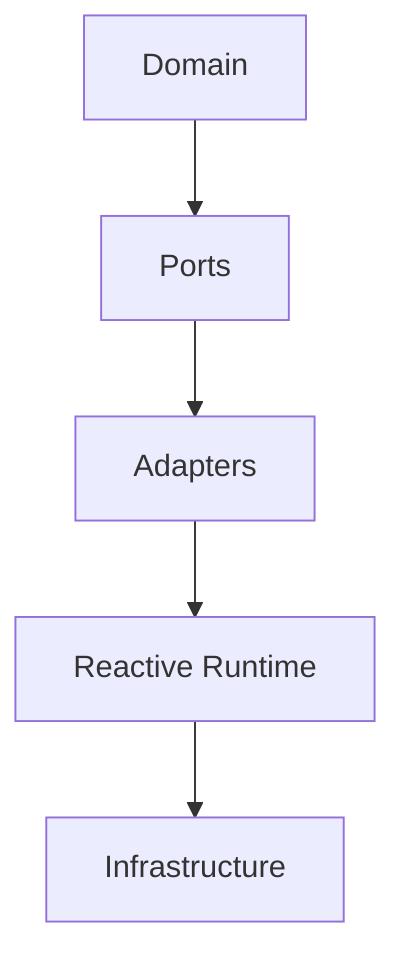

Each layer owns one responsibility, and none understand the implementation details of the next.

---

# Summary

The Runtime is an extraordinarily capable piece of infrastructure: it schedules, retries, observes, coordinates and delivers. The Domain does none of those things — it simply models the business. Maintaining this boundary ensures that the most valuable part of the platform, the business itself, remains protected from the inevitable evolution of the technologies that execute it.
