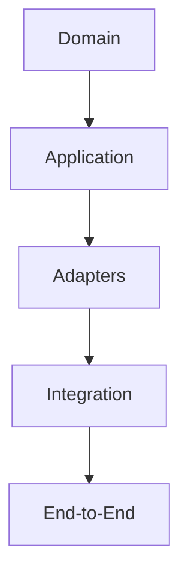
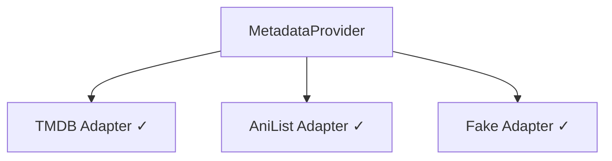
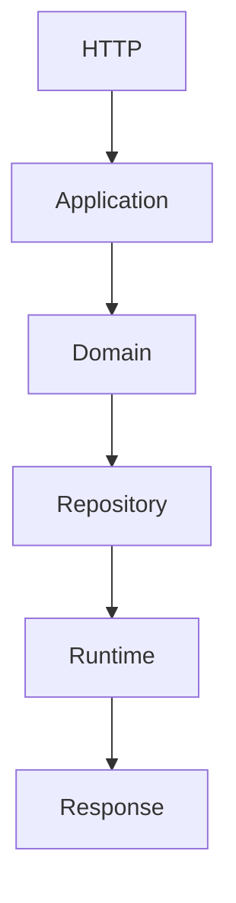
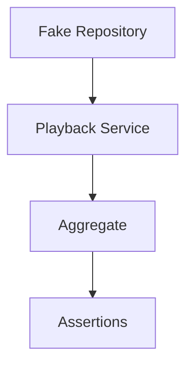

<!--
File: docs/engineering/guides/meg-004-hexagonal-architecture/12-testing-the-hexagon.md
Document: MEG-004
Status: Draft
-->

# Testing the Hexagon

> *The greatest proof that a Hexagonal Architecture is correct is that the business can be tested without any infrastructure.*

---

# Purpose

One of the primary motivations behind Hexagonal Architecture is testability. A correctly implemented Hexagon allows the Domain and Application layers to be exercised without requiring PostgreSQL, DuckDB, HTTP, Blob Storage, Docker, an Event Bus or External APIs. Testing should become a natural consequence of the architecture rather than an afterthought, and this document defines how each architectural layer within Mosaic should be tested.

---

# Philosophy

Within Mosaic:

> **Test business behaviour independently of technology.**

Every architectural boundary exists for two reasons: replaceability and testability. If the Domain requires infrastructure to execute, the boundary has failed.

---

# Testing Strategy

Every layer should be tested independently.



Each layer answers different questions, and no layer replaces another.

---

# The Testing Pyramid

Hexagonal Architecture naturally supports the following pyramid.

```text
          End-to-End

        Integration Tests

     Adapter Contract Tests

   Application Service Tests

       Domain Tests
```

The majority of tests should exist at the Domain level, because business logic should receive the highest testing investment. This isolation is one of the primary benefits of the Ports and Adapters pattern. [AWS Documentation](https://docs.aws.amazon.com/prescriptive-guidance/latest/cloud-design-patterns/hexagonal-architecture.html)

---

# Domain Tests

Domain tests verify business rules, Aggregate behaviour, Value Objects, Domain Services, Domain Events and invariants. They must not require databases, HTTP, event buses, runtime or filesystem — calling `Advance()` on the Playback Aggregate and asserting that `PlaybackCompleted` was raised should execute entirely in memory.

---

# Application Service Tests

Application Services coordinate use cases, so their tests should verify that the Aggregate was loaded, Domain behaviour invoked, the Aggregate persisted and Domain Events collected. They should use fake repositories, fake clocks and fake identity generators; infrastructure remains unnecessary.

---

# Adapter Tests

Adapters should be tested independently. Typical Adapter tests verify request mapping, response mapping, SQL generation, JSON serialisation, API integration and error translation. Business rules should not appear inside Adapter tests, because the Adapter's responsibility is translation and nothing more.

---

# Contract Tests

Every Adapter implements a Port, and contract tests verify that every Adapter behind a Port exhibits the same behaviour:



Each implementation should satisfy the same behavioural contract, which ensures infrastructure remains safely replaceable.

---

# Infrastructure Tests

Infrastructure should be tested using real infrastructure such as PostgreSQL, DuckDB, Blob Storage, Redis and HTTP APIs. These tests verify configuration, connectivity, persistence and protocol correctness; they do not verify business behaviour.

---

# Runtime Tests

The Reactive Runtime should be tested separately, covering worker execution, retries, scheduling, backpressure, graceful shutdown and event delivery. Runtime tests should not re-test business rules, since business correctness belongs to Domain tests.

---

# End-to-End Tests

End-to-end tests verify complete workflows.



These tests provide confidence that architectural boundaries collaborate correctly, and should remain focused upon important user journeys.

---

# Fake Adapters

The preferred testing strategy is replacing infrastructure with fake Adapters: an InMemoryRepository behind the PlaybackRepository Port, a FixedClock behind the Clock, a FakeMetadataProvider behind the MetadataProvider. The Domain remains unaware and business behaviour remains unchanged.

---

# Test Composition Root

Tests frequently construct a miniature Composition Root.



This mirrors production assembly; only the Adapter implementations differ.

---

# Domain Isolation

A useful architectural test is:

> **Can the Domain execute with every infrastructure dependency replaced by a fake?**

If the answer is no, technology has leaked into the Domain and the architecture should be reconsidered.

---

# Adapter Isolation

Likewise, Adapters should be testable independently of business behaviour: mapping a TMDB Response through the Metadata Adapter into a Metadata Value Object should require no Aggregate behaviour.

---

# Error Testing

Errors should be tested at the correct layer — an *Invalid Business Rule* in the Domain, an *HTTP Timeout* in the Adapter, *Retry Exhausted* in the Runtime. Every layer owns its own failure semantics.

---

# Mutation Safety

Domain tests should verify that invariants cannot be violated; a progress value greater than duration, for example, must be rejected. Testing invalid business state is often more valuable than testing successful behaviour.

---

# Event Testing

Domain tests verify that `PlaybackCompleted` was raised, while Runtime tests verify that `PlaybackCompleted` was delivered. These are different concerns and should remain independently testable.

---

# Mocking

Within Mosaic, prefer fake repositories, in-memory implementations and deterministic adapters, and avoid excessive mocking frameworks. Hexagonal Architecture naturally reduces the need for complex mocks because Ports already provide clean substitution points. [AWS Documentation](https://docs.aws.amazon.com/prescriptive-guidance/latest/cloud-design-patterns/hexagonal-architecture.html)

---

# Test Data

Business test data should use business terminology. Names such as `Library`, `Playback` and `Collection` are good; `Row1`, `ObjectA` and `DTO2` are poor. The ubiquitous language should remain consistent inside tests, because tests are executable documentation.

---

# Architecture Verification

A useful question is:

> **Can I delete every Adapter and still execute the Domain?**

If yes, the Hexagon has been preserved. If no, infrastructure has become coupled to business behaviour.

---

# Anti-Patterns

The following practices are prohibited.

- Domain Tests Using Databases
- HTTP Required For Business Tests
- Runtime Required For Aggregate Tests
- SQL Assertions Inside Domain Tests
- Infrastructure Models Inside Domain Tests
- Business Logic Inside Adapter Tests

---

# Mosaic Guidelines

Within Mosaic:

- Domain tests must remain infrastructure independent.
- Application Services should use fake Ports.
- Adapters should be tested independently.
- Contract tests should verify Port implementations.
- Runtime should be tested separately from business logic.
- End-to-end tests should validate complete workflows.
- Fake Adapters should be preferred over complex mocks.
- Every architectural layer should own its own tests.

---

# Relationship to MEG

Hexagonal Architecture exists partly to make testing a natural property of the design. The previous chapters explained dependency direction, Ports, Adapters and Composition; this chapter demonstrates the practical result, which is that good architecture naturally produces good tests. The next chapter provides practical modelling guidance for engineers implementing Hexagonal Architecture throughout the Mosaic platform.

---

# Summary

Testing is one of the strongest indicators of architectural quality. Within Mosaic the Domain should run without infrastructure, Application Services should coordinate without technology, Adapters should be independently replaceable and the Runtime should be independently verifiable. When every layer can be tested in isolation, the architecture has successfully separated business from technology — the real promise of Hexagonal Architecture.
