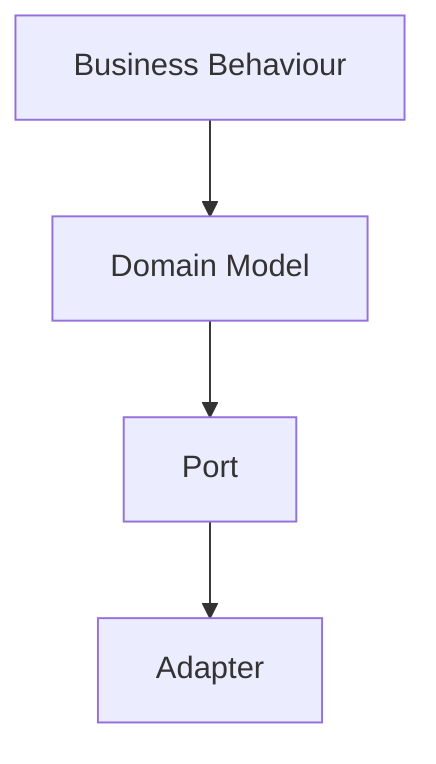
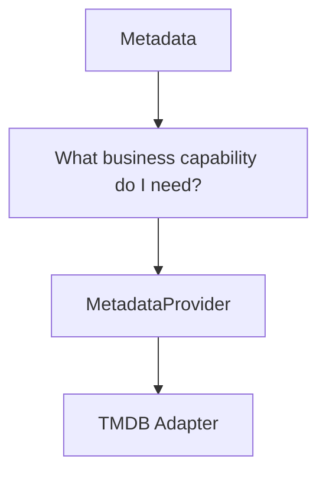
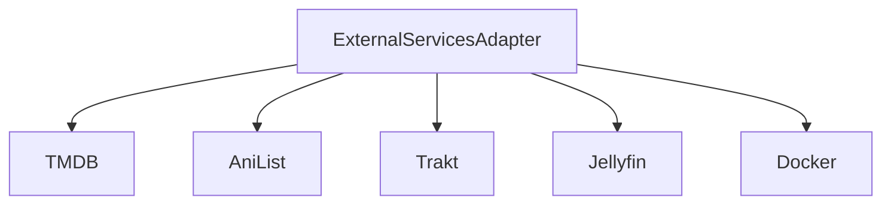

<!--
File: docs/engineering/guides/meg-004-hexagonal-architecture/13-modelling-guidelines.md
Document: MEG-004
Status: Draft
-->

# Modelling Guidelines

> *Every architectural decision should strengthen the boundary between the business and the outside world.*

---

# Purpose

The previous chapters introduced the structural building blocks of Hexagonal Architecture: Ports, Adapters, Dependency Direction, the Composition Root, Application Services and Runtime Boundaries. This document brings those concepts together into practical guidance for engineers implementing new capabilities within the Mosaic platform, and its purpose is to answer one question.

> **"Where should this code actually live?"**

---

# Philosophy

Within Mosaic:

> **Model the business first. Connect it to technology afterwards.**

When designing a new capability:

1. Discover the business.
2. Model the Domain.
3. Define the Ports.
4. Implement the Adapters.
5. Assemble everything in the Composition Root.

Never reverse this order.

---

# Start With The Domain

Every feature should begin inside the Domain by asking what business capability exists, which Aggregate owns it, which business rules apply and which Domain Events occur. Do **not** begin with the database schema, HTTP endpoints, REST APIs or runtime events. Technology follows the Domain, never the reverse.

---

# Define Ports Last

One of the most common mistakes is designing Ports before understanding the Domain. Instead, work outward from behaviour:



Ports should emerge naturally from business requirements, not from hypothetical infrastructure.

---

# One Dependency Rule

Whenever adding a dependency, ask:

> **Does this dependency point towards the Domain?**

If yes, proceed; if no, the dependency probably belongs elsewhere. Dependency direction should answer more architectural questions than folder structure.

---

# Business Before Infrastructure

Suppose a new feature requires TMDB. Starting from the TMDB API and asking "how do I use it?" is the wrong thought process. Start instead from the business capability:



The business requirement comes first and the infrastructure follows.

---

# Port Selection

Before introducing a Port, ask whether the Domain genuinely depends upon this capability, whether it is a business requirement, and whether another Port can already satisfy the behaviour. Avoid creating Ports because "we might need another implementation later" — Ports exist because the Domain requires stable contracts, not for speculative flexibility. AWS recommends introducing ports where the business genuinely requires external interaction, rather than creating unnecessary abstraction layers. [AWS Documentation](https://docs.aws.amazon.com/prescriptive-guidance/latest/hexagonal-architectures/best-practices.html)

---

# Adapter Selection

Every Adapter should answer one question — **which technology am I isolating?** — with an answer as concrete as PostgreSQL, TMDB, Filesystem or HTTP. If an Adapter cannot answer that question clearly, its responsibility should be reconsidered.

---

# One Adapter, One Concern

Adapters should remain cohesive. A TMDB Adapter is good; an `ExternalServicesAdapter` spanning several unrelated technologies is poor:



Technology boundaries should remain explicit.

---

# Keep The Domain Pure

SQL, HTTP, JSON, Docker, Runtime, Logging, environment variables and framework annotations should never appear inside the Domain. If these concepts appear, the boundary has already been crossed.

---

# Keep Application Services Thin

Application Services should follow the same structure described in [Application Services](10-application-services.md): receive request, load Aggregate, invoke behaviour, persist Aggregate, return result. If additional business logic appears, move it into the Aggregate, an Entity, a Value Object or a Domain Service. Application Services coordinate; they do not decide.

---

# Translate At The Boundary

Every translation should occur at a boundary: JSON becomes a Request DTO and then a Business Request, an Aggregate becomes a Database Row, a TMDB Response becomes Metadata. Translation should never occur inside the Domain.

---

# Prefer Explicit Mapping

Avoid magical mapping libraries where they obscure intent. Good:

```go
Metadata{
    Title: response.Title,
    Year:  response.Year,
}
```

Poor:

```go
mapper.Map(...)
```

Explicit mapping is usually easier to debug, review and evolve, and clarity is generally more valuable than reducing a few lines of code.

---

# Infrastructure Should Be Replaceable

Ask:

> **Could I replace this technology without modifying the Domain?**

Swapping PostgreSQL for CockroachDB, TMDB for AniList, or REST for GraphQL should each be possible without touching business behaviour. If the answer is "no", technology has probably leaked through the boundary.

---

# Design For Testing

A useful architectural question is:

> **Can I test this without infrastructure?**

If the answer is yes, the boundary is probably correct. If it is no, determine which dependency has entered the wrong layer.

---

# Runtime Is Infrastructure

One subtle guideline deserves repeating: the Reactive Runtime belongs outside the Hexagon. The Domain should never know about workers, retries, scheduling, queues or event buses. Those concepts remain infrastructure, and business behaviour remains pure.

---

# Folder Structure Follows Architecture

Packages should reflect architectural ownership.

```text
internal/
    domain/
    application/
    adapters/
        http/
        postgres/
        tmdb/
        runtime/
    bootstrap/
```

The folder structure should communicate dependency direction, ownership and boundaries, and should never encourage architectural violations. A clear separation between domain, entry points and adapters is a common recommendation for Ports and Adapters implementations. [AWS Documentation](https://docs.aws.amazon.com/prescriptive-guidance/latest/hexagonal-architectures/best-practices.html)

---

# Refactor Towards The Hexagon

Existing code rarely starts perfectly. When refactoring, ask whether this dependency can move outward, whether this behaviour can move inward, whether this translation can occur at the boundary, whether this Port can become smaller and whether this Adapter can become simpler. The Hexagon should become more explicit over time, not less.

---

# Architecture Checklist

Before merging a new capability confirm:

- [ ] Business behaviour lives in the Domain.
- [ ] Dependencies point inward.
- [ ] Ports describe business capabilities.
- [ ] Adapters isolate technology.
- [ ] Application Services remain thin.
- [ ] Runtime concerns remain outside the Domain.
- [ ] Infrastructure remains replaceable.
- [ ] Tests can execute without infrastructure.
- [ ] The Composition Root assembles all concrete implementations.

---

# Common Modelling Mistakes

Avoid designing around frameworks, exposing infrastructure through Ports, placing business rules in Adapters, generic "manager" classes, large Ports, large Adapters and Domain imports of infrastructure packages. Most architectural problems begin as small convenience decisions.

---

# Mosaic Guidelines

Within Mosaic:

- The Domain must be designed before infrastructure.
- Ports should emerge naturally from business requirements.
- Adapters must isolate technology.
- Translation must occur at architectural boundaries.
- Application Services should remain orchestration only.
- Runtime concerns must remain outside the Domain.
- Infrastructure must remain replaceable.
- Architectural simplicity should always outweigh unnecessary abstraction.

---

# Relationship to MEG

This chapter completes the practical implementation guidance of MEG-004. The remaining documents describe architectural reasoning (ADRs), contributor expectations, terminology and references. Together, [MEG-001](../meg-001-go-engineering-standards/index.md) through MEG-004 now define how software is written, how it executes, how the business is modelled, and how technology is prevented from corrupting that model.

---

# Summary

Hexagonal Architecture is ultimately about one idea.

> **Protect the business from technology.**

Every Port, every Adapter, every dependency, every package and every layer should reinforce that principle. When it is implemented consistently, changing technologies becomes routine while changing the business remains deliberate. That is the architectural foundation upon which the rest of the Mosaic platform is built.
