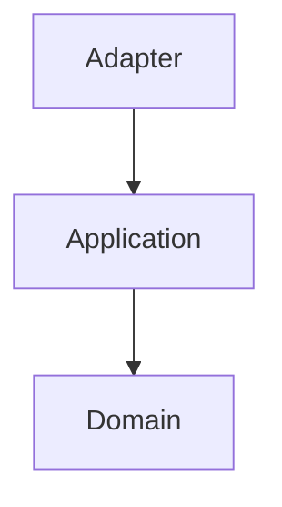
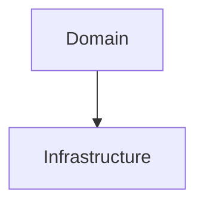
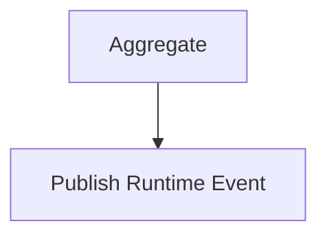
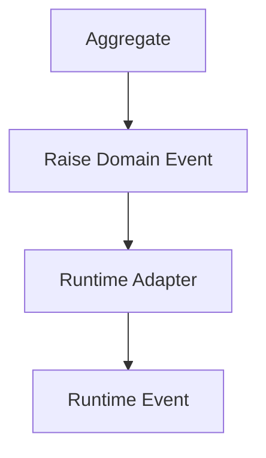
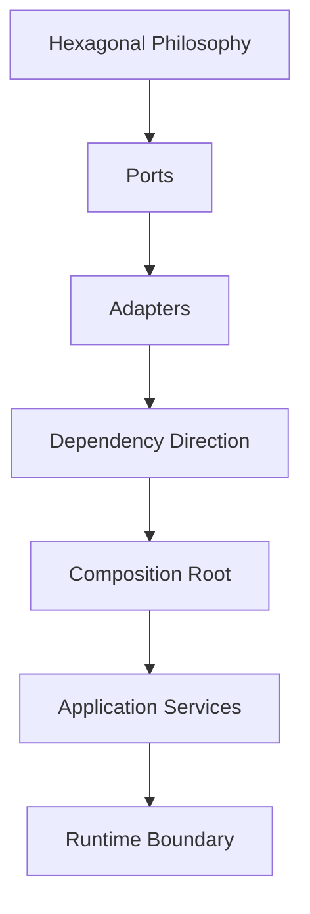

<!--
File: docs/engineering/guides/meg-004-hexagonal-architecture/15-contributor-guidance.md
Document: MEG-004
Status: Draft
-->

# Contributor Guidance

> *Every contribution either strengthens or weakens the architectural boundary. There is no neutral change.*

---

# Purpose

The Hexagonal Architecture protects the most valuable part of the Mosaic platform:

> **The Domain Model.**

Every contributor therefore shares responsibility for preserving dependency direction, technology independence, architectural boundaries and replaceable infrastructure. This document provides practical guidance for engineers implementing new capabilities within the Hexagonal Architecture.

---

# Philosophy

Within Mosaic:

> **Protect the Domain before adding infrastructure.**

Business behaviour should remain stable and infrastructure should remain replaceable. Whenever those two goals conflict, the Domain wins — always.

---

# Before Writing Code

Before implementing a new feature, ask which Bounded Context owns this, which Aggregate owns the behaviour, whether the Domain already models this concept, and whether infrastructure is influencing the design.

If implementation discussions begin before business modelling, return to [MEG-003](../meg-003-domain-driven-design/index.md). The Domain should always lead implementation.

---

# Before Creating A Port

Ask whether the Domain genuinely requires this capability, whether it describes business behaviour, and whether an existing Port could already satisfy the requirement.

Avoid introducing Ports simply because:

> "We might need another implementation."

Ports should emerge from business requirements, not speculation.

---

# Before Creating An Adapter

Ask which technology you are isolating, whether the Adapter performs translation, and whether any business behaviour has appeared in it.

If the Adapter contains business rules, the architecture has already begun drifting: business behaviour belongs inside the Domain.

---

# Before Adding A Dependency

Ask one question.

> **Does this dependency point inward?**

If it does, proceed. If it does not, reconsider the design. Dependency direction is one of the strongest architectural indicators available.

---

# Before Importing A Package

Every import should reinforce the Hexagon. Allowed.

Prohibited.

The compiler should naturally reinforce the architecture, and imports should tell the same architectural story as the documentation.

---

# Before Adding Infrastructure

Ask whether the Domain already exposes a Port, whether infrastructure should implement that Port, and whether the Domain actually requires this capability.

Infrastructure should adapt itself to existing Ports whenever practical. Avoid changing the Domain solely because a new technology has been introduced.

---

# Before Modifying A Port

Ports are long-lived contracts, and changing one affects the Domain, every Adapter, every test and every module.

Before modifying a Port, ask whether the business is changing or only the infrastructure. If only infrastructure changes, the Port probably should not.

---

# Before Modifying An Adapter

Adapters should evolve freely — SQL optimisation, API version upgrades, SDK replacement and protocol changes are all expected. These changes should rarely affect the Domain, and if they do, review the architectural boundary.

---

# Before Creating An Application Service

Application Services should coordinate, not decide. Ask whether you are loading an Aggregate, invoking business behaviour or persisting changes.

If additional business logic appears, move it into an Aggregate, Entity, Value Object or Domain Service. The Application layer should remain intentionally thin.

---

# Before Introducing Runtime Behaviour

The Reactive Runtime is infrastructure, so ask whether the Domain needs to know something or whether an Adapter should translate it. Poor.

Preferred.

[MEG-002](../meg-002-event-driven-runtime/index.md) and MEG-004 should reinforce one another, never compete.

---

# Before Merging

Every architectural contribution should satisfy the following checklist.

## Domain

- Business behaviour remains inside the Domain.
- No infrastructure packages imported.
- Ubiquitous Language remains consistent.

## Ports

- Ports describe business capabilities.
- Ports remain technology independent.
- Ports remain focused.

## Adapters

- Technology isolated.
- Translation only.
- No business rules.

## Dependencies

- Dependencies point inward.
- No circular imports.
- Infrastructure remains replaceable.

## Runtime

- Runtime remains outside the Domain.
- Domain Events remain infrastructure independent.
- Runtime integration occurs through Adapters.

## Documentation

- MEG updated if required.
- ADR created where appropriate.
- Diagrams remain accurate.
- Examples remain consistent.

Architecture documentation should evolve alongside implementation.

---

# Recognising Architectural Drift

The following symptoms usually indicate the Hexagon is weakening.

- SQL inside the Domain.
- HTTP types crossing Port boundaries.
- Runtime APIs imported by Aggregates.
- Growing Application Services.
- Business logic inside Adapters.
- Infrastructure exceptions leaking into the Domain.

Correct architectural drift early, because small violations accumulate quickly.

---

# Refactoring Towards The Hexagon

When improving existing code, ask whether this dependency can move outward, whether this translation can move into an Adapter, whether this business rule can move into an Aggregate, whether this Port can become smaller, and whether this technology can disappear behind a Port. Refactoring should make boundaries more explicit, not blur them.

---

# Review Mindset

Architecture reviews should ask whether a change strengthens dependency direction, improves replaceability and reduces coupling, whether the Domain remains pure, and whether replacing the technology involved would require Domain changes. These questions are generally more valuable than debating implementation style.

---

# Learning The Architecture

New contributors should study MEG-004 in the following order.

Understanding dependency direction first makes every later concept significantly easier to understand.

---

# Engineering Culture

Contributors should strive to simplify dependencies, reduce coupling, improve naming, remove technology leakage, preserve Domain purity and question unnecessary abstraction. The architecture should become more obvious over time, not more clever.

---

# Contributor Checklist

Before requesting review, confirm:

- [ ] The Domain remains technology independent.
- [ ] Dependencies point inward.
- [ ] Ports describe business capabilities.
- [ ] Adapters isolate technology.
- [ ] Application Services remain orchestration only.
- [ ] Runtime concerns remain outside the Domain.
- [ ] Infrastructure remains replaceable.
- [ ] Documentation has been updated.
- [ ] The architecture is simpler or clearer than before.

---

# Relationship to MEG

This document explains how contributors should evolve the Hexagonal Architecture established throughout MEG-004. Where the previous chapters define **how the architecture should be structured**, this chapter defines **how engineers should preserve that structure over time.**

Architecture survives not because diagrams exist, but because contributors consistently reinforce its principles.

---

# Summary

Hexagonal Architecture is not maintained through frameworks; it is maintained through engineering discipline. Every contributor influences whether the Domain remains independent, testable, replaceable and understandable.

Within Mosaic, every change should strengthen the architectural boundary between the business and technology, because once that boundary begins to erode, the cost of every future change begins to increase with it.
