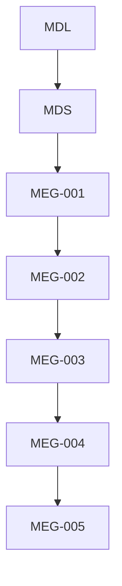
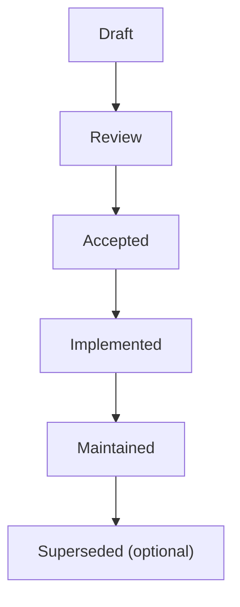

<!--
File: docs/engineering/guides/meg-005-runtime-architecture/00-document-control.md
Document: MEG-005
Status: Draft
-->

# Document Control

---

# Document Information

| Field | Value |
|---------|--------|
| Document ID | MEG-005 |
| Title | Runtime Architecture |
| File | 00-document-control.md |
| Status | Draft |
| Owner | AdamNi-7080 |
| Classification | Internal Architecture Specification |

---

# Purpose

This document establishes the governance, authority and lifecycle of the Mosaic Runtime Architecture specification. MEG-005 defines the internal architecture of the Mosaic Runtime, and unlike [MEG-002](../meg-002-event-driven-runtime/index.md), which defines **runtime behaviour**, this specification defines the **components, responsibilities and relationships** that make the runtime possible. It records the Supervisor Build Pipeline as an isolated runtime composition and activation flow.

It answers:

> **What is the Runtime made of?**

Not:

> **How does the Runtime behave?**

---

# Authority

MEG-005 is the authoritative specification governing the internal architecture of the Mosaic Runtime, and every runtime component should conform to the structural principles defined within it. This specification applies to:

- Mosaic Platform
- Runtime Kernel
- Capability Registry
- Execution Engine
- Scheduler
- Supervisor
- Worker Manager
- Resource Management
- Runtime Bootstrap

---

# Relationship to Other Specifications

MEG specifications intentionally build upon one another. Each assumes the vocabulary established by those before it, so the set reads as a stack rather than as independent documents.

Each occupies a distinct layer of that stack: **[MEG-001](../meg-001-go-engineering-standards/index.md)** defines engineering, **[MEG-002](../meg-002-event-driven-runtime/index.md)** defines runtime behaviour, **[MEG-003](../meg-003-domain-driven-design/index.md)** defines business modelling and **[MEG-004](../meg-004-hexagonal-architecture/index.md)** defines dependency boundaries, whereas **MEG-005** defines runtime structure. Together they describe both **how** the platform behaves and **how** it is constructed.

---

# Normative Language

Unless explicitly stated otherwise, the following keywords are interpreted according to RFC 2119.

| Keyword | Meaning |
|----------|---------|
| **MUST** | Mandatory requirement. |
| **MUST NOT** | Prohibited behaviour. |
| **SHOULD** | Strong recommendation. Deviation requires architectural justification. |
| **SHOULD NOT** | Discouraged except where clearly justified. |
| **MAY** | Optional behaviour based upon engineering judgement. |

Examples and diagrams are informative unless explicitly identified as normative.

---

# Runtime Principles

The Mosaic Runtime is built upon several foundational principles. Every subsequent chapter expands one or more of them.

- The Runtime owns execution.
- Capabilities own business behaviour.
- Every runtime component owns one responsibility.
- Resources have explicit ownership.
- Lifecycle is deterministic.
- Dependencies remain explicit.
- Components communicate through contracts.
- Runtime services remain independently replaceable.

---

# Document Lifecycle

MEG specifications evolve alongside the platform, and each document progresses through the following lifecycle.

Accepted specifications become part of the canonical Mosaic architecture, and historical revisions should remain available for future reference so that the reasoning behind superseded decisions is not lost.

---

# Runtime Evolution

The Runtime is expected to evolve, but structural changes should remain deliberate rather than accumulating by accident. Changes affecting:

- Runtime Kernel
- Capability Registry
- Execution Engine
- Scheduler
- Resource ownership
- Service lifecycle
- Startup sequence

should be accompanied by an Architectural Decision Record (ADR), because runtime architecture should evolve through intentional engineering rather than incremental drift.

---

# Compliance

All runtime repositories should comply with MEG-005. Where deviation becomes necessary, repositories should document:

- architectural reason
- affected components
- migration strategy
- expected impact

Temporary deviations should eventually be removed, whereas permanent deviations should generally result in updates to this specification rather than remaining as undocumented divergence.

---

# Design Philosophy

MEG-005 intentionally favours modularity, explicit ownership, deterministic lifecycle, replaceable components, operational simplicity and clear dependency direction. The Runtime should therefore resemble a small operating system in which each component owns exactly one responsibility, so that complex behaviour emerges from cooperation between small runtime services rather than from one large coordinating component. This reflects well-established operating system design principles in which the kernel provides foundational execution, scheduling and resource management while higher-level services remain modular and independently evolvable.  [Operating Systems](https://operatingsystemsauthority.com/operating-system-kernel)

---

# Scope of Authority

MEG-005 governs runtime architecture. It does **not** define business domains, domain behaviour, runtime semantics, storage implementation or module SDKs, because those concerns belong to [MEG-002](../meg-002-event-driven-runtime/index.md), [MEG-003](../meg-003-domain-driven-design/index.md), [MEG-004](../meg-004-hexagonal-architecture/index.md) and future MEG specifications. Maintaining this separation keeps structural concerns independent from behavioural concerns.
