<!--
File: docs/engineering/guides/meg-005-runtime-architecture/01-runtime-philosophy.md
Document: MEG-005
Status: Draft
Version: 0.4
-->

# Runtime Philosophy

> *The Runtime exists to provide an execution environment for capabilities. It should feel less like an application and more like an operating system.*

---

# Purpose

The Mosaic Runtime is frequently described as an event-driven runtime.

While true, this description is incomplete.

The Runtime is responsible for significantly more than event delivery.

It provides:

- execution
- lifecycle
- scheduling
- dependency composition
- capability discovery
- resource ownership
- observability
- fault isolation

Understanding the Runtime therefore requires a different mental model.

The Runtime should be viewed as the operating system of the Mosaic platform.

Capabilities become the applications running upon it.

---

# Philosophy

Within Mosaic:

> **The Runtime owns execution. Capabilities own behaviour.**

This separation is fundamental.

The Runtime should never understand:

- playback
- metadata
- collections
- recommendations
- libraries

Capabilities should never understand:

- workers
- queues
- schedulers
- retries
- dependency graphs

Each layer owns one concern.

---

# The Runtime Is Not The Platform

An important distinction exists.

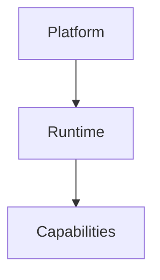

The Runtime enables the platform.

It is not the platform itself.

Users install Mosaic because of:

- Playback
- Library
- Metadata
- Modules

Not because:

- Worker Manager exists
- Scheduler exists
- Event Bus exists

The Runtime exists to make capabilities possible.

Nothing more.

---

# The Runtime As An Operating System

The closest architectural analogy is a modern operating system.

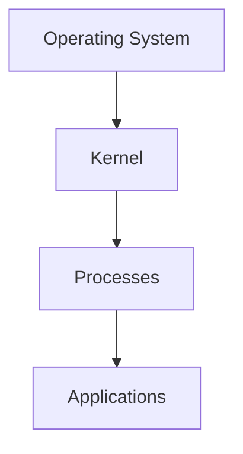

Within Mosaic.

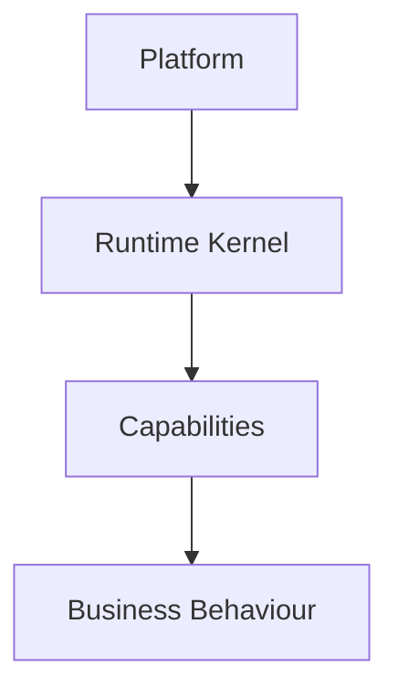

Capabilities should not concern themselves with:

- process scheduling
- resource allocation
- startup
- shutdown

Similarly:

Mosaic capabilities should not concern themselves with:

- worker allocation
- retries
- dependency resolution
- scheduling

The Runtime owns these responsibilities.

Modern operating systems separate resource management from application logic, allowing applications to focus on their own behaviour while the kernel manages execution, scheduling and resources.  [Operating Systems](https://operatingsystemsauthority.com/operating-system-kernel)

---

# Runtime Responsibilities

The Runtime owns platform-wide concerns.

These include:

- capability discovery
- dependency composition
- worker allocation
- scheduler execution
- lifecycle management
- health monitoring
- observability
- graceful shutdown

It intentionally does **not** own:

- media management
- metadata
- playback
- collections
- recommendations

Business belongs elsewhere.

---

# Capabilities

Capabilities are analogous to applications.

Each capability:

- owns business behaviour
- owns business state
- owns domain events

The Runtime provides:

- execution
- coordination
- services

Capabilities consume Runtime services.

The Runtime never consumes business behaviour.

---

# Runtime Kernel

At the centre of the Runtime sits the Runtime Kernel.

Conceptually.

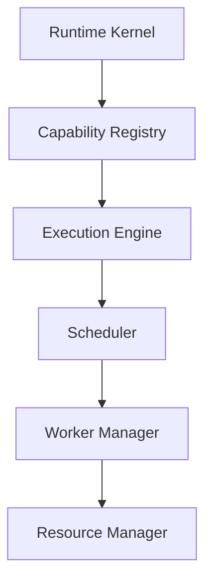

Every other Runtime component builds upon this foundation.

Future chapters define each component individually.

---

# Runtime Services

The Runtime exposes platform services.

Examples include:

```

Scheduler
```

```

Worker Manager
```

```

Resource Manager
```

```

Capability Registry
```

These services exist solely to support capability execution.

They should remain:

- generic
- reusable
- business agnostic

---

# Runtime Is Domain Agnostic

The Runtime should never understand business terminology.

Poor.

```

Playback Queue
```

Preferred.

```

Task Queue
```

Poor.

```

Metadata Worker
```

Preferred.

```

Worker
```

Capabilities provide meaning.

The Runtime provides execution.

This distinction should remain visible throughout the architecture.

---

# Runtime State

The Runtime owns operational state.

Examples include:

- active workers
- queue depth
- scheduler state
- loaded capabilities
- resource usage

It does **not** own:

- playback progress
- metadata
- collections
- user preferences

Operational state belongs to the Runtime.

Business state belongs to capabilities.

---

# Runtime Lifecycle

The Runtime itself follows a lifecycle.

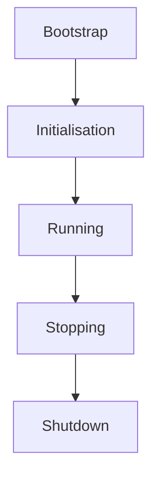

Capabilities participate in this lifecycle.

They do not control it.

Lifecycle ownership belongs to the Runtime.

---

# Runtime Contracts

Capabilities interact with the Runtime through well-defined contracts.

Examples include:

- lifecycle notifications
- scheduling requests
- runtime services
- capability registration

Capabilities should never communicate with Runtime internals directly.

Contracts preserve long-term stability.

---

# Runtime Independence

The Runtime should evolve independently from capabilities.

Suppose:

```

Scheduler Rewritten
```

Capabilities should remain unchanged.

Likewise.

```

Worker Manager Optimised
```

Business behaviour should remain identical.

This separation allows operational improvements without affecting domain correctness.

---

# Runtime Simplicity

Despite its responsibilities, the Runtime should remain conceptually simple.

It should answer only questions such as:

- What should execute?
- When should it execute?
- Which resources are available?
- Which capabilities are loaded?

It should never answer:

- Should playback resume?
- Should metadata refresh?
- Should recommendations update?

Those are business questions.

---

# Fault Isolation

Failures should remain isolated.

Example.

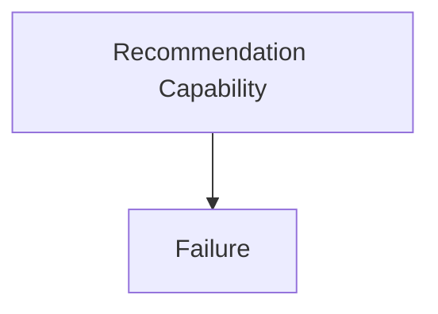

The Runtime should ensure:

- Playback continues.
- Metadata continues.
- Library continues.

The Runtime protects the platform from individual capability failures.

Capabilities should never destabilise one another.

---

# Progressive Growth

The Runtime should support growth without architectural change.

Initially.

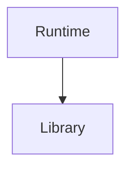

Later.

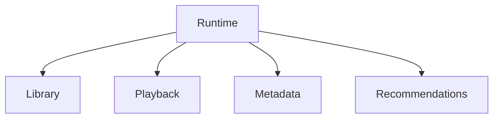

Later still.

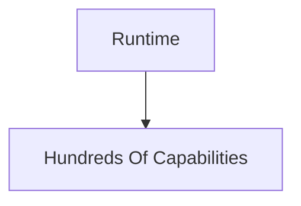

The Runtime should scale through composition.

Not increasing complexity.

---

# Runtime Does Not Become The Business

Perhaps the greatest long-term risk is allowing business behaviour to migrate into the Runtime.

Poor.

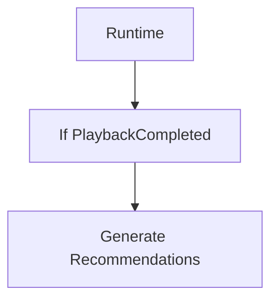

Preferred.

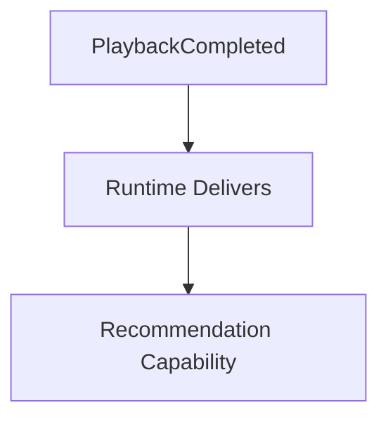

The Runtime coordinates.

Capabilities decide.

This boundary should never blur.

---

# Mosaic Principles

Within Mosaic:

- The Runtime owns execution.
- Capabilities own behaviour.
- The Runtime remains business agnostic.
- Operational state remains separate from business state.
- Capabilities consume Runtime services.
- The Runtime protects capability isolation.
- The Runtime evolves independently of business capabilities.
- Complexity should emerge through composition rather than centralisation.

These principles define the architectural identity of the Mosaic Runtime.

---

# Relationship to MEG

[MEG-002](../meg-002-event-driven-runtime/index.md) defined:

> **How the Runtime behaves.**

MEG-005 now begins defining:

> **What the Runtime actually is.**

The remaining chapters describe each Runtime subsystem individually, beginning with the **Runtime Kernel**, the component responsible for coordinating every other Runtime service.

---

# Summary

The Mosaic Runtime should not be viewed as another backend service.

It should be viewed as a lightweight operating system.

Its purpose is remarkably simple.

Provide a stable, observable and resilient execution environment in which independently developed capabilities can execute safely.

The Runtime exists to make business possible.

It should never become the business itself.
