<!--
File: docs/engineering/guides/meg-005-runtime-architecture/02-runtime-kernel.md
Document: MEG-005
Status: Draft
Version: 0.4
-->

# Runtime Kernel

> *The Runtime Kernel owns the platform itself. Every other runtime component exists because the Kernel allows it to.*

---

# Purpose

The Runtime consists of many independent subsystems.

Examples include:

- Capability Registry
- Execution Engine
- Worker Manager
- Scheduler
- Resource Manager
- Lifecycle Manager

Something must own the coordination of these subsystems.

Within Mosaic, that responsibility belongs to the **Runtime Kernel**.

The Runtime Kernel is the architectural centre of the Runtime.

It owns:

- lifecycle
- coordination
- service registration
- dependency graph
- runtime state

It intentionally owns no business behaviour.

---

# Philosophy

Within Mosaic:

> **The Runtime Kernel coordinates runtime services. It never becomes one.**

The Runtime Kernel should remain extremely small.

It should provide only the minimum capabilities required for the Runtime to function.

Everything else becomes a Runtime Service.

This mirrors microkernel operating system design, where the kernel retains only essential responsibilities while higher-level services are implemented separately.  [Operating Systems](https://operatingsystemsauthority.com/operating-system-kernel)

---

# What Is The Runtime Kernel?

The Runtime Kernel is the root object of the Mosaic Runtime.

Conceptually.

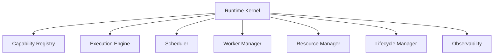

The Kernel owns these components.

Those components do not own one another.

---

# Why A Kernel Exists

Without a Runtime Kernel:

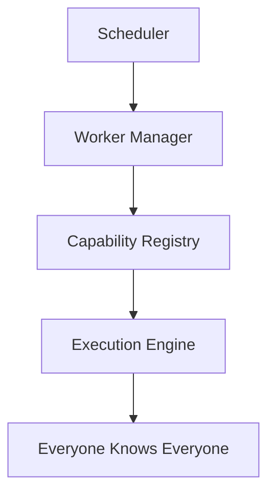

Eventually:

- dependencies become circular
- lifecycle becomes inconsistent
- ownership becomes unclear

Instead.

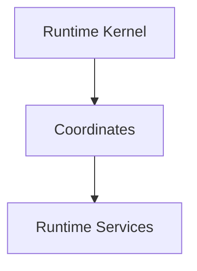

Dependencies remain explicit.

Responsibilities remain isolated.

---

# Kernel Responsibilities

The Runtime Kernel owns:

- runtime bootstrap
- service registration
- lifecycle coordination
- dependency graph construction
- runtime state
- service discovery
- shutdown coordination

The Runtime Kernel intentionally does **not** own:

- scheduling
- worker execution
- event delivery
- business behaviour
- persistence

These belong to dedicated Runtime Services.

---

# Runtime Composition

Every Runtime Service is composed through the Kernel.

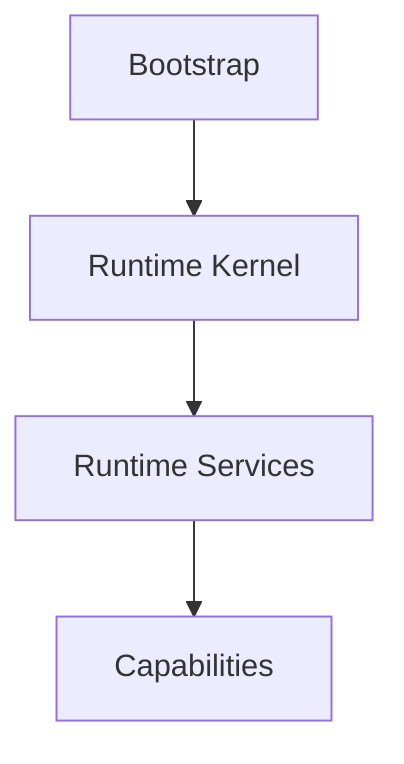

The Kernel becomes the root of the Runtime object graph.

---

# Runtime Registry

The Kernel maintains a registry of Runtime Services.

Conceptually.

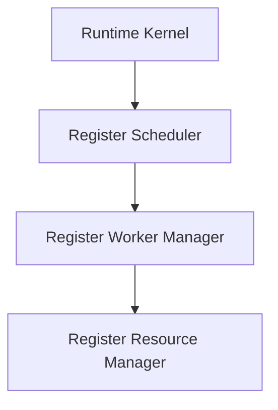

This registry exists solely for Runtime coordination.

It is **not** a Service Locator.

Runtime Services should still receive explicit dependencies through construction.

---

# Lifecycle Ownership

The Runtime Kernel owns lifecycle transitions.

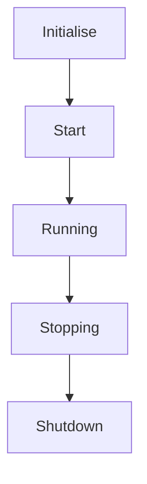

Every Runtime Service participates.

No Runtime Service should transition independently.

Lifecycle ownership remains centralised.

---

# Runtime State

The Kernel owns operational state.

Examples include:

- runtime status
- registered services
- loaded capabilities
- startup progress
- shutdown progress

Business state remains entirely outside the Runtime.

---

# Runtime Contracts

Runtime Services interact with the Kernel through contracts.

Examples include:

```

LifecycleService
```

```

CapabilityRegistry
```

```

ExecutionEngine
```

Services should never depend upon Kernel implementation details.

Only Kernel contracts.

---

# Kernel Simplicity

The Runtime Kernel should remain intentionally small.

A useful question is:

> **Could this responsibility become its own Runtime Service?**

If yes:

It probably should.

The Kernel should coordinate.

Not accumulate functionality.

---

# Runtime Services

The Runtime should resemble:

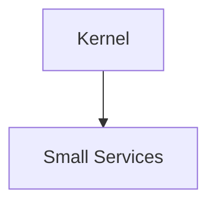

Not:

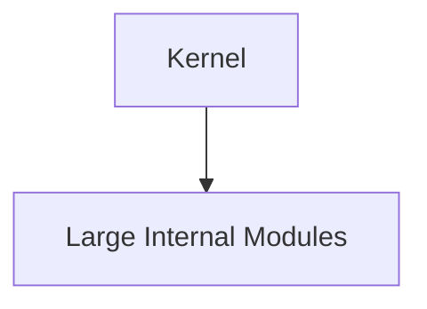

Small Runtime Services provide:

- replaceability
- testability
- isolation
- observability

Large kernels become difficult to evolve.

---

# Capability Independence

Capabilities should never communicate directly with the Kernel.

Instead.

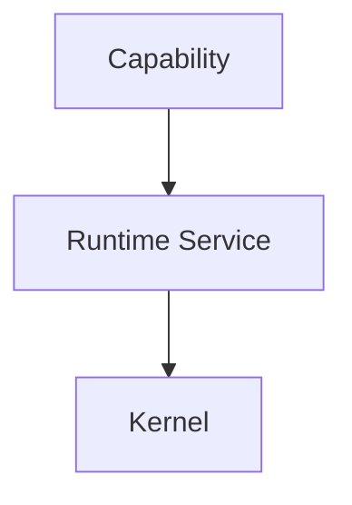

The Kernel remains an internal Runtime concern.

Capabilities should interact only with published Runtime contracts.

---

# Fault Isolation

Suppose:

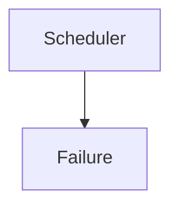

The Runtime Kernel should:

- detect failure
- report failure
- coordinate recovery

The Scheduler should not attempt to restart itself.

Operational coordination belongs to the Kernel.

---

# Service Independence

Runtime Services should remain unaware of one another wherever practical.

Poor.

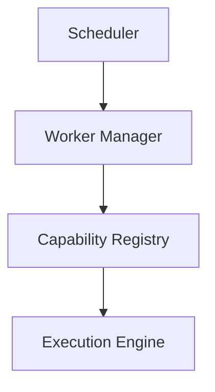

Preferred.

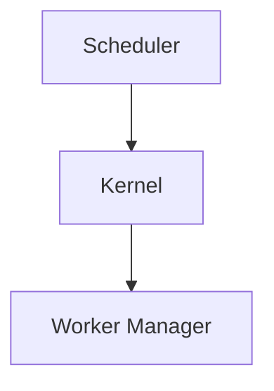

The Kernel coordinates communication.

Runtime Services remain independent.

---

# Runtime Growth

As Mosaic evolves, new Runtime Services should integrate naturally.

Example.

Initially.

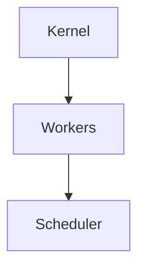

Later.

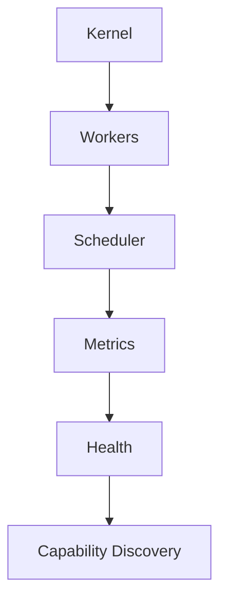

The Kernel should grow through composition.

Not through increasing internal complexity.

---

# Startup

During startup.

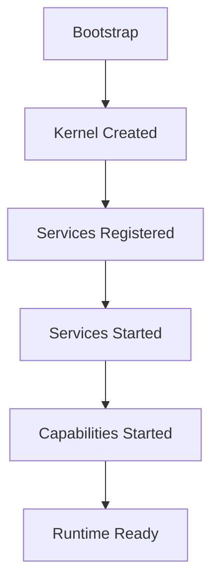

The Kernel owns this sequence.

Startup order should never be implicit.

---

# Shutdown

Likewise.

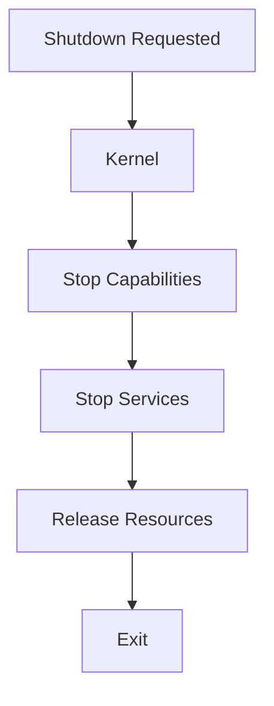

Every Runtime Service follows the same lifecycle.

The Kernel coordinates.

---

# Testing

The Runtime Kernel should be testable independently.

Typical tests verify:

- lifecycle ordering
- service registration
- dependency graph
- startup
- shutdown

Business capabilities should not be required.

The Kernel exists independently of the business.

---

# Anti-Patterns

The following practices are prohibited.

## Business Logic

The Runtime Kernel making business decisions.

---

## Service Locator

Runtime Services requesting arbitrary services dynamically.

---

## Large Kernel

Moving every Runtime feature into the Kernel.

---

## Circular Runtime Services

Runtime Services depending directly upon one another.

---

## Capability Awareness

The Kernel understanding:

- playback
- metadata
- collections

The Kernel coordinates execution.

It never understands the business.

---

# Mosaic Guidelines

Within Mosaic:

- The Runtime Kernel MUST remain small.
- The Runtime Kernel MUST own lifecycle coordination.
- Runtime Services MUST remain independently replaceable.
- The Runtime Kernel MUST NOT contain business behaviour.
- Runtime Services SHOULD communicate through Kernel contracts.
- Startup and shutdown MUST be coordinated by the Kernel.
- Runtime growth SHOULD occur through composition.
- The Runtime Kernel SHOULD resemble a microkernel rather than a monolith.

---

# Relationship to MEG

The Runtime Philosophy established:

> **What the Runtime is.**

The Runtime Kernel establishes:

> **Which component owns the Runtime itself.**

The next chapter introduces the **Capability Registry**, the subsystem responsible for discovering, registering and exposing every capability participating in the Mosaic platform.

---

# Summary

The Runtime Kernel is the smallest yet most important component within the Runtime.

It owns:

- coordination
- lifecycle
- composition

It intentionally avoids owning:

- business
- execution
- scheduling
- persistence

By remaining small, explicit and stable, the Kernel allows the Runtime to continue evolving through independently replaceable services rather than accumulating complexity at its centre.
