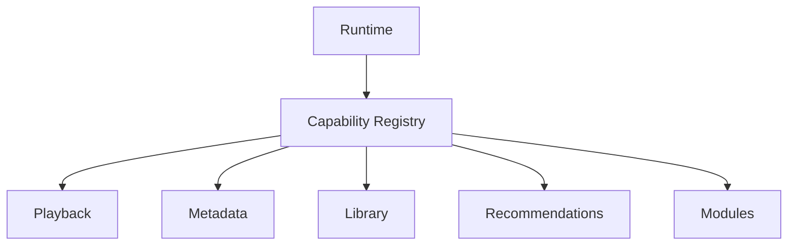
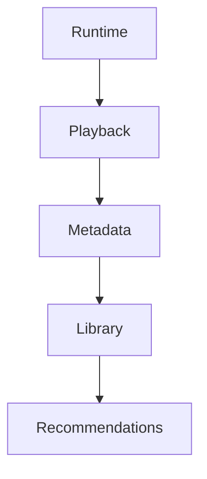
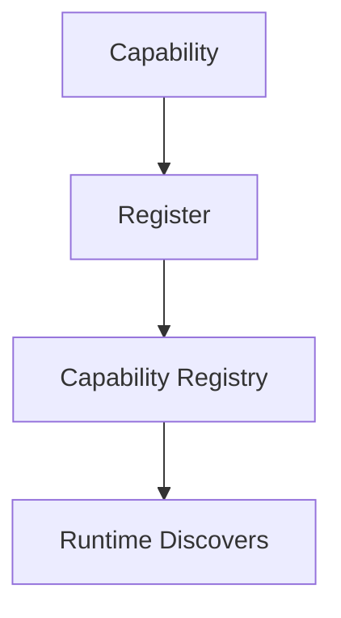
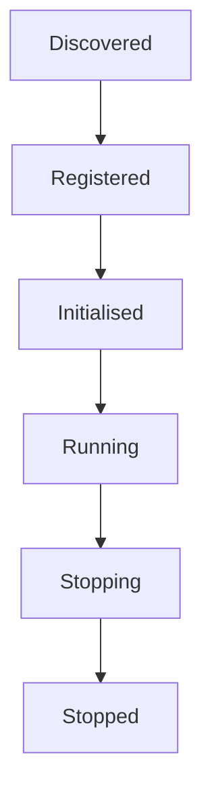
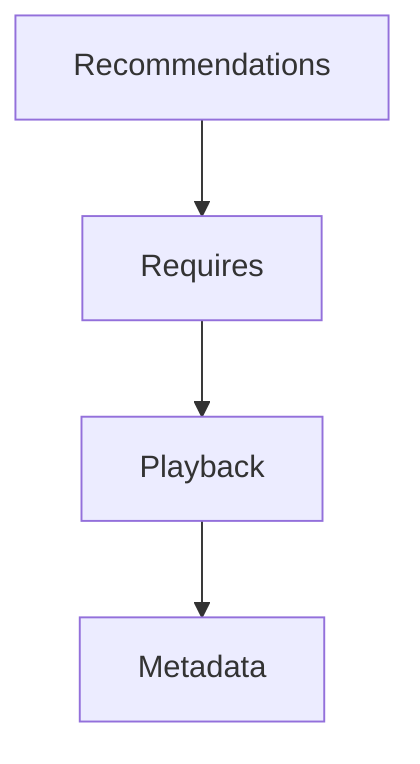
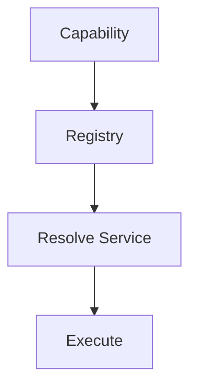

<!--
File: docs/engineering/guides/meg-005-runtime-architecture/03-capability-registry.md
Document: MEG-005
Status: Draft
-->

# Capability Registry

> *The Runtime does not execute features. It executes capabilities. The Capability Registry is the Runtime's source of truth.*

---

# Purpose

The Mosaic Runtime is intentionally modular. A capability may arrive from several directions and may change state at any point in the platform's life, so capabilities may be:

- built into the Platform distribution
- provided by first-party modules
- provided by third-party modules
- enabled
- disabled
- upgraded
- removed

The Runtime therefore requires a mechanism for discovering, identifying and managing every capability available to the platform, and that responsibility belongs to the **Capability Registry**. The Registry provides the Runtime with a single authoritative view of the platform's available capabilities.

---

# Philosophy

Within Mosaic:

> **Capabilities register themselves. The Runtime discovers them.**

The Runtime should never contain hard-coded knowledge such as:

```go
if playbackEnabled {

    ...

}
```

Instead a capability registers itself, the Runtime discovers that registration, and the Runtime integrates the capability on that basis. The Runtime therefore grows through discovery rather than through modification.

---

# What Is A Capability?

Within Mosaic, a capability is a self-contained unit of business functionality, such as Playback, Metadata, Library, Recommendations or Authentication. The division of ownership between a capability and the Runtime is strict. The Runtime owns execution, whereas capabilities own:

- business behaviour
- runtime registration
- lifecycle participation

---

# What Is The Capability Registry?

The Capability Registry is the Runtime's catalogue of available capabilities. Every Runtime service discovers capabilities through the Registry, which means no Runtime component should maintain its own capability list.



---

# Why A Registry Exists

Without a Registry the Runtime reaches for each capability directly, naming Playback, Metadata, Library and Recommendations one by one.



The Runtime then becomes tightly coupled to every capability, so every new capability requires Runtime modification. With a Registry the direction reverses, and the Runtime becomes open for extension while remaining closed for modification.



---

# Runtime Source Of Truth

The Capability Registry is the authoritative source of everything the Runtime knows about a capability. Other Runtime components should query the Registry rather than maintain independent copies of that information. The Registry is authoritative for:

- available capabilities
- capability metadata
- lifecycle state
- dependencies
- health
- version

---

# Registration

Capabilities register during startup: a capability is created, it registers itself with the Capability Registry, and only once every registration has completed is the Runtime ready. Registration should therefore occur before capability execution begins, because capabilities that are not registered do not exist from the Runtime's perspective.

---

# Discovery

Runtime Services discover capabilities through the Registry. The Scheduler asks the Registry which capabilities are scheduled, and Runtime Events reach their subscribers by the same route, because the Registry knows which capabilities subscribe. Discovery should always remain explicit.

---

# Capability Metadata

Every registered capability should expose metadata. The Registry owns that metadata whereas the capability owns its accuracy. The metadata typically includes:

- identifier
- name
- version
- owner
- lifecycle state
- dependencies
- health
- capabilities provided

Modern service registries similarly maintain metadata describing registered services, allowing runtime discovery without hard-coded dependencies.  [microservices.io](https://microservices.io/patterns/service-registry.html)

---

# Capability Identity

Every capability must possess a globally unique identifier, such as `playback`, `metadata` or `library`. Changing one should be considered a breaking architectural change, which is why identifiers should remain:

- stable
- immutable
- human readable

---

# Capability Lifecycle

The Registry tracks lifecycle. It records each transition, the Runtime coordinates them, and capabilities participate in them.



---

# Dependency Discovery

Capabilities may depend upon other capabilities, and Recommendations, Playback and Metadata stand in exactly such a relationship.



The Registry owns this dependency graph: capabilities should declare their dependencies and the Runtime should resolve them, which keeps dependency knowledge centralised rather than distributed.

---

# Capability State

The Registry maintains operational state, recording whether a capability is Running, Disabled, Failed or Waiting. Business state remains outside the Registry, which tracks only Runtime state.

---

# Health

Capabilities should publish health information, reporting themselves as Healthy, Degraded or Unavailable. The Capability Registry aggregates this information for Runtime services, but it should never determine health itself.

---

# Capability Discovery Is Runtime Only

Business capabilities should never query the Registry. It is poor practice for Playback to find the Metadata capability for itself; Playback should instead raise a Domain Event, after which the Runtime consults the Registry and reaches the Metadata capability. The Registry exists for Runtime coordination, not for business behaviour.

---

# Capability Replacement

The Runtime should treat capabilities as interchangeable. Metadata may be served by a local provider today and by a cloud provider later, and in both cases the Registry records only the Metadata capability, so the Runtime remains unaware of implementation differences.

---

# Module Integration

Modules register exactly like Platform capabilities: a module is loaded, it registers its capability with the Capability Registry, and the Runtime discovers it there. Everything therefore becomes a capability, and this is one of the architectural foundations enabling Mosaic's module-first design. The Registry should make no distinction between:

- Platform capabilities
- First-party
- Third-party

---

# Runtime Services

Every Runtime Service should depend upon the Registry, which becomes the Runtime's single source of capability knowledge. Those services include:

- Scheduler
- Worker Manager
- Lifecycle Manager
- Execution Engine

---

# Registry Is Not A Service Locator

This distinction is critical. The poor pattern has a capability ask the Registry to resolve a service and then execute against it.



The Registry should not provide arbitrary object lookup. Its remit is narrower, covering only:

- discovery
- metadata
- lifecycle
- dependency information

Dependency injection remains the responsibility of the Composition Root. Using a registry for runtime discovery is distinct from using a Service Locator for dependency resolution, which obscures dependencies and is generally discouraged.  [Reddit](https://www.reddit.com/r/softwarearchitecture/comments/1241cgj)

---

# Observability

Observability is what makes the Registry's knowledge usable outside itself. The Registry should expose:

- registered capabilities
- lifecycle state
- dependency graph
- health
- version
- registration failures

The Runtime should always be able to explain:

> Which capabilities currently exist?

---

# Anti-Patterns

The following practices are prohibited.

## Hard-Coded Capabilities

Conditions of this form inside the Runtime:

```go
if playback {

}
```

---

## Business Queries

Domain objects querying the Registry.

---

## Duplicate Registries

Multiple Runtime components maintaining independent capability lists.

---

## Runtime Behaviour

The Registry deciding scheduling, retries or execution. The Registry owns knowledge, not execution.

---

## Service Locator

Returning arbitrary dependencies for business code.

---

# Mosaic Guidelines

Within Mosaic:

- Every capability must register with the Capability Registry.
- The Capability Registry must be the Runtime's single source of capability metadata.
- Runtime Services must discover capabilities through the Registry.
- Capabilities must expose metadata and lifecycle information.
- Business behaviour must remain independent of the Registry.
- The Registry must not become a dependency injection container.
- Built-in and module-delivered capabilities must register identically.
- Capability discovery must remain explicit and observable.

---

# Relationship to MEG

The Runtime Kernel owns the Runtime, whereas the Capability Registry owns knowledge of every capability participating in that Runtime. The next chapter introduces the **Service Lifecycle**, explaining how registered capabilities progress from discovery to execution and eventually to graceful shutdown.

---

# Summary

The Capability Registry is the Runtime's memory. It knows:

- what capabilities exist
- what they provide
- what they require
- whether they are healthy
- where they are in their lifecycle

It intentionally knows nothing about the business those capabilities perform, and that separation allows the Runtime to remain generic while enabling the platform to grow indefinitely through independently developed capabilities.
