<!--
File: docs/engineering/guides/meg-005-runtime-architecture/03-capability-registry.md
Document: MEG-005
Status: Draft
Version: 0.4
-->

# Capability Registry

> *The Runtime does not execute features. It executes capabilities. The Capability Registry is the Runtime's source of truth.*

---

# Purpose

The Mosaic Runtime is intentionally modular.

Capabilities may be:

- built into the Platform distribution
- provided by first-party modules
- provided by third-party modules
- enabled
- disabled
- upgraded
- removed

The Runtime therefore requires a mechanism for discovering, identifying and managing every capability available to the platform.

This responsibility belongs to the **Capability Registry**.

The Capability Registry provides the Runtime with a single authoritative view of the platform's available capabilities.

---

# Philosophy

Within Mosaic:

> **Capabilities register themselves. The Runtime discovers them.**

The Runtime should never contain hard-coded knowledge such as:

```

if playbackEnabled {

    ...

}
```

Instead:

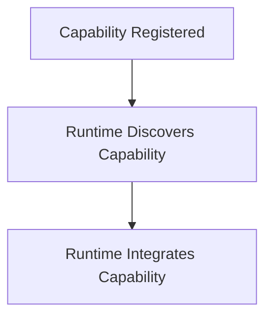

The Runtime grows through discovery.

Not modification.

---

# What Is A Capability?

Within Mosaic, a capability is a self-contained unit of business functionality.

Examples include:

```

Playback
```

```

Metadata
```

```

Library
```

```

Recommendations
```

```

Authentication
```

Capabilities own:

- business behaviour
- runtime registration
- lifecycle participation

The Runtime owns execution.

---

# What Is The Capability Registry?

The Capability Registry is the Runtime's catalogue of available capabilities.

Conceptually.

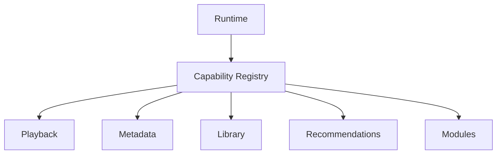

Every Runtime service discovers capabilities through the Registry.

No Runtime component should maintain its own capability list.

---

# Why A Registry Exists

Without a Registry:

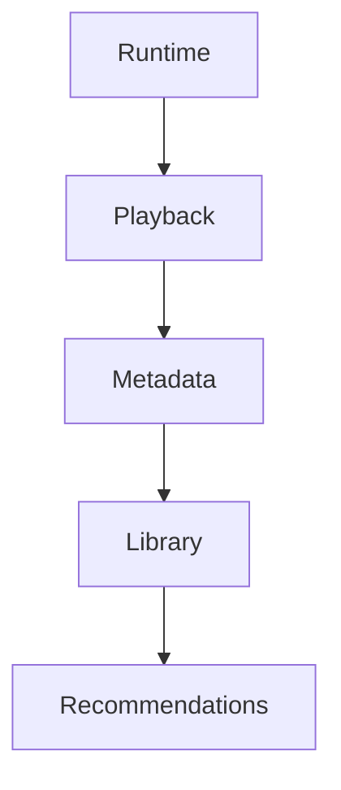

The Runtime becomes tightly coupled to every capability.

Every new capability requires Runtime modification.

Instead.

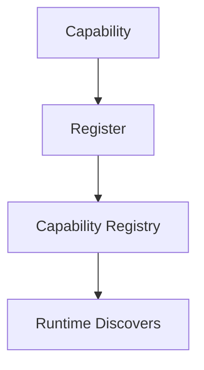

The Runtime becomes open for module while remaining closed for modification.

---

# Runtime Source Of Truth

The Capability Registry is the authoritative source for:

- available capabilities
- capability metadata
- lifecycle state
- dependencies
- health
- version

Other Runtime components should query the Registry.

They should never maintain independent copies of capability information.

---

# Registration

Capabilities register during startup.

Conceptually.

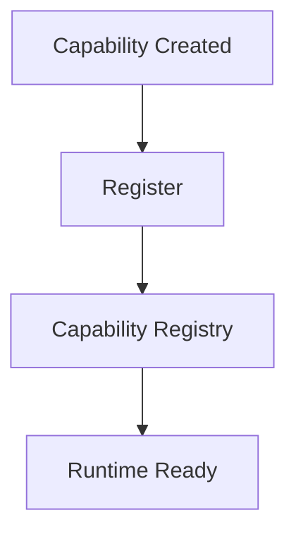

Registration should occur before capability execution begins.

Capabilities that are not registered do not exist from the Runtime's perspective.

---

# Discovery

Runtime Services discover capabilities through the Registry.

Example.

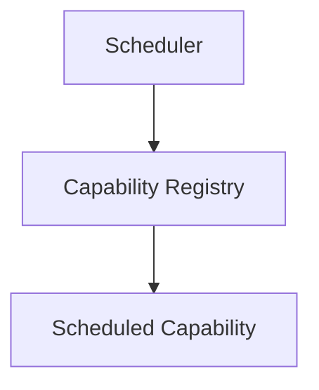

Likewise.

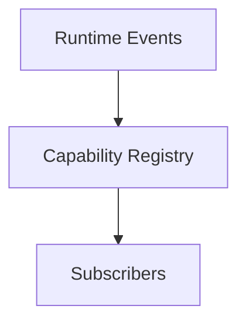

Discovery should always remain explicit.

---

# Capability Metadata

Every registered capability SHOULD expose metadata.

Examples include:

- identifier
- name
- version
- owner
- lifecycle state
- dependencies
- health
- capabilities provided

The Registry owns this metadata.

The capability owns its accuracy.

Modern service registries similarly maintain metadata describing registered services, allowing runtime discovery without hard-coded dependencies.  [microservices.io](https://microservices.io/patterns/service-registry.html)

---

# Capability Identity

Every capability MUST possess a globally unique identifier.

Examples.

```

playback
```

```

metadata
```

```

library
```

Identifiers should remain:

- stable
- immutable
- human readable

Changing a capability identifier should be considered a breaking architectural change.

---

# Capability Lifecycle

The Registry tracks lifecycle.

Example.

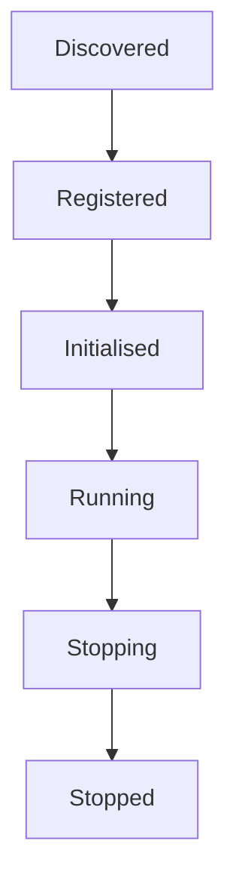

The Registry records lifecycle.

The Runtime coordinates it.

Capabilities participate in it.

---

# Dependency Discovery

Capabilities may depend upon other capabilities.

Example.

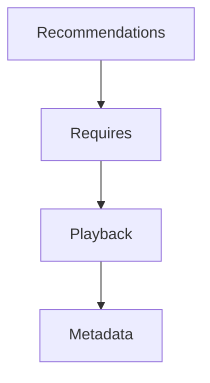

The Registry owns this dependency graph.

Capabilities should declare dependencies.

The Runtime should resolve them.

This keeps dependency knowledge centralised rather than distributed.

---

# Capability State

The Registry maintains operational state.

Examples include:

```

Running
```

```

Disabled
```

```

Failed
```

```

Waiting
```

Business state remains outside the Registry.

The Registry tracks only Runtime state.

---

# Health

Capabilities SHOULD publish health information.

Example.

```

Healthy
```

```

Degraded
```

```

Unavailable
```

The Capability Registry aggregates this information for Runtime services.

The Registry should never determine health itself.

---

# Capability Discovery Is Runtime Only

Business capabilities should never query the Registry.

Poor.

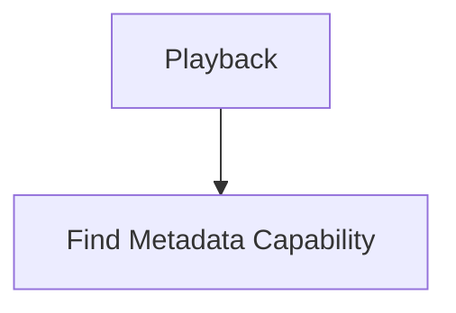

Preferred.

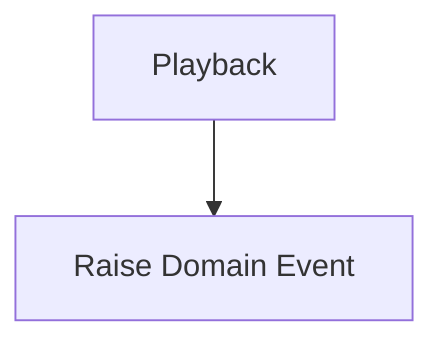

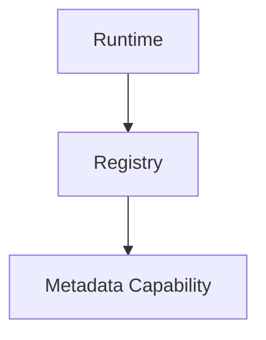

The Registry exists for Runtime coordination.

Not business behaviour.

---

# Capability Replacement

The Runtime should treat capabilities as interchangeable.

Example.


Later.

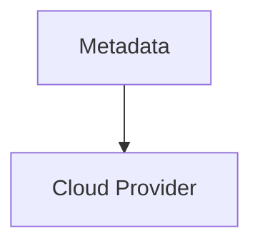

The Registry records:

```

Metadata Capability
```

The Runtime remains unaware of implementation differences.

---

# Module Integration

Modules register exactly like Platform capabilities.

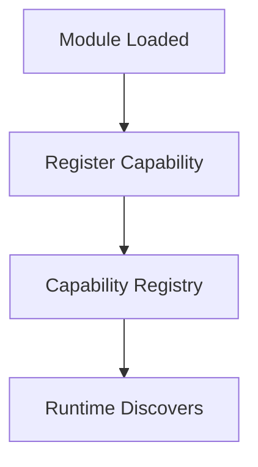

The Registry should make no distinction between:

- Platform capabilities
- First-party
- Third-party

Everything becomes a capability.

This is one of the architectural foundations enabling Mosaic's module-first design.

---

# Runtime Services

Every Runtime Service should depend upon the Registry.

Examples include:

- Scheduler
- Worker Manager
- Lifecycle Manager
- Execution Engine

The Registry becomes the Runtime's single source of capability knowledge.

---

# Registry Is Not A Service Locator

This distinction is critical.

Poor.

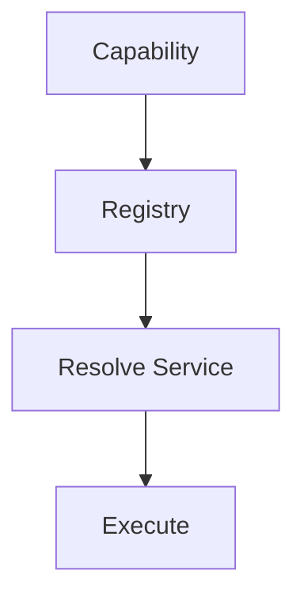

The Registry should not provide arbitrary object lookup.

It provides:

- discovery
- metadata
- lifecycle
- dependency information

Dependency injection remains the responsibility of the Composition Root.

Using a registry for runtime discovery is distinct from using a Service Locator for dependency resolution, which obscures dependencies and is generally discouraged.  [Reddit](https://www.reddit.com/r/softwarearchitecture/comments/1241cgj)

---

# Observability

The Registry SHOULD expose:

- registered capabilities
- lifecycle state
- dependency graph
- health
- version
- registration failures

The Runtime should always be able to explain:

> Which capabilities currently exist?

---

# Anti-Patterns

The following practices are prohibited.

## Hard-Coded Capabilities

```

if playback {

}
```

inside the Runtime.

---

## Business Queries

Domain objects querying the Registry.

---

## Duplicate Registries

Multiple Runtime components maintaining independent capability lists.

---

## Runtime Behaviour

The Registry deciding:

- scheduling
- retries
- execution

The Registry owns knowledge.

Not execution.

---

## Service Locator

Returning arbitrary dependencies for business code.

---

# Mosaic Guidelines

Within Mosaic:

- Every capability MUST register with the Capability Registry.
- The Capability Registry MUST be the Runtime's single source of capability metadata.
- Runtime Services MUST discover capabilities through the Registry.
- Capabilities MUST expose metadata and lifecycle information.
- Business behaviour MUST remain independent of the Registry.
- The Registry MUST NOT become a dependency injection container.
- Built-in and module-delivered capabilities MUST register identically.
- Capability discovery MUST remain explicit and observable.

---

# Relationship to MEG

The Runtime Kernel owns the Runtime.

The Capability Registry owns knowledge of every capability participating in that Runtime.

The next chapter introduces the **Service Lifecycle**, explaining how registered capabilities progress from discovery to execution and eventually to graceful shutdown.

---

# Summary

The Capability Registry is the Runtime's memory.

It knows:

- what capabilities exist
- what they provide
- what they require
- whether they are healthy
- where they are in their lifecycle

It intentionally knows nothing about the business those capabilities perform.

That separation allows the Runtime to remain generic while enabling the platform to grow indefinitely through independently developed capabilities.
