<!--
File: docs/engineering/guides/meg-005-runtime-architecture/04-service-lifecycle.md
Document: MEG-005
Status: Draft
Version: 0.4
-->

# Service Lifecycle

> *Every Runtime Service should know how to begin, how to become ready, how to stop accepting work and how to shut down cleanly.*

---

# Purpose

The Mosaic Runtime is composed of many independent Runtime Services.

Examples include:

- Capability Registry
- Scheduler
- Worker Manager
- Execution Engine
- Resource Manager
- Observability

These services are long-lived.

They are created once and typically remain active for the lifetime of the Runtime.

Without a well-defined lifecycle:

- startup order becomes unpredictable
- shutdown becomes unsafe
- dependencies become ambiguous
- failures become difficult to recover from

This document defines the canonical lifecycle followed by every Runtime Service.

---

# Philosophy

Within Mosaic:

> **Every Runtime Service follows the same lifecycle.**

Consistency is more valuable than flexibility.

Every Runtime Service should behave identically with respect to:

- startup
- readiness
- execution
- shutdown
- disposal

This consistency allows the Runtime Kernel to coordinate every service without special-case logic.

---

# Runtime Lifecycle

Every Runtime Service progresses through the following lifecycle.

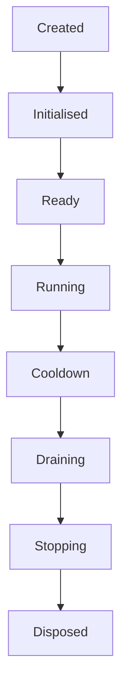

Each state has exactly one responsibility.

No Runtime Service should invent additional lifecycle stages without architectural justification.

---

# Created

The service has been constructed.

Only construction has occurred.

The service:

- has received dependencies
- has not performed work
- has not allocated resources

Construction should remain inexpensive.

Heavy initialisation belongs later.

---

# Initialised

During initialisation, the service prepares itself.

Typical work includes:

- validating configuration
- allocating resources
- constructing internal state
- registering dependencies

The service should still reject external work.

Initialisation prepares the service.

It does not activate it.

---

# Ready

A Ready service has completed initialisation.

It is now capable of accepting work.

Examples include:

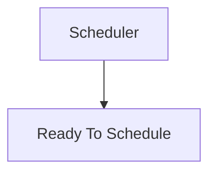

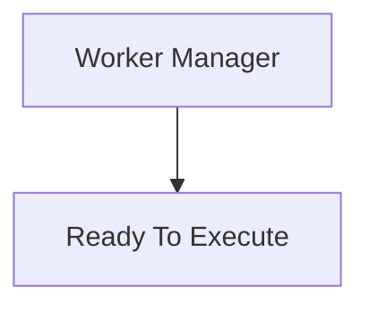

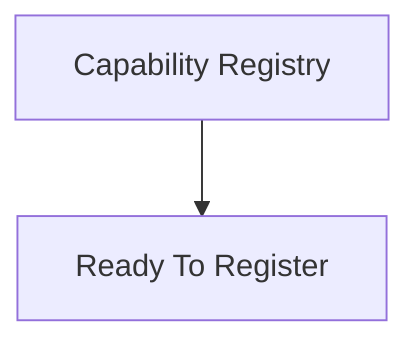

Readiness indicates operational capability.

Not active execution.

Separating "ready" from "running" is a common lifecycle pattern because it allows dependencies to initialise before accepting external work.  [Shelter Design](https://design.shelter.org.uk/digital-framework/the-digital-lifecycle)

---

# Running

The Runtime Service is now operational.

Examples include:

- accepting requests
- scheduling work
- allocating workers
- exposing health
- publishing metrics

This represents the normal operational state.

Most services remain in this state for the majority of their lifetime.

---

# Cooldown

Cooldown is the first shutdown phase.

Its purpose is simple.

> **Stop accepting new work.**

Examples.

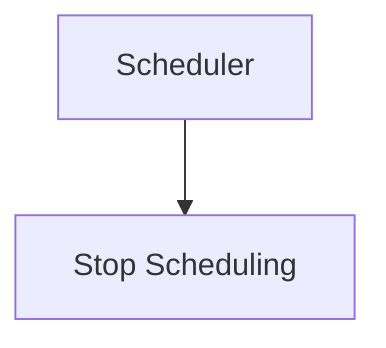

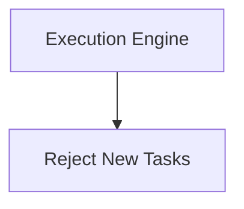

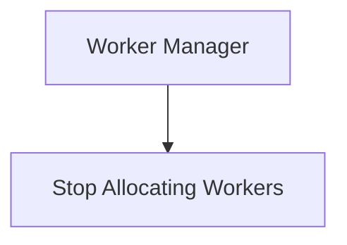

Existing work continues.

Only new work is rejected.

Separating admission control from shutdown greatly simplifies graceful termination of long-running systems.  [Reddit](https://www.reddit.com/r/node/comments/1s4x8gp/application_lifecycle_is_one_of_the_most_ignored/)

---

# Draining

During draining:

No new work enters.

Existing work completes.

Example.

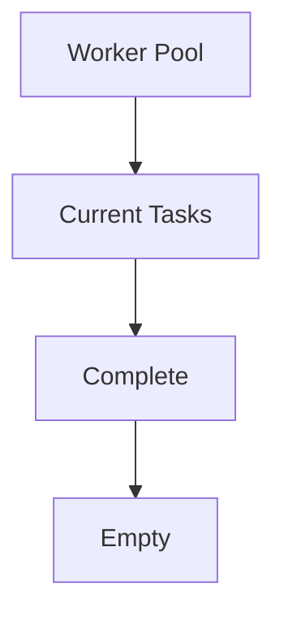

The Runtime should prefer graceful completion over abrupt cancellation wherever practical.

---

# Stopping

Once all work has completed:

The service begins shutdown.

Typical work includes:

- unregistering listeners
- stopping background loops
- closing channels
- notifying dependants

The service should now perform no additional business work.

---

# Disposed

All owned resources have been released.

Examples include:

- database pools
- timers
- network sockets
- file handles

The service no longer participates in the Runtime.

Disposed services must not be restarted.

A new instance should be created instead.

---

# Lifecycle Ownership

The Runtime Kernel owns lifecycle transitions.

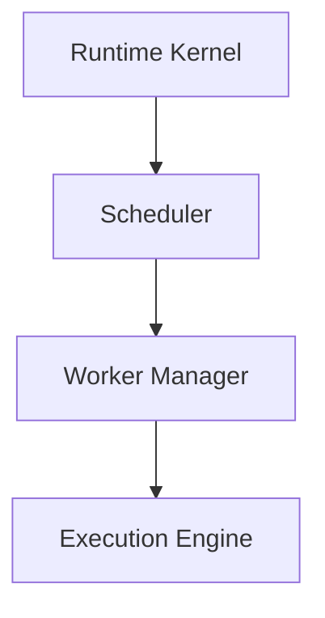

Individual Runtime Services should never transition themselves independently.

Lifecycle coordination belongs exclusively to the Kernel.

---

# Lifecycle Dependencies

Services should start in dependency order.

Example.

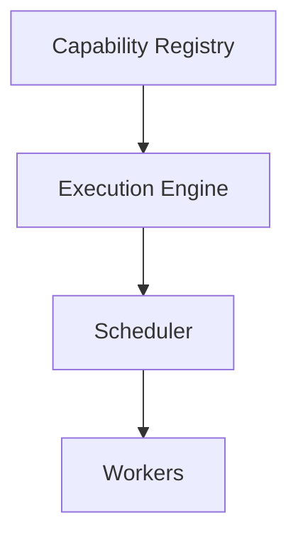

Shutdown occurs in reverse.

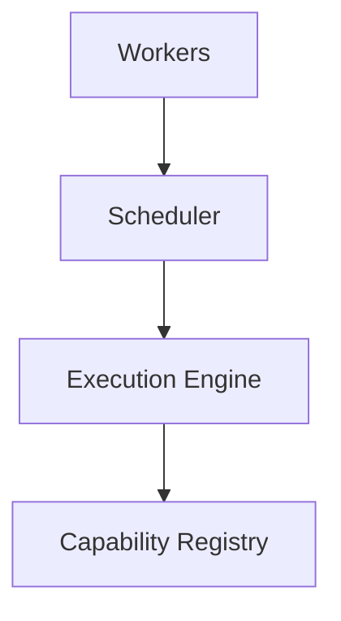

This ordering prevents services depending upon components that have already stopped.

---

# Lifecycle Events

The Runtime MAY publish lifecycle events.

Examples include:

```

ServiceInitialised
```

```

ServiceReady
```

```

ServiceStarted
```

```

ServiceStopping
```

```

ServiceDisposed
```

These are Runtime Events.

Not Domain Events.

They improve observability without leaking infrastructure into the Domain.

---

# Health

Lifecycle state and health are related.

They are not identical.

Example.

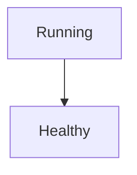

or

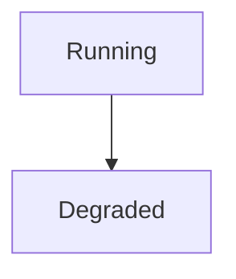

A service may be operational while experiencing reduced capability.

Health describes operational quality.

Lifecycle describes operational state.

---

# Restartability

Runtime Services SHOULD be restartable.

Restarting should require:

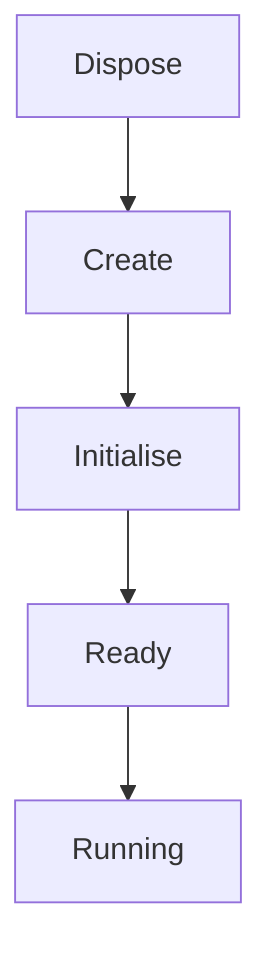

Services should not depend upon previous process state.

Explicit lifecycles naturally support recovery after failure.

---

# Failure During Startup

Suppose initialisation fails.

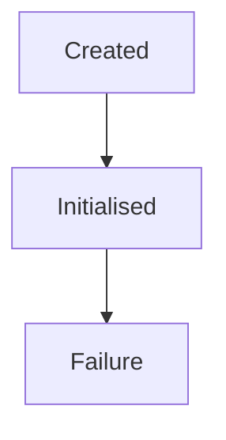

The Runtime Kernel should:

- report the failure
- stop dependent services
- terminate startup

Partial startup should not continue unless explicitly supported.

---

# Failure During Execution

Suppose a service fails while running.

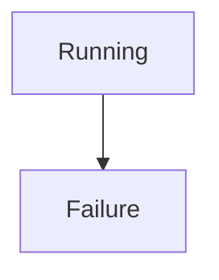

The Runtime Kernel determines:

- restart
- shutdown
- degraded operation

The failing service should not make that decision itself.

---

# Resource Ownership

Every Runtime Service owns its own resources.

Therefore:

Every Runtime Service is responsible for releasing those resources during disposal.

Ownership should never become ambiguous.

Resource cleanup follows lifecycle ownership.

---

# Lifecycle Contracts

Every Runtime Service SHOULD implement the same lifecycle contract.

Conceptually.

```text
Initialise()

Ready()

Start()

Cooldown()

Drain()

Stop()

Dispose()
```

This allows the Runtime Kernel to manage all services uniformly.

The exact implementation is less important than the behavioural consistency.

---

# Testing

Lifecycle behaviour SHOULD be tested independently.

Typical tests verify:

- startup ordering
- readiness
- cooldown
- draining
- shutdown
- resource disposal

Lifecycle correctness is an architectural concern.

Not merely an operational one.

---

# Anti-Patterns

The following practices are prohibited.

## Hidden Startup

Constructors starting background work automatically.

---

## Immediate Shutdown

Stopping services without cooldown or draining.

---

## Resource Leaks

Disposed services retaining:

- timers
- workers
- sockets
- goroutines

---

## Independent Lifecycle

Services starting and stopping themselves without Kernel coordination.

---

## Startup Side Effects

Services performing business work during initialisation.

---

## Skipping Readiness

Accepting work before dependencies become operational.

---

# Mosaic Guidelines

Within Mosaic:

- Every Runtime Service MUST follow the canonical lifecycle.
- The Runtime Kernel MUST coordinate lifecycle transitions.
- Services MUST initialise before becoming ready.
- Services MUST stop accepting new work before stopping existing work.
- Draining SHOULD complete existing work where practical.
- Services MUST release owned resources before disposal.
- Lifecycle SHOULD remain observable.
- Startup SHOULD follow dependency order.
- Shutdown SHOULD occur in reverse dependency order.

---

# Relationship to MEG

The Runtime Kernel owns:

> **Who participates in the Runtime.**

The Service Lifecycle defines:

> **How every Runtime Service participates throughout its lifetime.**

The next chapter introduces the **Dependency Graph**, describing how Runtime Services and Capabilities are wired together while preserving explicit ownership and deterministic startup.

---

# Summary

A Runtime Service should never simply:

> **Start.**

Nor should it simply:

> **Stop.**

It should progress through a deliberate, observable lifecycle that makes startup predictable, execution reliable and shutdown graceful.

Within Mosaic, every Runtime Service follows the same lifecycle so that the Runtime Kernel can coordinate the entire platform with consistency rather than special cases.
