<!--
File: docs/engineering/guides/meg-005-runtime-architecture/06-execution-engine.md
Document: MEG-005
Status: Draft
Version: 0.4
-->

# Execution Engine

> *The Scheduler decides when work should execute. The Worker executes it. The Execution Engine ensures that the correct work reaches the correct execution environment.*

---

# Purpose

The Runtime contains many components responsible for execution.

These include:

- Scheduler
- Worker Manager
- Capability Registry
- Resource Manager

None of these components actually coordinate the execution of work.

That responsibility belongs to the **Execution Engine**.

The Execution Engine transforms abstract units of work into running execution.

It sits at the centre of the Runtime and coordinates:

- work dispatch
- execution routing
- worker allocation
- execution state
- execution completion

without understanding any business behaviour.

---

# Philosophy

Within Mosaic:

> **The Execution Engine executes work. It never understands the work it executes.**

Execution is an operational concern.

Business meaning belongs entirely to capabilities.

The Execution Engine should remain completely business agnostic.

---

# What Is The Execution Engine?

The Execution Engine is the Runtime component responsible for coordinating executable work.

Conceptually.

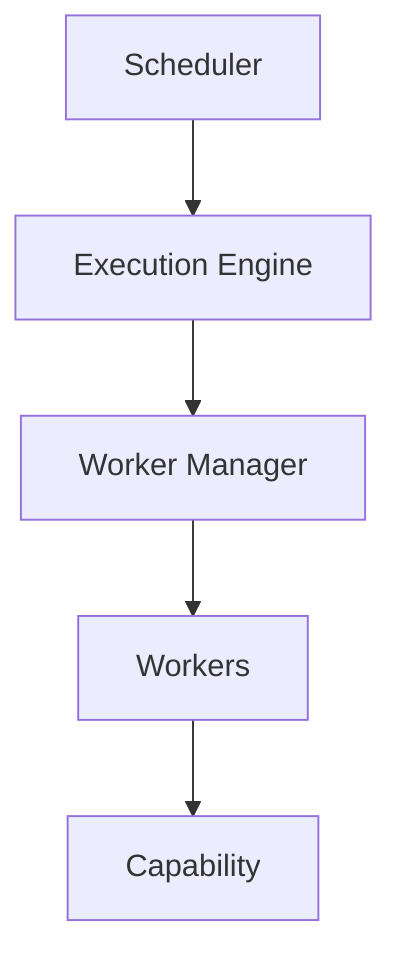

It acts as the bridge between:

- work creation
- work execution

The Scheduler decides *when*.

The Execution Engine decides *how*.

---

# Responsibilities

The Execution Engine owns:

- task dispatch
- execution routing
- worker assignment
- execution tracking
- execution completion
- execution cancellation

It intentionally does **not** own:

- scheduling
- retries
- business workflows
- event routing
- persistence

Those responsibilities belong elsewhere.

---

# Work Units

Everything executed by the Runtime becomes a Work Unit.

Examples include:

- Runtime Events
- Scheduled Tasks
- Module Calls
- Maintenance Tasks
- Background Jobs

The Execution Engine treats every Work Unit identically.

Business meaning remains invisible.

---

# Execution Pipeline

Every Work Unit follows the same pipeline.

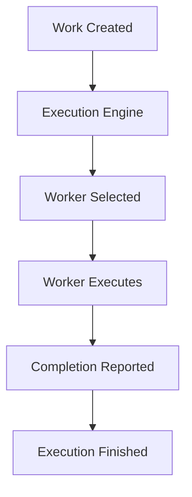

The pipeline should remain deterministic.

Every Work Unit should follow the same lifecycle.

---

# Execution Is Stateless

The Execution Engine should remain stateless.

It owns:

- execution coordination

It does **not** own:

- business state
- runtime state
- worker state

Long-lived state belongs to:

- Capability Registry
- Worker Manager
- Resource Manager

The Execution Engine simply coordinates.

---

# Worker Selection

The Execution Engine delegates worker selection.

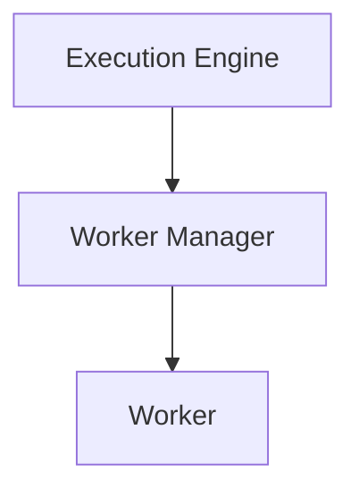

The Execution Engine should never understand:

- thread allocation
- worker pools
- scheduling policies

It simply requests execution.

The Worker Manager fulfils that request.

---

# Scheduler Integration

The Scheduler produces executable work.

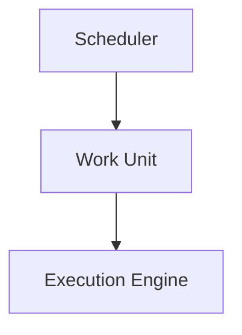

The Scheduler does not execute.

The Execution Engine does not schedule.

Responsibilities remain intentionally separate.

---

# Capability Execution

The Execution Engine executes capabilities.

It does **not** execute business logic directly.

Conceptually.

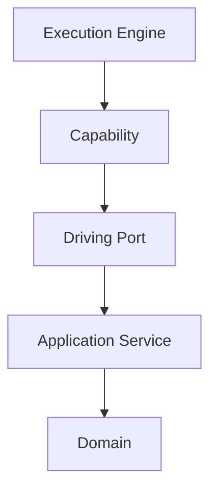

The Execution Engine remains unaware of:

- Aggregates
- Entities
- Domain Events

It simply executes registered capabilities.

---

# Parallel Execution

Independent Work Units SHOULD execute concurrently.

Example.

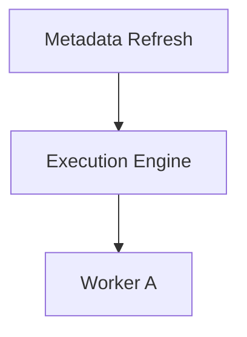

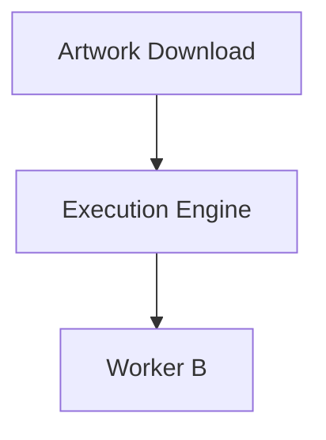

Concurrency should emerge naturally.

The Execution Engine should maximise utilisation while respecting Runtime limits.

Modern execution engines typically coordinate worker pools rather than executing work directly, allowing scheduling and execution responsibilities to remain separate.  [DeepWiki](https://deepwiki.com/taskflow/taskflow/2.2-executor-and-workers)

---

# Execution State

Every Work Unit progresses through the same execution lifecycle.

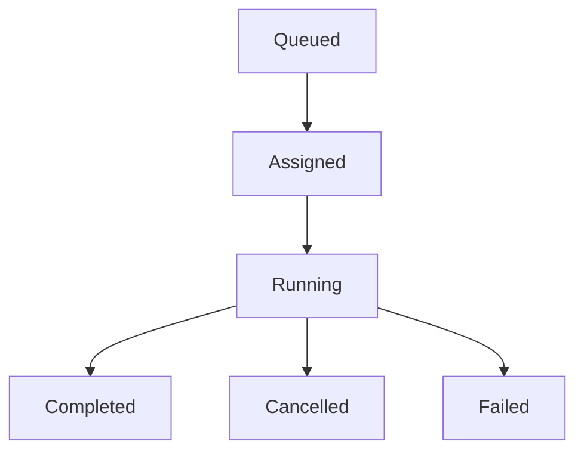

The Execution Engine owns this execution state.

Business state remains elsewhere.

---

# Cancellation

The Execution Engine coordinates cancellation.

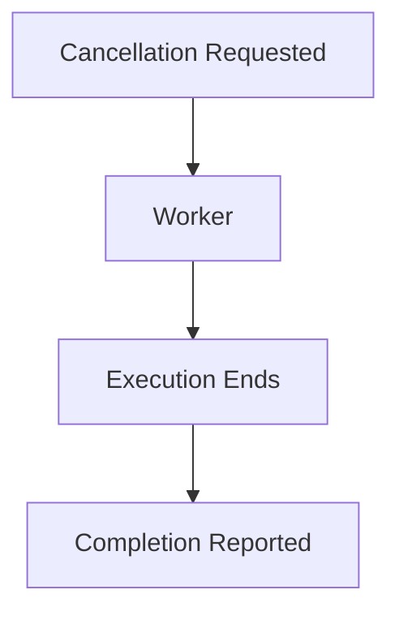

Business logic determines how to leave business state consistent.

The Execution Engine simply coordinates execution termination.

---

# Failure Handling

Execution failure does not imply business failure.

Example.

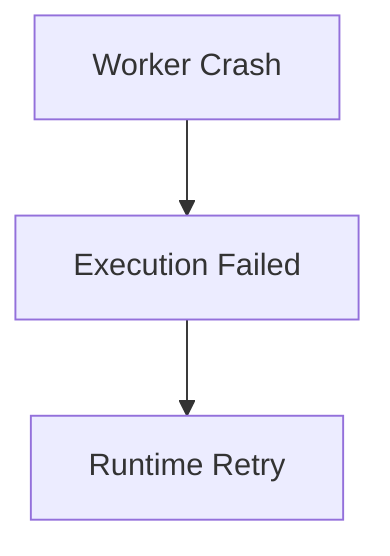

The Execution Engine reports failure.

The Runtime decides:

- retry
- dead letter
- shutdown

Execution and recovery remain separate concerns.

---

# Capability Isolation

Every capability executes independently.

Suppose.

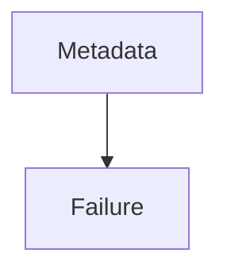

The Execution Engine should ensure:

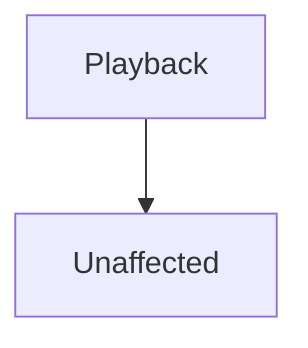

Execution isolation is one of the Runtime's primary responsibilities.

---

# Execution Contracts

The Execution Engine communicates through Runtime contracts.

Examples include:

- Work Submission
- Worker Allocation
- Execution Result
- Cancellation

The engine should never communicate directly with:

- databases
- HTTP
- event buses
- business services

Everything passes through Runtime abstractions.

---

# Resource Awareness

The Execution Engine should remain aware of Runtime resource constraints.

Examples include:

- available workers
- queue pressure
- execution limits
- resource exhaustion

It should cooperate with:

- Worker Manager
- Resource Manager

It should never allocate resources itself.

---

# Observability

Every execution SHOULD be observable.

Useful metrics include:

- queued work
- active work
- completed work
- failed work
- execution latency
- worker utilisation

The Execution Engine should become one of the most observable Runtime components.

Operators should always understand:

> What is currently executing?

---

# Runtime Independence

The Execution Engine should remain independent from:

- worker implementation
- scheduling algorithms
- execution strategies

Changing:

```

Worker Pool
```

should not require changing:

```

Execution Engine
```

Responsibilities should remain replaceable.

---

# Testing

The Execution Engine SHOULD be tested independently.

Typical tests verify:

- dispatch
- cancellation
- completion
- routing
- execution ordering
- worker selection contracts

Business capabilities should not be required.

The engine should be testable using fake workers.

---

# Anti-Patterns

The following practices are prohibited.

## Business Logic

The Execution Engine deciding business behaviour.

---

## Scheduling

The Execution Engine determining when work should execute.

---

## Resource Ownership

The Execution Engine managing thread pools directly.

---

## Worker Awareness

Business capabilities interacting with worker implementations.

---

## Runtime Coupling

The Execution Engine depending directly upon Scheduler implementation details.

---

## Technology Leakage

Execution behaviour depending upon infrastructure-specific implementation details.

---

# Mosaic Guidelines

Within Mosaic:

- The Execution Engine MUST remain business agnostic.
- Every executable task MUST become a Work Unit.
- The Execution Engine MUST coordinate execution rather than perform work.
- Worker allocation MUST remain the responsibility of the Worker Manager.
- Scheduling MUST remain separate from execution.
- Execution SHOULD maximise safe parallelism.
- Execution state MUST remain observable.
- The Execution Engine SHOULD remain independently replaceable.

---

# Relationship to MEG

The Dependency Graph determines:

> **What can execute.**

The Execution Engine determines:

> **How that execution occurs.**

The next chapter introduces the **Worker Manager**, the Runtime subsystem responsible for providing, supervising and balancing the worker pool that performs execution on behalf of the Execution Engine.

---

# Summary

The Execution Engine is the Runtime's dispatcher.

It does not:

- schedule
- retry
- own resources
- understand business behaviour

Instead it transforms abstract Work Units into running execution by coordinating the Runtime components responsible for carrying out that work.

By keeping execution separate from scheduling, worker management and business logic, the Mosaic Runtime remains modular, scalable and remarkably easy to reason about.
