<!--
File: docs/engineering/guides/meg-005-runtime-architecture/07-worker-manager.md
Document: MEG-005
Status: Draft
Version: 0.4
-->

# Worker Manager

> *The Execution Engine decides what should execute. The Worker Manager decides where it executes.*

---

# Purpose

Execution requires workers.

Workers execute:

- Runtime Events
- Scheduled Tasks
- Capability Operations
- Maintenance Jobs
- Background Processing

However, workers themselves require management.

They must be:

- created
- monitored
- allocated
- retired
- replaced
- observed

Within the Mosaic Runtime, these responsibilities belong to the **Worker Manager**.

The Worker Manager owns the lifecycle and utilisation of every worker participating in the Runtime.

---

# Philosophy

Within Mosaic:

> **Workers are Runtime resources. The Worker Manager owns those resources.**

Workers should never:

- create themselves
- destroy themselves
- schedule themselves
- coordinate themselves

The Worker Manager owns:

- worker lifecycle
- worker allocation
- worker health
- worker capacity

Workers simply execute work.

---

# What Is A Worker?

A Worker is an isolated execution environment capable of executing one Work Unit at a time.

Conceptually.

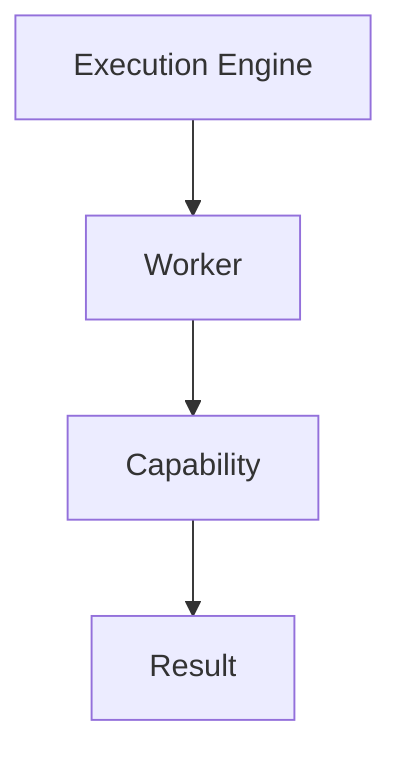

Workers understand:

- execution
- cancellation
- completion

Workers do not understand:

- playback
- metadata
- libraries
- recommendations

Business meaning remains invisible.

---

# Why A Worker Manager Exists

Without a Worker Manager:

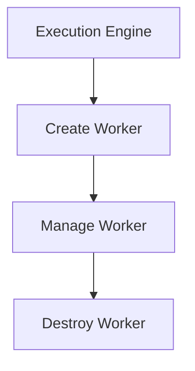

Execution and resource management become tightly coupled.

Instead.

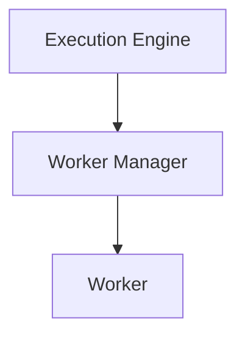

Execution remains independent.

Resource ownership remains explicit.

---

# Responsibilities

The Worker Manager owns:

- worker creation
- worker allocation
- worker retirement
- worker health
- worker utilisation
- worker replacement
- worker pool management

It intentionally does **not** own:

- scheduling
- execution routing
- retries
- business behaviour

These concerns belong elsewhere.

---

# Worker Pool

Workers exist within managed pools.

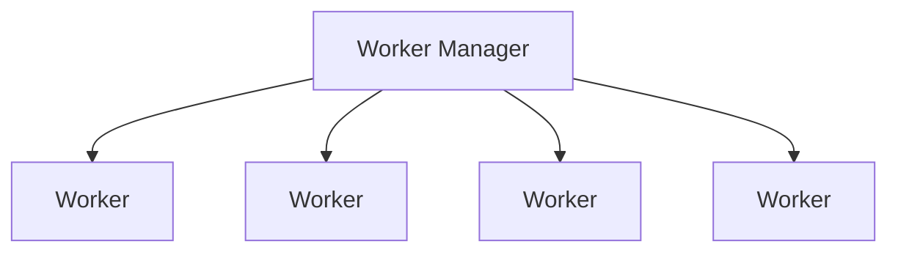

The Worker Manager should view workers as a pool of interchangeable execution resources.

Individual workers should rarely matter.

Worker pools are a well-established concurrency pattern because they bound resource usage while allowing work to be processed concurrently.  [Buntime](https://buntime.djalmajr.dev/concepts/worker-pool/)

---

# Worker Lifecycle

Every worker follows the same lifecycle.

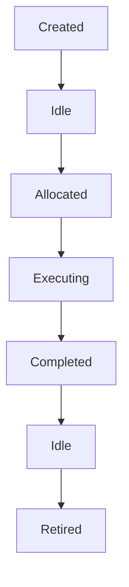

The Worker Manager owns every transition.

Workers should never transition independently.

---

# Worker Allocation

When execution is requested:

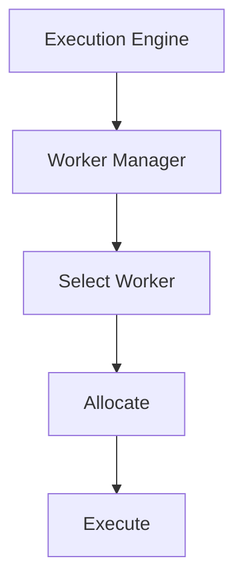

Selection policies are implementation details.

The Execution Engine should simply request execution.

---

# Idle Workers

Idle workers represent available capacity.

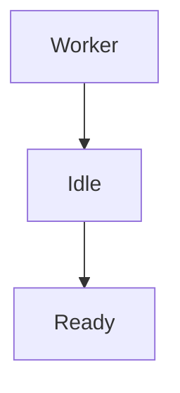

Idle workers should consume minimal resources while remaining immediately available for work.

Workers should never busy-wait.

---

# Busy Workers

A busy worker owns one active Work Unit.

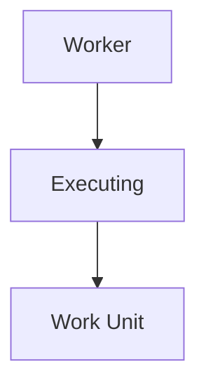

By default:

One worker executes one Work Unit.

Parallelism is achieved by increasing worker count.

Not by increasing worker complexity.

---

# Worker Ownership

Every worker has exactly one owner.

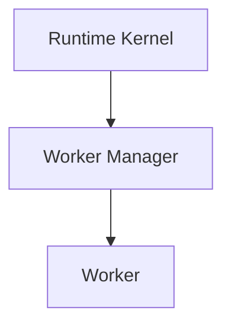

Ownership answers:

- who created the worker
- who retires the worker
- who monitors the worker
- who replaces the worker

Ownership should never become ambiguous.

---

# Worker Identity

Workers SHOULD possess Runtime identity.

Example.

```

Worker-17
```

Identity supports:

- diagnostics
- tracing
- metrics
- debugging

Business capabilities should remain unaware of worker identity.

Worker identity belongs exclusively to the Runtime.

---

# Worker Health

The Worker Manager SHOULD continuously monitor worker health.

Examples include:

- responsive
- idle
- executing
- degraded
- failed

Health determines operational readiness.

Not business correctness.

---

# Worker Failure

Suppose:

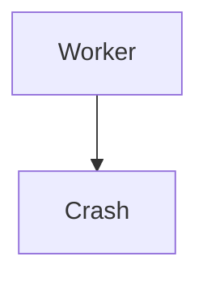

The Worker Manager should:

- detect failure
- retire worker
- create replacement
- notify Runtime

The Execution Engine simply observes:

```

Execution Failed
```

Worker recovery belongs entirely to the Worker Manager.

This separation mirrors the classic manager/worker pattern, where the manager owns worker lifecycle while workers focus solely on execution.  [fprime.jpl.nasa.gov](https://fprime.jpl.nasa.gov/latest/docs/user-manual/design-patterns/manager-worker/)

---

# Worker Capacity

Workers represent finite Runtime capacity.

Examples include:

- available workers
- active workers
- idle workers
- maximum workers

Capacity information should be exposed to:

- Scheduler
- Execution Engine
- Resource Manager

The Worker Manager owns these metrics.

---

# Scaling

Worker pools SHOULD scale deliberately.

Possible strategies include:

```

Static
```

```

Adaptive
```

```

Configured
```

Regardless of strategy:

Scaling should remain bounded.

Unlimited worker creation is prohibited.

Resource usage should remain predictable.

---

# Worker Retirement

Workers should not exist indefinitely.

Retirement may occur because of:

- shutdown
- failure
- resource pressure
- maintenance
- runtime upgrade

Retired workers should complete:

- cleanup
- resource release
- metric publication

before disposal.

---

# Worker Replacement

Worker replacement should be automatic.

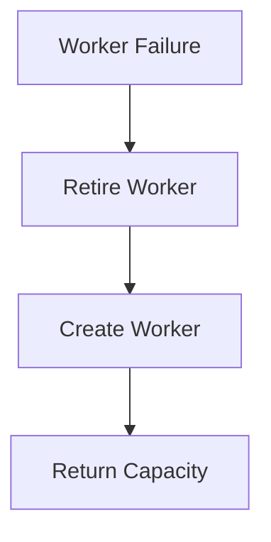

Capabilities should remain unaware that replacement occurred.

Operational resilience belongs entirely to the Runtime.

---

# Worker Affinity

The Runtime SHOULD avoid unnecessary worker affinity.

Poor.

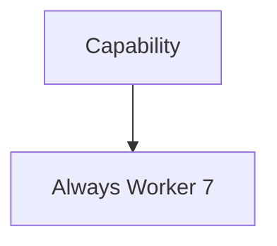

Preferred.

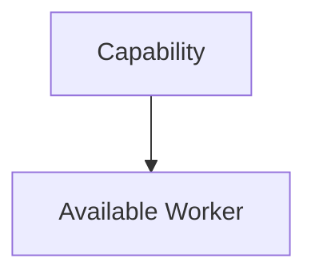

Workers should remain interchangeable wherever practical.

Affinity should exist only where technically justified.

---

# Worker Isolation

Workers should remain isolated.

Failure within one worker should not affect:

- neighbouring workers
- unrelated capabilities
- Runtime stability

Isolation improves resilience and simplifies recovery.

---

# Worker Metrics

The Worker Manager SHOULD expose:

- worker count
- idle workers
- active workers
- utilisation
- replacement count
- failures
- average execution time

These metrics provide insight into Runtime capacity.

---

# Worker Observability

Operators should be able to answer:

- Which workers are active?
- Which workers are idle?
- Which workers failed?
- How heavily utilised is the pool?

The Worker Manager should expose this information without additional instrumentation.

---

# Worker Creation

Workers should generally be created during Runtime startup.

Later expansion should occur only when justified by Runtime policy.

Worker creation should remain predictable.

Not reactive to every temporary workload spike.

---

# Anti-Patterns

The following practices are prohibited.

## Self-Managing Workers

Workers creating additional workers.

---

## Unlimited Worker Creation

Creating workers without Runtime limits.

---

## Worker-Owned Scheduling

Workers determining future execution.

---

## Business Logic

Workers making business decisions.

---

## Worker Affinity By Default

Binding capabilities permanently to specific workers.

---

## Hidden Worker Pools

Capabilities creating private worker pools outside Runtime control.

---

# Mosaic Guidelines

Within Mosaic:

- The Worker Manager MUST own every worker.
- Workers MUST remain interchangeable by default.
- Worker pools MUST remain bounded.
- Worker lifecycle MUST be centrally managed.
- Worker failures MUST trigger controlled replacement.
- Worker health MUST remain observable.
- Worker metrics MUST be exposed.
- Capabilities MUST NOT create their own workers.
- Business behaviour MUST remain completely independent of worker implementation.

---

# Relationship to MEG

The Execution Engine answers:

> **What should execute?**

The Worker Manager answers:

> **Which execution resource should perform that work?**

The next chapter introduces the **Scheduler Architecture**, the Runtime subsystem responsible for determining **when** work should become executable.

Together:

- Scheduler decides **when**.
- Execution Engine decides **how**.
- Worker Manager decides **where**.

---

# Summary

The Worker Manager transforms workers from implementation details into managed Runtime resources.

It owns:

- lifecycle
- health
- capacity
- allocation
- replacement

By centralising worker management, the Mosaic Runtime gains:

- predictable resource usage
- resilience
- observability
- scalability

Workers remain simple.

The Worker Manager makes them reliable.
