<!--
File: docs/engineering/guides/meg-005-runtime-architecture/08-scheduler-architecture.md
Document: MEG-005
Status: Draft
Version: 0.4
-->

# Scheduler Architecture

> *The Scheduler decides when work becomes executable. It never executes the work itself.*

---

# Purpose

Many Runtime operations do not execute immediately.

Examples include:

- scheduled capability operations
- delayed retries
- recurring maintenance
- cache refresh
- metadata synchronisation
- module maintenance
- health verification

These operations require a component capable of answering one question.

> **Is this work ready to execute?**

Within Mosaic, that responsibility belongs exclusively to the **Scheduler**.

The Scheduler determines *when* work should execute.

It does not determine:

- where
- how
- by whom

Those responsibilities belong to other Runtime components.

---

# Philosophy

Within Mosaic:

> **The Scheduler owns time. It does not own execution.**

The Scheduler should remain intentionally small.

Its purpose is to transform:

```

Future Work
```

into:

```

Executable Work
```

Once work becomes executable, responsibility transfers immediately to the Execution Engine.

---

# What Is The Scheduler?

The Scheduler is a Runtime Service responsible for managing temporal execution.

Conceptually.

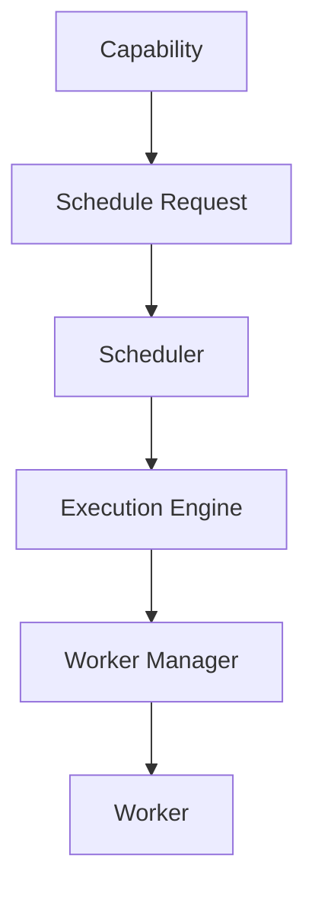

Notice:

The Scheduler never executes work.

It merely decides:

> **Now.**

---

# Responsibilities

The Scheduler owns:

- delayed execution
- recurring execution
- retry timing
- execution deadlines
- execution windows
- schedule persistence
- schedule cancellation

It intentionally does **not** own:

- worker allocation
- execution routing
- retries
- business behaviour

These concerns remain elsewhere.

---

# Scheduler Pipeline

Every scheduled operation follows the same lifecycle.

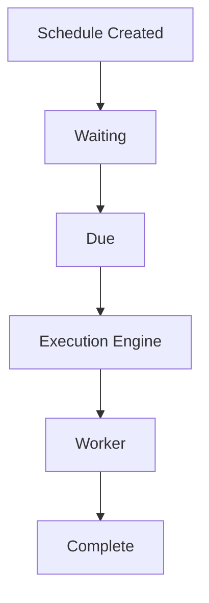

Once a schedule becomes due:

The Scheduler's responsibility ends.

---

# Time Ownership

One of the defining principles of the Runtime is:

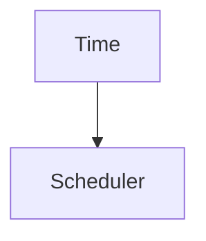

Business capabilities should never determine execution timing.

Example.

Poor.

```go
time.Sleep(...)
```

inside a capability.

Preferred.

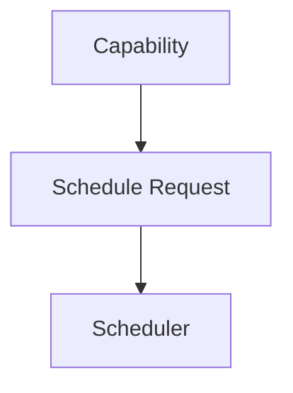

The Runtime owns time.

Capabilities own intent.

---

# Delayed Execution

The Scheduler supports delayed execution.

Example.

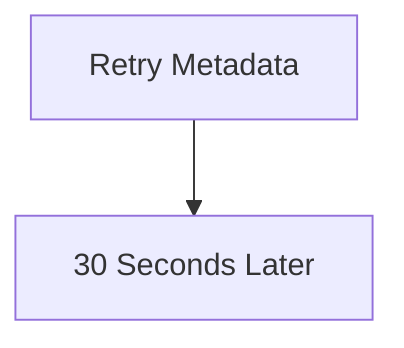

The delay belongs to the Scheduler.

The Metadata capability remains completely unaware.

---

# Recurring Execution

Recurring work is treated as a first-class Runtime concept.

Examples include:

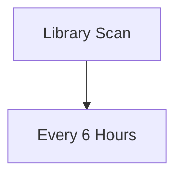

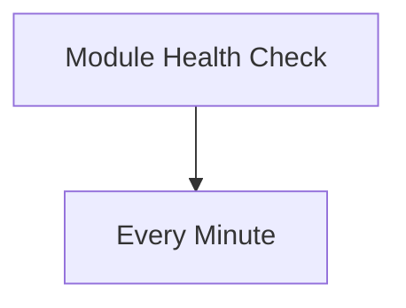

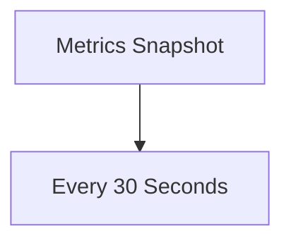

Recurring schedules should produce new executable Work Units.

Not execute work directly.

---

# Execution Handoff

When work becomes due:

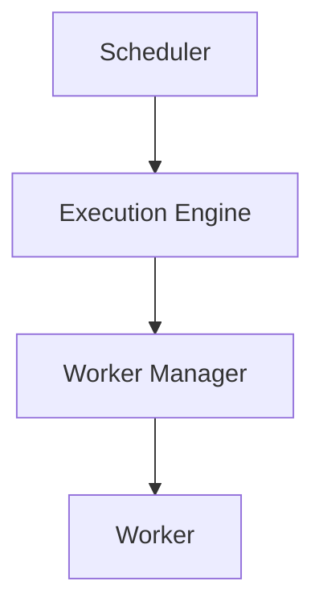

The Scheduler should not know:

- worker count
- worker availability
- execution strategy

Execution begins only after handoff.

This separation between scheduling and execution allows each subsystem to scale and evolve independently.  [System Design Handbook](https://www.systemdesignhandbook.com/guides/design-a-distributed-job-scheduler/)

---

# Schedule Storage

Schedules SHOULD remain durable.

Typical schedule information includes:

- capability
- operation
- execution time
- recurrence
- priority
- owner
- metadata

Persistence allows schedules to survive:

- restart
- upgrade
- failure

The Scheduler owns schedule durability.

Capabilities do not.

---

# Schedule Identity

Every schedule SHOULD possess a unique Runtime identifier.

Example.

```

schedule-42
```

Identity enables:

- cancellation
- diagnostics
- replay
- metrics

Schedule identity belongs to Runtime infrastructure.

Not business behaviour.

---

# Schedule Ownership

Every schedule has exactly one owner.

Example.

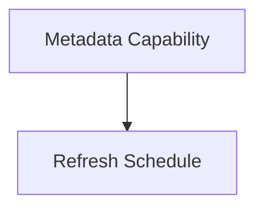

The owning capability requests the schedule.

The Scheduler owns its execution lifecycle.

Ownership should remain explicit.

---

# Priority

The Scheduler MAY assign execution priority.

Example.

High.

- user interaction
- playback
- authentication

Normal.

- metadata refresh
- recommendation generation

Low.

- cleanup
- analytics
- maintenance

The Scheduler determines *when* work enters execution.

The Execution Engine still determines *how* it executes.

Priority influences admission.

Not business semantics.

---

# Cancellation

Schedules SHOULD remain cancellable.

Lifecycle.

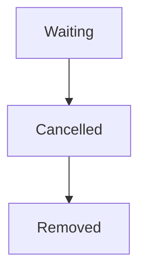

Cancelled schedules should never reach the Execution Engine.

Cancellation remains a scheduling concern.

---

# Dependency Awareness

The Scheduler SHOULD respect Runtime state.

Example.

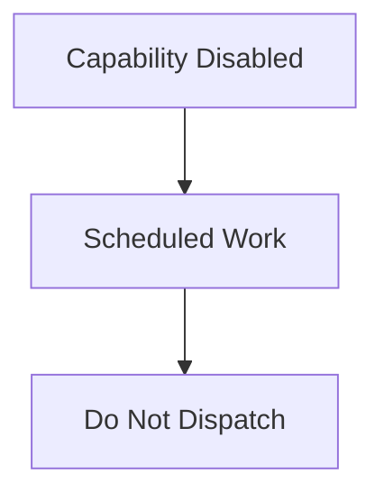

The Scheduler should consult the Capability Registry before dispatching work.

It should never execute work for unavailable capabilities.

---

# Scheduler Simplicity

The Scheduler should answer only two questions.

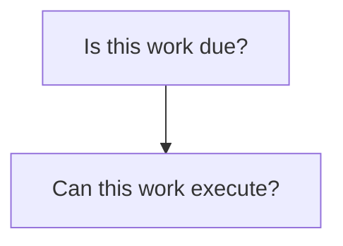

It should never answer:

```

Should this business behaviour happen?
```

Business decisions remain outside the Runtime.

---

# Scaling

The Scheduler should remain lightweight.

It should:

- determine execution time
- enqueue executable work

It should not execute capability logic.

This allows:

- Scheduler scaling
- Execution scaling

to occur independently.

This separation is widely used in distributed schedulers because it keeps scheduling lightweight while worker fleets scale horizontally.  [System Design Handbook](https://www.systemdesignhandbook.com/guides/design-a-distributed-job-scheduler/)

---

# Failure Recovery

Suppose the Scheduler fails.

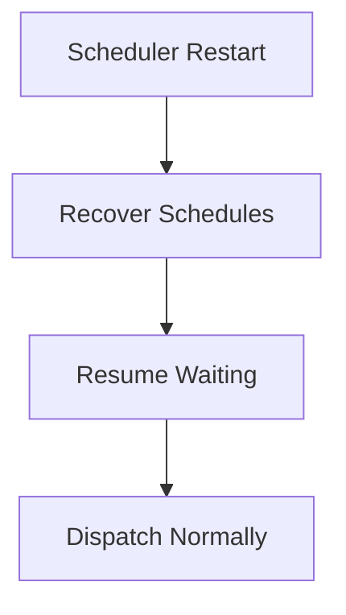

Schedules should survive failure.

Capabilities should not recreate them manually.

The Runtime owns recovery.

---

# Observability

The Scheduler SHOULD expose:

- active schedules
- waiting schedules
- recurring schedules
- execution latency
- missed schedules
- cancelled schedules

Operators should always understand:

> **What is waiting to execute?**

---

# Scheduler Independence

The Scheduler should remain independent from:

- worker implementation
- execution strategy
- storage implementation
- business capabilities

Changing:

```

Execution Engine
```

should not require changing:

```

Scheduler
```

Likewise.

Changing storage should not alter scheduling semantics.

---

# Anti-Patterns

The following practices are prohibited.

## Executing Work

The Scheduler directly invoking capabilities.

---

## Worker Allocation

The Scheduler selecting workers.

---

## Business Decisions

The Scheduler determining business behaviour.

---

## Sleeping Capabilities

Capabilities delaying themselves.

---

## Runtime Polling Loops

Capabilities implementing their own scheduling infrastructure.

---

## Hard-Coded Timers

Embedding recurring timing directly inside business logic.

---

# Mosaic Guidelines

Within Mosaic:

- The Scheduler MUST own all temporal execution.
- The Scheduler MUST NOT execute work directly.
- The Scheduler MUST remain independent of worker allocation.
- Schedules SHOULD remain durable.
- Schedule identity MUST remain unique.
- Capabilities MUST request scheduling rather than implement it.
- The Scheduler SHOULD expose operational metrics.
- The Scheduler SHOULD remain lightweight and deterministic.
- Execution MUST begin only after handoff to the Execution Engine.

---

# Relationship to MEG

The Worker Manager answers:

> **Where does work execute?**

The Scheduler answers:

> **When does work become executable?**

The next chapter introduces the **Resource Manager**, the Runtime subsystem responsible for managing finite Runtime resources such as memory, worker capacity and infrastructure allocations.

---

# Summary

The Scheduler is the Runtime's keeper of time.

It transforms future work into executable work while remaining completely unaware of:

- business behaviour
- execution strategy
- worker implementation

By separating scheduling from execution, the Mosaic Runtime gains:

- independent scalability
- deterministic timing
- operational simplicity
- clean architectural boundaries

Time belongs to the Scheduler.

Execution belongs to the Runtime.

Business belongs to capabilities.
