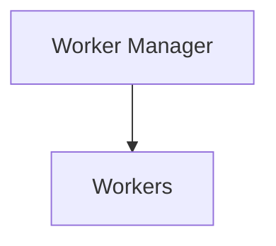
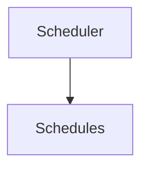
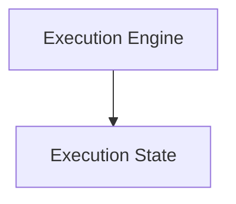
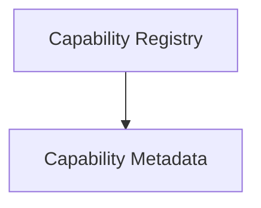
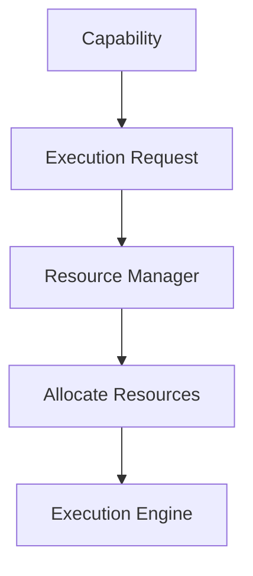
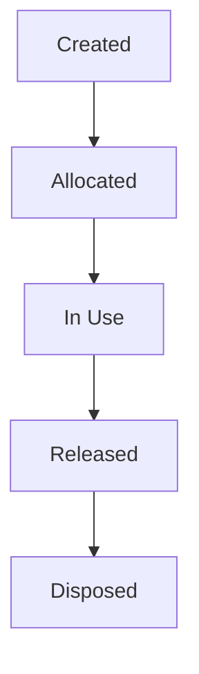
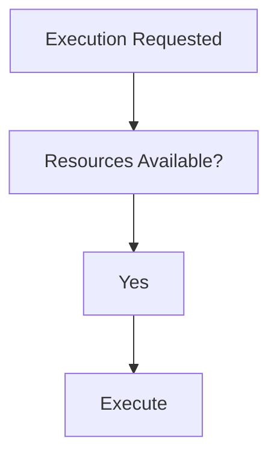
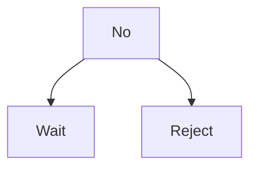
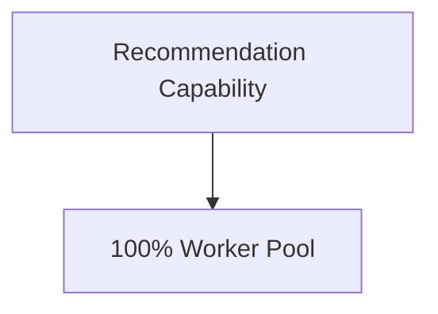

<!--
File: docs/engineering/guides/meg-005-runtime-architecture/09-resource-management.md
Document: MEG-005
Status: Draft
Version: 0.4
-->

# Resource Management

> *Resources are finite. The Runtime exists to allocate them deliberately rather than accidentally.*

---

# Purpose

Every long-running platform operates within finite constraints.

Examples include:

- CPU
- memory
- worker capacity
- database connections
- blob storage
- network bandwidth
- file handles

The Runtime is responsible for ensuring these resources are:

- allocated
- monitored
- protected
- reclaimed

Business capabilities should never concern themselves with resource management.

They should simply request execution.

The Runtime determines whether sufficient resources exist.

---

# Philosophy

Within Mosaic:

> **Capabilities consume resources. The Runtime owns them.**

Resources belong to the Runtime.

Capabilities borrow them.

This separation ensures that business behaviour remains independent of operational constraints.

Operating systems are commonly described as resource managers because they allocate finite resources while protecting overall system stability.  [cis.temple.edu](https://cis.temple.edu/~giorgio/cis307/readings/intro.html)

---

# What Is A Resource?

Within the Runtime, a resource is anything with finite availability.

Examples include:

- workers
- memory
- CPU time
- database pools
- blob storage clients
- HTTP clients
- scheduler capacity
- queue capacity

Resources should be treated consistently regardless of implementation.

---

# Resource Ownership

Every Runtime resource has exactly one owner.

Examples.









Ownership answers:

- who allocates
- who monitors
- who releases
- who reports health

Shared ownership should be avoided.

---

# Resource Allocation

Resources should be allocated explicitly.

Conceptually.



Capabilities should never allocate Runtime resources directly.

---

# Resource Lifetime

Every resource follows the same conceptual lifecycle.



Resources should never remain allocated indefinitely.

Ownership implies responsibility for release.

---

# Resource Pools

Finite resources SHOULD generally be managed through pools.

Examples include:

```

Database Connections
```

```

HTTP Clients
```

```

Blob Clients
```

```

Workers
```

Pooling improves:

- predictability
- reuse
- observability

Resource creation should not occur for every request.

---

# Resource Limits

Every managed resource SHOULD have explicit limits.

Examples include:

```

Maximum Workers
```

```

Maximum Queue Size
```

```

Maximum Connections
```

```

Maximum Concurrent Imports
```

Unlimited resources are prohibited.

Finite limits enable predictable Runtime behaviour.

---

# Resource Admission

Before execution begins, the Runtime SHOULD determine whether sufficient resources exist.

Conceptually.



or



Admission control protects overall Runtime stability.

---

# Resource Exhaustion

Suppose:

```

Worker Pool Full
```

The Runtime should:

- queue work
- apply backpressure
- expose metrics

It should not:

- create unlimited workers
- ignore limits
- exhaust memory

Graceful degradation is always preferable to uncontrolled growth.

---

# Memory

Memory is a shared Runtime resource.

Capabilities should avoid:

- retaining unnecessary state
- caching indefinitely
- allocating unbounded collections

Long-lived allocations should remain visible to the Runtime.

Memory ownership should always be explicit.

---

# Connection Management

External connections belong to infrastructure.

Examples include:

- PostgreSQL
- Redis
- TMDB
- Blob Storage

Connections SHOULD be:

- pooled
- reused
- monitored
- released

Capabilities should consume abstractions.

Not connections.

---

# Resource Isolation

Capabilities should never monopolise Runtime resources.

Example.



The Runtime should ensure fair allocation across capabilities.

No single capability should destabilise the platform.

---

# Resource Accounting

Every significant resource SHOULD be measurable.

Examples include:

- allocated workers
- active executions
- queue utilisation
- database pool usage
- memory usage

Operators should always understand where Runtime resources are being consumed.

---

# Resource Reclamation

Unused resources SHOULD be reclaimed automatically.

Examples include:

- idle workers
- expired schedules
- abandoned execution state
- unused connections

The Runtime should minimise resource leakage over long periods of execution.

---

# Capability Quotas

The Runtime MAY impose capability-level quotas.

Examples include:

- maximum concurrent executions
- maximum scheduled work
- memory budgets
- worker allocation limits

Quotas prevent one capability from exhausting shared Runtime resources.

---

# Resource Health

Every managed resource SHOULD expose health information.

Examples include:

```

Healthy
```

```

Near Capacity
```

```

Exhausted
```

Health should influence Runtime decisions before failures occur.

---

# Observability

Resource Management SHOULD expose:

- resource utilisation
- allocation rate
- release rate
- exhaustion events
- queue growth
- capacity trends

Resource usage should become one of the most observable aspects of the Runtime.

---

# Resource Policies

Allocation policies SHOULD remain configurable.

Examples include:

- fair sharing
- priority-based allocation
- reserved capacity
- adaptive scaling

Policies should evolve independently from business capabilities.

Capabilities request execution.

Policies decide resource allocation.

---

# Resource Independence

The Resource Manager should remain independent from:

- scheduling
- worker implementation
- execution strategy

It provides resource information.

Other Runtime components consume it.

Responsibilities remain intentionally separated.

---

# Anti-Patterns

The following practices are prohibited.

## Unlimited Allocation

Allocating resources without defined limits.

---

## Capability-Owned Resources

Capabilities creating and managing shared Runtime resources.

---

## Hidden Pools

Private connection pools outside Runtime management.

---

## Resource Leaks

Failing to release owned resources after execution completes.

---

## Ignoring Resource Pressure

Continuing to admit work despite exhausted Runtime capacity.

---

## Shared Ownership

Multiple Runtime components claiming responsibility for the same resource.

---

# Mosaic Guidelines

Within Mosaic:

- Every Runtime resource MUST have one owner.
- Resources MUST remain finite.
- Resource allocation MUST remain explicit.
- Resource pools SHOULD be preferred for reusable infrastructure.
- Resources MUST be released after use.
- Capability quotas MAY be applied where appropriate.
- Resource usage MUST remain observable.
- Resource exhaustion MUST trigger graceful degradation rather than uncontrolled growth.
- Business capabilities MUST remain unaware of Runtime resource management.

---

# Relationship to MEG

The Scheduler determines:

> **When work becomes executable.**

The Resource Manager determines:

> **Whether sufficient Runtime resources exist to execute that work safely.**

The next chapter introduces **Startup**, describing how the Runtime Kernel transforms a collection of Runtime Services and Capabilities into a fully operational platform.

---

# Summary

Resource Management is one of the Runtime's primary responsibilities.

It ensures that:

- finite resources remain available
- capabilities coexist fairly
- Runtime stability is preserved
- operational behaviour remains predictable

Within Mosaic, business capabilities should never think about resource allocation.

They should simply perform business behaviour.

The Runtime exists to ensure the necessary resources are available to make that possible.
