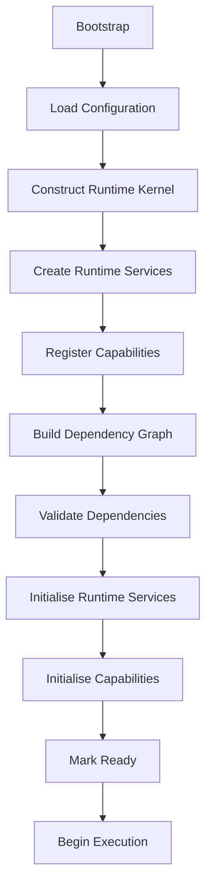
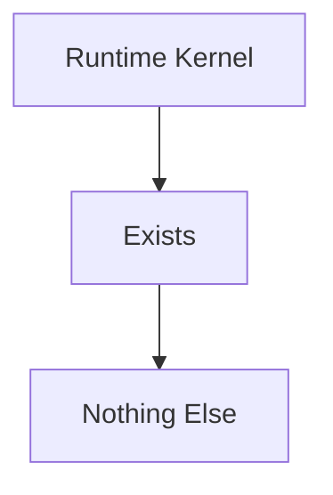
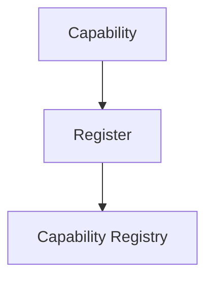
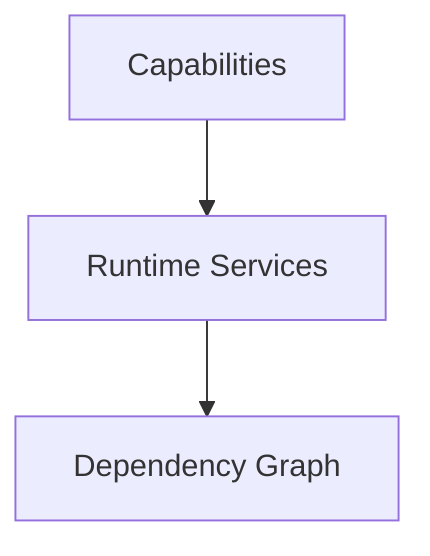
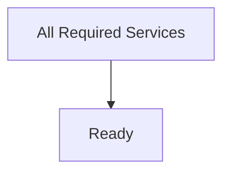
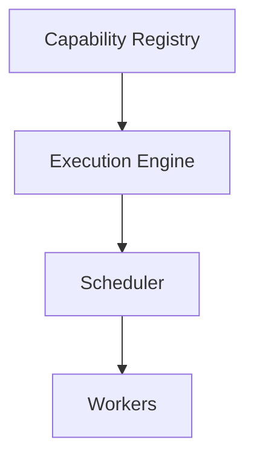
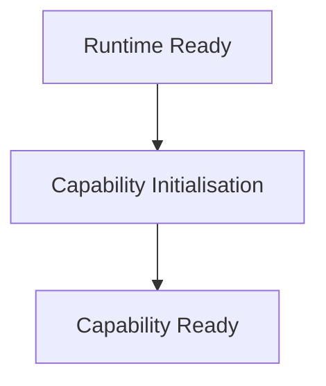
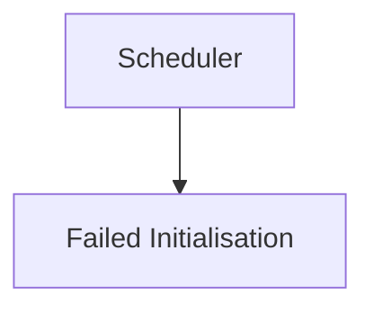

<!--
File: docs/engineering/guides/meg-005-runtime-architecture/10-startup.md
Document: MEG-005
Status: Draft
Version: 0.4
-->

# Startup

> *Startup should not be a sequence of function calls. It should be the controlled transition of a Runtime from potential to operation.*

---

# Purpose

Starting the Mosaic Runtime is significantly more complex than simply calling:

```go
main()
```

The Runtime must:

- validate configuration
- construct infrastructure
- build the dependency graph
- register capabilities
- initialise runtime services
- verify dependencies
- expose health
- begin execution

Every step depends upon the previous one.

This document defines the canonical startup sequence of the Mosaic Runtime.

---

# Philosophy

Within Mosaic:

> **Startup is deterministic, observable and dependency driven.**

The Runtime should never rely upon:

- hidden initialisation
- implicit ordering
- global state
- startup side effects

Every startup transition should be:

- explicit
- repeatable
- observable

The Runtime should always start the same way.

---

# Startup Goals

A successful startup should produce a Runtime that is:

- fully initialised
- dependency validated
- operationally healthy
- ready to execute work

No business capability should begin execution until these conditions have been satisfied.

---

# Startup Sequence

Every Runtime instance follows the same high-level sequence.



Every stage owns exactly one responsibility.

This staged approach mirrors the startup sequence of mature operating systems, where the kernel, foundational services and applications initialise in dependency order.  [QNX](https://qnx.com/developers/docs/7.1/com.qnx.doc.neutrino.fastboot/topic/fb_system_startup_architecture.html)

---

# Stage 1 — Bootstrap

The executable begins.

Responsibilities include:

- process creation
- signal registration
- initial logging
- panic handling

No Runtime Services exist yet.

Only the bootstrap environment.

---

# Stage 2 — Configuration

Configuration is loaded before any Runtime component exists.

Examples include:

- database configuration
- worker limits
- scheduler configuration
- capability configuration
- module configuration

Configuration should be validated immediately.

Invalid configuration should terminate startup.

Not execution.

---

# Stage 3 — Runtime Kernel

The Runtime Kernel is constructed.

At this point:



The Kernel becomes responsible for coordinating every remaining startup stage.

No Runtime Service should exist before the Kernel.

---

# Stage 4 — Runtime Services

Platform Runtime Services are constructed.

Examples include:

```

Capability Registry
```

```

Execution Engine
```

```

Worker Manager
```

```

Scheduler
```

```

Resource Manager
```

Construction should remain lightweight.

Heavy initialisation belongs later.

---

# Stage 5 — Capability Registration

Capabilities register themselves with the Runtime.



Registration should collect:

- identity
- version
- dependencies
- lifecycle
- metadata

Capabilities should not begin execution yet.

---

# Stage 6 — Dependency Graph

The Runtime constructs the dependency graph.



This graph becomes the authoritative startup model.

Startup order should emerge from the graph.

Not handwritten code.

---

# Stage 7 — Validation

Before any execution begins, the Runtime validates:

- dependency cycles
- missing dependencies
- version compatibility
- configuration completeness
- capability conflicts

Failure should terminate startup immediately.

Partial Runtime startup is discouraged.

Failing fast during startup is generally preferable to discovering dependency failures during execution.  [QNX](https://qnx.com/developers/docs/7.1/com.qnx.doc.neutrino.fastboot/topic/fb_system_startup_architecture.html)

---

# Stage 8 — Initialisation

Runtime Services initialise.

Examples include:

- creating worker pools
- opening connection pools
- preparing schedulers
- allocating resources

Capabilities then initialise.

Initialisation prepares the Runtime.

It does not begin execution.

---

# Stage 9 — Readiness

Every Runtime Service reports readiness.

The Runtime Kernel waits until:



Only then may the Runtime become operational.

Readiness should be explicit.

Never assumed.

---

# Stage 10 — Execution

The Runtime enters:

```

Running
```

Examples include:

- scheduler begins scheduling
- execution engine accepts work
- workers begin processing
- capabilities become operational

Startup is now complete.

The Runtime transitions into its steady operational state.

---

# Startup Ordering

Ordering should always be dependency driven.

Example.



Not.

```go
StartRegistry()

StartScheduler()

StartWorkers()
```

Manual ordering should be avoided wherever practical.

---

# Parallel Initialisation

Independent components SHOULD initialise concurrently.

Example.

```

Observability
```

and

```

Blob Storage
```

may initialise simultaneously if neither depends upon the other.

The dependency graph determines safe parallelism.

---

# Capability Initialisation

Capabilities initialise after Runtime Services.

Conceptually.



Capabilities should assume:

Every required Runtime Service already exists.

---

# Startup Failure

Suppose:



The Runtime should:

- abort startup
- dispose initialised services
- release resources
- exit cleanly

Continuing with a partially initialised Runtime should generally be prohibited.

---

# Startup Recovery

Startup should be repeatable.

Every startup attempt should produce identical behaviour given identical configuration.

Startup should never depend upon:

- previous execution
- cached Runtime state
- hidden globals

Determinism simplifies both operations and debugging.

---

# Startup Observability

Every stage SHOULD emit structured Runtime events.

Examples include:

```

RuntimeBootstrapping
```

```

CapabilityRegistered
```

```

DependencyGraphValidated
```

```

RuntimeReady
```

Operators should always understand:

> **Where is startup currently?**

---

# Startup Timing

The Runtime SHOULD expose startup metrics.

Examples include:

- total startup duration
- dependency validation time
- capability registration time
- service initialisation time

Slow startup should become measurable.

Optimisation should follow evidence.

---

# Startup Extensibility

Adding a new Runtime Service should require:

- registration
- dependency declaration

It should **not** require rewriting startup logic.

The dependency graph should naturally integrate new Runtime Services.

---

# Anti-Patterns

The following practices are prohibited.

## Hidden Initialisation

Constructors performing heavy work automatically.

---

## Manual Startup Ordering

Hard-coded service startup sequences.

---

## Partial Runtime

Continuing execution despite failed dependency validation.

---

## Capability Startup Before Runtime

Capabilities executing before Runtime Services become ready.

---

## Global Mutable Startup State

Sharing startup information through package globals.

---

## Silent Startup Failure

Suppressing startup failures and attempting recovery without operator visibility.

---

# Mosaic Guidelines

Within Mosaic:

- Startup MUST be deterministic.
- Configuration MUST be validated before Runtime construction.
- Runtime Services MUST initialise before capabilities.
- Dependency validation MUST complete before execution begins.
- Startup ordering MUST follow the dependency graph.
- Startup SHOULD maximise safe parallelism.
- Startup MUST remain observable.
- Startup failures SHOULD terminate the Runtime cleanly.
- The Runtime MUST become fully ready before accepting work.

---

# Relationship to MEG

The Resource Manager determines:

> **Whether sufficient Runtime resources exist.**

Startup determines:

> **How those resources, Runtime Services and Capabilities become one operational platform.**

The next chapter introduces **Shutdown**, describing the symmetrical process through which the Runtime safely transitions from execution back to a fully stopped state.

---

# Summary

Startup is the Runtime's first responsibility.

A successful startup produces a Runtime that is:

- complete
- validated
- observable
- deterministic

Every later Runtime behaviour depends upon startup having established a correct operational foundation.

Within Mosaic, startup should feel less like launching an application and more like booting an operating system.
