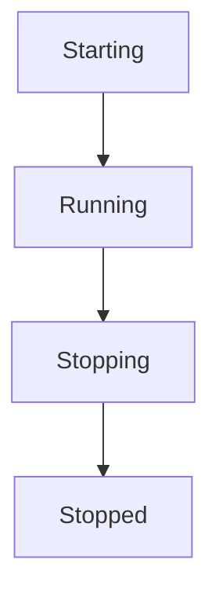
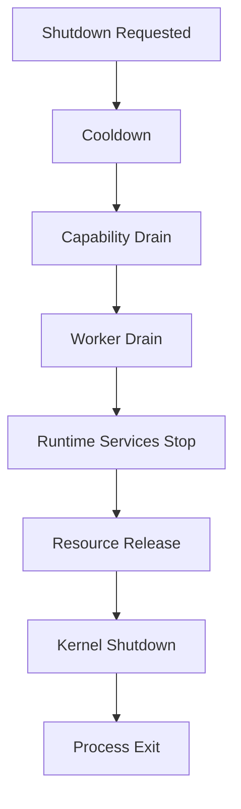
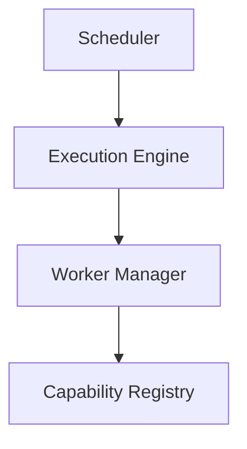
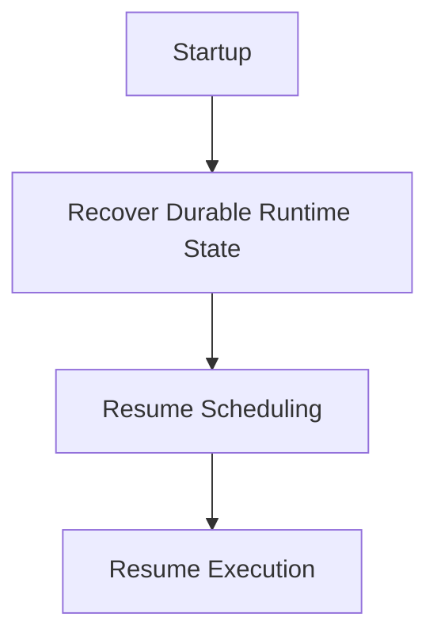
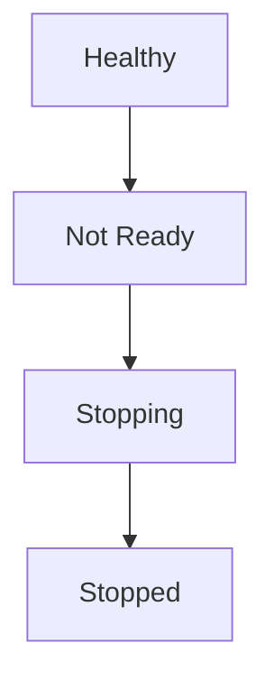

<!--
File: docs/engineering/guides/meg-005-runtime-architecture/11-shutdown.md
Document: MEG-005
Status: Draft
-->

# Shutdown

> *A Runtime should stop with the same discipline with which it starts. Shutdown is a lifecycle transition, not an emergency.*

---

# Purpose

Eventually every Runtime stops. Reasons include:

- deployment
- maintenance
- upgrade
- configuration changes
- host shutdown
- scaling
- operator request

Most of these are routine, which is precisely why stopping cannot be treated as an exceptional event. A controlled shutdown is one of the defining characteristics of a production-grade Runtime, so within Mosaic shutdown should be:

- deterministic
- observable
- graceful
- recoverable

Business correctness should always take priority over shutdown speed.

---

# Philosophy

Within Mosaic:

> **The Runtime should stop accepting new work before it stops existing work.**

Shutdown should never interrupt business behaviour unnecessarily. Instead, the Runtime should transition through well-defined phases until every component has safely completed its responsibilities.

---

# Runtime Lifecycle

Shutdown is one transition within a lifecycle the Runtime follows in full.



Only the Runtime moves between these states, and capabilities react to a transition rather than causing one. This is why shutdown can be ordered at all: a single owner decides when each phase begins, and no component has to infer from its peers that stopping has started. Lifecycle state is distinct from the health progression described later in this chapter, which reports what the Runtime is willing to serve rather than which phase it occupies.

---

# Shutdown Goals

Shutdown is judged by what survives it rather than by how quickly it finishes. A successful shutdown should ensure:

- no new work admitted
- active work completes where practical
- resources released
- Runtime state preserved
- capabilities stopped safely
- observability maintained

No Runtime component should disappear without first participating in the shutdown lifecycle, because a component that vanishes silently takes its resources and its in-flight work with it.

---

# Shutdown Sequence

Every Runtime follows the same shutdown sequence, in which each stage owns exactly one responsibility. The order is the reverse of startup, so what was built last is dismantled first.



This shape is the conventional one. Graceful shutdown in distributed systems commonly follows the same pattern: stop accepting new work, drain in-flight work, release resources and terminate cleanly.  [GeeksforGeeks](https://www.geeksforgeeks.org/system-design/graceful-shutdown-in-distributed-systems-and-microservices/)

---

# Stage 1 — Shutdown Requested

Shutdown is initiated from outside the Runtime rather than decided within it. It begins when the Runtime receives:

- SIGTERM
- SIGINT
- administrator request
- orchestrator request
- maintenance request

The Runtime immediately transitions into the Stopping state, and the Runtime Kernel now owns shutdown coordination. No component begins stopping on its own initiative.

---

# Stage 2 — Cooldown

Cooldown is the first stage that changes observable behaviour, and it changes exactly one thing:

> **No new externally initiated work is accepted.**

Admission closes at every entry point at once. Examples include:

- HTTP stops accepting requests
- schedulers stop creating work
- event consumers stop consuming
- module entry points close

Existing work continues, but new work does not begin. Cooldown is therefore distinct from draining, because it closes admission before anything attempts to complete work already in flight.  [Reddit](https://www.reddit.com/r/node/comments/1s4x8gp/application_lifecycle_is_one_of_the_most_ignored/)

---

# Stage 3 — Capability Drain

With admission closed, capabilities finish the existing business work they were already carrying. Examples include:

- playback updates
- metadata imports
- library scans
- recommendation generation

Capabilities should receive a cancellation requested notification, and they alone decide how to leave business state consistent. The Runtime never decides business correctness.

Long-running work should therefore observe cancellation rather than wait to be interrupted by it.

```go
ctx.Done()
```

A task that checks for cancellation periodically can clean up, return a meaningful status and avoid leaving partial state behind, whereas one that never checks will still be running when the shutdown budget expires and will be terminated mid-operation. Business correctness takes precedence over shutdown speed, but a capability that ignores cancellation entirely is what forces the Runtime into the forced termination it is trying to avoid.

---

# Stage 4 — Worker Drain

Workers continue executing remaining Work Units until their running tasks complete and the worker pool becomes idle. They should not begin executing newly admitted work, because only work already accepted should continue.

---

# Stage 5 — Runtime Services

Nothing may stop while business work is still running, so this stage cannot begin until the workers have drained. Runtime Services then begin stopping in a typical order.



Services stop according to the reverse dependency graph, so no service should outlive the services upon which it depends. The Scheduler goes first because everything downstream of it would otherwise keep receiving work.

---

# Stage 6 — Resource Release

Resources are released once the services holding them have stopped. Examples include:

- database pools
- blob storage
- HTTP servers
- timers
- worker pools
- network sockets

Every Runtime Service releases only the resources it owns, because ownership determines cleanup responsibility.

---

# Stage 7 — Kernel Shutdown

Once every Runtime Service has terminated, the Runtime Kernel reaches shutdown complete and records final Runtime state before process termination. At this point the Runtime no longer exists, and everything that needed to survive it has already been persisted.

---

# Admission Control

The Runtime should distinguish between external work and internal continuations. A `RecommendationGenerated` follow-up raised by a `PlaybackCompleted` event, for example, may still execute during draining because it belongs to an already admitted workflow, whereas new user requests should not. This distinction prevents partially completed business workflows while still allowing shutdown to complete predictably.  [Reddit](https://www.reddit.com/r/node/comments/1s4x8gp/application_lifecycle_is_one_of_the_most_ignored/)

---

# Shutdown Deadlines

Graceful shutdown should remain bounded, because draining that waits indefinitely is indistinguishable from a hang. Shutdown runs against a single budget covering every stage, defaulting to **30 seconds**, within which graceful completion is attempted; forced termination follows if that budget expires. The timeout should remain configurable, but infinite shutdown is prohibited.

The default is 30 seconds because the Runtime's budget must fit inside whatever grace period its supervising orchestrator allows, and 30 seconds is the Kubernetes default for `terminationGracePeriodSeconds`. A Runtime that budgets longer than its orchestrator grants is killed part-way through draining, which produces exactly the abandoned work and unreleased resources this chapter exists to prevent. Raising the Runtime timeout therefore requires raising the orchestrator grace period to match, and the two values should be changed together.

---

# Forced Shutdown

If graceful shutdown cannot complete within the configured deadline, the timeout triggers a forced stop. Forced shutdown should remain exceptional, and before termination the Runtime should make every reasonable attempt to:

- finish work
- persist state
- release resources

---

# Capability Behaviour

Capabilities should respond to shutdown through lifecycle notifications rather than by acting on the Runtime themselves. They should never:

- intercept process signals
- stop Runtime Services
- terminate workers

Lifecycle remains owned by the Runtime Kernel.

---

# Scheduler Shutdown

The Scheduler stops first, so its obligation is to close the source of new work without losing what has already been scheduled. It should:

- stop accepting new schedules
- persist recurring schedules
- preserve delayed work
- stop dispatching executable work

Scheduled work should survive controlled restarts where appropriate, which is why persistence happens as part of shutdown rather than being left to chance.

---

# Execution Engine Shutdown

The Execution Engine stops admitting before it stops tracking, since work already accepted still needs somewhere to report to. It should:

- reject new Work Units
- continue tracking active work
- report completion
- stop after all active execution ends

Execution should conclude before worker disposal begins, so the engine outlives the work it admitted.

---

# Worker Manager Shutdown

The Worker Manager holds the last resources still performing business work, which makes it the last thing that may be taken away. It should:

- stop allocating workers
- wait for active workers
- retire idle workers
- dispose worker pools

Worker disposal should occur only after execution completes, because a disposed pool cannot finish what the Execution Engine is still tracking.

---

# Capability Registry Shutdown

The Capability Registry should remain available until every capability has completed shutdown, and only then should it be disposed. Dependency information may still be required while shutdown is being coordinated.

---

# Restart Recovery

Shutdown is only half of the lifecycle, and the other half assumes nothing about how the previous one ended. Following restart, the Runtime recovers through a defined sequence.



Recovery should depend upon persisted Runtime state rather than upon graceful shutdown always succeeding, because the shutdowns most in need of recovery are the ones that did not complete.

---

# Observability

Shutdown should produce Runtime Events throughout, so that a drain in progress is distinguishable from a drain that is stuck. Examples include:

- RuntimeStopping
- CooldownStarted
- WorkerDraining
- RuntimeStopped

From these, operators should always understand:

- current shutdown phase
- remaining work
- blocked services
- timeout progress

Shutdown should never appear silent.

---

# Health

Health reporting changes before behaviour does, so that traffic is withdrawn while the Runtime can still serve it. During shutdown, health should transition through a defined progression.



The Runtime should become unavailable before terminating, which prevents additional work from entering during shutdown.

---

# Testing

Shutdown correctness is as important as startup correctness, so shutdown should be tested explicitly. Typical tests verify:

- cooldown
- draining
- dependency ordering
- timeout behaviour
- resource release
- restart recovery

Each of these is a path that only executes when the Runtime stops, which is exactly why it goes unexercised otherwise.

---

# Anti-Patterns

The following practices are prohibited.

## Immediate Exit

Calling:

```go
os.Exit(...)
```

without Runtime shutdown. Nothing drains, and nothing releases what it holds.

---

## New Work During Shutdown

Continuing to admit new Runtime work. Cooldown exists to close admission, and admitting work afterwards defeats every stage that follows.

---

## Worker Termination

Killing workers before active work completes. Existing work should complete where practical, and a terminated worker abandons it mid-flight.

---

## Hidden Cleanup

Background goroutines performing undisclosed shutdown behaviour. Cleanup that the Kernel does not coordinate cannot be ordered or observed.

---

## Runtime-Owned Business Decisions

The Runtime deciding which business work should be abandoned. That decision belongs to the capability that owns the work.

---

## Silent Failure

Suppressing shutdown failures without observability. Shutdown must remain observable, and a suppressed failure leaves the operator believing the Runtime stopped cleanly.

---

# Mosaic Guidelines

Within Mosaic:

- Shutdown must remain deterministic.
- Cooldown must occur before draining.
- New work must not be admitted during shutdown.
- Existing work should complete where practical.
- Runtime Services must stop in reverse dependency order.
- Resources must be released by their owners.
- Shutdown must remain observable.
- Restart recovery must not depend upon graceful shutdown always succeeding.
- Business correctness must remain more important than shutdown speed.

---

# Relationship to MEG

Startup explains:

> **How the Runtime becomes operational.**

Shutdown explains:

> **How the Runtime safely ceases operation.**

Together they define the complete operational lifecycle of the Mosaic Runtime. The next chapter introduces **Runtime State**, describing the operational information maintained by the Runtime throughout its lifetime.

---

# Summary

A mature Runtime is defined as much by how it stops as by how it starts. Within Mosaic, shutdown is:

- deliberate
- observable
- dependency aware
- resource aware
- business safe

The Runtime should leave the platform in a predictable state regardless of whether shutdown occurs because of deployment, maintenance or failure, and that predictability is one of the defining characteristics of a reliable platform.
