<!--
File: docs/engineering/guides/meg-005-runtime-architecture/12-runtime-state.md
Document: MEG-005
Status: Draft
Version: 0.4
-->

# Runtime State

> *Business state belongs to capabilities. Runtime state belongs to the Runtime. The two should never be confused.*

---

# Purpose

The Mosaic Runtime continuously maintains information describing its own operational condition.

Examples include:

- loaded capabilities
- worker utilisation
- scheduler status
- execution queues
- dependency graph
- health
- lifecycle

This information is essential for operating the platform.

It is **not** business information.

This document defines the Runtime State maintained by the Mosaic Runtime and establishes the boundary between operational state and business state.

---

# Philosophy

Within Mosaic:

> **The Runtime knows how the platform is operating. Capabilities know what the platform is doing.**

The Runtime should never own:

- playback progress
- library contents
- metadata
- recommendations

Capabilities should never own:

- worker state
- scheduler state
- execution queues
- lifecycle state

Each model remains independent.

---

# What Is Runtime State?

Runtime State is the operational state required for the Runtime to function.

Examples include:

- service lifecycle
- worker allocation
- active executions
- queue depth
- resource utilisation
- capability registration

Runtime State describes:

> **The execution environment.**

It does not describe:

> **The business.**

---

# Runtime State Categories

Runtime State naturally separates into several categories.

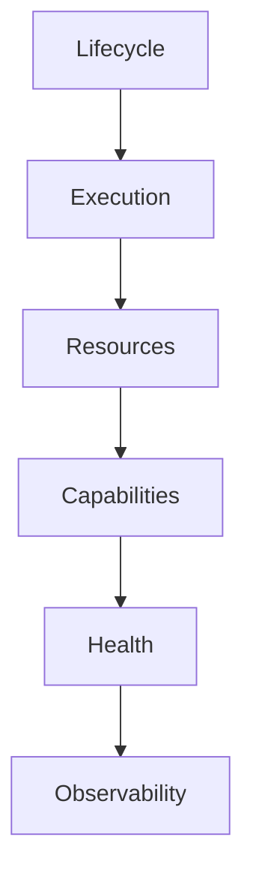

Each category represents one operational concern.

The Runtime should avoid mixing unrelated state.

---

# Lifecycle State

Lifecycle State records where Runtime components currently exist within their lifecycle.

Examples include:

```

Created
```

```

Ready
```

```

Running
```

```

Stopping
```

```

Disposed
```

This information belongs exclusively to the Runtime.

Capabilities participate.

They do not own it.

---

# Execution State

Execution State describes currently executing work.

Examples include:

- active Work Units
- queued work
- running workers
- execution latency
- execution completion

Execution State exists only while work is executing.

It should never become business state.

---

# Capability State

The Runtime maintains capability metadata.

Examples include:

- registered
- enabled
- disabled
- healthy
- failed
- version

This state describes:

```

Capability Availability
```

Not:

```

Capability Business State
```

For example.

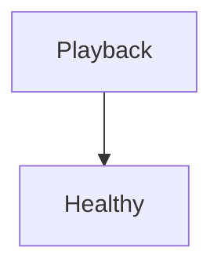

is Runtime State.

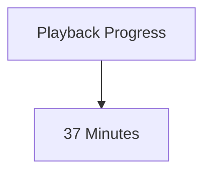

is business state.

The distinction should remain absolute.

---

# Resource State

Resource State describes Runtime resource usage.

Examples include:

- worker pool utilisation
- memory allocation
- queue capacity
- connection pools
- scheduler capacity

The Runtime owns these resources.

Business capabilities simply consume them.

---

# Dependency State

The Runtime maintains the dependency graph.

Examples include:

- dependency resolution
- blocked capabilities
- startup ordering
- shutdown ordering

This state enables deterministic Runtime behaviour.

It has no business meaning.

---

# Health State

Health represents operational readiness.

Examples include:

```

Healthy
```

```

Degraded
```

```

Unavailable
```

Health answers:

> **Can this component currently perform its operational responsibilities?**

It does not answer:

> **Is the business correct?**

Those are different questions.

---

# Observability State

The Runtime also maintains operational telemetry.

Examples include:

- traces
- metrics
- structured logs
- execution history
- queue history

Observability supports operators.

It should never influence business behaviour.

---

# Runtime State Ownership

Every category of Runtime State has exactly one owner.

Examples.

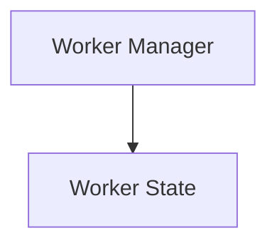

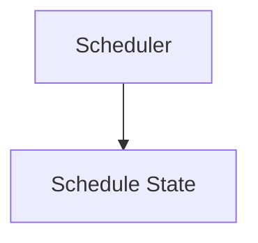

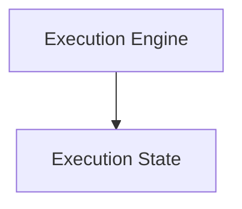

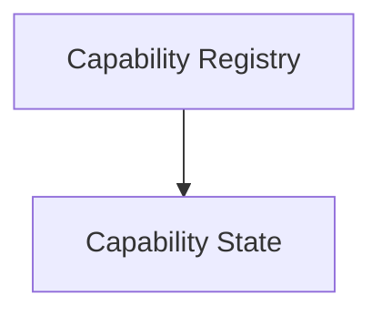

Shared ownership is prohibited.

Ownership determines:

- mutation
- persistence
- observability

---

# Runtime State Is Ephemeral

Most Runtime State is temporary.

Examples include:

```

Queue Depth
```

```

Worker Allocation
```

```

Active Execution
```

If the Runtime restarts:

This state naturally disappears.

Only durable Runtime State should survive restart.

---

# Durable Runtime State

Some Runtime State SHOULD survive restart.

Examples include:

- recurring schedules
- capability configuration
- dependency metadata
- runtime configuration

This information allows the Runtime to resume normal operation after restart.

Durability should remain deliberate.

Not automatic.

---

# Business State

Business State belongs exclusively to capabilities.

Examples include:

```

Playback Progress
```

```

Metadata
```

```

Library Contents
```

```

Collection Membership
```

The Runtime should never:

- mutate
- persist
- interpret

business state.

It merely provides the environment in which capabilities manage it.

---

# Runtime State Transitions

Runtime State changes frequently.

Example.

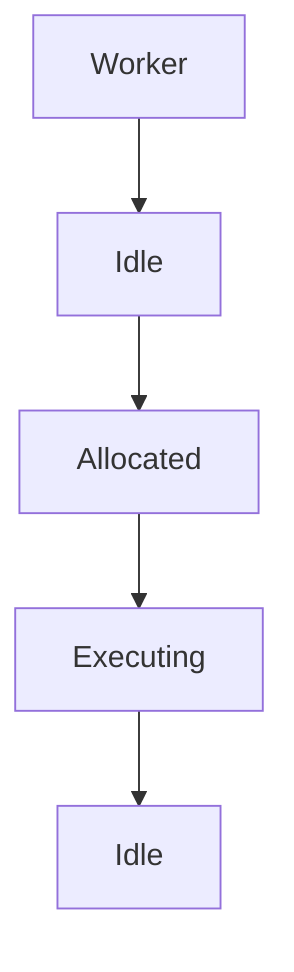

These transitions should remain:

- deterministic
- observable
- inexpensive

Operational correctness depends upon them.

---

# Runtime Snapshots

The Runtime MAY expose snapshots of operational state.

Examples include:

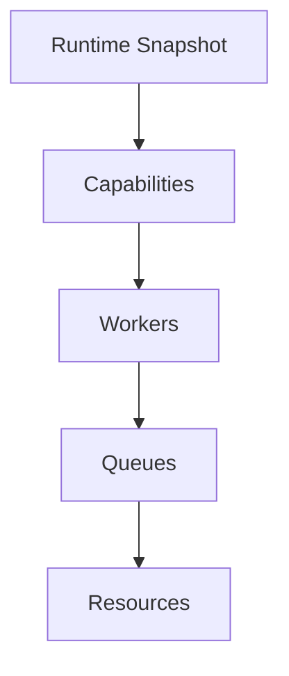

Snapshots assist:

- diagnostics
- support
- monitoring
- debugging

Snapshots should remain read-only.

They describe the Runtime.

They do not control it.

---

# Runtime State Is Not Configuration

Configuration describes:

> **How the Runtime should operate.**

Runtime State describes:

> **How the Runtime is currently operating.**

These concepts should remain separate.

Configuration changes are infrequent.

Runtime State changes continuously.

---

# Runtime State Is Not Cache

Likewise.

Runtime State is not:

```

Business Cache
```

Business caching belongs to capabilities.

Runtime State exists solely to support Runtime operation.

The two should never be conflated.

---

# Runtime State Recovery

Following restart:

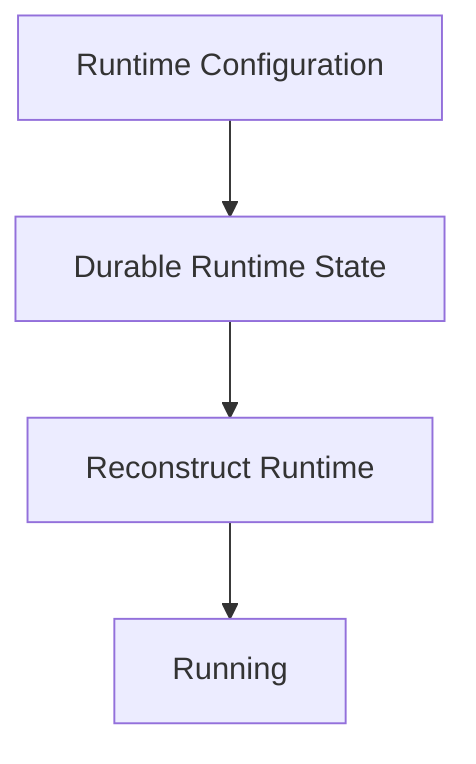

Temporary Runtime State should not be restored unnecessarily.

Only operationally valuable state should persist.

---

# Observability

Runtime State SHOULD be observable.

Operators should be able to answer:

- What is running?
- What is waiting?
- Which capabilities exist?
- Which workers are active?
- Which resources are constrained?

The Runtime should explain itself continuously.

---

# Anti-Patterns

The following practices are prohibited.

## Business State Inside Runtime

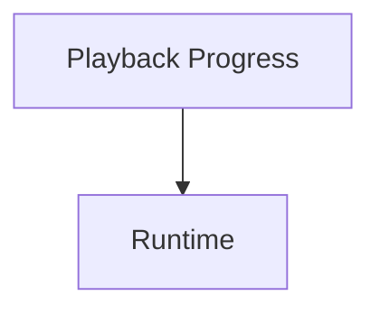

---

## Runtime State Inside Domain

Aggregates storing:

- worker IDs
- queue depth
- scheduler metadata

---

## Shared Ownership

Multiple Runtime components mutating the same Runtime State.

---

## Permanent Execution State

Persisting transient execution information unnecessarily.

---

## Runtime Decisions Using Business State

The Runtime should remain operationally focused.

Business decisions belong to capabilities.

---

## Capabilities Reading Runtime Internals

Capabilities depending upon queue depth or worker allocation.

---

# Mosaic Guidelines

Within Mosaic:

- Runtime State MUST remain operational.
- Business State MUST remain inside capabilities.
- Every Runtime State category MUST have one owner.
- Runtime State SHOULD remain observable.
- Temporary Runtime State SHOULD remain ephemeral.
- Durable Runtime State SHOULD be explicitly identified.
- Runtime State MUST NOT leak into the Domain.
- Configuration MUST remain separate from Runtime State.
- Runtime State SHOULD describe execution, not business.

---

# Relationship to MEG

Startup and Shutdown define:

> **How the Runtime begins and ends.**

Runtime State defines:

> **What the Runtime knows about itself while it exists.**

The next chapter provides practical Runtime Architecture guidance for contributors implementing new Runtime Services and evolving the Runtime over time.

---

# Summary

The Runtime maintains one model.

Capabilities maintain another.

The Runtime's model describes:

- execution
- resources
- health
- lifecycle

Capabilities describe:

- business
- behaviour
- users
- media

Maintaining this separation is one of the most important architectural decisions within Mosaic.

It allows the Runtime to evolve operationally without ever becoming responsible for the business itself.  [Wikipedia](https://en.wikipedia.org/wiki/Architectural_state)
