<!--
File: docs/engineering/guides/meg-005-runtime-architecture/14-supervisor-model.md
Document: MEG-005
Status: Draft
Version: 0.4
-->

# Supervisor Model

> *The Supervisor is the immutable host manager that installs, activates, upgrades and recovers Mosaic Generations.*

---

# Purpose

Mosaic is a self-hosted media centre, but its architecture should behave more like a small operating system than a conventional web application.

The Platform should be replaceable.

The Shell should be replaceable.

Modules should be selected, composed and upgraded deliberately.

The Supervisor is the stable host-level process that makes those properties possible.

It exists outside Platform packages and Generations and remains available when the Platform or Shell fails.

It starts first, remains loaded for the lifetime of the Mosaic installation and owns health monitoring for the layers it manages.

The Supervisor is the recovery layer.

It must not be the thing that needs recovering.

The Supervisor also owns the public entry point into Mosaic.

The Platform should never expose itself directly to users.

---

# Philosophy

Within Mosaic:

> **The Supervisor owns Mosaic installation, generation activation, upgrade and recovery. The Platform owns media execution.**

The Supervisor should be the smallest durable layer a user installs.

It should understand enough about Mosaic to assemble and recover the system.

It should not become the media Platform itself.

The Supervisor orchestrates build and activation.

It does not contain build logic.

Build mechanics belong to the Build Pipeline.

---

# What Is The Supervisor?

The Supervisor is the always-running Mosaic manager.

It is responsible for:

- installing the Mosaic Shell
- running onboarding
- recording selected Mosaic functionality
- resolving selected Modules
- invoking the Build Pipeline
- validating produced Platform packages
- activating Mosaic Generations
- booting the active Generation
- monitoring Platform and Shell health
- preparing upgrades in the background
- switching to a prepared Generation when safe
- rolling back failed activations by reactivating a previous Generation
- exposing the public HTTP entry point
- emitting Recovery SDUI for recovery and diagnostics
- keeping the richest available interface alive during recovery

Conceptually.

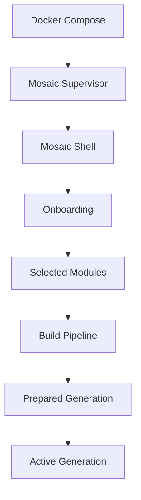

The Supervisor is not a Runtime Service inside the Platform.

It is the host-level manager that creates and supervises the Platform.

It should remain intentionally tiny, independently testable and dependency-light.

Its role is closer to a bootloader than an application framework.

The Supervisor is not:

- a package manager,
- a plugin loader,
- the Platform,
- a compiler.

It is the runtime composition orchestrator.

It assembles a desired Mosaic runtime from selected Modules, invokes the Build Pipeline and activates the resulting Generation only after validation.

---

# Public Entry Point

The Supervisor is the only public entry point for Mosaic.

All user traffic should enter through the Supervisor.

Conceptually.

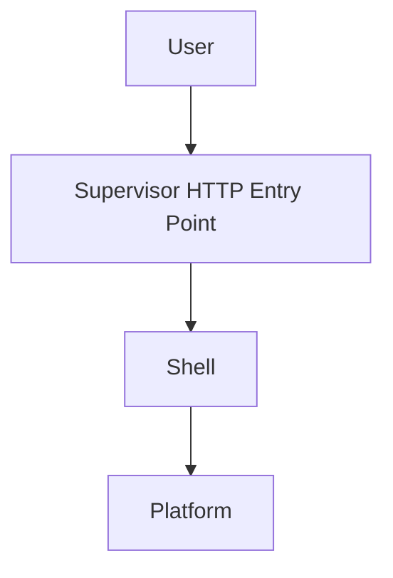

The Platform never serves UI directly.

When the Platform is healthy, the Supervisor routes the user toward the Shell and the Shell communicates with the Platform.

When the Platform is unavailable, the Supervisor emits Recovery SDUI and the Shell renders recovery state.

When the Shell is unavailable, the Supervisor serves the embedded recovery renderer.

---

# Interface Guarantee

Within Mosaic:

> **The Supervisor guarantees that there is always an intelligent interface available. The only thing that changes is how capable that interface is.**

Recovery should happen in layers.

The most capable available interface should always be used.

More primitive interfaces should appear only when richer interfaces are unavailable.

The user should not lose their interface simply because the Platform is unavailable.

---

# Recovery Hierarchy

Mosaic recovery follows a strict hierarchy.

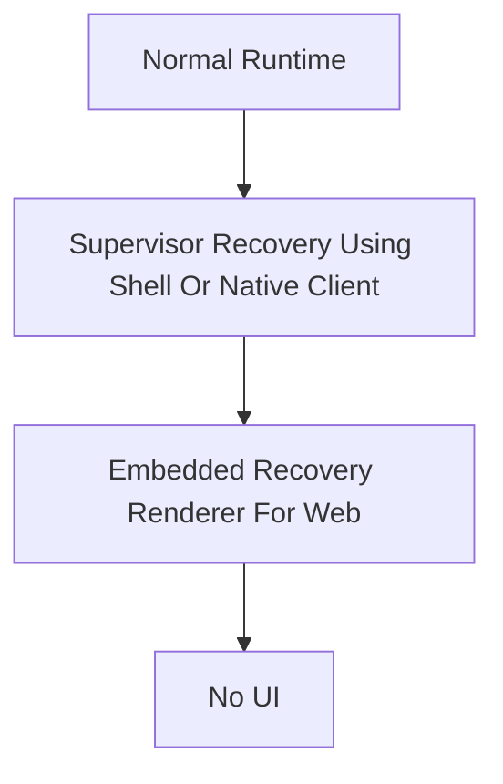

The user should almost never see the final layer.

During normal operation, the Shell renders Runtime SDUI from the Platform.

During Platform recovery, the Shell remains active and renders Recovery SDUI from the Supervisor.

Native clients use their own renderer to present the same Recovery SDUI directly from the Supervisor.

Only when the Web Shell is unavailable does a browser fall back to the embedded recovery renderer.

No UI means catastrophic failure in which neither a client renderer nor the embedded Web recovery path can communicate with the Supervisor.

The Presentation Layer does not recover the Supervisor.

It keeps an interface available while the Supervisor recovers the Platform or Web Shell.

---

# System Hierarchy

The Supervisor changes the Mosaic hierarchy.

Preferred.

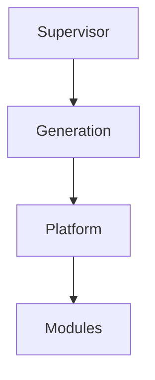

Avoid.

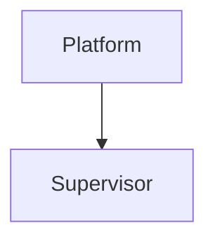

The thing responsible for recovery should not be the thing that needs recovering.

Everything above the Supervisor can be created, replaced, restarted or recovered by the Supervisor.

---

# Supervisor Immutability

The Supervisor should behave like Mosaic's boot layer.

It should be:

- intentionally tiny
- rarely changed
- independently testable
- dependency-light
- capable of recovering the rest of Mosaic

The Supervisor may be upgraded deliberately, but its design should resist frequent change.

Most Mosaic evolution should occur in Generations, Platform packages, Shell releases and Modules.

The Supervisor should remain stable enough that users can rely on it when every other Mosaic layer fails.

---

# Installation Boundary

A self-hosted user should be able to add Mosaic to a Docker Compose file and start the Supervisor.

The Supervisor then prepares the rest of Mosaic immediately.

Bootstrap begins when the Supervisor starts.

It must not wait for a browser connection or user action.

Initial installation should follow this shape.

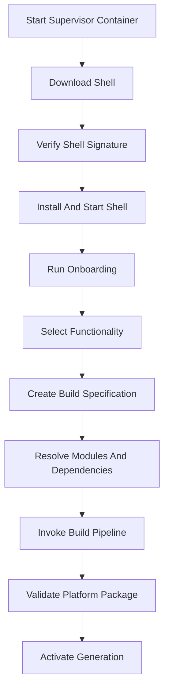

The user should not manually assemble Platform packages.

The Supervisor owns orchestration of that composition step.

The Build Pipeline owns the mechanics of producing the package.

The normal installation path must not ask the user to enter recovery or click a `Build Mosaic` action before onboarding.

The Supervisor should be the first Mosaic component to start and the last to stop.

---

# Shell Relationship

The Shell is the normal Mosaic presentation layer for the web.

The Supervisor installs and starts the Shell.

The Shell should render user-facing onboarding, normal administration and the operational facade over the Platform.

The Supervisor owns onboarding state and flow until the Platform is ready.

The Supervisor should retain enough authority to recover or reinstall the Shell if it fails.

The Shell is therefore managed by the Supervisor, but it is not the Supervisor.

The Platform does not present itself directly.

The Shell presents the Platform.

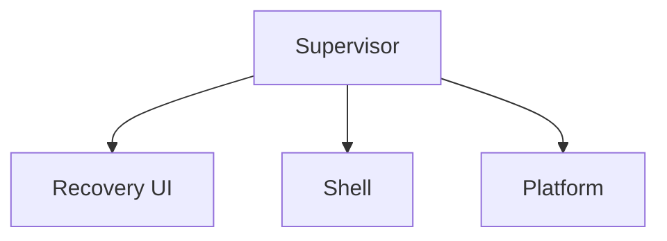

The Shell is the operational facade over Mosaic.

It should stay available during Platform failure whenever possible.

If the Platform disconnects, the Shell should reconnect to the Supervisor and render Recovery SDUI.

The user remains inside the Shell while the Supervisor restarts, rolls back or repairs the Platform.

---

# Onboarding Relationship

During onboarding, the user selects the functionality Mosaic should have.

Examples include:

- media features such as Anime, Movies, TV and Music
- providers such as AniList, TMDB and Jellyfin
- optional Modules
- update channels
- the generated Build Specification

The selected functionality determines which Modules participate in the Platform composition.

Onboarding produces a desired Mosaic Generation.

The Supervisor turns that desired Generation into an activated system by resolving Modules, invoking the Build Pipeline and activating the produced package.

The Platform does not need to exist during onboarding.

The Supervisor should query the Module Catalogue and derive onboarding choices from Module manifests.

The Shell must not hardcode the available Module set.

When a Module appears in the Module Catalogue, its manifest metadata should make it available as an onboarding candidate without requiring a Shell release.

Final compatibility is established only during admission and dependency validation.

[MEG-006](../meg-006-module-platform/index.md) defines Module Catalogue discovery.

[MIP-002](../../protocols/mip-002-module-manifest-protocol/index.md) defines the manifest metadata available to catalogue and onboarding clients.

The onboarding flow may be:

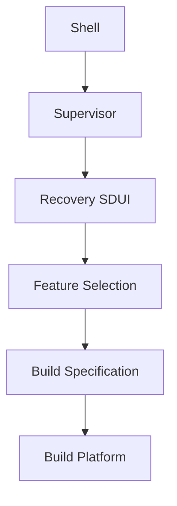

After onboarding completes, the Supervisor builds and validates the Platform package, starts the Platform, and the Shell switches to Runtime SDUI.

Onboarding uses Recovery SDUI because the Platform does not yet exist and therefore cannot produce Runtime SDUI.

The Build Specification is the declarative result of onboarding.

Conceptually.

```yaml
runtime:
  channel: stable
features:
  - anime
  - movies
providers:
  metadata:
    - anilist
    - tmdb
modules:
  - playback
  - recommendations
```

The Supervisor uses the Build Specification to orchestrate manifest and dependency resolution, SDK compatibility validation, Module acquisition and isolated Build Workspace preparation.

The Build Pipeline owns the mechanics of acquiring build inputs and preparing the Build Workspace.

The Build Specification describes the desired runtime composition.

It does not contain build mechanics.

---

# Module Composition

Modules are Go libraries that implement the Mosaic SDK and declare their contracts through the Module system.

Examples include:

- Jellyfin adapter
- metadata provider
- artwork provider
- storage provider
- external integration runner

The Supervisor should not treat Modules as dynamic Runtime patches.

It should resolve the selected Modules and invoke the Build Pipeline to produce a concrete Platform package.

The Supervisor should never know how to compile Modules.

Build logic belongs to the Build Pipeline.

[MEG-006](../meg-006-module-platform/index.md) defines how Modules participate in Mosaic.

[MIP-002](../../protocols/mip-002-module-manifest-protocol/index.md) defines how Module manifests describe identity, dependencies, permissions and compatibility.

---

# Build Pipeline

The Build Pipeline is responsible for producing Platform packages.

It consumes:

- Platform foundation
- selected Modules
- resolved SDK contracts
- validated configuration

The Supervisor invokes the Build Pipeline.

The Build Pipeline produces a candidate Platform package.

The Supervisor validates and activates that package as part of a Generation.

This keeps build logic out of the Supervisor.

---

# Supervisor Build Pipeline

The Supervisor Build Pipeline describes the orchestration flow from a desired runtime composition to an activated Generation.

The Supervisor owns orchestration, policy, progress, diagnostics and activation.

The Build Pipeline owns build mechanics.

The source repository is never modified during this process.

While the Build Pipeline runs, the Supervisor should emit Recovery SDUI containing:

- overall progress
- current build stage
- relevant logs
- estimated completion when a meaningful estimate is available

The Shell remains loaded and renders those updates throughout the build.

Every build occurs in an isolated workspace and produces a candidate Platform package before activation.

Conceptually.

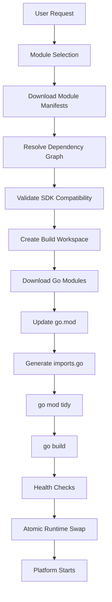

The pipeline is closer to a compiler toolchain than a traditional package manager.

It assembles a bespoke Mosaic runtime from declarative Module manifests and produces a deterministic executable.

---

# Build Triggers

A build may be initiated by:

- first installation
- enabling Modules
- disabling Modules
- Platform upgrade
- SDK upgrade
- Module update
- rollback preparation
- development environment

The Supervisor determines the desired runtime composition before invoking the Build Pipeline.

---

# Manifest Resolution

The Supervisor downloads or reads each selected Module manifest.

The manifest is the Supervisor's source of truth for:

- SDK requirements
- capabilities
- dependencies
- permissions
- published events
- subscribed events

The Supervisor never analyses Go source code to discover those declarations.

If manifest resolution fails, the build ends before dependency resolution or compilation.

---

# Dependency Validation

The Supervisor builds the complete dependency graph before compilation.

It validates:

- required Modules
- compatible versions
- SDK compatibility
- duplicate registrations
- missing capabilities
- required permissions
- contract availability

If validation fails, the build terminates before compilation begins.

The previous active Generation remains untouched.

---

# Build Workspace

The Supervisor creates a temporary build workspace for each candidate Generation.

Conceptually.

```text
workspace/

    platform/
    sdk/
    modules/
    generated/
```

Every build starts from a clean workspace.

The workspace protects source repositories from mutation and makes build inputs explicit.

The Supervisor must not modify the Platform source repository or Module source repositories while preparing a Generation.

---

# Go Dependency Management

Go remains responsible for resolving library dependencies.

The Build Pipeline updates the temporary `go.mod`.

Example.

```text
go mod edit -require=github.com/mosaic/module-anilist@v1.2.0
```

Then:

```text
go mod tidy
```

The Supervisor observes progress and diagnostics.

It does not implement Go dependency resolution itself.

---

# Automatic Module Discovery

Go only compiles imported packages.

Rather than modifying Platform source code, the Build Pipeline generates exactly one integration source file.

```text
generated/

    imports.go
```

Example.

```go
package generated

import (
    _ "github.com/mosaic/module-anilist"
    _ "github.com/mosaic/module-playback"
    _ "github.com/mosaic/module-jellyfin"
)
```

Blank imports ensure every selected Module package's `init()` function executes at Platform startup.

This is the only generated Go source required for Module discovery.

[MEG-006](../meg-006-module-platform/index.md) governs the generated imports boundary.

---

# Runtime Registration

At startup, each selected Module registers itself with the SDK.

Example.

```go
func init() {
    sdk.Register(NewModule())
}
```

Registration rules:

- registration only
- no I/O
- no configuration loading
- no networking
- no goroutines

The SDK registry becomes the Platform's runtime Module catalogue.

The Platform then asks:

```go
sdk.Modules()
```

and builds Capability Managers from registered Modules.

---

# Compilation Output

After dependency preparation and generated imports exist, the Build Pipeline runs:

```text
go build
```

The output is a single executable containing:

- Platform
- SDK
- every selected Module

There are no runtime plugins.

There is no dynamic loading.

The finished executable behaves like a single Go application while still being assembled from independently versioned Modules.

---

# Pre-Activation Health Checks

The Supervisor must never activate an unverified runtime.

Validation may include:

- successful startup
- HTTP readiness
- GraphQL readiness
- capability registration
- storage validation
- Shell connectivity
- package validation

Only healthy candidate runtimes may become active.

---

# Atomic Runtime Activation

The Supervisor stages runtimes before activation.

Conceptually.

```text
runtime/

    current/
    next/
    previous/
```

Activation follows this shape.

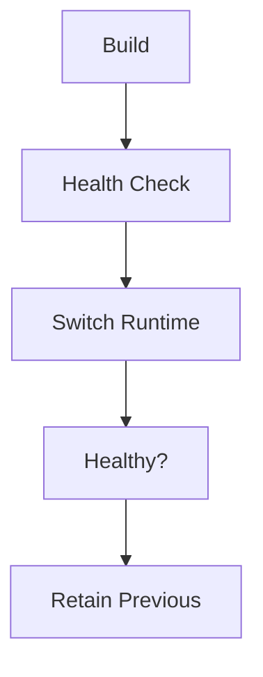

If activation fails:

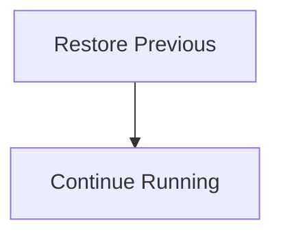

Rollback means reactivating a previous known good Generation.

Previous runtimes should be retained until later garbage collection policy permits deletion.

---

# Build Failure Handling

If any stage fails:

- manifest resolution
- dependency validation
- compilation
- health check
- activation

the Supervisor should:

- preserve the previous runtime
- report diagnostics
- present Recovery SDUI
- keep the richest available interface alive
- avoid leaving the user without feedback

Build failure should never corrupt the active Generation.

---

# Development Build Mode

Development uses the same architecture as production.

Conceptually.

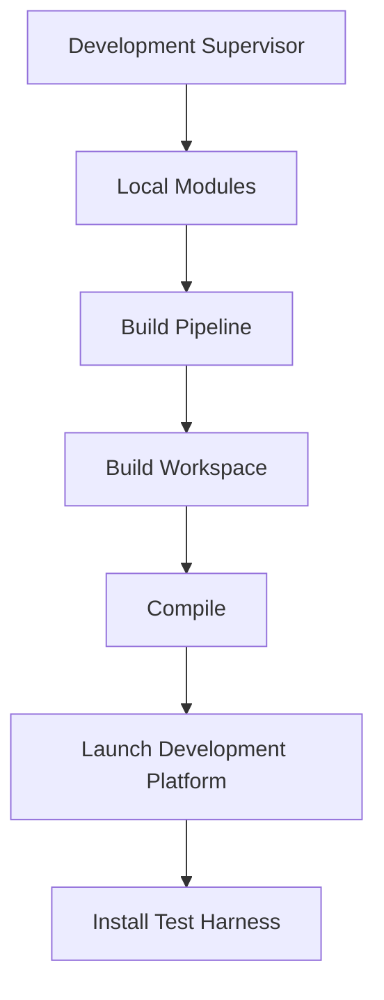

The Development Supervisor may optimise for feedback speed, but it must not introduce runtime plugin loading semantics.

Production and development should share the same static composition model.

The Development Supervisor owns file watching, local source mapping, rebuild requests, development activation and client notification.

The Build Pipeline retains ownership of Build Workspace preparation, generated imports, Go dependency operations and compilation.

[MEG-006](../meg-006-module-platform/index.md) defines the complete Developer Platform and Development Supervisor workflow.

---

# Generations

A Generation is an immutable installed Mosaic system version.

It contains the artefacts required to activate a coherent Mosaic installation.

Conceptually.

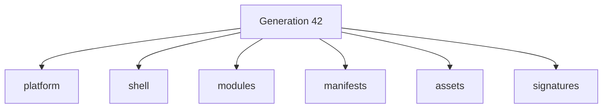

Only one Generation is active at a time.

Prepared Generations may exist before activation.

Previous known good Generations should be retained for rollback.

Rollback means activating an earlier Generation.

It should not mean undoing a sequence of mutations.

---

# Platform Package

A Platform package is the Platform artefact produced by the Build Pipeline and stored within a Generation.

The package includes the executable Platform output and the metadata required for validation and activation.

The Supervisor owns validation and activation of the package.

The running Platform owns media execution, Module lifecycle, scheduling, workers, Runtime State and business capability execution.

This preserves a clear boundary.

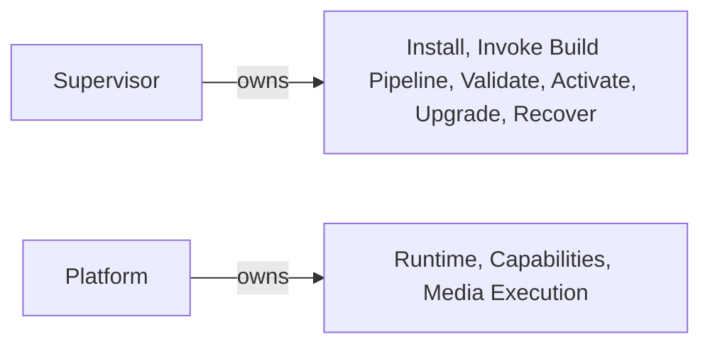

---

# Atomic Upgrade Model

The Supervisor should manage upgrades by preparing and activating Generations.

When a Platform upgrade is available, the Supervisor should:

- discover the available version
- download or prepare required artefacts
- resolve compatibility with selected Modules
- invoke the Build Pipeline
- create the next prepared Generation
- run pre-activation validation
- wait for a safe activation point
- atomically switch activation to the prepared Generation
- monitor post-activation health
- retain the previous known good Generation
- roll back by reactivating the previous Generation if activation fails

The current Generation should continue serving until the new Generation is prepared.

Upgrade should feel like a safe replacement, not an in-place mutation.

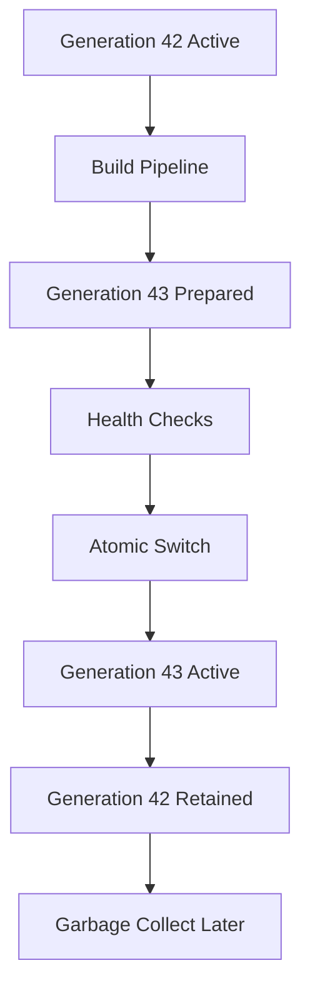

---

# Rollback Authority

Rollback is a core Supervisor capability.

The Supervisor may roll back:

- failed Generation activation
- failed Platform package activation
- failed Shell activation
- failed configuration activation
- incompatible Module composition

Rollback should activate the previous known good Generation.

Rollback should not attempt to repair corrupt media data or business state.

Those concerns require explicit recovery workflows.

---

# Recovery UI

The Supervisor must expose recovery UI capability that does not depend on the Platform.

The preferred recovery UI is rendered by the Shell.

The embedded recovery renderer is a last-resort browser bootstrap path owned by the Supervisor.

The embedded recovery renderer can run when the Shell cannot be used.

Examples include:

- Shell missing
- Shell corrupt
- Shell integrity verification failure
- Shell cannot be executed

The embedded recovery renderer should consist of:

- one HTML file
- inline CSS
- inline JavaScript

It must not depend on:

- external CSS files
- JavaScript bundles
- images
- fonts
- frameworks
- build pipeline

The recovery UI should behave like a firmware or BIOS-style surface.

It should be simple, local and dependable.

It should show:

- installed Generations
- active Generation
- previous known good Generation
- current activation state
- Platform status
- Build progress
- Runtime health
- storage checks
- package validation
- recent Platform boot failures
- Shell health
- failed upgrade attempt
- Module composition errors
- rollback status
- relevant logs and diagnostics
- available recovery actions
- rollback options
- safe restart options

The recovery UI should not become an alternate full administration interface.

It exists to diagnose and recover Mosaic when the normal system is unavailable.

It should know only about:

- installed Generations
- logs
- health
- configuration
- storage
- network
- diagnostics
- recovery actions

It must not know media semantics.

---

# Recovery SDUI

The Supervisor does not emit HTML.

It emits Recovery SDUI.

Recovery SDUI is intentionally smaller than Runtime SDUI.

It should support only recovery and diagnostics.

Examples include:

- Heading
- Paragraph
- Status
- Progress
- Button
- Form
- Table
- Log

The Shell, embedded recovery renderer and native clients may all render Recovery SDUI.

The Supervisor remains presentation independent.

Recovery SDUI is the only Supervisor-owned presentation contract.

The Supervisor does not produce Runtime SDUI, including during onboarding.

---

# Embedded Recovery Renderer

The embedded recovery renderer exists only for browser bootstrap and catastrophic Shell failure.

It converts Recovery SDUI into HTML inside the browser.

It should visually communicate control and transparency rather than beauty.

Recommended characteristics include:

- monospace typography
- minimal colours
- firmware or terminal aesthetic
- simple progress bars
- live logs
- basic controls

It should communicate one message:

> **The Supervisor is still in control.**

Native clients do not require the embedded recovery renderer because they already contain their own renderer.

---

# Supervisor State

Supervisor state is host management state.

Examples include:

- installed Supervisor version
- installed Generations
- active Generation
- candidate Generation
- previous known good Generation
- selected Module set
- build history
- activation history
- rollback points
- recovery diagnostics

Supervisor state should remain separate from Platform Runtime State and media business state.

---

# Failure Modes

The Supervisor should initially target the following failure modes.

| Failure Mode | Supervisor Response |
|--------------|---------------------|
| Platform package fails to boot | Keep or restore previous known good Generation and expose diagnostics. |
| Shell fails to start | Attempt Shell recovery and expose recovery UI. |
| Upgrade fails before activation | Keep current active Generation and report preparation failure. |
| Upgrade fails after activation | Reactivate previous known good Generation. |
| Module composition fails | Reject candidate composition and keep the active Generation. |
| Selected Module becomes incompatible | Block activation and explain compatibility failure. |
| Configuration activation fails | Roll back configuration or keep previous active configuration. |
| Platform repeatedly crashes | Stop restart loops, keep diagnostics and offer rollback or safe restart. |

The Supervisor should prefer preserving a known good system over repeatedly attempting a broken activation.

---

# Supervisor State Machine

The Supervisor behaves as a state machine.

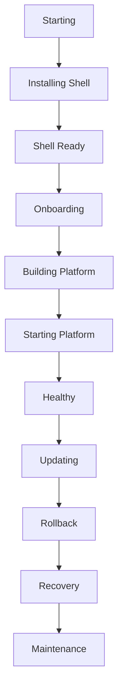

The browser, Shell and native clients render whichever state the Supervisor currently owns.

---

# Startup And Recovery Flows

The Supervisor begins Shell bootstrap as soon as its process starts.

This work should normally complete before the user opens Mosaic.

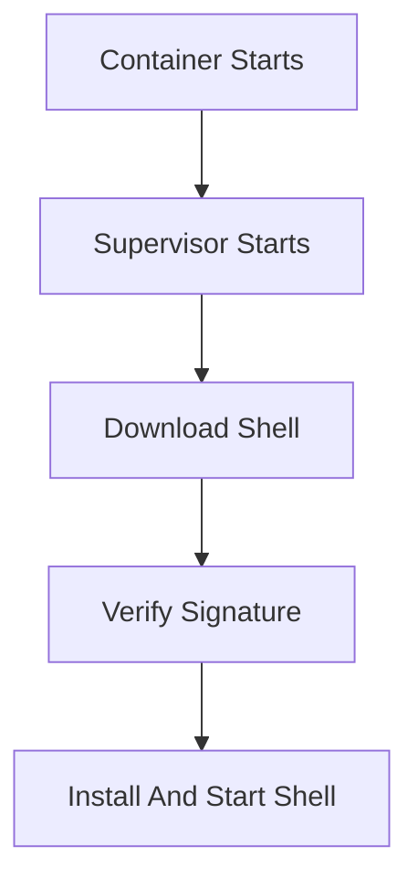

## First Visit With Shell Ready

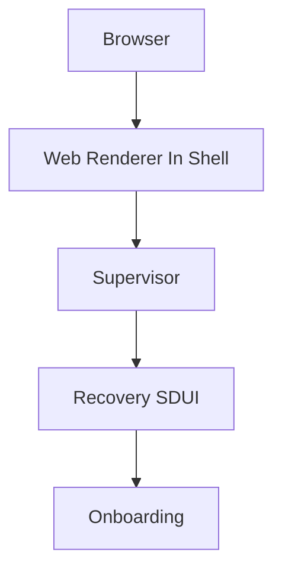

The embedded recovery renderer should not appear.

The Shell renders Supervisor-owned Recovery SDUI until the Platform exists and can provide Runtime SDUI.

## Shell Not Ready

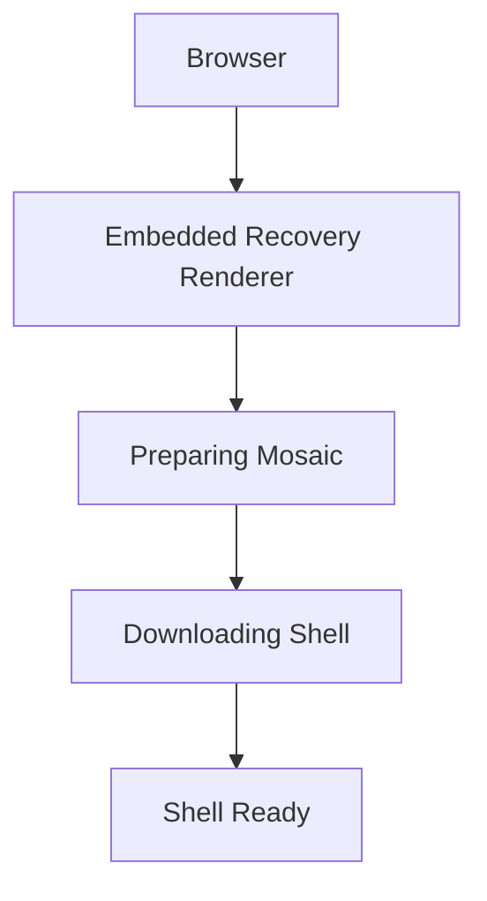

The Supervisor should transition into the Shell automatically when the Shell is ready.

The user should not need to refresh or take manual action.

The embedded renderer must not present a manual redirect or `Build Mosaic` button.

Its purpose is to communicate bootstrap progress until the Shell can replace it automatically.

## Onboarding And Build

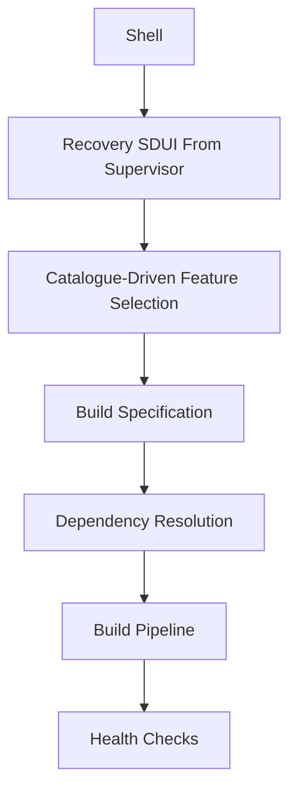

The Shell remains the active presentation layer throughout this flow.

If the build fails, the Supervisor continues emitting Recovery SDUI through the Shell with the failure explanation, diagnostics and safe retry actions.

Build failure must not cause a browser to fall back to the embedded recovery renderer while the Shell remains healthy.

## Initial Runtime Switch

```mermaid
flowchart TD

N1["Platform Passes Health Checks"]
N2["Supervisor Marks Platform Ready"]
N3["Shell Switches Backend"]
N4["Runtime SDUI"]
N5["Home Screen"]

N1 --> N2
N2 --> N3
N3 --> N4
N4 --> N5
```

The Shell remains loaded during this handoff.

Only its active backend and SDUI producer change, from Supervisor-owned Recovery SDUI to Platform-owned Runtime SDUI.

The transition should not require a page refresh or replacement of the Shell.

## Platform Failure

```mermaid
flowchart TD

N1["Shell"]
N2["Platform Disconnects"]
N3["Reconnects To Supervisor"]
N4["Recovery SDUI"]

N1 --> N2
N2 --> N3
N3 --> N4
```

The Shell should remain visible.

The user may see restart, rollback, progress and log state without losing their interface.

## Platform Recovery

```mermaid
flowchart TD

N1["Supervisor"]
N2["Platform Ready"]
N3["Shell Reconnects"]
N4["Platform Resumes"]

N1 --> N2
N2 --> N3
N3 --> N4
```

The transition should feel seamless.

## Shell Failure

For browser access, the Supervisor should fall back to the embedded recovery renderer only when the Shell cannot be used.

The embedded recovery renderer should diagnose or recover the Shell before returning to the richer Shell experience.

Native clients continue to render Recovery SDUI with their own renderer and do not use the embedded HTML document.

## Atomic Upgrade Recovery

```mermaid
flowchart TD

N1["Download"]
N2["Build"]
N3["Health Check"]
N4["Switch"]
N5["Retain Previous"]

N1 --> N2
N2 --> N3
N3 --> N4
N4 --> N5
```

If the Platform upgrade fails:

```mermaid
flowchart TD

N1["Rollback"]
N2["Reconnect Shell"]
N3["Continue"]

N1 --> N2
N2 --> N3
```

The user should remain inside the Shell throughout.

---

# Non-Responsibilities

The Supervisor does not own:

- media semantics
- playback behaviour
- metadata interpretation
- recommendation logic
- Runtime scheduling
- worker execution
- Module business behaviour
- normal Shell user experience
- client rendering
- Runtime SDUI production

Those responsibilities belong to the Platform, Runtime, Modules and Shell.

---

# Anti-Patterns

The following practices are prohibited.

## Supervisor As Platform

Putting media execution or business capability behaviour into the Supervisor.

The Supervisor manages Mosaic.

It does not become Mosaic's media Platform.

---

## In-Place Mutation

Changing the active Platform installation directly during upgrade.

The Supervisor should prepare a candidate Generation separately and activate it atomically.

---

## Supervisor As Builder

Embedding compilation, packaging or dependency build mechanics inside the Supervisor.

The Supervisor orchestrates the Build Pipeline.

It does not become the Builder.

---

## Shell-Dependent Recovery

Requiring the normal Shell to diagnose Shell failure.

The Shell should render recovery whenever available.

The embedded recovery renderer must remain available when the Shell itself is unavailable.

---

## Platform As Public UI

Allowing the Platform to serve UI directly.

The Supervisor is the public entry point.

The Platform provides business logic, GraphQL, Runtime SDUI, Event Bus and Capability Managers.

It does not present itself.

---

## Unbounded Restart Loop

Restarting a broken Platform indefinitely.

The Supervisor should detect repeated failure, stop unsafe loops and expose recovery options.

---

## Mutable Supervisor

Allowing the Supervisor to accumulate dependencies, business behaviour or frequent change.

The Supervisor should remain tiny, stable and independently testable.

It should always be capable of recovering the rest of Mosaic.

---

# Mosaic Guidelines

Within Mosaic:

- The Supervisor MUST be outside every Platform package and Generation.
- The Supervisor MUST be the always-running host manager for Mosaic.
- The Supervisor MUST start before every managed Mosaic component and stop after them.
- The Supervisor MUST expose the only public HTTP entry point.
- The Platform MUST NOT serve UI directly.
- The Supervisor MUST remain intentionally tiny and dependency-light.
- The Supervisor SHOULD change rarely.
- The Supervisor MUST be independently testable.
- The Supervisor SHOULD install and manage the Shell.
- The Supervisor MUST begin Shell download, signature verification and installation without waiting for user interaction.
- The Supervisor SHOULD run onboarding through the Shell.
- The Supervisor SHOULD derive onboarding choices from Module Catalogue and manifest metadata rather than a hardcoded Shell catalogue.
- The Supervisor MUST convert accepted onboarding choices into a declarative Build Specification.
- The Supervisor MUST resolve selected Modules before invoking the Build Pipeline.
- The Supervisor MUST NOT contain build or compilation logic.
- The Supervisor MUST validate produced Platform packages.
- The Supervisor MUST activate immutable Generations.
- The Supervisor MUST support rollback by reactivating a previous known good Generation.
- The Supervisor MUST emit Recovery SDUI rather than HTML.
- The Supervisor MUST prefer Shell-rendered recovery when the Shell is available.
- The Supervisor MUST keep the Shell loaded while transitioning from Recovery SDUI to Runtime SDUI.
- The Supervisor MUST provide an embedded recovery renderer for browser bootstrap and Shell failure only.
- The embedded recovery renderer MUST transition to the Shell automatically when the Shell becomes available.
- The Supervisor MUST keep host management state separate from Runtime State and business state.
- The Supervisor MUST NOT own media business behaviour.

---

# Relationship To MEG

This chapter extends MEG-005 by defining the host-level component responsible for activating and recovering Runtime-bearing Generations.

Related guidance is provided by:

- [MAC-001 — Platform Architecture](../../architecture/mac-001-platform-architecture/index.md), for the Platform, Runtime and Module boundaries.
- [MEG-006 — Module Platform](../meg-006-module-platform/index.md), for Module participation in Mosaic.
- [MIP-002 — Module Manifest Protocol](../../protocols/mip-002-module-manifest-protocol/index.md), for Module identity, dependencies, permissions and compatibility.
- [MOP-001 — Observability Operations](../../operations/mop-001-observability-operations/index.md), for operational health interpretation.

The governing decision is recorded in:

- MEG-005 ADR-001 — Supervisor As Mosaic Host Manager.

The next chapter records architectural decisions affecting Runtime Architecture.

---

# Summary

The Supervisor should make Mosaic feel self-hostable, recoverable and upgradeable.

A user installs the Supervisor.

The Supervisor installs the Shell, guides onboarding, resolves selected Modules, invokes the Build Pipeline, validates the produced Platform package and activates a Generation.

When upgrades arrive, the Supervisor prepares a new Generation in the background and activates it atomically.

When activation fails, the Supervisor rolls back by activating the previous known good Generation.

When everything else is unavailable, the Supervisor still exposes the recovery UI.
