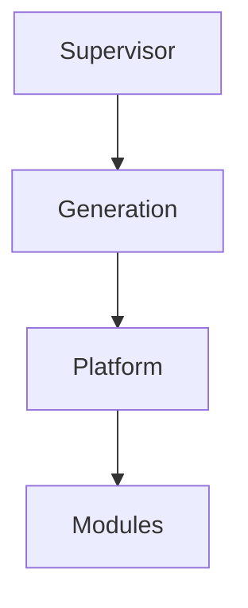
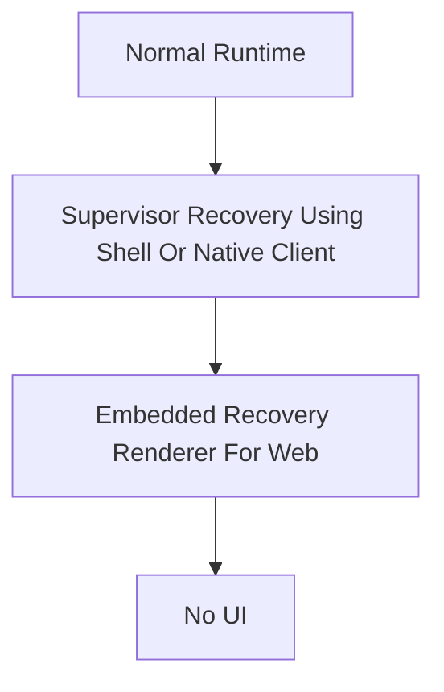

<!--
File: docs/engineering/guides/meg-005-runtime-architecture/15-adrs.md
Document: MEG-005
Status: Draft
Version: 0.4
-->

# Architectural Decision Guidance

> *Decision history belongs in decision records. This chapter identifies when MEG-005 needs them and where readers should look for the governing process.*

---

# Purpose

MEG-005 may require architecture decisions when changes alter long-lived engineering direction, compatibility expectations or responsibility boundaries.

The decision process itself is governed by **[MDG-001 — Documentation Authority Guide](../../documentation/mdg-001-documentation-authority-guide/index.md)**.

This chapter avoids repeating ADR process rules so the documentation library has one authoritative home for decision practice.

---

# Decision Areas

Create or update a decision record when a change affects:

- Capability-Oriented Runtime
- Microkernel Runtime
- Runtime Dependency Graph
- Execution Engine Separation
- Worker Manager Ownership
- Scheduler Architecture
- Supervisor Authority Boundary
- Platform Activation
- Generations
- Build Pipeline Boundary
- Isolated Build Workspace
- Upgrade And Rollback
- Recovery Hierarchy
- Supervisor Public Entry Point
- Capability Registry
- Runtime Lifecycle

---

# MEG-005 ADR-001 — Supervisor As Mosaic Host Manager

**Status**

Accepted

**Decision Date**

2026-07-14

---

## Context

Mosaic is a self-hosted media centre whose architecture is evolving toward an operating-system-like model.

Users should be able to add Mosaic to a Docker Compose file and start from one durable process.

That process must be able to install the Shell, guide onboarding, resolve selected functionality, invoke a Build Pipeline, activate immutable Generations, apply upgrades and recover the system when normal services fail.

The previous framing of Supervisor as an internal Runtime Service does not match this boundary.

The Supervisor needs authority outside Platform packages and Generations.

---

## Decision

Mosaic will define the Supervisor as the always-running host-level Mosaic manager.

The Supervisor owns:

- Shell installation and management
- onboarding entry point
- selected Module resolution
- Build Pipeline invocation
- Platform package validation
- Generation activation
- Platform boot through the active Generation
- background upgrade preparation
- atomic activation
- rollback by reactivating a previous known good Generation
- recovery UI independent of Platform and able to survive Shell failure

The Supervisor is outside every Platform package and Generation.

The Platform owns Runtime execution, Module lifecycle, scheduling, workers, Runtime State and media capability behaviour.

Modules are Go libraries that implement the Mosaic SDK and participate through the Module system.

The Supervisor resolves the selected Modules and invokes the Build Pipeline to produce a Platform package.

The Build Pipeline owns build mechanics.

The Supervisor validates and activates the resulting Generation.

The Recovery UI is Supervisor-owned state that can be rendered by the Shell when available and by an embedded recovery renderer when the Shell is unavailable.

---

## Alternatives Considered

| Alternative | Outcome | Reason |
|-------------|---------|--------|
| Supervisor as internal Runtime Service | Rejected | It cannot recover the Platform when the Platform itself fails. |
| Shell as installer and recovery owner | Rejected | Shell failure would remove the recovery surface. |
| User manually composes Platform binaries | Rejected | Self-hosted installation would become fragile and operationally complex. |
| Dynamic Module loading only | Deferred | The initial model favours producing a concrete Platform package from selected Modules. |
| In-place Platform upgrade | Rejected | Atomic candidate activation with rollback provides a safer upgrade model. |
| Supervisor owns build logic | Rejected | Build mechanics would make the Supervisor larger, more changeable and harder to recover. |
| Recovery UI only inside Shell | Rejected | Shell failure would remove the last-resort recovery surface. |

---

## Consequences

The Supervisor becomes the durable layer below Shell, Platform and Generations.

Mosaic can support appliance-like installation through Docker Compose while still activating a tailored Platform package from selected Modules.

Upgrade and rollback become explicit architecture rather than operational afterthoughts.

Generations provide a cleaner activation and rollback model because rollback means activating a previous Generation rather than undoing mutations.

The Recovery UI remains available when the Platform is unavailable and can fall back when the Shell is unavailable.

The Supervisor must remain small enough to be dependable.

It must not accumulate media business behaviour.

It must also avoid accumulating build logic.

The architectural hierarchy becomes:

The recovery layer remains below the layers it may need to recover.

---

## Implementation Implications

Runtime implementations should treat the Supervisor as the parent process or host manager for Mosaic.

The Supervisor should maintain host management state for:

- installed Generations
- active Generation
- candidate Generation
- previous known good Generation
- selected Module set
- build and activation history
- rollback points
- recovery diagnostics

The Platform should expose enough health and activation information for the Supervisor to decide whether an activation succeeded.

The Shell should support onboarding and normal administration, but recovery must not depend on Shell availability.

The Recovery UI should expose installed Generations, logs, health, configuration, storage, network diagnostics and recovery actions without depending solely on the Shell or Platform.

Module selection and compatibility should align with [MEG-006](../meg-006-module-platform/index.md) and [MIP-002](../../protocols/mip-002-module-manifest-protocol/index.md).

---

# MEG-005 ADR-002 — Supervisor Guarantees An Intelligent Interface

**Status**

Accepted

**Decision Date**

2026-07-14

---

## Context

Mosaic should not lose its user interface simply because the Platform is unavailable.

The Supervisor already owns Platform lifecycle, Shell lifecycle, updates, rollback, recovery and diagnostics.

That makes it the only component positioned below both the Shell and Platform.

Recovery should therefore degrade through increasingly primitive presentation layers rather than disappearing.

The Presentation Layer remains available to communicate Supervisor state while the Supervisor recovers managed layers.

It does not recover or supervise the Supervisor itself.

---

## Decision

The Supervisor is the only public HTTP entry point for Mosaic.

The Platform never serves UI directly.

The Supervisor guarantees an intelligent interface by using the richest available presentation layer:

The Supervisor emits Recovery SDUI rather than HTML.

The Shell renders Recovery SDUI when it is available.

The embedded recovery renderer exists only for browser bootstrap and Shell failure.

Native clients render Recovery SDUI with their own renderers and do not require the embedded recovery renderer.

Onboarding uses Recovery SDUI because the Platform does not yet exist and cannot produce Runtime SDUI.

The Supervisor begins downloading, verifying and installing the Shell immediately at process startup without waiting for browser traffic.

When the Shell is available, it remains loaded throughout onboarding, build progress and the initial Platform activation.

The Shell switches from Supervisor-owned Recovery SDUI to Platform-owned Runtime SDUI only after the Platform has passed health checks.

---

## Alternatives Considered

| Alternative | Outcome | Reason |
|-------------|---------|--------|
| Platform serves UI directly | Rejected | Platform failure would remove the normal user interface. |
| Supervisor emits HTML directly | Rejected | It couples recovery state to the web client and excludes native renderers. |
| Embedded renderer as normal recovery UI | Rejected | It weakens the richer Shell experience and should remain a fallback. |
| Normal installation starts in recovery | Rejected | Recovery is exceptional; proactive Shell bootstrap should make the Shell the first interface most users see. |
| Manual `Build Mosaic` bootstrap action | Rejected | Bootstrap should begin automatically and onboarding should lead directly into build orchestration. |
| Blank or log-only failure page | Rejected | Users should see confidence, progress and actionable recovery state. |
| Presentation Layer supervises or recovers the Supervisor | Rejected | Clients present Supervisor state but do not own Supervisor lifecycle or recovery. |
| Establish MAC-008 Recovery Architecture now *(deferred; not yet published)* | Deferred | MEG-005 owns recovery lifecycle and [MDS-008](../../../design/system/mds-008-component-library/index.md) owns recovery presentation; a Canon is justified only when broader cross-specification invariants require a new authoritative home. |

---

## Consequences

The Supervisor owns the public entry point and recovery state.

The Shell becomes the preferred operational facade over both Platform and Supervisor recovery state.

Normal installation presents Mosaic through the Shell rather than presenting recovery as a required mode.

The embedded recovery renderer must remain tiny, self-contained and independent from Shell assets.

Recovery SDUI becomes a separate contract from Runtime SDUI.

Users experience graceful degradation instead of abrupt failure.

---

## Implementation Implications

The Supervisor should expose state such as:

- Starting
- Installing Shell
- Shell Ready
- Onboarding
- Building Platform
- Starting Platform
- Healthy
- Updating
- Rollback
- Recovery
- Maintenance

Recovery diagnostics should include:

- Platform status
- Build progress
- Runtime health
- storage checks
- package validation
- rollback status
- logs
- available recovery actions

The embedded recovery renderer should be a single HTML document with inline CSS and JavaScript only.

It should not depend on external CSS, JavaScript bundles, images, fonts, frameworks or a build pipeline.

The embedded renderer should automatically yield to the Shell when Shell installation completes.

Onboarding should be generated from Module Catalogue and manifest metadata, produce a declarative Build Specification, and expose build progress through Recovery SDUI.

---

# MEG-005 ADR-003 — Supervisor Orchestrates Isolated Runtime Builds

**Status**

Accepted

**Decision Date**

2026-07-14

---

## Context

Mosaic composes a tailored Platform from independently versioned Modules.

The Supervisor owns the desired runtime composition, update flow, rollback, diagnostics and activation.

The Build Pipeline owns build mechanics such as temporary workspace preparation, `go.mod` updates, generated imports, `go mod tidy` and `go build`.

If the Supervisor behaved like a package manager or plugin loader, Mosaic would either mutate the active installation in place or load unverified code into a running Platform.

Both options weaken rollback and recovery.

---

## Decision

The Supervisor will orchestrate isolated runtime builds before activation.

The declarative Build Specification produced by onboarding is the input to that orchestration.

Every build starts from a desired runtime composition and proceeds through:

1. Module selection
2. Module manifest resolution
3. dependency graph validation
4. SDK compatibility validation
5. isolated build workspace creation
6. Go module download and temporary `go.mod` update
7. generated `imports.go`
8. `go mod tidy`
9. `go build`
10. pre-activation health checks
11. atomic activation

The Supervisor must not modify source repositories or the active Generation during build preparation.

The Supervisor must not analyse Go source code to discover Module identity, permissions, dependencies or contracts.

Manifests remain the Supervisor's source of truth.

The Build Pipeline must generate only the `imports.go` integration file required for blank imports.

The Supervisor activates only validated candidate runtimes.

During first installation, the Shell remains loaded while the Build Pipeline runs and switches to the Platform only after health checks pass.

---

## Alternatives Considered

| Alternative | Outcome | Reason |
|-------------|---------|--------|
| In-place Platform mutation | Rejected | It weakens rollback and risks corrupting the active runtime. |
| Runtime plugin loading | Rejected | It bypasses static validation and introduces runtime compatibility failure modes. |
| Supervisor owns Go build mechanics | Rejected | Build mechanics would make the Supervisor larger and harder to recover. |
| Source-code discovery | Rejected | Manifests should be the non-executing source of truth. |
| Activate before health checks | Rejected | Users could be switched onto an invalid runtime. |
| Replace or reload the Shell after initial build | Rejected | The Shell can switch SDUI producer and backend without disrupting the presentation layer. |

---

## Consequences

The Supervisor behaves more like a compiler toolchain orchestrator than a traditional package manager.

Builds become deterministic because every candidate runtime is assembled in a clean workspace from declared inputs.

The active Generation remains untouched until a candidate has passed validation.

Rollback remains simple because activation switches between known Generations rather than undoing mutations.

Development and production can share the same static composition model.

---

## Implementation Implications

Supervisor diagnostics should expose progress for each build stage.

Recovery UI should report:

- manifest resolution failures,
- dependency validation failures,
- SDK compatibility failures,
- Go dependency failures,
- generated import failures,
- compilation failures,
- health check failures,
- activation failures.

The active runtime should continue running while candidate preparation fails.

Previous known good runtimes should be retained until explicit garbage collection policy removes them.

---

# Relationship To [MDG-001](../../documentation/mdg-001-documentation-authority-guide/index.md)

[MDG-001](../../documentation/mdg-001-documentation-authority-guide/index.md) defines ADR structure, review expectations, lifecycle and cross-reference rules.

This guide should reference decisions that affect it, but should not redefine the decision process.

---

# Review Guidance

During review, confirm that the guide and any related decision record agree.

If a decision changes the meaning of this guide, update the affected chapter and reference the decision from this page.
