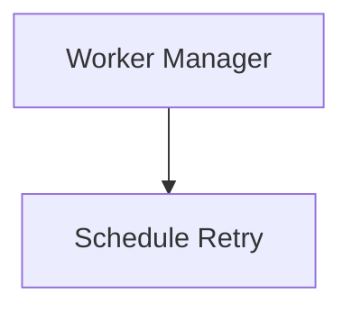
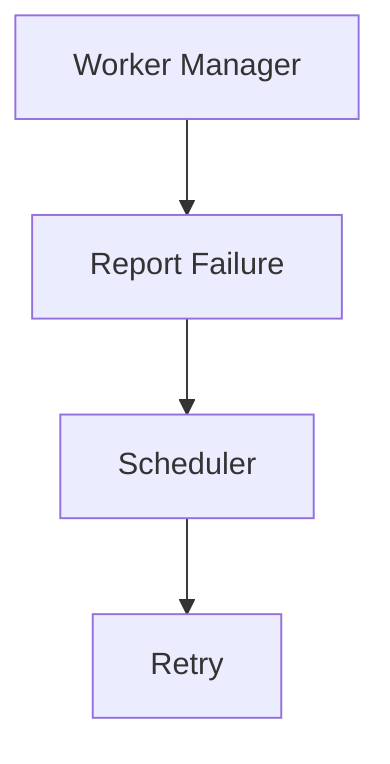

<!--
File: docs/engineering/guides/meg-005-runtime-architecture/16-contributor-guidance.md
Document: MEG-005
Status: Draft
Version: 0.4
-->

# Contributor Guidance

> *Every Runtime contribution should make the platform simpler to operate, not merely more capable.*

---

# Purpose

The Mosaic Runtime is the execution platform upon which every capability depends.

Unlike business capabilities, changes to the Runtime affect:

- every capability
- every module
- every deployment
- every operator

This document provides practical guidance for engineers contributing to the Runtime Architecture.

Its purpose is to ensure the Runtime continues to evolve without accumulating unnecessary complexity.

---

# Philosophy

Within Mosaic:

> **Protect the Runtime before extending it.**

The Runtime should evolve because the platform requires new execution capabilities.

It should never evolve because business behaviour has leaked into infrastructure.

Whenever these concerns conflict:

The Runtime remains generic.

Business remains within capabilities.

---

# Before Writing Runtime Code

Before implementing a Runtime feature ask:

- Does this belong in the Runtime?
- Or does it belong in a capability?
- Does this improve execution?
- Or does it implement business behaviour?

If the answer involves:

- playback
- metadata
- libraries
- recommendations

it almost certainly belongs outside the Runtime.

---

# Before Creating A Runtime Service

Every Runtime Service should answer one question.

> **What single Runtime responsibility do I own?**

Examples.

```

Scheduler
```

```

Worker Manager
```

```

Capability Registry
```

Avoid creating services that answer:

> **Everything.**

Responsibilities should remain narrow.

---

# Before Modifying The Kernel

The Runtime Kernel should change rarely.

Before modifying it ask:

- Can this responsibility become a Runtime Service?
- Does the Kernel genuinely require this knowledge?
- Would another component own this more naturally?

The Kernel should remain stable throughout the lifetime of the platform.

---

# Before Adding A Dependency

Ask:

> **Does this dependency improve Runtime coordination or introduce Runtime coupling?**

Runtime Services should depend upon:

- contracts
- Runtime abstractions
- explicit interfaces

Avoid direct dependencies between Runtime Services wherever practical.

The Dependency Graph should remain obvious.

---

# Before Adding Runtime State

Ask:

- Who owns this state?
- Is it operational?
- Does another Runtime Service already own it?

Runtime State should remain:

- explicit
- singularly owned
- operational

Business state belongs elsewhere.

---

# Before Introducing Scheduling

Scheduling belongs only inside the Scheduler.

Poor.



Preferred.



Responsibilities should remain clearly separated.

---

# Before Introducing Workers

Capabilities should never create workers.

Only the Worker Manager owns worker lifecycle.

Ask:

- Can existing workers execute this?
- Does the Worker Manager need enhancement?
- Does this belong in execution rather than business?

The Runtime should retain ownership of execution resources.

---

# Before Modifying Startup

Startup should remain:

- deterministic
- dependency driven
- observable

Avoid introducing:

- hidden initialisation
- implicit ordering
- startup side effects

Every startup change should preserve the canonical startup sequence.

---

# Before Modifying Shutdown

Shutdown should preserve:

- cooldown
- draining
- resource cleanup
- dependency ordering

Never optimise shutdown by sacrificing business correctness.

Graceful shutdown is more valuable than rapid shutdown.

---

# Before Adding Observability

Ask:

> **Is this Runtime information or business information?**

Examples of Runtime telemetry.

- worker utilisation
- queue depth
- scheduler latency
- capability lifecycle

Examples of business telemetry.

- playback completion
- media imported
- recommendations generated

The Runtime should observe itself.

Capabilities observe the business.

---

# Runtime Reviews

Runtime reviews should focus on:

- ownership
- dependency direction
- lifecycle
- modularity
- observability
- operational simplicity

Performance improvements should never weaken Runtime architecture.

---

# Runtime Refactoring

When refactoring ask:

- Can this Runtime Service become smaller?
- Can this responsibility move outward?
- Can this contract become clearer?
- Can this dependency disappear?

Runtime refactoring should generally reduce complexity.

Not merely rearrange it.

---

# Runtime Testing

Every Runtime contribution SHOULD include tests for:

- lifecycle
- startup
- shutdown
- dependency validation
- execution
- resource ownership
- observability

Business tests belong elsewhere.

Runtime tests verify Runtime behaviour.

---

# Runtime Documentation

Runtime documentation should evolve alongside implementation.

Whenever introducing:

- Runtime Service
- Runtime contract
- lifecycle stage
- dependency relationship

consider updating:

- MEG-005
- Runtime diagrams
- ADRs
- contributor documentation

Architecture should never become tribal knowledge.

---

# Runtime Checklist

Before requesting review, confirm:

## Runtime Structure

- [ ] One responsibility per Runtime Service.
- [ ] Runtime Kernel remains small.
- [ ] Dependencies remain explicit.

---

## Execution

- [ ] Scheduler remains independent.
- [ ] Execution Engine remains business agnostic.
- [ ] Worker Manager retains ownership of workers.

---

## Runtime State

- [ ] Ownership remains explicit.
- [ ] Business state has not entered the Runtime.
- [ ] Runtime state remains observable.

---

## Lifecycle

- [ ] Startup remains dependency driven.
- [ ] Shutdown remains graceful.
- [ ] Lifecycle remains deterministic.

---

## Documentation

- [ ] MEG updated where required.
- [ ] ADR created where appropriate.
- [ ] Diagrams remain accurate.
- [ ] Runtime contracts documented.

Every Runtime change should strengthen both the implementation and the documentation.

---

# Common Runtime Mistakes

Avoid:

- adding business behaviour to Runtime Services
- growing the Runtime Kernel
- introducing hidden dependencies
- bypassing Runtime contracts
- creating private worker pools
- embedding scheduling inside capabilities
- storing business state in Runtime components

These decisions often seem convenient initially.

They become expensive later.

---

# Engineering Culture

Runtime contributors should strive to:

- simplify execution
- clarify ownership
- improve observability
- reduce coupling
- preserve replaceability
- question unnecessary complexity

The Runtime should become easier to understand as it grows.

Not harder.

---

# Relationship to MEG

This document explains how contributors should evolve the Runtime Architecture established throughout MEG-005.

The previous chapters define:

> **How the Runtime is structured.**

This chapter defines:

> **How engineers should preserve that structure over time.**

Protecting Runtime Architecture is a shared engineering responsibility.

---

# Summary

The Runtime should feel dependable.

Predictable.

Boring.

That is not a criticism.

Infrastructure succeeds when engineers rarely think about it because it consistently behaves exactly as expected.

Within Mosaic, every Runtime contribution should strengthen that property by making the execution platform:

- simpler
- clearer
- more modular
- more observable

Capabilities create value.

The Runtime quietly makes that value possible.
