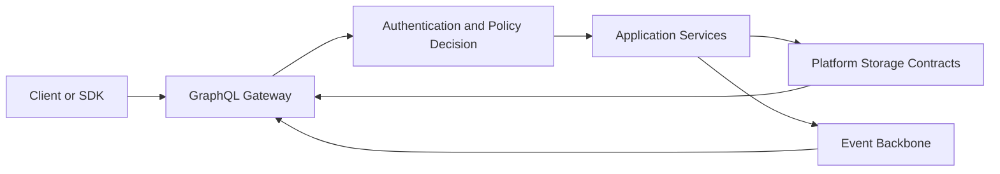

<!--
File: docs/engineering/guides/meg-005-runtime-architecture/17-graphql-projection.md
Document: MEG-005
Status: Draft
-->

# GraphQL Projection

> **Current direction:** GraphQL is Mosaic's client-facing projection layer. It calls Platform and domain services, contributes no storage logic and exposes only policy-authorised data.

## Boundary

GraphQL translates client queries and mutations into application-service calls. It is not a second domain model and it is not a repository layer.

Resolvers MUST NOT:

- query PostgreSQL directly;
- bypass Platform repositories;
- make authorisation decisions independently;
- expose Module-private tables or events; or
- embed domain workflows that belong in application services.

## Schema Composition

The Platform owns the GraphQL gateway, common scalar types, authentication context, policy directives, error envelope and transport behaviour.

Modules may contribute schema fields, types, queries, mutations and subscriptions through the SDK contract. Module contributions must resolve through their declared capabilities and Platform services.

The final schema is assembled during Platform composition and validated before the binary is activated. A Module cannot silently replace a Platform-owned field or introduce an incompatible type.

## Authorisation

Every operation is evaluated by the Platform Policy Decision Point before resolver execution. The decision includes the authenticated user, requested action, resource, registered device and session context.

GraphQL field visibility is not a substitute for server-side policy. A hidden field improves client clarity; it does not replace enforcement on the application service.

## Query And Mutation Rules

Queries project current authorised state. Mutations invoke application services that validate invariants, commit state and publish required domain events through the transactional outbox.

Mutations must not write directly to read models or event subscribers.

The schema should prefer domain-language operations over generic CRUD mutations. For example, `startPlayback` communicates intent more clearly than `updatePlaybackSessionRow`.

## Subscriptions

GraphQL subscriptions consume permitted updates from the in-process Event Bus. The subscription layer translates event facts into client projections and applies the same identity, resource and device policy as queries.

The GraphQL client never connects directly to PostgreSQL `LISTEN`/`NOTIFY`, the outbox table or the internal Event Bus.

## Projection And Performance

Resolvers should use request-scoped DataLoader or equivalent batching for recursive Node structures and related resources. Projection code should avoid N+1 database access and should select only fields required by the query.

Large media bytes do not travel through ordinary GraphQL responses. GraphQL returns authorised Part or stream references; the Playback path handles range-capable byte delivery.

## Error Boundary

The gateway returns stable, non-sensitive error categories for authentication, authorisation, validation, not-found, conflict, dependency and internal failures.

Internal SQL, credential, filesystem and Module details must remain in protected diagnostics rather than client error messages.

## Guarantees

- one gateway exposes the composed Platform schema;
- every operation passes Platform policy;
- resolvers call services rather than storage;
- Module schema contributions remain contract-validated;
- mutations publish state-change events atomically; and
- subscriptions preserve the same permission boundary as queries.

